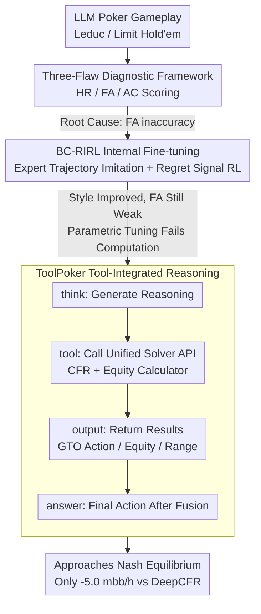

# How Far Are LLMs from Professional Poker Players? Revisiting Game-Theoretic Reasoning with Agentic Tool Use

**Conference**: ICLR 2026  
**arXiv**: [2602.00528](https://arxiv.org/abs/2602.00528)  
**Code**: TBD  
**Area**: LLM/NLP  
**Keywords**: LLM poker, game-theoretic reasoning, tool-augmented LLM, CFR solver, incomplete information game  

## TL;DR
This paper systematically analyzes three major reasoning flaws of LLMs in poker (Heuristic Reasoning, Factual Misunderstanding, and the Knowing-Doing Gap) and proposes ToolPoker—the first tool-integrated LLM reasoning system for incomplete information games. By integrating an external CFR solver to provide game-theoretic optimal (GTO) guidance, the framework enables a 7B model to approach Nash equilibrium in Limit Hold'em.

## Background & Motivation
**Background**: While LLMs have achieved breakthroughs in mathematical reasoning and programming, their performance in incomplete information games remains significantly inferior to traditional methods. Poker requires the tight integration of Bayesian belief updates, game-theoretic reasoning, and strategy execution.

**Limitations of Prior Work**: LLMs exhibit three primary reasoning flaws: ① Heuristic Reasoning: relying on shallow heuristics rather than game-theoretic principles; ② Factual Misunderstanding: misjudging objective values such as hand strength and pot odds; ③ Knowing-Doing Gap: instances where reasoning is correct but the action deviates.

**Key Challenge**: LLMs can generate "correct-sounding" game-theoretic analysis text but cannot execute precise calculations.

**Goal**: How to enable LLMs to perform game-theoretic reasoning and decision-making in incomplete information games?

**Key Insight**: Integrate a CFR solver as an external tool into the LLM reasoning workflow.

**Core Idea**: ToolPoker = LLM linguistic understanding + CFR solver precise game-theoretic computation.

## Method

### Overall Architecture
The study progresses through three stages: first, evaluating vanilla LLMs in Leduc / Limit Hold'em using a fine-grained diagnostic framework; second, attempting purely parametric BC-RIRL fine-tuning to see if "expert imitation + reinforcement learning" can eliminate defects; and finally, implementing ToolPoker, which integrates an external CFR solver into the reasoning loop. The first two steps serve as diagnostics and counter-examples, establishing that the fatal bottleneck is the inability to calculate objective values (FA), which parametric tuning alone cannot bridge.

### Key Designs

**1. Three-Flaw Diagnostic Framework: Decomposing "Poor LLM Performance" into Measurable Causes**

Win rates alone do not reveal why LLMs lose. This paper establishes a fine-grained diagnostic framework using LLM-as-Judge (GPT-4o-mini) to score reasoning text on a 0–2 scale across three metrics:

- Heuristic Reasoning (HR): Whether the reasoning follows shallow rules (e.g., "raise with big cards") or genuine analysis of opponent ranges and equilibrium.
- Factual Alignment (FA): The accuracy of judgments regarding **calculable** objective quantities like equity, pot odds, and opponent ranges—identified as the most critical bottleneck.
- Action–reasoning Consistency (AC): Capturing the "knowing-doing gap" where the model reasons to "fold" but executes a "raise."

Evaluations show these flaws are universal; even o4-mini only scores approximately HR 1.80 / FA 1.56 / AC 1.85, with FA consistently being the lowest.

**2. BC-RIRL Internal Fine-tuning: Proving Imitation + RL Cannot Bridge the Computation Gap**

BC-RIRL consists of two steps: Behavioral Cloning (BC) using ~5k expert trajectories (CFR+ solver actions + templated reasoning) and Regret-Informed Reinforcement Learning (RIRL) using PPO. The reward is not the sparse final win/loss, but a **step-level regret signal** from a CFR solver:

$$R(a^t_i)=\frac{R_t(a^t_i)-\text{mean}(\{r^t_j\})}{F_{\text{norm}}(\{r^t_j\})},$$

which provides fine-grained feedback on action quality. While HR and AC improved significantly (e.g., HR from 0.95 to 1.93 in Leduc), FA remained largely stagnant (only reaching 1.12), and the model still could not beat traditional solvers. This proves that purely **parametric** methods only replicate expert "style" without acquiring the underlying computational capability.

**3. ToolPoker Tool-Integrated Reasoning: Delegating Computation to the Solver**

ToolPoker is the first tool-integrated reasoning (TIR) framework for incomplete information games. It consolidates the CFR solver and equity calculator into a **single API** to prevent multi-turn trajectory collapse. The model follows a `think` → `tool` → `output` → `answer` cycle. Training involves a BC stage with code-augmented datasets to teach tool-calling timing and an RL stage using a composite reward $R = R_{\text{answer}} + \alpha_f R_{\text{format}} + \alpha_t R_{\text{tool}}$ to ensure the model actually utilizes the solver's output rather than ignoring it.

## Key Experimental Results

### Main Results — Performance vs. Traditional Methods (Limit Texas Hold'em, net chips)

| Method | vs NFSP | vs DQN | vs DMC | vs DeepCFR |
|------|---------|--------|--------|------------|
| Vanilla Qwen2.5-7B | -53.5 | -188 | -144 | -101.0 |
| BC-RIRL | -77.5 | -82.5 | -80.5 | -70.2 |
| **ToolPoker** | **+60.5** | **+63.0** | **+61.5** | **-5.0** |

### Reasoning Quality Assessment (Leduc Hold'em, 0-2 scale)

| Method | HR | FA | AC |
|------|-------|-------|------|
| Vanilla Qwen2.5-7B | 0.95 | 0.86 | 1.68 |
| BC-RIRL | 1.93 | 1.06 | 1.86 |
| o4-mini | 1.80 | 1.56 | 1.85 |
| **ToolPoker** | **~2.0** | **~2.0** | **~2.0** |

### Key Findings
- All vanilla LLMs (including GPT-4o and o4-mini) fail to defeat the Nash equilibrium solver CFR+.
- BC-RIRL improves reasoning style (HR/AC) but FA remains unchanged, demonstrating that parametric tuning cannot solve computational flaws.
- ToolPoker resolves factual misunderstandings through tool integration, causing FA to surge and reasoning scores to approach perfection.
- ToolPoker achieves performance near Nash equilibrium, trailing DeepCFR by only -5.0 mbb/h.

## Highlights & Insights
- The **HR/FA/AC diagnostic framework** decomposes "reasoning quality" into measurable axes applicable to other precise reasoning tasks.
- The **"Knowing-Doing Gap" (AC)** is a significant but often overlooked LLM issue.
- **Tool + LLM complementarity** is highly effective in game-theoretic scenarios: the solver handles precise computation while the LLM manages interpretation.
- Imitating "talking like an expert" (BC) is not equivalent to "thinking like an expert."

## Limitations & Future Work
- Dependency on external CFR solvers increases latency and deployment complexity.
- Evaluation was limited to two-player poker; multi-player games were not explored.
- Occasional tool-calling format errors.
- Fine-tuning was restricted to the Qwen2.5-7B model.

## Related Work & Insights
- **vs Pluribus/Libratus**: While traditional AI uses pure CFR, ToolPoker positions the LLM as a "user interface" for CFR.
- **vs ReAct**: ToolPoker applies the tool-use paradigm specifically to game-theoretic reasoning.
- Insight: Any LLM application requiring precise mathematical or game-theoretic computation should prioritize tool augmentation over pure parametric scaling.

## Rating
- Novelty: ⭐⭐⭐⭐ First CFR+LLM integration; valuable flaw analysis.
- Experimental Thoroughness: ⭐⭐⭐⭐ Cross-evaluations with traditional solvers + qualitative reasoning metrics.
- Writing Quality: ⭐⭐⭐⭐ Clear three-stage progression.
- Value: ⭐⭐⭐⭐ A benchmark model for tool-augmented LLMs in strategic games.

<!-- RELATED:START -->

## Related Papers

- [\[ACL 2025\] A Survey of LLM-based Agents in Medicine: How Far Are We from Baymax?](../../ACL2025/llm_nlp/a_survey_of_llm-based_agents_in_medicine_how_far_are_we_from_baymax.md)
- [\[ACL 2025\] Large Language Models for Predictive Analysis: How Far Are They?](../../ACL2025/llm_nlp/large_language_models_for_predictive_analysis_how_far_are_they.md)
- [\[ACL 2025\] How Numerical Precision Affects Arithmetical Reasoning Capabilities of LLMs](../../ACL2025/llm_nlp/how_numerical_precision_affects_arithmetical_reasoning_capabilities_of_llms.md)
- [\[ACL 2026\] How Do Answer Tokens Read Reasoning Traces? Self-Reading Patterns in Thinking LLMs](../../ACL2026/llm_nlp/how_do_answer_tokens_read_reasoning_traces_self-reading_patterns_in_thinking_llm.md)
- [\[ACL 2025\] DICE-Bench: Evaluating the Tool-Use Capabilities of Large Language Models in Multi-Round, Multi-Party Dialogues](../../ACL2025/llm_nlp/dice-bench_evaluating_the_tool-use_capabilities_of_large_language_models_in_mult.md)

<!-- RELATED:END -->
