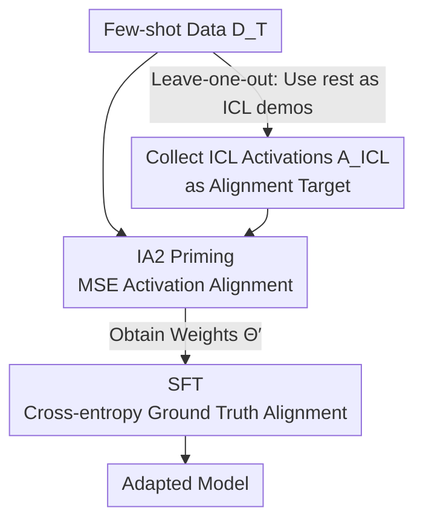

# IA2: Alignment with ICL Activations improves Supervised Fine-Tuning

**Conference**: ICLR 2026  
**OpenReview**: [https://openreview.net/forum?id=r99m9ziONQ](https://openreview.net/forum?id=r99m9ziONQ)  
**Code**: Yes (Included in paper; contains answer parsing functions)  
**Area**: LLM / NLP · Fine-tuning and Adaptation  
**Keywords**: Supervised Fine-Tuning, In-Context Learning, Activation Alignment, Self-distillation, Calibration

## TL;DR
This paper observes that while Supervised Fine-Tuning (SFT) and In-Context Learning (ICL) produce similar outputs, their internal activations differ significantly. Consequently, the authors propose IA2—a self-distillation priming step that uses MSE to align model activations with "ICL-present" activations before performing SFT. This approach significantly improves both few-shot adaptation accuracy and calibration across 12 benchmarks.

## Background & Motivation
**Background**: Adapting general large language models to narrow tasks involves two main routes. First is SFT (often with PEFT like LoRA), which updates weights using labeled samples to generate target responses. Second is ICL, which prepends demos in the prompt to "learn" the task without weight updates. SFT adaptation is cheap at inference (plug-and-play LoRA) but requires substantial labeling for few-shot generalization; ICL generalizes well and is more calibrated but consumes valuable context for every query, increasing inference costs.

**Limitations of Prior Work**: A common goal is to "solidify ICL capabilities into weights." Existing works (such as distilling context into weights) have attempted this, but they rely solely on response text as the training signal—forcing the SFT model to replicate the ICL model's output. This paper argues this is insufficient: producing the same output as ICL does not guarantee the model "functions" like ICL.

**Key Challenge**: Theoretical work (e.g., Von Oswald et al.) claims ICL is equivalent to an internal gradient descent. If true, base+ICL activations should resemble those of an SFT model without demos. However, empirical findings in this paper show that, given the same data, layer-wise activations of ICL and SFT do not align—especially in middle layers where abstract processing of the demo set occurs. Despite similar surface outputs, they follow different functional circuits. This difference manifests as calibration error: ICL has a much lower ECE (Expected Calibration Error) than SFT at similar accuracy levels, as SFT signals tend to learn shortcuts that fail on new data, while ICL relies on complex circuits to extract generalizable patterns from demos.

**Goal**: Can the "information-rich ICL activations" be directly used as a training signal to improve SFT quality (accuracy and calibration) rather than just mimicking its output?

**Core Idea**: Insert a priming step before standard SFT that explicitly aligns "query-only" activations to "ICL-present" activations using MSE, making the SFT model function like ICL before performing conventional SFT for output alignment.

## Method

### Overall Architecture
IA2 decomposes adaptation into a two-stage pipeline: "functional alignment first, output alignment second," using the exact same few-shot data as SFT for a fair comparison. Given a few-shot task dataset $D_T=\{(X_i,Y_i)\}$: First, for each sample, other samples are used as ICL demos (leave-one-out reuse, no additional data). An ICL run is performed to collect the "ICL-present" activation tensors $A^i_{ICL}$ at output positions as alignment targets. Then, IA2 priming is conducted—using MSE to pull "query-only" activations toward $A^i_{ICL}$ to obtain weights $\Theta'$ that are "internally ICL-like." Finally, standard cross-entropy SFT is performed on $\Theta'$ to align outputs with the ground truth labels $Y$.

The key metric is activation similarity $\mathrm{asim}(A_1,A_2)$—the token-wise cosine similarity of two activation tensors (dimensions $L\times R$). Diagnostic experiments show that pure SFT vs. ICL $\mathrm{asim}$ is low (0.52 for Qwen-4B), while IA2→SFT increases it to 0.67–0.83, improving accuracy and calibration.

### Key Designs

**1. Collecting ICL Activations as Alignment Targets: Injecting Demos via Leave-one-out**

For priming to be "ICL-like," the target must be quantified. For each training sample $X_i$, the remaining $N-1$ samples are randomly ordered to form a demo set $I$. The model processes $T_i=[I\circ X_i]$ to generate an ICL response $\hat Y_i$, and activation $A^i_{ICL}\in\mathbb{R}^{L\times G\times d}$ is collected at the output token positions (fixed $G=200$ for multi-token tasks). The ingenuity lies in **reusing the same training data**—introducing no extra labels and ensuring a fair comparison between IA2, SFT, and ICL. Activations at "output token positions" are chosen because they represent the internal "footprints" of ICL processing the query before producing tokens.

**2. IA2: Self-distillation in Activation Space to Align "Query-only" with "ICL-present"**

This is the core contribution. It addresses the limitation that output alignment is insufficient. The objective is: for each newly generated token, find weights $\tilde W_{QKVO}$ such that
$$\mathrm{SA}([I\circ X];W_{QKVO})\approx \mathrm{SA}(X;\tilde W_{QKVO}),\quad \forall X\in T.$$
In other words, the self-attention output of "no demo, query only" should approximate the "with demo" output. While prior work provided closed-form solutions for linearized attention, this paper seeks a practical solution for non-linear Transformers: constructing unaligned activations $A_i$ (by feeding $T_i=[X_i\circ\hat Y_i]$, pretending the model generated the ICL response from the query alone) and minimizing the MSE with the target activations:
$$L_{IA2}=\sum_{i=1}^{N}\lVert A_i-A^i_{ICL}\rVert.$$
Crucially, this **does not touch ground truth response tokens**—it doesn't reward a specific output but forces the model to "process input like ICL" at every layer. Since it distills the model's own ICL behavior (teacher and student are the same model, but the teacher sees the context), it is called "self-distillation." IA2-only (without SFT) achieves respectable accuracy and good calibration, proving activation signals are rich in adaptable information.

**3. IA2→SFT: Two-stage Sequence of Functional and Output Alignment**

IA2 alone is not enough: activation alignment improves calibration, but "ICL signals are not always correct." Pursuing extreme activation similarity might sacrifice accuracy that could be gained from ground truth labels (Figure 3 shows ECE decreases as asim increases, but extreme alignment is not accuracy-optimal). Therefore, after IA2 shifts parameters from $\Theta$ to $\Theta'$, the model **switches** to the standard SFT loss $L_{SFT}$ (cross-entropy) to continue training on ground truth labels. Both signals serve their purpose: IA2 for functional alignment with ICL, SFT for alignment with human expectation. This is "sequential" rather than "joint" because ICL-generated target activations may differ significantly from ground truth in length or content, making the targets incompatible. Weight subspace analysis (Figure 4) suggests IA2→SFT shares ~39% of the subspace with IA2-only, while pure SFT updates are nearly orthogonal to both—meaning IA2 reaches a subspace unattainable by pure SFT.

### Loss & Training
Two stages: first $L_{IA2}$ (activation MSE) until convergence, then $L_{SFT}$ (ground truth cross-entropy) until convergence. Training uses LoRA (rank=8) on $W_Q, W_K, W_O$. Few-shot scale $N\in\{2,4,8,16,\dots\}$, averaged over 5 random sets per $N$. Three learning rates (1e-4 / 3e-4 / 1e-3) were tested per (method, dataset) to ensure results are not architecture-tuning dependent. Over 13,000 models were trained in total. A joint variant IA2+SFT ($L_{IA2}+\beta\cdot L_{SFT}$) is discussed for scenarios where only ICL responses are available.

## Key Experimental Results

### Main Results
Covered 12 benchmarks across single-token (Classification / True-False / MCQ) and multi-token (Math / Science QA) tasks, using Qwen3-4B-Base and Llama-3.2. Metrics used are accuracy (acc↑) and Expected Calibration Error (ECE↓).

Single-token (Qwen3-4B, $N=4$, selected):

| Dataset (Train→Test) | Metric | ICL | SFT only | IA2 only | IA2→SFT |
|---|---|---|---|---|---|
| FinS→FinS | acc↑ | 63.6 | 67.4 | 63.1 | **78.7** |
| FinS→FinS | ece↓ | 0.12 | 0.31 | 0.24 | **0.16** |
| SST2→SST2 | acc↑ | 85.4 | 65.2 | 82.7 | **90.4** |
| SST2→SST2 | ece↓ | 0.13 | 0.22 | 0.28 | **0.06** |
| SST2→FinS* (OOD) | acc↑ | 41.9 | 68.4 | 71.3 | **82.4** |

Multi-token (Qwen3-4B, $N=4$, ground truth):

| Dataset | ICL | SFT only | IA2 only | IA2→SFT |
|---|---|---|---|---|
| GSM8K | 76.4 | 70.9 | 77.4 | **73.6** |
| GSM8Ks* (OOD) | 68.4 | 64.5 | 66.2 | **68.8** |
| HMathA | 60.4 | 50.4 | 47.8 | **55.3** |
| SciQ | 37.5 | 35.0 | 6.9 | **40.8** |

IA2→SFT outperforms pure SFT on all multi-token datasets. On single-token tasks, it usually exceeds ICL accuracy (though calibration is slightly lower).

### Ablation Study
| Configuration | Key Finding | Description |
|---|---|---|
| SFT only | Baseline | Output-oriented; prone to shortcuts and poor calibration in few-shot settings. |
| IA2 only | High acc & good ece | Competes without touching GT tokens; proves information density of activations. |
| IA2→SFT | Optimal combo | Functional + Output alignment; wins on both acc and ece. |
| IA2+SFT (Joint, ICL-resp only) | Superior to SFT | 77.0 vs 66.4 on GSM8K; extracts info from ICL responses without GT labels. |
| SFT (Soft-label KD) | Mixed performance | Strong on multi-token, weak on single-token; IA2 is more robust. |

### Key Findings
- **Activation Similarity → Calibration**: Figure 3 shows ECE decreases smoothly as asim increases, confirming "internal ICL-like behavior" directly yields better calibration; however, SFT is needed to bridge the accuracy gap.
- **IA2 Subspace is Unreachable by SFT**: Pure SFT updates are nearly orthogonal to IA2, while IA2→SFT shares ~39% of the subspace with IA2-only—gains derive primarily from the IA2 priming step.
- **When ICL Still Wins**: Qwen outperforms all trained methods via ICL on math (GSM8K/HMathA), likely due to STEM data in pre-training making ICL extremely sample-efficient (ICL $N=2$ > $N=4,8$). Multi-token IA2→SFT occasionally lags behind ICL, possibly due to LoRA rank constraints on long contexts.

## Highlights & Insights
- **Shifting Alignment from Output to Activation Space**: The most significant insight is that ICL and SFT have similar outputs but different activations, indicating different functional circuits. Direct activation alignment is the key to transferring ICL capabilities.
- **Leave-one-out Reuse with Zero Extra Data**: Using the training set's remaining samples as demos ensures fair comparison and keeps the extra cost minimal.
- **Transferable Methodology**: The idea of "aligning to a stronger but costlier mode in middle representations first, then finishing with the task loss" can be generalized to distilling Retrieval-Augmented or Tool-use states into base models.

## Limitations & Future Work
- Authors acknowledge that small LoRA (rank=8) has limited compression for long multi-token contexts; higher ranks need investigation.
- When the base model is "naturally" strong for a task (e.g., Qwen on STEM), ICL is highly efficient, reducing the relative benefit of IA2.
- MSE alignment across tokens may be unstable if ICL and GT response lengths differ significantly (the reason IA2+SFT cannot always be joint). Open-ended long-text generation remains to be tested.

## Related Work & Insights
- **vs. Context Distillation (Snell 2022 / Chen 2024b)**: These distill context into weights using only response text, inheriting SFT's shortcut problems. IA2 aligns functioning rather than just outputs.
- **vs. Knowledge Distillation Soft-labels (Hinton 2015)**: Soft-label KD is close to IA2+SFT on multi-token but fails on single-token; activation signals provide more consistent adaptable information.
- **vs. "ICL = Internal Gradient Descent" Theory (Von Oswald 2023)**: This paper empirically contradicts the strong form of this hypothesis in real LLMs—if truly equivalent, activations should align, whereas specifically the middle layers do not.

## Rating
- Novelty: ⭐⭐⭐⭐⭐ Shifting alignment targets to activation space and providing a practical self-distillation for non-linear Transformers.
- Experimental Thoroughness: ⭐⭐⭐⭐⭐ 12 benchmarks, two model families, 13,000+ models, including OOD, subspace, and KD analyses.
- Writing Quality: ⭐⭐⭐⭐ Clear chain of logic; however, some analysis relies heavily on the appendix.
- Value: ⭐⭐⭐⭐ Provides a plug-and-play priming step to improve accuracy and calibration using existing data, with conceptual insights into ICL vs. SFT.

<!-- RELATED:START -->

## Related Papers

- [\[ICLR 2026\] Differential Fine-Tuning Large Language Models Towards Better Diverse Reasoning Abilities](differential_fine-tuning_large_language_models_towards_better_diverse_reasoning_.md)
- [\[ICLR 2026\] FACT: Fine-grained Across-variable Convolution for Multivariate Time Series Forecasting](fact_fine-grained_across-variable_convolution_for_multivariate_time_series_forec.md)
- [\[ACL 2025\] HFT: Half Fine-Tuning for Large Language Models](../../ACL2025/llm_nlp/hft_half_fine-tuning_for_large_language_models.md)
- [\[ACL 2026\] Synthetic Eggs in Many Baskets: The Impact of Synthetic Data Diversity on LLM Fine-Tuning](../../ACL2026/llm_nlp/synthetic_eggs_in_many_baskets_the_impact_of_synthetic_data_diversity_on_llm_fin.md)
- [\[ACL 2025\] SDD: Self-Degraded Defense against Malicious Fine-tuning](../../ACL2025/llm_nlp/sdd_self-degraded_defense_against_malicious_fine-tuning.md)

<!-- RELATED:END -->
