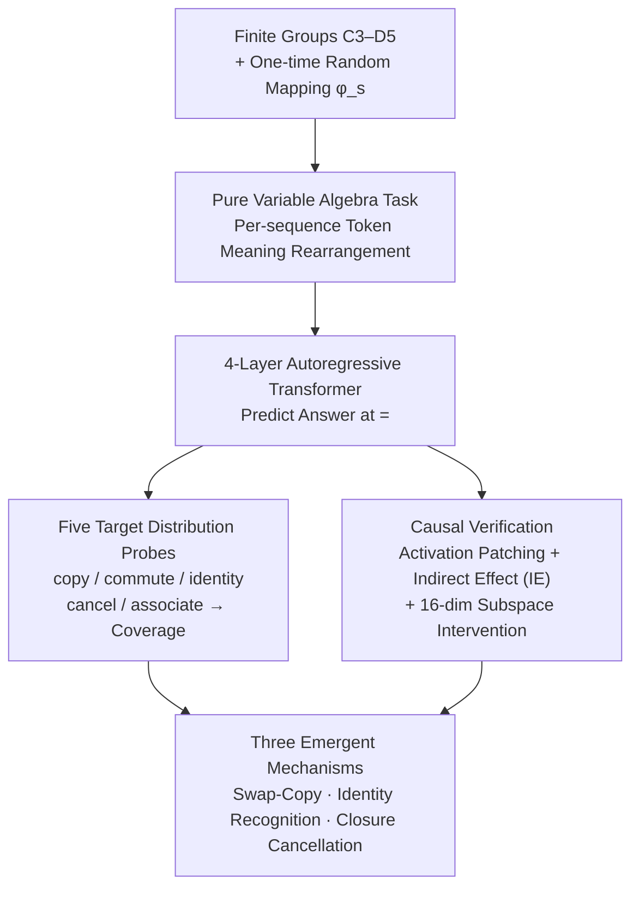

# In-Context Algebra

**Conference**: ICLR2026  
**arXiv**: [2512.16902](https://arxiv.org/abs/2512.16902)  
**Code**: [algebra.baulab.info](https://algebra.baulab.info)  
**Area**: Other  
**Keywords**: in-context learning, mechanistic interpretability, symbolic reasoning, finite groups, transformer mechanisms

## TL;DR

This paper designs an **in-context algebra task** where tokens act as pure variables with meanings randomized for each sequence. It discovers that under this setting, Transformers cease to learn classical Fourier/geometric representations and instead emerge with three **symbolic reasoning mechanisms** (swap-copy, identity recognition, and closure cancellation). Furthermore, it reveals that these abilities appear sequentially as phase transitions during the training process.

## Background & Motivation

**Limitations of Fixed Embeddings**: Extensive prior research on model interpretability (e.g., grokking, modular arithmetic) suggests that Transformers pre-encode task information within token embeddings (e.g., "108" encoding "divisible by 2"), learning periodic or Fourier-basis geometric strategies.

**True Abstract Reasoning**: A hallmark of abstract reasoning is the ability to process **symbols whose meanings are unknown a priori**. What strategies would a model learn if tokens carried no fixed semantics?

**Pure Variable Setting**: The authors propose keeping tokens in each sequence as placeholder variables. A random mapping $\varphi_s$ maps finite group elements to vocabulary symbols (different for each sequence), forcing the model to reason solely from contextual relationships.

**Connection to ICL**: This serves as a deep exploration into the internal mechanisms of in-context learning—models must observe "facts" in the context to infer algebraic structures rather than relying on parametric memory.

**Interpretability Methodology**: The authors designed 5 target data distributions and causal intervention experiments, providing a rigorous methodological paradigm for mechanism verification.

**Phase-based Learning**: During training, different abilities emerge sequentially in the form of phase transitions, revealing the internal curriculum of Transformers learning abstract operations.

## Method

### Overall Architecture

This paper investigates how Transformers "infer" algebraic structures in context when tokens lack fixed semantics and models cannot take shortcuts via geometric priors in embeddings. To this end, finite group multiplication is adapted into a **pure variable setting**: each sequence uses a one-time random mapping to scatter group elements into placeholder tokens without fixed meanings. A 4-layer autoregressive Transformer predicts answers at the "=" mark of each multiplication fact. Since accuracy alone cannot distinguish which algorithm the model utilizes, the authors employ **five target data distributions** to isolate each hypothesized mechanism and perform coverage analysis. Finally, **causal interventions** are used to pinpoint specific attention heads executing these algorithms, ultimately dissecting three symbolic mechanisms repeatedly learned by the model.

### Key Designs

**1. Pure Variable Algebra Task: Stripping Semantic Priors from Tokens**

In previous interpretability studies, token meanings were fixed (e.g., the number "108" naturally encodes "divisibility by 2"), leading models to learn geometric shortcuts like Fourier bases. In this work, given a set of finite groups $\mathcal{G}=\{C_3,\ldots,C_{10},D_3,D_4,D_5\}$, for each sequence $s$, a subset $\mathcal{G}_s$ is sampled such that the union $H_s=\bigcup\mathcal{G}_s$ satisfies $|H_s|\le N=16$. A bijective mapping $\varphi_s:H_s\to V$ randomly assigns group elements to 16 variable tokens. Crucially, $\varphi_s$ varies per sequence, meaning the same token possesses entirely different meanings across sequences. Sequences consist of $k=200$ multiplication facts:

$$s = v_{x_1} v_{y_1} = v_{z_1},\; \cdots,\; v_{x_k} v_{y_k} = v_{z_k}$$

Each fact occupies 4 positions (left slot $v_{x_i}$, right slot $v_{y_i}$, prediction point "=", and answer slot $v_{z_i}$). The model must predict the answer at "=". This setup forces the model to rely on relationships between facts in the context, necessitating symbolic reasoning.

**2. Five Target Distributions: Turning "Algorithm Identification" into Controlled Experiments**

Correct predictions can arise from several different algorithms, which cannot be distinguished by accuracy alone. The authors construct a target data distribution for each hypothesized mechanism where only the corresponding algorithm is solvable: $\mathcal{D}_{\text{copy}}$ contains literal copies of the final fact; $\mathcal{D}_{\text{commute}}$ provides only the commutative fact $yx=z$ without a literal copy; $\mathcal{D}_{\text{identity}}$ includes facts with identity elements where the identity is exposed in the context; $\mathcal{D}_{\text{cancel}}$ provides facts sharing the left slot $x$ or right slot $y$ with the query, forcing the model to exclude candidates via cancellation laws; $\mathcal{D}_{\text{associate}}$ provides a minimal set of facts that can derive the answer through the associative law $(xg)d=fd\Rightarrow x(gd)=z$. These five algorithms are applied sequentially to calculate "Algorithm Coverage"—the proportion of model accuracy explained by each mechanism.

**3. Causal Verification: Pinpointing Attention Heads via Indirect Effect and Activation Patching**

To identify components executing these algorithms, authors perform activation patching between clean/corrupted sequence pairs. The contribution of a head $(l,h)$ is quantified using Indirect Effect (IE):

$$\text{IE}(l,h) = P(v_{\text{target}} \mid a_{s_{\text{clean}}}^{(l,h)} \to s_{\text{corrupt}}) - P(v_{\text{target}} \mid s_{\text{corrupt}})$$

This measures the recovery of the correct token probability when activations from the clean sequence are transplanted. For mechanisms involving set states (e.g., closure), a 16-dimensional subspace $W$ is trained for subspace-level intervention to verify if the model explicitly maintains algebraic sets.

**4. Three Emergent Mechanisms: Swap-Copy, Identity Recognition, Closure Cancellation**

Dissection reveals three primary mechanisms. **Swap-Copy** is handled by a single head (Layer 3, Head 6): it attends to the answer slot for literal copies and redirects to the answer slot of the commutative fact $yx=z$ when needed. **Identity Recognition** relies on "Query Boosting + Identity Suppression": Head 3.1 boosts logits for query variables, while Head 3.6 suppresses identified identity tokens. **Closure Cancellation** occurs in two steps: a closure sub-mechanism tracks all elements in the same group as the query variables, and a cancellation sub-mechanism excludes candidates already appearing in the same left/right slots.

## Key Experimental Results

### Main Results: Algorithm Coverage and Model Performance

| Mechanism | Training Data Coverage (AUC) | Hold-out Coverage (AUC) |
|-----------|----------------------------|-------------------------|
| Literal Copy | 67.9% | — |
| Swap-Copy | +12.1% | — |
| Identity Recognition | +4.2% | 28.7% |
| Closure Cancellation | +2.7% | +39.1% |
| Associative Composition | +3.6% | +16.9% |
| **Total Coverage** | **90.4%** | **84.7%** |
| **Observed Model Accuracy** | **92.4%** | **87.3%** |

### Model Accuracy across Target Distributions

| Data Distribution | $k=50$ | $k=100$ |
|-------------------|--------|---------|
| Literal Copy $\mathcal{D}_{\text{copy}}$ | ~100% | 100.0% |
| Swap-Copy $\mathcal{D}_{\text{commute}}$ | ~97% | 99.0% |
| Identity Recognition $\mathcal{D}_{\text{identity}}$ | ~98% | 100.0% |
| Closure Cancellation $\mathcal{D}_{\text{cancel}}$ | ~95% | 97.0% |
| Associative Composition $\mathcal{D}_{\text{associate}}$ | ~55% | 60.2% |

### Generalization

- **Unseen Group Generalization**: Near-perfect accuracy on all 8th-order groups not seen during training.
- **Semigroup Generalization**: Non-trivial accuracy on non-group structures like semigroups.
- **Quasigroup/Magma**: Performance drops on quasigroups and fails on magmas, indicating reliance on group structural properties.

### Ablation Study: Phase Transitions

Skill acquisition during training exhibits five clear **phase transitions**:

| Phase | Skill Acquired | Training Steps |
|-------|----------------|----------------|
| ➀ | Structural token prediction ("=", ",") | Earliest |
| ➁➂ | Group closure + Query boosting (50% Identity accuracy) | Second stage |
| ➃➄ | Literal copy + Swap-copy | Sharp increase |
| ➅➆ | Closure cancellation + Full identity recognition | Joint gradual improvement |
| ➇ | Associative composition | Final appearance |

Key Findings:
- **Copying is foundational**: Cancellation and identity recognition build upon copying abilities.
- **Joint emergence**: Identity suppression and cancellation execute similar "suppression" functions and are learned synchronously.
- **Associativity is hardest**: This is the last ability learned and achieves only 60% accuracy.

### Causal Intervention Results

| Experiment | Key Head | AIE |
|------------|----------|-----|
| Literal Copy | Head 3.6 | **0.91** |
| Swap-Copy | Head 3.6 | **0.48** |
| Max other heads | — | < 0.08 |
| Closure Subspace Intervention Accuracy | 16-dim $W$ | **99.8%** |

## Highlights & Insights

- **Minimalist yet Profound Design**: The pure variable algebra setting elegantly isolates "embedding priors" from "in-context reasoning," serving as a high-quality paradigm for ICL mechanism research.
- **Complete Mechanistic Dissection**: Progresses from hypothesis to target distribution design, coverage analysis, causal intervention, and subspace probing to form a closed-loop verification.
- **Natural Correspondence between Phase Transitions and Curriculum Learning**: Reveals the spontaneous staged skill acquisition of Transformers, offering theoretical insights.
- **Dependency of Symbolic vs. Geometric Strategies**: Demonstrates that reasoning strategies depend on task structure—fixed tokens lead to geometric strategies, while pure variables lead to symbolic strategies.
- **Open Sourced** code and data for reproducibility.

## Limitations & Future Work

1. **Model Scale Constraints**: Verified only on small 4-layer Transformers; applicability to large-scale pretrained LLMs remains unknown.
2. **Insufficient Associative Learning**: The model only achieves 60% accuracy on associativity, indicating that multi-step reasoning remains a challenge.
3. **Idealized Task**: Finite group algebra is distant from natural language reasoning; whether conclusions transfer to more complex scenarios requires verification.
4. **Vocabulary Size Limits**: Only 16 variable tokens were used; consistency of mechanisms at larger vocabulary scales has not been studied.
5. **CoT Not Explored**: Combining Chain-of-Thought prompting might improve performance on complex reasoning like associativity.

## Related Work & Insights

| Dimension | Ours | Prior Work (Nanda et al., Zhong et al.) |
|-----------|------|-----------------------------------------|
| Token Meaning | Pure variables changing per sequence | Fixed semantics (e.g., numbers) |
| Learned Strategy | Symbolic reasoning (copy, cancel) | Fourier-basis / Geometric representation |
| Grokking Emergence | Phase transitions but not traditional grokking | Typical grokking |
| Generalization | Generalizes to unseen groups | Generalizes to in-distribution data |
| Analysis Method | Causal intervention + Subspace probing | Weight/Embedding analysis |

Complementary to Akyürek et al. (2024) regarding induction/n-gram head analysis—the copying head (3.6) in this work exhibits similar n-gram matching behavior but further demonstrates advanced functions like swap-copying and identity suppression.

## Rating

- Novelty: ⭐⭐⭐⭐⭐ — The pure variable algebra setting is a first, revealing reasoning mechanisms entirely different from traditional fixed-token settings.
- Experimental Thoroughness: ⭐⭐⭐⭐⭐ — 5 target distributions + causal interventions + subspace probing + phase analysis provide extremely thorough verification.
- Writing Quality: ⭐⭐⭐⭐⭐ — Excellent visuals and clear logic; visualizations in Figures 4/5/6 are particularly outstanding.
- Value: ⭐⭐⭐⭐ — Provides significant insights for ICL mechanism research, though the bridge to practical LLM applications still requires verification.

<!-- RELATED:START -->

## Related Papers

- [\[ICLR 2026\] Constrained Decoding of Diffusion LLMs with Context-Free Grammars](constrained_decoding_of_diffusion_llms_with_context-free_grammars.md)
- [\[ACL 2025\] Mixtures of In-Context Learners](../../ACL2025/llm_nlp/mixtures_of_in-context_learners.md)
- [\[ACL 2026\] UCS: Estimating Unseen Coverage for Improved In-Context Learning](../../ACL2026/llm_nlp/ucs_estimating_unseen_coverage_for_improved_in-context_learning.md)
- [\[ICML 2026\] Position: The Turing-Completeness of Autoregressive Transformers Relies Heavily on Context Management](../../ICML2026/llm_nlp/position_the_turing-completeness_of_autoregressive_transformers_relies_heavily_o.md)
- [\[NeurIPS 2025\] In-Context Learning of Linear Dynamical Systems with Transformers: Approximation Bounds and Depth-Separation](../../NeurIPS2025/llm_nlp/in-context_learning_of_linear_dynamical_systems_with_transformers_approximation_.md)

<!-- RELATED:END -->
