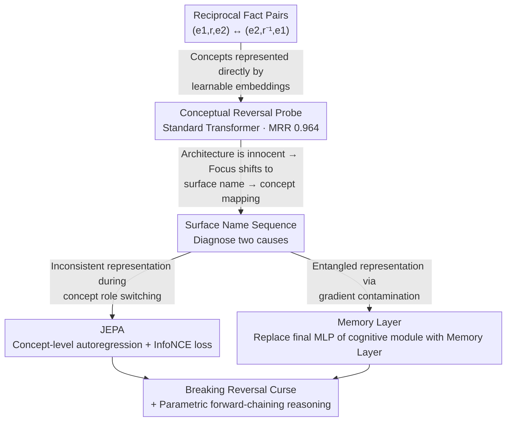

# Is the Reversal Curse a Binding Problem? Uncovering Limitations of Transformers from a Basic Generalization Failure

**Conference**: ICLR 2026  
**arXiv**: [2504.01928](https://arxiv.org/abs/2504.01928)  
**Code**: [GitHub](https://github.com/OSU-NLP-Group/reversal-curse-binding)  
**Area**: LLM/NLP  
**Keywords**: Reversal Curse, Binding Problem, JEPA, Concept Representation, Transformer Limitations

## TL;DR
This paper proposes that the "Reversal Curse" is a manifestation of the "binding problem" from cognitive science in Transformers—stemming from inconsistency and entanglement of concept representations. It designs an architecture based on JEPA and memory layers to truly break the reversal curse for the first time without relying on data augmentation.

## Background & Motivation
LLMs exhibit a fundamental generalization failure known as the Reversal Curse: after learning "Tom Smith's wife is Mary Stone" during training, they cannot answer "Mary Stone’s husband is ___." This is not limited to natural language; inverse operations are universal in mathematics, logic, and science.

Existing solutions rely either on data augmentation (flipping/shuffling sentence segments) or non-causal training objectives, which "bypass" the problem rather than solving it. A fundamental question remains: **Are traditional autoregressive Transformers destined to be unable to learn reversal?**

The authors provide a surprising answer: **No.** The key finding is that when inputs are represented at an abstract concept level (one learnable embedding per concept), standard Transformers can learn reversal perfectly. The problem lies in the **mapping process from surface form to concepts**. This connects the Reversal Curse to the "binding problem" in cognitive science.

## Method

### Overall Architecture
This paper seeks to answer a question that has been repeatedly bypassed: whether autoregressive Transformers are inherently incapable of learning reversal. The exploration is divided into two steps. First, by removing the "surface form" variable and allowing the model to learn reversal directly at the abstract conceptual level, the authors found the architecture itself is capable (**Conceptual Reversal Probe**). Thus, the focus shifts from "architecture" to the "surface form → concept" mapping, diagnosing two specific causes: **inconsistency** of representations and **entanglement** between concepts. Second, the authors apply targeted remedies: using **JEPA** (Joint-Embedding Predictive Architecture) to address inconsistency and **Memory Layers** to address entanglement, achieving true reversal learning without data augmentation or changing the autoregressive objective.

### Key Designs

**1. Conceptual Reversal Probe: Proving the Transformer architecture itself is sufficient**

To determine if the architecture is responsible, the "surface form" interference must be stripped away. The authors set $N=6$ pairs of reciprocal relations $(r_i, r_i^{-1})$, divided entities into a learning set $\mathcal{E}_A$ and a test set $\mathcal{E}_B$, and represented **each concept directly via a learnable embedding without any text names**. During training, GPT-2 sees all directions for the learning set, while entities in the test set are seen in only one direction. The result is an MRR as high as 0.964, proving that standard Transformers can learn reversal perfectly at the concept level. This step negates the hypothesis that "Transformers are naturally incapable of reversal" and narrows the problem down to how surface names map to concepts.

**2. Inconsistency Hypothesis & JEPA: Unifying concept representations across reading and prediction**

After locating the issue in the mapping phase, the first cause identified is inconsistency: the representation of a concept when perceived as a subject differs from its representation when predicted as an object. JEPA addresses this by moving autoregressive prediction from the surface level to the concept level—a cognitive module encodes surface names into concept embeddings, and subsequent autoregressive prediction occurs directly in this embedding space using an InfoNCE loss with in-batch contrastive learning. Because the prediction target and input encoding share the same embedding space, the model is forced to form consistent representations for the same concept. This marks the first time non-trivial reversal generalization has been achieved without data augmentation or non-causal objectives.

**3. Entanglement Hypothesis & Memory Layers: Preventing gradient contamination between concepts**

The second cause lies in the gradients. Analyzing the updates of the final MLP layer in the cognitive module, the authors found that when the hidden activations $\alpha, \beta$ of two concepts $a, b$ overlap ($\alpha^T\beta \neq 0$), the update for $a$ is contaminated by the gradient of $b$:

$$\Delta a = -\eta\|\alpha\|^2 \frac{\partial L}{\partial a} - \eta\, \alpha^T\beta\, \frac{\partial L}{\partial b}$$

The second term represents cross-contamination, which accumulates layer by layer. The solution is to replace the final MLP layer of the cognitive module with a Memory Layer (ultra-wide hidden dimension + top-k sparsity + softmax activation), forcing different concepts into highly separated activation patterns to eliminate entanglement. A key comparison shows that simply widening the model (768 → 1280) yields only marginal gains, whereas the Memory Layer significantly improves generalization with the same parameter count—indicating the bottleneck is the representation structure, not capacity.

### Extension: Parametric Forward-Chaining Reasoning
The reversal capability unlocks a form of parametric memory integration. For example, given "X=5", "Y=3", and "X+Y=Z", inferring "Z=8" essentially requires reversing 5+3=8 into Z=8. On multi-step arithmetic reasoning tasks involving search trees, JEPA + Memory Layer outperforms the non-parametric (in-context) reasoning of o3-Mini and Gemini-2.5-Pro by relying on parametric memory.

## Key Experimental Results

### Conceptual Reversal Learning (MRR)

| $|\mathcal{E}_A|$ | 1 Layer | 6 Layers | 12 Layers | 18 Layers |
|---|---|---|---|---|
| 2.5K | 0.823 | 0.890 | 0.810 | 0.823 |
| 50K | 0.947 | 0.951 | 0.951 | 0.944 |
| 100K | 0.964 | 0.861 | 0.960 | 0.975 |

### JEPA Ablation (multiplicity=10, $|\mathcal{E}_A|$=50K)

| Configuration (#Rec/#Sem) | Accuracy | Description |
|---|---|---|
| 1/1 | ~72% | Shallower is optimal |
| 1/6 | ~52% | Deeper semantic layer → Entanglement accumulation |
| 6/6 | ~40% | Deeper overall → Worse |
| 1/1 + Memory Layer | ~80% | Optimal after eliminating entanglement |

### Key Findings
- Standard Transformers **fail 100%** (0% accuracy) under surface prediction, yet reach 0.975 MRR at the conceptual level.
- JEPA breaks the reversal curse for the first time without data augmentation/non-causal objectives, achieving non-trivial generalization (~72%).
- Entanglement effects worsen significantly with model depth: performance drops to near zero in deep models when multiplicity=20 (multiplicity refers to the number of entities sharing head/tail tokens; higher multiplicity leads to more surface name overlap).
- Memory Layers perform significantly better than wide models of equivalent parameter size—proving the issue is structural, not capacity-based.
- Parametric forward-chaining reasoning maintains high performance even at a branching factor of 40 (6.5K facts), outperforming o3-Mini.

## Highlights & Insights
- Systematically associates the fundamental generalization failure of LLMs with the "binding problem" in cognitive science, providing a logical and inspiring perspective.
- The "Concept level works → Surface form fails" comparative experiment is elegantly designed, accurately pinpointing the core issue.
- The gradient analysis of entanglement is concise and powerful: $\Delta a = -\eta\|\alpha\|^2 \frac{\partial L}{\partial a} - \eta \alpha^T\beta \frac{\partial L}{\partial b}$, clearly demonstrating cross-contamination.
- Parametric forward-chaining reasoning is an impressive application, showcasing the deep value of reversal capabilities.

## Limitations & Future Work
- JEPA requires prior knowledge to locate concept positions and is not yet an automated solution.
- The Memory Layer assumes each unique name corresponds to a unique concept, which may hinder learning in synonym-rich scenarios.
- Experiments were conducted on controlled synthetic data; the gap with real-world LLM pre-training needs to be bridged.
- The path from identifying the "binding problem" to practical LLM improvements remains long.

## Related Work & Insights
- **vs. Data Augmentation Methods** (Golovneva et al.): Data augmentation is a bypass; JEPA + Memory Layer represents the first true breakthrough.
- **vs. Zhu et al. Theoretical Analysis**: While Zhu proved Transformers cannot learn reversal under specific conditions, this paper finds it possible at the conceptual level—different conditions lead to different conclusions.

## Rating
- Novelty: ⭐⭐⭐⭐⭐ Linking the Reversal Curse to the binding problem is a fresh and profound perspective.
- Experimental Thoroughness: ⭐⭐⭐⭐⭐ Complete chain from discovery to hypothesis to verification to application.
- Writing Quality: ⭐⭐⭐⭐⭐ Excellent narrative, progressing from surprising findings to in-depth analysis.
- Value: ⭐⭐⭐⭐⭐ Fundamental research for understanding and improving LLMs with far-reaching impact.

<!-- RELATED:START -->

## Related Papers

- [\[ICLR 2026\] Trapped by simplicity: When Transformers fail to learn from noisy features](trapped_by_simplicity_when_transformers_fail_to_learn_from_noisy_features.md)
- [\[ACL 2025\] Veracity Bias and Beyond: Uncovering LLMs' Hidden Beliefs in Problem-Solving Reasoning](../../ACL2025/llm_nlp/veracity_bias_llm_hidden_beliefs.md)
- [\[ICLR 2026\] Compositional-ARC: Assessing Systematic Generalization in Abstract Spatial Reasoning](compositional-arc_assessing_systematic_generalization_in_abstract_spatial_reason.md)
- [\[AAAI 2026\] Learning Spatial Decay for Vision Transformers](../../AAAI2026/llm_nlp/learning_spatial_decay_for_vision_transformers.md)
- [\[AAAI 2026\] Vision Transformers are Circulant Attention Learners](../../AAAI2026/llm_nlp/vision_transformers_are_circulant_attention_learners.md)

<!-- RELATED:END -->
