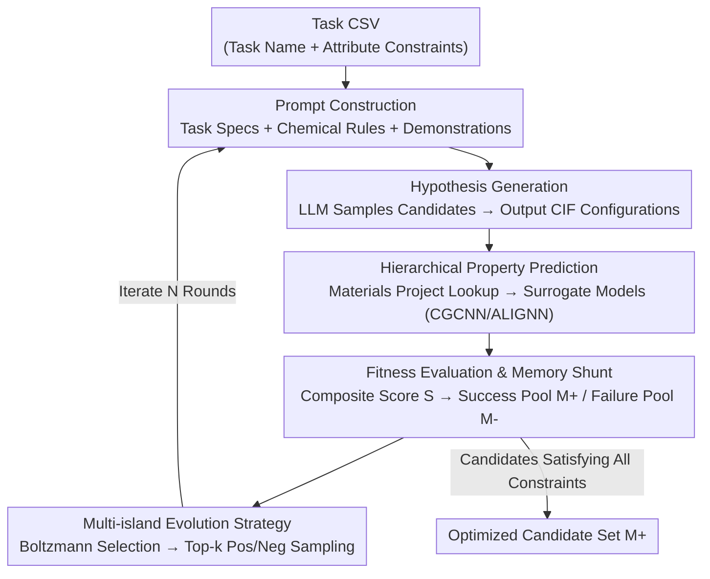

# LLEMA: Evolutionary Search with LLMs for Multi-Objective Materials Discovery

**Conference**: ICLR 2026  
**arXiv**: [2510.22503](https://arxiv.org/abs/2510.22503)  
**Code**: [github.com/scientific-discovery/LLEMA](https://github.com/scientific-discovery/LLEMA)  
**Area**: LLM NLP  
**Keywords**: Materials discovery, LLM evolutionary search, multi-objective optimization, crystal structure generation, surrogate models  

## TL;DR

Ours proposes the LLEMA framework, which integrates the scientific knowledge of LLMs with chemical rule-guided evolutionary search and memory-driven iterative optimization. It achieves higher hit rates, stability, and Pareto front quality across 14 multi-objective materials discovery tasks.

## Background & Motivation

Materials discovery requires searching through a vast combinatorial space of chemistry and structure while satisfying multiple, often conflicting, objectives. Traditional discovery processes are resource-intensive and slow, while existing methods face several dilemmas:

1. **Limitations of Prior Work in Generative Models** (CDVAE, G-SchNet, DiffCSP, MatterGen): These require retraining for specific tasks, lack generalization ability, and miss the extensive prior knowledge embedded in LLMs.
2. **Limitations of Prior Work in LLM Methods** (e.g., LLMatDesign): These rely on prompt engineering or unguided material generation. The generated candidates may be theoretically feasible but are often unstable or non-synthesizable.
3. **Key Challenge of Single-objective Optimization**: Most methods simplify materials discovery into single-objective tasks, whereas real-world scenarios are inherently multi-objective (e.g., thermoelectric materials require simultaneous optimization of electrical conductivity and thermal resistance).

LLEMA is the first framework to simultaneously feature **domain knowledge integration, multi-objective optimization, rule-guided generation, and evolutionary optimization improvement**.

## Method

### Overall Architecture

Ours formulates materials discovery as a constrained multi-objective optimization problem: find a material $m^*$ in the candidate space $\mathcal{M}$ that maximizes weighted objectives $m^* = \arg\max_{m \in \mathcal{M}} \sum_i w_i f_i(m)$, where each constraint $c_i$ can be an interval constraint $f_i(m) \in [l_i, u_i]$, a lower bound $f_i(m) \geq l_i$, or an upper bound $f_i(m) \leq u_i$. The entire pipeline is a closed loop: users provide only a CSV specifying the task name and attribute constraints. The framework then automatically constructs prompts, directs the LLM to sample candidates and output CIF crystal configurations. Candidates undergo hierarchical attribute prediction to obtain attribute vectors, followed by composite scoring to determine constraint satisfaction. Successes/failures are shunted into two memory pools. In the next iteration, positive and negative demonstrations are sampled from multiple independent "islands" to feed back into the prompt, allowing the LLM to evolve while correcting errors within a chemically valid subspace. This integrates "LLM scientific priors" with "evolutionary iterative correction." After $N$ iterations, the success pool $\mathbb{M}^+$ is returned as the optimized candidate set.

### Key Designs

**1. Hypothesis Generation: Transforming Prompts into Evolutionary Operators via Chemical Rules**

LLM generation relying purely on prompt engineering often yields "theoretically possible but non-synthesizable" candidates because domain constraints are not integrated into the generation process. In each iteration $n$, LLEMA lets the LLM $\pi_\theta$ sample a batch of candidates $\mathcal{M}^b$ from prompt $\mathbf{p}_n$. The prompt consists of four parts: task specifications (natural language targets and attribute constraints), chemical design principles $\mathcal{R}$ (rules like homologous element substitution, stoichiometry maintenance, and oxidation state consistency acting as mutation/crossover operators), positive/negative demonstrations from pools $\mathbb{M}^+$ and $\mathbb{M}^-$, and instructions for the LLM to directly output crystal configurations (formula, lattice parameters, atomic coordinates) as CIF files. Treating substitution rules and conservation laws as explicit operators forces the LLM to evolve within a chemically valid subspace rather than searching blindly—a fundamental difference from MatterGen (learned priors) or LLMatDesign (unconstrained generation).

**2. Hierarchical Property Prediction: Ensuring Reliability via Lookups and Surrogates**

The true properties of candidate materials must be accurate without running expensive DFT for every case. LLEMA employs a hierarchical oracle: it first queries the Materials Project database for exact or similar matches; if found, the ground truth is used. For out-of-distribution (OOD) candidates, it switches to surrogate models (CGCNN, ALIGNN pretrained on JARVIS-DFT) to predict the attribute vector $f(m) \in \mathbb{R}^d$. Ablation studies show this layer is indispensable—removing surrogate models and relying solely on database lookups causes hit rates and stability to collapse to <5%, as the search cannot evaluate OOD candidates meaningfully.

**3. Fitness Evaluation and Memory Shunt: Composite Scoring for Pool Management**

In multi-objective scenarios, satisfaction levels of multiple constraints must be compressed into a comparable scalar. LLEMA uses a composite score to aggregate predicted attributes of candidate $\mathcal{M}_j$ based on constraints:

$$S(\mathcal{T}, \mathcal{C}; \mathcal{M}_j) = \sum_{i=1}^k w_i \cdot \Phi_i(f_i(\mathcal{M}_j), c_i)$$

where $w_i$ is the relative weight of the $i$-th attribute, and $\Phi_i$ is a normalized reward function measuring how well $f_i(\mathcal{M}_j)$ fulfills constraint $c_i$. Candidates satisfying all hard constraints ($S \geq 0$, i.e., all $\Phi_i \geq 0$) enter the success pool $\mathbb{M}^+$, while those violating any constraint enter the failure pool $\mathbb{M}^-$. Using both pools as demonstrations teaches the model "what is right" and "what to avoid," improving the hit rate from 4.4 to 15.1 and reducing the database memorization rate from 95.3% to 58.3%.

**4. Multi-island Evolution Strategy: Balancing Exploration and Exploitation**

A single memory pool may converge prematurely by repeatedly recalling known materials. Drawing from island-model logic (e.g., FunSearch), LLEMA divides the population into $m=5$ independent islands, each with its own $\mathbb{M}^+$ and $\mathbb{M}^-$. In each round, an island is selected via Boltzmann sampling:

$$P_i = \frac{\exp(s_i/\tau_c)}{\sum_j \exp(s_j/\tau_c)}$$

where $s_i$ is the average score of island $i$ and temperature $\tau_c$ controls selection intensity. Within the chosen island, top-k samples are drawn from $\mathbb{M}^+$ and $\mathbb{M}^-$ to construct the next prompt $\mathbf{p}_{n+1}$ alongside chemical rules $\mathcal{R}$. This strategy further boosts hit rates to 29.8% and reduces memorization to 25.3%.

### Loss & Training

LLEMA does not require retraining any models: surrogate models use public pretrained weights, and the LLM is used strictly for inference. Users only need to provide a CSV with task names and constraints. High-efficiency pruning occurs by assigning low scores to candidates violating hard constraints, focusing compute on searching within the valid subspace.

## Key Experimental Results

### Main Results: 14 Materials Discovery Tasks

Evaluated on Hit Rate (H.R.) and Stability (Stab.) across 14 tasks in electronics, energy, coatings, optics, and aerospace:

| Method | Wide-Bandgap H.R/Stab | SAW/BAW H.R/Stab | Solid-State H.R/Stab | Piezo H.R/Stab | Transparent H.R/Stab |
|------|:-:|:-:|:-:|:-:|:-:|
| CDVAE | 0.04/0.04 | 0.29/0.00 | 0.04/0.04 | 42.19/0.00 | 0.00/0.00 |
| MatterGen | 6.56/4.15 | 26.27/0.00 | 5.33/3.11 | 21.64/0.00 | 9.38/0.00 |
| LLMatDesign | 4.19/1.13 | 47.59/0.13 | 2.51/2.44 | 32.16/1.38 | 0.04/0.04 |
| LLEMA (Mistral) | 17.08/10.71 | 31.58/6.80 | 31.79/20.78 | 67.11/4.84 | 43.87/18.48 |
| **LLEMA (GPT)** | **33.62/22.42** | **59.88/10.74** | **46.17/25.37** | 63.46/3.22 | 39.11/14.85 |

LLEMA outperforms baselines in almost all tasks, particularly in stability—baseline candidates often meet attribute constraints but are thermodynamically unstable.

### Ablation Study

| Method | H.R. ↑ | Stab. ↑ | Mem. Rate ↓ |
|------|:-:|:-:|:-:|
| LLM (Direct Generation) | 4.4 | 1.8 | 95.3 |
| + Memory Feedback | 15.1 | 20.1 | 58.3 |
| + Mutation & Crossover | 29.8 | 21.5 | 25.3 |
| **LLEMA (Full)** | **30.2** | **27.6** | **16.6** |

### Key Findings

1. **Evolutionary optimization significantly reduces memorization**: Pure LLM repetition of Materials Project data drops from 95.3% to 16.6% with LLEMA.
2. **Surrogate models are indispensable**: Without them, H.R. and stability collapse to <5% as the search degrades into trivial repetition.
3. **Convergence dynamics**: The proportion of valid candidates increases from ~27% at iteration 250 to ~33% at iteration 1000.
4. **Pareto front superiority**: In wide-bandgap and rigid ceramic tasks, all Pareto optimal solutions originate from LLEMA.
5. **Consistency with expert knowledge**: Discovered candidates like ZrAl₂O₅ and Hf₀.₅Zr₀.₅O₂ correspond to known high-k dielectric material families.

## Highlights & Insights

- **Encoding chemical knowledge into evolutionary operators**: Domain knowledge (substitution rules, stoichiometry, etc.) is transformed into operators guiding LLM generation rather than simple prompting.
- **Multi-island evolution strategy**: Inspired by FunSearch, it balances exploration and exploitation through a parallel island structure.
- **High Practicality**: Users can start new tasks with a single CSV; surrogate models use pretrained weights without retraining.
- **Benchmark Contribution**: Provides 14 industrially relevant multi-objective materials discovery tasks with clear physical constraints.

## Limitations & Future Work

1. Dependence on surrogate models (CGCNN, ALIGNN) for prediction; errors can accumulate and misguide the search.
2. Lack of experimental validation—newly discovered materials are computation-validated only, without laboratory synthesis.
3. High iteration cost for LLM queries; 250 iterations require significant API calls.
4. Chemical rules are currently manually designed; automated rule discovery is a natural extension.
5. Performance was validated only on GPT-4o-mini and Mistral-Small; stronger LLMs may yield further improvements.

## Related Work & Insights

- **Relation to FunSearch (Romera-Paredes et al., 2024)**: LLEMA's multi-island strategy is directly inspired by FunSearch, extending it from program search to materials discovery.
- **Complementarity with MatterGen**: MatterGen uses conditional sampling via diffusion models for inverse design; LLEMA uses LLM reasoning + evolutionary search. The two could be complementary.
- **Insight for AI4Science**: Demonstrates how to combine broad LLM knowledge with domain-specific constraints—a paradigm applicable to drug design and catalyst discovery.

## Rating

- **Novelty**: ⭐⭐⭐⭐ — First to unify LLM evolutionary search, chemical rules, and multi-objective optimization for materials discovery.
- **Technical Depth**: ⭐⭐⭐⭐ — Multi-layered design involving surrogate models, evolution, and memory management.
- **Experimental Thoroughness**: ⭐⭐⭐⭐⭐ — 14 tasks, multiple baselines, and extensive ablation/qualitative analysis.
- **Writing Quality**: ⭐⭐⭐⭐ — Clear structure and rigorous problem modeling.
- **Value**: ⭐⭐⭐⭐ — Low entry barrier (CSV-based) but reliant on surrogate quality.
- **Overall Rating**: ⭐⭐⭐⭐ (8/10)

<!-- RELATED:START -->

## Related Papers

- [\[ICLR 2026\] Efficient Multi-objective Prompt Optimization via Pure-exploration Bandits](efficient_multi-objective_prompt_optimization_via_pure-exploration_bandits.md)
- [\[ICLR 2026\] Toward Safer Diffusion Language Models: Discovery and Mitigation of Priming Vulnerabilities](toward_safer_diffusion_language_models_discovery_and_mitigation_of_priming_vulne.md)
- [\[ACL 2025\] Gradient-Adaptive Policy Optimization: Towards Multi-Objective Alignment of Large Language Models](../../ACL2025/llm_nlp/gapo_multi_objective_alignment.md)
- [\[ACL 2026\] AlphaContext: An Evolutionary Tree-based Psychometric Context Generator for Creativity Assessment](../../ACL2026/llm_nlp/alphacontext_an_evolutionary_tree-based_psychometric_context_generator_for_creat.md)
- [\[ICLR 2026\] VERIFY: A Novel Multi-Domain Dataset Grounding LTL in Contextual Natural Language via Provable Intermediate Logic](verify_a_novel_multi-domain_dataset_grounding_ltl_in_contextual_natural_language.md)

<!-- RELATED:END -->
