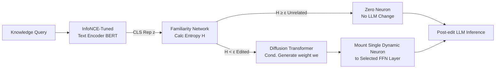

# Massive Editing for Large Language Models Based on Dynamic Weight Generation

**Conference**: ICLR 2026  
**OpenReview**: [https://openreview.net/forum?id=GJfWu4BjoI](https://openreview.net/forum?id=GJfWu4BjoI)  
**Code**: [https://github.com/RodeWayne/MeG-for-Knowledge-Editing](https://github.com/RodeWayne/MeG-for-Knowledge-Editing)  
**Area**: Knowledge Editing / Massive Model Editing / Diffusion Model Weight Generation  
**Keywords**: Knowledge Editing, Massive Editing, Dynamic Weight Generation, Diffusion Transformer, Locality  

## TL;DR
MeG attaches a "dynamic weight neuron" to the LLM, using a diffusion model to generate the neuron's weights conditioned on the knowledge query. This allows massive knowledge editing (1024–10k entries) while adding only a single neuron—simultaneously expanding knowledge capacity and locking interference to the original model as a constant, thereby significantly outperforming existing weight-modification methods on Locality metrics.

## Background & Motivation
**Background**: Knowledge Editing (KE) aims to update outdated or incorrect knowledge in LLMs at a much lower cost than pre-training. Ideal editing must satisfy three properties: Reliability (new knowledge is accurately written), Generality (correct response to paraphrased queries), and Locality (unrelated knowledge remains unchanged). Batch editing (injecting tens of thousands of facts at once) is the most practical yet challenging scenario.

**Limitations of Prior Work**: Existing massive editing methods (MEMIT, PMET, MALMEN) follow the "internal weight modification" route, where performance collapses sharply as the editing scale grows (especially beyond 10k). The authors attribute this collapse to two factors: **① Knowledge capacity limits**: Modifying only a subset of LLM weights has a fixed ceiling for writable knowledge; exceeding this threshold deteriorates Reliability and Generality. **② Interference accumulation**: The more weights are modified, the greater the damage to the original model's functions, making Locality harder to maintain at scale. Approaches like T-Patcher or SCEN, which "add neurons/experts," bypass capacity limits but require storing static weights for each entry, causing computational and storage costs to explode linearly with the number of edits.

**Key Challenge**: Expanding capacity requires adding structure, but adding structure causes overhead and interference to swell linearly with the number of edits—capacity, interference, and overhead form a trilemma that is difficult to balance.

**Goal**: Achieve high Reliability, Generality, and Locality simultaneously for batch editing at the 10k scale, while ensuring that the added structure and overhead do not grow with the number of edits.

**Core Idea**: **"Generation instead of Storage"**—rather than storing static neuron weights for each piece of knowledge, a diffusion model is trained to **dynamically generate** the weights of a single neuron based on the current knowledge query. This neuron is then mounted to a specific layer of the LLM for inference. Regardless of the number of edited facts, the model always adds only one neuron: knowledge capacity is carried by the distribution modeling capability of the generative model (decoupled from LLM size), while interference with the original model remains constant (scale-invariant interference).

## Method

### Overall Architecture
MeG consists of four components forming a "Encoding-Routing-Generation-Mounting" pipeline: the knowledge query is first processed by an **InfoNCE-tuned text encoder** to obtain a representation, then enters the **Familiarity Network** to determine if it is edited knowledge or unrelated; if it belongs to edited knowledge, a **DiT-based weight generation model** generates the weights of a dynamic neuron conditioned on that representation; the **Mounting mechanism** adds this neuron to a selected FFN layer of the LLM for inference. If it is unrelated knowledge, zero weights are generated (equivalent to no modification), preserving Locality. The training phase collects "knowledge-weight" pairs offline to train the diffusion model, while the inference phase generates weights in real-time based on the query.

### Key Designs

**1. Single Dynamic Neuron + Diffusion Weight Generation: Turning "Storing Knowledge" into "Generating Weights."** This is the foundation of MeG. The authors first optimize the weights of a new neuron $w_e$ for each edited fact $x_e$ while freezing the original model weights $\theta$, such that $y=f(x_e;(\theta,w_e))$ equals the target $y_e$, collecting $N$ pairs of $(x_e^i, w_e^i)$. Weight generation is treated similarly to "text-to-image": a DiT-based diffusion model generates neuron weights conditioned on the text representation. This analogy holds because the dimensionality of a single neuron (approx. $2560^2$ for Phi-2, $4096^2$ for GPT-J/Llama-3) is comparable to an image, and diffusion models excel at high-dimensional fine-grained generation. Training uses the v-prediction objective for stability, where the velocity $v_t=\alpha_t\cdot\epsilon-\beta_t\cdot w$ is predicted, and the loss is $\mathcal{L}_{\text{v-pred}}=\mathbb{E}_{w,c,t}\big[\|v_t-\hat v_\theta(w_t,t,c)\|_2^2\big]$. Thus, the LLM only ever gains one neuron, keeping interference constant.

**2. InfoNCE Text Encoder: Strengthening Generality via Similarity.** Generality requires the model to correctly answer paraphrased queries. The key is to encode $x_e$ and its equivalent expression $x_{eq}$ into similar representations. The authors treat this as a contrastive representation learning problem: using the BERT CLS vector, equivalent expressions are positive samples, and other facts are negative samples, optimized via InfoNCE loss $\mathcal{L}_{f_{TE}}=-\frac{1}{B}\sum_{i=1}^{B}\log\frac{\exp(\text{sim}(x_{eq}^i,x_e^i)/\tau)}{\sum_{j=1}^{B}\exp(\text{sim}(x_{eq}^i,x_e^j)/\tau)}$. Since real equivalent expressions are often unavailable, the authors synthesize "original-paraphrase" pairs for training. Ablations show that on COUNTERFACT-GPT-J-1024, InfoNCE tuning improves Generality from 18.46 (frozen BERT) to 84.96 (AG), far exceeding MSE tuning (56.54).

**3. Familiarity Network: Entropy-based Binary Routing for Locality.** Even with one neuron, Locality drops if unrelated queries are modified. The authors leverage the fact that neural network training is an entropy-reduction process: for seen data, the output distribution's entropy is significantly lower. All edited queries are randomly assigned to $K=10$ classes ($K \ll N$) to train a 5-layer FFN classifier $f_\mu$. At inference, the entropy $H=-\sum_{k=1}^{K}P_\mu^k\log P_\mu^k$ is calculated: if $H < \epsilon$, it is treated as edited knowledge and processed by DiT; if $H \ge \epsilon$, it is unrelated, and a zero neuron is generated. This network significantly boosts Locality, e.g., +34.86%(AG) on ZsRE-Phi-2-1024.

**4. FFN Layer Selection + 50-step Fast Sampling: Engineering Calibrations.** The choice of the layer to which the neuron is added is critical; instead of always using the last layer like T-Patcher, the authors pre-select a specific editing layer for each LLM. For inference, diffusion steps are compressed from 1000 to 50 using fast sampling, maintaining weight quality while improving efficiency. Reverse denoising iterates from $t=T$ to $t=0$ to recover weights $w_e=\frac{1}{\sqrt{\bar\alpha_t}}\big(w_t-\sqrt{1-\bar\alpha_t}\cdot v\big)$.

## Key Experimental Results

### Main Results (ZsRE, edit num=10000, Score is the harmonic mean of 6 metrics)

| Model | Method | Reliability(AG/TF) | Generality(AG/TF) | Locality(AG/TF) | Score↑ |
|------|------|------|------|------|------|
| Phi-2 | MALMEN | 71.79/85.94 | 41.54/68.67 | 18.22/80.78 | 45.64 |
| Phi-2 | **Ours** | 95.07/97.04 | 59.69/74.17 | **91.14/95.84** | **82.80** |
| GPT-J | MALMEN | 96.78/98.54 | 59.35/79.09 | 16.56/81.41 | 48.92 |
| GPT-J | **Ours** | 99.11/99.16 | 61.69/75.68 | **83.99/94.20** | **83.20** |
| Llama-3 | MALMEN | 87.23/94.72 | 57.95/80.92 | 44.65/85.86 | 70.03 |
| Llama-3 | **Ours** | 98.90/99.44 | 61.33/78.95 | **85.02/94.23** | **83.90** |

Ours leads by a large margin across all models. The Locality improvement is particularly significant, outperforming the runner-up by +63.69%(AG) on GPT-J. Scaling curves (1024 to 10k) show that MeG degrades the slowest, with its lead widening as the number of edits increases.

### General Ability Maintenance (Phi-2, post ZsRE 10k edited)

| Task | Before | FT | MEMIT | MALMEN | Ours |
|------|--------|----|-------|--------|-----|
| GSM8K | 42.84 | 32.68 | 19.26 | 48.60 | **61.18** |
| MMLU | 56.98 | 52.68 | 45.19 | 53.97 | **57.00** |
| BBH | 40.58 | 20.12 | 30.31 | 38.45 | **40.67** |

After 10,000 edits, MeG shows almost no performance drop (and even slight gains) on general benchmarks, confirming that "single neuron = controllable interference."

### Ablation Study

| Ablation Item | Setting | Key Metric Change |
|--------|------|------|
| Familiarity Network (ZsRE-Phi-2-1024) | w/o FN → Ours | Locality 53.81→88.67(AG), Score 81.32→91.30 |
| Text Encoder (CF-GPT-J-1024) | Frozen/MSE/InfoNCE | Generality(AG) 18.46/56.54/**84.96** |
| Weight Generator (Llama-3-ZsRE 10k) | MLP → DiT | Generality(AG) 45.49→61.33; MLP is 90% faster but generalizes poorly |

### Key Findings
- Interference of a single neuron is "non-monotonic": Without the Familiarity Network, Locality only degrades by 4.89%(AG) as edits increase from 1024 to 10k, far better than the monotonic collapse of weight-modifying methods.
- DiT is indispensable for Generality: Replacing DiT with an MLP keeps Reliability/Locality similar but causes Generality to plummet, indicating that high-precision weight generation is crucial for Generality.

## Highlights & Insights
- **Paradigm Shift**: Replacing "storing weights" with "generating weights conditioned on queries" reduces the structural overhead and interference growth in massive KE to a constant.
- **Cross-domain Analogy**: Recognizing that single neuron weight dimensions match those of images allows the reuse of the text-to-image DiT paradigm, effectively applying Neural Network Diffusion to KE.
- **Entropy Reduction Routing**: Using the "training as entropy reduction" property for unrelated knowledge identification allows protecting Locality without needing unrelated data during training.
- **Realistic Evaluation**: Pointing out distortions in old Locality metrics on low-accuracy datasets, the authors use consistency of responses post-edit and add the more realistic AG (autoregressive generation) setting.

## Limitations & Future Work
- **Extra Inference Overhead**: Each edited query requires a diffusion denoising pass. Even at 50 steps, this is an additional cost compared to original inference.
- **Offline Pairing Cost**: Optimized "knowledge-weight" pairs must be collected for $N$ facts before training the diffusion model, a process that scales linearly with knowledge volume.
- **Pseudo-equivalent Data Dependency**: Generality depends on synthetic paraphrases for encoder training; generalization under real distribution shifts remains to be verified.
- **Single Editing Layer Assumption**: Currently, one neuron is added to a single layer. Whether complex or conflicting knowledge requires multi-layer or multi-neuron setups is an open question.

## Related Work & Insights
- **Weight Modification** (ROME/MEMIT/PMET/MALMEN): Locates and edits or uses meta-learning to change internal FFN weights. MeG directly competes with and surpasses these as the mainstream for massive KE.
- **Neuron Addition** (T-Patcher/RASE/SCEN): Adds neurons or external weights. MeG improves upon these by replacing "storage" with "generation" to prevent cost explosions.
- **Neural Network Diffusion** (p-diff/Wang et al. 2024a): Demonstrates that diffusion models can model network parameter distributions better than VAE hypernetworks. MeG innovates by moving from "generating a set of static parameters" to "dynamically generating a single neuron per query."

## Rating
- Novelty: ⭐⭐⭐⭐⭐ — Dynamic conditional generation of single-neuron weights is a clean and rare paradigm-level breakthrough.
- Experimental Thoroughness: ⭐⭐⭐⭐ — Covers 3 models, 2 datasets, and 4 scales, including general benchmarks and three ablations.
- Writing Quality: ⭐⭐⭐⭐ — Motivation and components are clearly explained; Figure 2 is highly effective.
- Value: ⭐⭐⭐⭐ — Significant leads in Locality and preservation of general abilities make this highly meaningful for practical batch KE.

<!-- RELATED:START -->

## Related Papers

- [\[ACL 2025\] Dynamic Knowledge Integration for Evidence-Driven Counter-Argument Generation with Large Language Models](../../ACL2025/llm_nlp/dynamic_knowledge_integration_for_evidence-driven_counter-argument_generation_wi.md)
- [\[ACL 2026\] From Static Inference to Dynamic Interaction: A Survey of Streaming Large Language Models](../../ACL2026/llm_nlp/from_static_inference_to_dynamic_interaction_a_survey_of_streaming_large_languag.md)
- [\[ACL 2026\] PersonaArena: Dynamic Simulation for Evaluating and Enhancing Persona-Level Role-Playing in Large Language Models](../../ACL2026/llm_nlp/personaarena_dynamic_simulation_for_evaluating_and_enhancing_persona-level_role-.md)
- [\[ICLR 2026\] PT2-LLM: Post-Training Ternarization for Large Language Models](pt2-llm_post-training_ternarization_for_large_language_models.md)
- [\[ICLR 2026\] Attend to the Active: Structure-Aware Dynamic Attention in LLMs for Compositional Instruction Following](attend_to_the_active_structure-aware_dynamic_attention_in_llms_for_compositional.md)

<!-- RELATED:END -->
