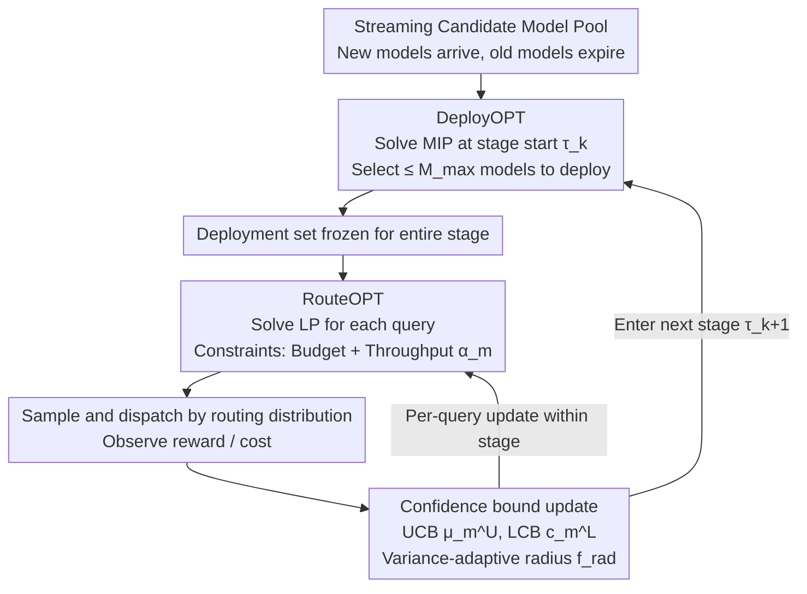

# Near-Optimal Online Deployment and Routing for Streaming LLMs

**Conference**: ICLR 2026  
**arXiv**: [2506.17254](https://arxiv.org/abs/2506.17254)  
**Code**: None  
**Area**: LLM NLP / System Optimization  
**Keywords**: LLM routing, online deployment, streaming bandits, concurrency limit, budget constraints

## TL;DR
This work formalizes the joint problem of streaming online deployment and routing for LLMs for the first time: as new models continuously emerge and old ones become obsolete, the authors propose the StageRoute hierarchical algorithm under a concurrency limit $M_{\max}$ and cost budget constraints. The study proves a $\tilde{\mathcal{O}}(T^{2/3})$ regret bound and provides a matching lower bound, achieving near-optimality.

## Background & Motivation

**Background**: Extensive work has been done on LLM routing (e.g., RouteLLM, Hybrid-LLM, Zooter), but they mostly assume a fixed set of models. In practice, new models are released continuously while old ones gradually phase out. For instance, Azure OpenAI limits each resource to 32 standard deployments and 5 fine-tuned deployments, with GPT-4.1 having a rate limit of 1000 RPM and 1M TPM.

**Key Challenge**: Practical LLM services face decisions coupled across two fundamentally different time scales:
   - **Macro (stage-wise)**: Deciding which models to keep deployed (constrained by the concurrency limit $M_{\max}$ and fixed for an entire stage). This is a **high-risk decision**—activating an uncertain new model may require evicting a known reliable model for a whole stage.
   - **Micro (per-query)**: Routing each incoming query to one of the deployed models (constrained by budget and throughput).
   - Deployment decisions **determine** the entire action space for routing—a fundamental precursor problem ignored by previous routing research.

**Limitations of Prior Work**: Static pool routing (RouteLLM) lacks dynamic deployment; budget-aware routing (TensorOpera) lacks concurrency limits; streaming bandits (UniRoute/CSCR) lack stage-level commitment; BwK models consumable budgets but lacks active set replacement. No existing framework simultaneously addresses these five dimensions: **streaming arrival, dynamic deployment, concurrency limits, budget, and throughput**.

**Core Idea**: By modeling LLM deployment and routing as an online decision problem with two coupled time scales, the authors propose StageRoute. It uses optimistic estimation for deployment selection at the macro level and solves an LP for real-time routing at the micro level, achieving a near-optimal $\tilde{\mathcal{O}}(T^{2/3})$ regret bound.

## Method

### Overall Architecture
StageRoute addresses a precursor problem ignored by existing routing works: which models to keep online and where to send each query as new models arrive and old ones expire. It divides the total time $T$ into $K$ stages, making hierarchical decisions across two time scales. At the start of each stage $\tau_k$, a "strategic" deployment is performed: incorporating newly arrived models into the candidate pool, selecting $\leq M_{\max}$ models to deploy, and freezing this set for the entire stage—a high-risk commitment that cannot be changed mid-stage. For each query arriving within a stage, a "tactical" routing decision is made: a linear program is solved in real-time over the frozen deployment set to obtain a dispatch distribution. After observing rewards/costs, confidence estimates for each model are updated, serving both micro-level routing and macro-level deployment in the next stage.

### Key Designs

**1. DeployOPT: Defining the Available Model Set via Optimistic Estimation**

Deployment is high-risk—activating an unexplored new model at the start of a stage might degrade performance for the entire period without the possibility of mid-stage replacement. Thus, DeployOPT solves an optimization problem with a concurrency limit at each update point $\tau_k$ (Eq. 3): it assigns weights $d$ to candidate models, constraining the support size $|\text{supp}(d)| = \min(M_{\max}, |\mathcal{M}_{\tau_k}|)$ and satisfying the budget $b$ and throughput limits $\alpha_m$. The goal is to maximize "optimistic" utility using performance upper bounds $\mu_m^U$ (UCB) and cost lower bounds $c_m^L$ (LCB). The non-zero support of the optimal solution $d^*$ forms the deployment set $\mathcal{D}_k(\mathcal{A})$. This approach encourages exploring new models. Importantly, $d^*$ **only determines which models to deploy and is not used as the routing probability**, decoupling deployment from routing execution.

**2. RouteOPT: Per-query Real-time LP Dispatch**

Once the deployment set is frozen, exploration and exploitation within the stage are handled by the routing layer. For each query, RouteOPT solves a linear program (Eq. 7) over the deployed models $\mathcal{D}_k(\mathcal{A})$, aiming for the expected reward based on UCB rewards $\mu_m^U$ and LCB costs $c_m^L$, subject to budget and throughput constraints $p_t(m) \leq \alpha_m$. A model $m_t$ is sampled according to the resulting distribution $p_t^*$. Observations of actual rewards $r_t$ and costs $c_t$ refresh the empirical means $\bar\mu_m, \bar c_m$ and sample counts $N_m$, tightening the confidence bounds for subsequent queries.

**3. Confidence Bound Design: Variance-Adaptive Radii**

The tightness of UCB/LCB directly influences the algorithm's willingness to adopt new models. The performance upper bound is set as $\mu_m^U = \text{proj}_{[0,1]}(\bar\mu_m + 2f_{rad})$ and the cost lower bound as $c_m^L = \text{proj}_{[c_1,c_2]}(\bar c_m - 2f_{rad})$, where the confidence radius is:

$$f_{rad}(v,n) = \sqrt{\frac{\gamma v}{n}} + \frac{\gamma}{n}$$

This radius shrinks as the sample count $n$ increases and expands with empirical variance $v$, with $\gamma = \Theta(\log(NT/\delta))$ ensuring $1-\delta$ confidence. The variance term allows the confidence intervals of well-sampled models to narrow quickly, concentrating the exploration budget on truly uncertain new models.

**4. Regret Bound and Matching Lower Bound: Separating Learning and Discovery Costs**

Theorem 1 provides an upper bound $\text{Regret} \leq \mathcal{O}(\sqrt{M_{\max}KT\log(NT/\delta)} + NT/(M_{\max}K))$: the first term represents the statistical learning cost of routing within the deployed set, while the second term captures the structural bottleneck of model discovery—the difficulty of identifying the best new models when only $M_{\max}$ out of $N$ candidates can be online. Balancing these terms across stage count $K$ leads to a near-optimal convergence of $\tilde{\mathcal{O}}(N^{1/3}T^{2/3})$. Theorem 2 further proves a matching lower bound of $\Omega(T^{2/3})$, indicating this rate is an inherent difficulty of the problem.

## Key Experimental Results

### Comparison with Existing LLM Routing Frameworks

| Method | Streaming Models | Dynamic Deployment ($M_{\max}$ limit) | Budget Aware | Throughput Limit |
|------|---------|----------------------|---------|----------|
| RouteLLM | ✗ | ✗ | ✓ | ✗ |
| UniRoute | ✓ | ✗ | ✓ | ✗ |
| CSCR | ✓ | ✗ | ✓ | ✗ |
| **StageRoute** | **✓** | **✓** | **✓** | **✓** |

### Simulation Experiments (RouterBench real cost/score data)

| Setup | StageRoute vs Oracle Gap | Description |
|---------|------------------------|------|
| Tight Budget $(b=0.3)$ | <5% sub-optimality | Maintains closeness to oracle under strict budget |
| Loose Budget $(b=0.7)$ | <2% sub-optimality | Near-optimal when budget is ample |
| $M_{\max}$ Change | Performance scales with $M_{\max}$ | Validates the theoretical role of concurrency limits |
| $K$ Change | Optimal near $K=T^{1/3}$ | Validates theoretical optimal stage count |
| Diverse Queries | Consistently effective | Robust across multi-task/multi-lingual workloads |

### Key Findings
- The two-term regret decomposition clearly reveals the fundamental trade-off between "routing learning" and "model discovery."
- StageRoute significantly outperforms static deployment strategies under tight budgets, as dynamic replacement of obsolete models yields substantial gains.
- Throughput constraints naturally throttle high-load models, mitigating latency spikes.

## Highlights & Insights
- **Innovation in Problem Formalization**: This work is the first to model LLM deployment and routing as an online decision problem coupling two time scales, covering realistic scenarios with streaming arrivals, concurrency limits, and budget/throughput constraints.
- **Regret Decomposition Insights**: The trade-off between statistical learning costs and structural discovery bottlenecks provides clear guidance for system design.
- **Optimality Proof**: The matching lower bound confirms that $\tilde{\mathcal{O}}(T^{2/3})$ is the best achievable rate given the inherent difficulty of the problem.
- **Decoupled Architecture**: Using DeployOPT's solution for selection rather than direct routing probabilities allows the system to adapt quickly at the query level within fixed stage-wise deployments.

## Limitations & Future Work
- The model assumes stationary performance distributions (constant mean $\mu_m$) and does not account for model degradation or distribution shifts in queries.
- Routing is non-contextual; incorporating contextual estimators could further improve performance by utilizing query features.
- Throughput is modeled via simple probabilities $p_t(m) \leq \alpha_m$ assuming instantaneous load sharing, whereas real systems might require consideration of queuing delays.
- The evaluation is limited to simulations based on RouterBench offline data, lacking validation in true production environments.

## Related Work & Insights
- **vs RouteLLM/Hybrid-LLM**: These target fixed model pools without concurrency limits, whereas StageRoute handles fully dynamic scenarios.
- **vs BwK (Bandits with Knapsacks)**: BwK models consumable budgets but lacks stage-level commitment and active set replacement.
- **vs CMAB (Combinatorial MAB)**: CMAB selects super-arms from a fixed ground set without streaming arrivals.
- **vs Streaming Bandits**: These allow streaming arrivals but do not couple stage-wise deployment and query routing.
- **Insight**: The hierarchical decision architecture (strategic deployment + tactical routing) can be generalized to other resource-constrained online service systems.

## Rating
- Novelty: ⭐⭐⭐⭐⭐ First complete formalization + near-optimal algorithm + matching lower bound.
- Experimental Thoroughness: ⭐⭐⭐ Primarily simulation-based, lacking real-world deployment validation.
- Writing Quality: ⭐⭐⭐⭐⭐ Rigorous theoretical derivation with clear motivation.
- Value: ⭐⭐⭐⭐ Provides significant theoretical guidance for LLM service system design.

<!-- RELATED:START -->

## Related Papers

- [\[ICML 2025\] BEST-Route: Adaptive LLM Routing with Test-Time Optimal Compute](../../ICML2025/llm_nlp/best-route_adaptive_llm_routing_with_test-time_optimal_compute.md)
- [\[ICLR 2026\] BOTS: A Unified Framework for Bayesian Online Task Selection in LLM Reinforcement Finetuning](bots_a_unified_framework_for_bayesian_online_task_selection_in_llm_reinforcement.md)
- [\[AAAI 2026\] ICL-Router: In-Context Learned Model Representations for LLM Routing](../../AAAI2026/llm_nlp/icl-router_in-context_learned_model_representations_for_llm_routing.md)
- [\[ACL 2025\] Are Optimal Algorithms Still Optimal? Rethinking Sorting in LLM-Based Pairwise Ranking with Batching and Caching](../../ACL2025/llm_nlp/are_optimal_algorithms_still_optimal_rethinking_sorting_in_llm-based_pairwise_ra.md)
- [\[ACL 2025\] LLM as Effective Streaming Processor: Bridging Streaming-Batch Mismatches with Group Position Encoding](../../ACL2025/llm_nlp/llm_as_effective_streaming_processor_bridging_streaming-batch_mismatches_with_gr.md)

<!-- RELATED:END -->
