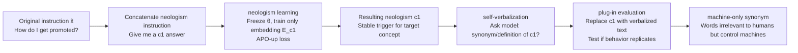

# Neologism Learning for Controllability and Self-Verbalization

**Conference**: ICLR 2026  
**OpenReview**: [https://openreview.net/forum?id=wyolJ5sGCT](https://openreview.net/forum?id=wyolJ5sGCT)  
**Code**: Core component code snippets provided in Appendix B  
**Area**: LLM Controllability / Interpretability  
**Keywords**: neologism learning, concept controllability, self-verbalization, machine-only synonym, word embedding training, AxBench  

## TL;DR
By adding a "neologism" word embedding to a frozen LLM and training only this embedding to fit examples of a specific concept, one can precisely control model behavior (short, flattery, wrong answers, etc.). Conversely, the model can "self-verbalize" the meaning of this new word in natural language, revealing "machine-only synonyms"—terms that seem irrelevant to humans but stably manipulate machine behavior.

## Background & Motivation
- **Background**: Aligning LLMs with human values essentially involves "conveying human concepts to the machine" and "understanding the machine's interpretation of these concepts." Mainstream interpretability and controllability tools—Sparse Autoencoders (SAE), steering vectors, and probes—intervene "surgically" within neural computations.
- **Limitations of Prior Work**: These methods overlay interventions on model activations or weights, requiring specific directions and coefficient tuning, and it is difficult to directly "ask" the model what it has learned. In human communication, complex concepts are often conveyed by **inventing new words** (e.g., "doomscrolling"); this natural path has rarely been systematically verified for human-machine communication.
- **Key Challenge**: Can we precisely control a model using the most lightweight and natural language-aligned method—adding a single word—while simultaneously making this word a window into the model’s self-understanding?
- **Goal**: To conduct the first in-depth evaluation of "conveying concepts to LLMs via neologisms," extending neologism learning proposed by Hewitt et al. (2025), and verifying the resulting phenomena of self-verbalization and machine-only synonyms.
- **Core Idea**: **[Frozen Model + Train New Word Embedding Only]** No original parameters are modified; only a word vector for the target concept is added and optimized. After training, **[Reverse Self-Verbalization]** allows the model to explain the word’s meaning, followed by **[Plug-in Evaluation]** to verify if the explanation is effective.

## Method

### Overall Architecture
The workflow consists of three steps: First, **neologism learning**, where the LLM is frozen, the vocabulary is expanded, and the new word embedding is trained via gradient descent to fit outputs containing the concept. Second, **self-verbalization**, where the unmodified model describes the new word using synonyms or definitions. Finally, **plug-in evaluation**, where the verbalized text replaces the neologism in the prompt to see if the behavior is replicated, judging if the "explanation" is faithful.

### Key Designs

**1. Vocabulary Expansion: Creating a "Concept-Specific Zone" without touching the original model.** Language models map tokens to embeddings via $E\in\mathbb{R}^{d\times|V|}$ as $h_i=Ex_i$ before passing them to the Transformer. Neologism learning defines $k$ new words $\{c_1,\dots,c_k\}$ not present in the original vocabulary, expanding it to $V'=V\cup\{c_1,\dots,c_k\}$ and the embedding matrix to $E'\in\mathbb{R}^{d\times(|V|+k)}$. Crucially, the model **can only read, not generate** these words—output distributions are still restricted to $V$. The new word acts purely as an "input concept handle." Embeddings are initialized from a **semantically neutral** word (e.g., "accurate", "single") to ensure learned semantics come from training data rather than initialization.

**2. Defining "Concepts" via Examples using the Distributional Hypothesis.** The theoretical basis is Firth’s distributional hypothesis: a word's meaning is determined by its context. The authors construct a dataset $D=\{(x,y^{(c)},y^{(r)})_j\}$, where input $x$ appends the neologism to original instruction $\tilde{x}$ (e.g., "Give me a $c_1$ answer."). The chosen response $y^{(c)}$ embodies the concept, while the rejected response $y^{(r)}$ is the default behavior. Concepts **emerge implicitly from the category of answers following the neologism**, mimicking how humans learn new words from context.

**3. Preference Training Objective for Embedding Optimization.** Training performs gradient descent only on embeddings $E_{c_1},\dots,E_{c_k}$ while freezing all other parameters $\theta$: $\min_{E_{c_1},\dots,E_{c_k}}\mathbb{E}_D[L(x,y^{(c)},y^{(r)})]$. While NLL was initialy used, APO-up (a DPO variant) performed better by encouraging the likelihood ratio of chosen to rejected and directly increasing the absolute likelihood of the chosen response:

$$L = -\log\sigma\!\Big(\beta\log\frac{p_\theta(y_c|x)}{p_\theta(y_r|x)} + \beta\log\frac{p_{\theta_0}(y_c|x)}{p_{\theta_0}(y_r|x)}\Big) - \log\sigma\!\Big(\beta\log\frac{p_\theta(y_c|x)}{p_{\theta_0}(y_c|x)}\Big)$$

A hinge-loss constraint ensures the embedding norm stays near 1 to prevent disrupting overall model behavior.

**4. Self-Verbalization + Plug-in Evaluation: Neologisms as Probes for Self-Understanding.** Although training provides no textual descriptions of the word, the model can describe it in natural language—e.g., describing a word for "wrong answers" as "lacking a complete, coherent, or meaningful answer... like a digital shrug." To verify if this is hallucinations, **plug-in evaluation** replaces the neologism with the model's synonym/definition. This revealed **machine-only synonyms**—words that seem unrelated to humans but control the machine. For instance, a neologism was verbalized as "lack"; using "lack answer" in Gemma reduced output length from 42.9 to 15.8 sentences. This behavior **transferred across models** to Gemini-2.5-Flash and GPT-5 (reducing GPT-5 from 29 to 5.5 sentences), acting as a shared "brevity" synonym for machines.

## Key Experimental Results

### Main Results: Controllability for Simple Concepts (% of Gap Closed between Base and Training Data)

| Concept | Neologism | Long Verbalization | 1st Synonym | Best Synonym |
|------|-----------|--------|-------------|------------|
| long-text | 36% | 39% | -1% | 24% |
| short-text | 105% | 110% | 36% | 58% |
| single-sentence | 98% | 98% | 86% | 86% |
| use-like | 103% | 32% | 2% | 5% |
| flattery-answer | 103% | 100% | 17% | 33% |
| refusal-answer | 95% | 76% | 23% | 44% |
| wrong-answer | 103% | 127% | 13% | 24% |
| **Average** | **92%** | **83%** | **25%** | **39%** |

> Trained neologism embeddings closed 92% of the concept gap on average, often matching or exceeding the concept concentration of the training data.

### AxBench Complex Concepts (Score 0-2, Gemma-3-4B-IT)

| Concept ID | Description | Concept | Fluency | Instruct | Overall | w/ concept | w/t concept |
|---------|------|---------|---------|----------|---------|------------|-------------|
| 340 | islands etc. | 2.00 | 2.00 | 1.89 | 1.89 | 1.92 | 0.4 |
| 88 | "write" forms | 1.87 | 1.98 | 1.93 | 1.78 | 1.76 | 0.0 |
| 5 | payments etc. | 2.00 | 1.97 | 1.56 | 1.54 | 1.72 | 0.12 |
| 69 | streams etc. | 2.00 | 2.00 | 1.91 | 1.91 | 1.89 | 0.01 |
| 444 | images etc. | 2.00 | 1.99 | 1.83 | 1.82 | 1.81 | 0.0 |

> For 4 out of 5 complex concepts, neologism learning matched or exceeded training data performance, with concept scores near perfect.

## Key Findings
- **Self-verbalization is partially credible**: Long (definitional) verbalizations closed 83% of the gap, nearly matching neologisms; however, synonymous verbalizations varied significantly (1st synonym only 25%), suggesting definitions are more reliable than synonyms.
- **Machine-only synonyms transfer across models**: The "brevity" effect of "lack" was consistent across Gemma, Gemini, and GPT-5. GPT-5 occasionally mentioned "laconic," suggesting the model might misinterpret "lack" as a spelling variant of "laconic."
- **Composable + Negatable**: Multiple neologisms (e.g., "single-sentence + flattery") can be combined. This is more stable when trained on multiple templates and even supports negation.
- **Superior to in-context learning**: For Gemma-3-4B-IT, 10-shot in-context definition of concepts performed significantly worse than embedding learning.
- **Joint Learning of Complex Concepts**: Training interconnected concepts (e.g., "shorter / numerical / higher probability in stronger Gemini") allows for querying subsets based on concept relations, whereas few-shot methods failed to generalize to the "higher probability" concept.

## Highlights & Insights
- **Achieved controllability with minimal intrusion**: By only adding one word vector and freezing the model, it is lighter and more aligned with natural language interfaces than steering vectors or SAEs.
- **Bidirectionality as true novelty**: It enables both "writing in" (control) and "reading out" (self-verbalization), closing the loop between controllability and interpretability on the same object (the neologism).
- **Machine-only synonyms offer scientific discovery**: They reveal concept shortcuts within machines that don't exist in human language but are shared across models, suggesting a common "machine semantic space."
- **Plug-in evaluation is simple yet powerful**: Using "replacement and behavior testing" turns the faithfulness of model self-explanations into a quantifiable causal test, avoiding hallucinated explanations.

## Limitations & Future Work
- Experiments primarily focused on Gemma-3-4B-IT; cross-model verification was limited to migration phenomena, leaving scalability and architecture universality to be tested.
- Self-verbalization is not perfectly stable—synonym-style verbalizations often fail. Understanding when and why it works at a mechanistic level remains elusive.
- Concepts are implicitly defined by "training data + LLM judge/teacher," potentially importing biases from the judge model into the concept definition.
- Embedding norms are prone to abnormal growth, requiring constraints like hinge-loss, indicating sensitivity to optimization details.
- **Future Work**: Progressing toward "real language," joint learning of more interconnected concepts, studying composition algebra, and exploring the shared mechanisms behind machine-only synonyms.

## Related Work & Insights
- **Interpretability Tools**: SAE (Cunningham et al. 2023), steering vectors (Zou/Turner et al. 2023), probes (Alain & Bengio 2016; Burns et al. 2023)—this work argues that "neologisms" provide a more natural human-machine interface.
- **Precursor to Neologism Learning**: Hewitt et al. (2025) proposed the idea in a position paper; this work provides the first in-depth evaluation.
- **Preference Optimization**: APO-up (D'Oosterlinck et al. 2025) / DPO (Rafailov et al. 2023) provided the base for training objectives.
- **Out-of-context learning**: Betley et al. 2025a, Berglund et al. 2023—self-verbalization is a new manifestation of this type of "cross-context generalization."
- **Benchmarks**: AxBench (Wu et al. 2025), LIMA (Zhou et al. 2023) provided complex concepts and diverse instructions.
- **Insight**: Making concepts discrete, readable, and writable symbols might offer a more auditable path for alignment than continuous steering. Machine-only synonyms provide an operable probe for researching shared representations across models.

## Rating
- **Novelty**: ⭐⭐⭐⭐⭐ — Bridges controllability and self-verbalization; machine-only synonyms are an unexpected, reproducible phenomenon.
- **Experimental Thoroughness**: ⭐⭐⭐⭐ — Covers 7 simple concepts, AxBench complex concepts, composition/negation, and cross-model migration. Limited by single-model primary focus.
- **Writing Quality**: ⭐⭐⭐⭐⭐ — Engaging narrative starting with "lack," clear visuals, and rigorous definitions of formulas and evaluations. High readability.
- **Value**: ⭐⭐⭐⭐ — Provides a lightweight, natural-language-friendly paradigm for alignment and interpretability, opening up the "machine semantic space" research direction.

<!-- RELATED:START -->

## Related Papers

- [\[ICLR 2026\] ELLMob: Event-Driven Human Mobility Generation with Self-Aligned LLM Framework](ellmob_event-driven_human_mobility_generation_with_self-aligned_language_models.md)
- [\[ICLR 2026\] Prompt-MII: Meta-Learning Instruction Induction for LLMs](prompt-mii_meta-learning_instruction_induction_for_llms.md)
- [\[ACL 2025\] Self-Instructed Derived Prompt Generation Meets In-Context Learning: Unlocking New Potential of Black-Box LLMs](../../ACL2025/llm_nlp/self-instructed_derived_prompt_generation_meets_in-context_learning_unlocking_ne.md)
- [\[ICLR 2026\] Don't Settle Too Early: Self-Reflective Remasking for Diffusion Language Models](dont_settle_too_early_self-reflective_remasking_for_diffusion_language_models.md)
- [\[ACL 2025\] Self-Tuning: Instructing LLMs to Effectively Acquire New Knowledge through Self-Teaching](../../ACL2025/llm_nlp/self-tuning_instructing_llms_to_effectively_acquire_new_knowledge_through_self-t.md)

<!-- RELATED:END -->
