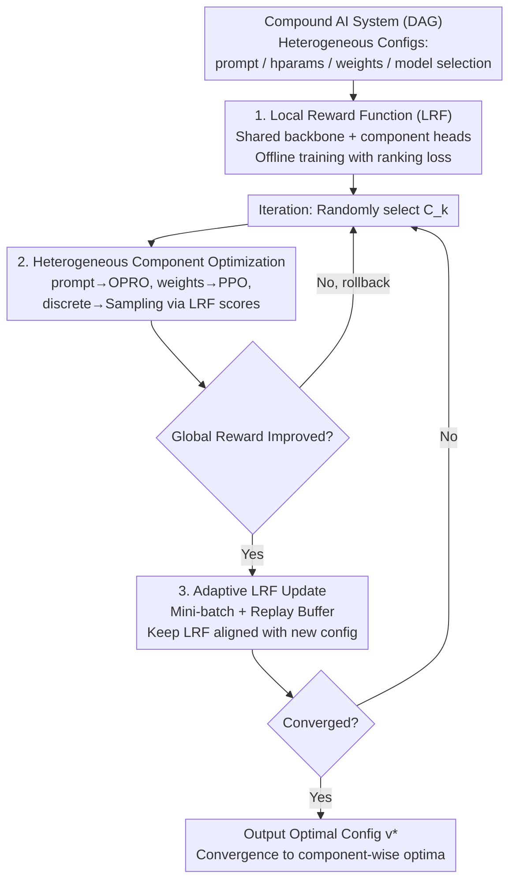

# Optimas: Optimizing Compound AI Systems with Globally Aligned Local Rewards

**Conference**: ICLR 2026  
**arXiv**: [2507.03041](https://arxiv.org/abs/2507.03041)  
**Code**: [https://optimas.stanford.edu/](https://optimas.stanford.edu/)  
**Area**: LLM NLP / System Optimization  
**Keywords**: Compound AI systems, Local Reward Functions, Global Alignment, Heterogeneous Parameter Optimization, Convergence Guarantees

## TL;DR
The Optimas framework is proposed to maintain a Local Reward Function (LRF) aligned with the global reward for each component within a compound AI system. This enables the independent optimization of heterogeneous components (prompts, model parameters, hyperparameters, model selection), achieving an average performance gain of 11.92% across five real-world systems.

## Background & Motivation
**Background**: Modern AI systems increasingly integrate multiple components—such as LLMs, retrievers, tool calls, and traditional ML models—forming compound AI systems to handle complex tasks. These systems are highly sensitive to component failures, as an error in one component can cascade and amplify through the pipeline.

**Limitations of Prior Work**: (a) Inter-component dependencies are often non-differentiable, preventing end-to-end gradient optimization; (b) Configuration spaces are highly heterogeneous—text prompts, continuous hyperparameters, model weights, and discrete model selections requiring completely different optimization strategies; (c) Evaluating global performance requires running the full system every time, which is costly and data-inefficient.

**Key Challenge**: Existing methods (e.g., DSPy for prompt optimization, TextGrad for text-based feedback optimization, OPRO for single-step optimization) can only handle a **single type** of parameter. Even if individual components are optimized to their local best, upstream components remain unaware of downstream preferences, leading to sub-optimal collaboration. There is a lack of a unified framework to simultaneously optimize heterogeneous configurations.

**Core Idea**: The core idea is to learn a Local Reward Function (LRF) for each component. As long as the LRF remains aligned with the global reward (i.e., the local optimization direction is consistent with the global one), heterogeneous components can be optimized independently using their most suitable methods without the need for frequent full-system runs. This essentially decomposes joint optimization into multiple independent coordinate optimization problems.

## Method

### Overall Architecture
Optimas addresses a practical challenge: optimizing a pipeline where "vastly different" configurations (prompts, hyperparameters, model weights, model selection) coexist across components like LLMs, retrievers, and tools. The overall approach avoids directly optimizing the non-differentiable and expensive global objective. Instead, it assigns a local scorer (LRF) to each component to predict whether its output benefits the final result. Each component then optimizes locally; as long as these local scores remain aligned with the global reward, the entire system improves.

The process consists of two stages. **First, offline LRF training**: The system is modeled as a directed acyclic graph (DAG) $\mathcal{G}=(\mathcal{C},\mathcal{E})$ containing $K$ components $\{C_k\}_{k=1}^K$, each with a configuration policy $\mathbf{v}_k$. The input flows topologically to produce output $y=f(x;\mathbf{v})$, with the global goal being $\mathbf{v}^{\star}=\arg\max_{\mathbf{v}} \mathbb{E}_{x\sim\mathcal{D}}[R(x,f(x;\mathbf{v}))]$. **Second, the iterative loop**: In each round, a component is randomly selected and optimized locally using the optimization method best suited for its configuration type, targeting its LRF. New configurations pass through a validation gate; they are accepted only if they improve the global reward. Once accepted, the LRF is lightly calibrated using a mini-batch of new preference data to stay synchronized with the evolving system. Optimas thus transforms a coupled joint optimization into a set of independently solvable yet aligned coordinate optimization sub-problems.

### Key Designs

**1. Local Reward Function (LRF): Predicting Global Contribution**

The difficulty of directly optimizing the global reward $R$ lies in the non-differentiability between components and the high cost of full-system evaluation. LRF learns a scoring function $r_k(x_k,y_k)$ for each component $C_k$ to evaluate its contribution to final performance. All LRFs share a common LLM backbone $\phi$ and use component-specific linear projection heads $h_k$, such that $r_k(x_k,y_k) = h_k \circ \phi([x_k, y_k])$. The shared backbone ensures scalability as the number of components grows, while independent heads capture component-specific characteristics.

The LRF replaces the global reward based on an "alignment property": if $r_k(x_k,y_k^+) \geq r_k(x_k,y_k^-)$, then replacing $y_k^-$ with $y_k^+$ should lead to a higher global reward. Training uses a pairwise log-sigmoid ranking loss:

$$\mathcal{L}_k = -\mathbb{E}\big[\log\sigma\big(r_k(x_k,y_k^+)-r_k(x_k,y_k^-)\big)\big]$$

Preference pairs $(y_k^+, y_k^-)$ are constructed automatically: by running the system to $C_k$, recording the partial trajectory, sampling two candidate outputs, and using Monte Carlo estimation to determine which leads to a higher global reward. Theorem 4.1 proves that the minimizer of this loss satisfies the alignment property.

**2. Heterogeneous Component Optimization: Unified Command via LRF**

With aligned LRFs, components can be optimized using their most effective methods without running the full system. Text prompts are optimized via OPRO, selecting the best candidate based on LRF scores. Trainable models (e.g., LLM weights) utilize RL algorithms like PPO, using the LRF as a critic to provide reward signals. Discrete or low-dimensional continuous configurations (model selection, hyperparameters) are updated by sampling from a distribution built on LRF scores. Updates are guarded by validation: new configurations are only accepted if global reward on a small validation set actually increases.

**3. Adaptive LRF Update: Lightweight Calibration**

LRFs are not static; they can become outdated as configurations update. If upstream components change, the global value of a downstream output shifts ($r_i$ loses accuracy). If downstream components change, the LRF may face out-of-distribution inputs. Optimas solves this in two stages: Stage 1 involves offline training to reach initial convergence and alignment. Stage 2 performs online adaptation using a small batch of new preference data $\mathcal{B}_k$ and a history buffer to maintain stability, ensuring the LRF keeps pace with system changes at a low cost.

### Theory
Two theorems support the logic that local optimization is equivalent to global improvement. **Theorem 4.1** states that the ranking loss minimizer for LRF satisfies the local-global alignment property, and maximizing the LRF shares the same solution as maximizing the conditional global reward. **Theorem 4.2** further indicates that under conditions of compactness and unique component-wise optima, Optimas converges to a component-wise maximum.

## Key Experimental Results

### Main Results (Five Real-world Compound Systems)

| System | Metric | Unoptimized | DSPy | TextGrad | **Optimas** | Relative Gain |
|------|------|-------------|------|----------|-------------|----------|
| Amazon Recommendation | Acc | 21.21 | 18.18 | 20.88 | **24.24** | +14.3% |
| PubMedQA Medical | Acc | 57.46 | 60.26 | 56.96 | **69.13** | +1.8% |
| STaRK-Prime Retrieval | MRR | 40.73 | 41.40 | 41.31 | **50.54** | +22.1% |
| HotpotQA RAG | F1 | 33.80 | 44.90 | 24.86 | **50.48** | +12.4% |
| BigCodeBench Code | Pass | 36.67 | 33.81 | 35.71 | **38.92** | +9.0% |

### Ablation Study

| Configuration | Description |
|------|------|
| Optimas (Full) | All components optimized independently with aligned LRFs; improved all 5 systems. |
| w/o LRF adaptation | Performance dropped by 2-5%; LRF misalignment due to lack of updates. |
| Global reward only | Performance dropped by 3-8%; low data efficiency due to lack of local signals. |
| DSPy (Prompt only) | Dropped by 14.3% on Amazon; optimizing single config types is unreliable. |

### Key Findings
- **Optimas is the only method that improved performance across all five tasks**; DSPy and TextGrad decreased performance on some systems.
- The average ranking accuracy of LRF is 77.96%, significantly exceeding LLM Judge (49.52%), indicating learned LRFs are more reliable than zero-shot LLM scoring.
- Average system runs were 0.71k vs 0.79k for DSPy, demonstrating higher data efficiency.
- Adaptive LRF updates are crucial for long-term performance; without them, performance degrades in later iterations.

## Highlights
- A unified framework for optimizing heterogeneous configurations, whereas DSPy/TextGrad are limited to single types.
- Strict theoretical guarantees for LRF alignment (convergence to component-wise optima).
- The shared backbone + independent head architecture for LRF is both scalable and memory-efficient.
- Consistent improvements across five real systems, while DSPy dropped 14.3% on the Amazon task.

## Limitations & Future Work
- Coordinate optimization only guarantees component-wise optima in non-convex problems, not necessarily the global optimum.
- Online LRF adaptation still requires a small number of system runs and Monte Carlo sampling, so the cost is not zero.
- The number of components in experiments was limited (2-5); scalability for much larger systems is yet to be verified.
- Conflicts in the shared LRF backbone might occur if input distributions across components differ drastically.

## Related Work & Insights
- **DSPy/TextGrad**: Limited to prompt optimization; do not support heterogeneous configurations.
- **OPRO**: Single-step generation optimization; incapable of handling multi-component, multi-step pipelines.
- **LLMSelector**: Focuses only on model routing; system run costs are approximately 3x higher than Optimas.
- **Process Reward Models**: Rely on human annotation or MCTS; Optimas automatically constructs alignment data via preferences.

## Rating
- Novelty: ⭐⭐⭐⭐ (Novel LRF alignment approach for unified heterogeneous optimization)
- Experimental Thoroughness: ⭐⭐⭐⭐⭐ (5 real systems + extensive ablations + theoretical analysis)
- Writing Quality: ⭐⭐⭐⭐ (Clear structure, rich visualizations)
- Value: ⭐⭐⭐⭐ (Significant direction for compound AI system optimization)

<!-- RELATED:START -->

## Related Papers

- [\[ICML 2026\] Optimizing Diversity and Quality through Base-Aligned Model Collaboration](../../ICML2026/llm_nlp/optimizing_diversity_and_quality_through_base-aligned_model_collaboration.md)
- [\[ICLR 2026\] ELLMob: Event-Driven Human Mobility Generation with Self-Aligned LLM Framework](ellmob_event-driven_human_mobility_generation_with_self-aligned_language_models.md)
- [\[ACL 2026\] Characterizing the Expressivity of Local Attention in Transformers](../../ACL2026/llm_nlp/characterizing_the_expressivity_of_local_attention_in_transformers.md)
- [\[ICLR 2026\] Speculative Actions: A Lossless Framework for Faster AI Agents](speculative_actions_faster_ai_agents.md)
- [\[ACL 2026\] Generative Floor Plan Design with LLMs via Reinforcement Learning with Verifiable Rewards](../../ACL2026/llm_nlp/generative_floor_plan_design_with_llms_via_reinforcement_learning_with_verifiabl.md)

<!-- RELATED:END -->
