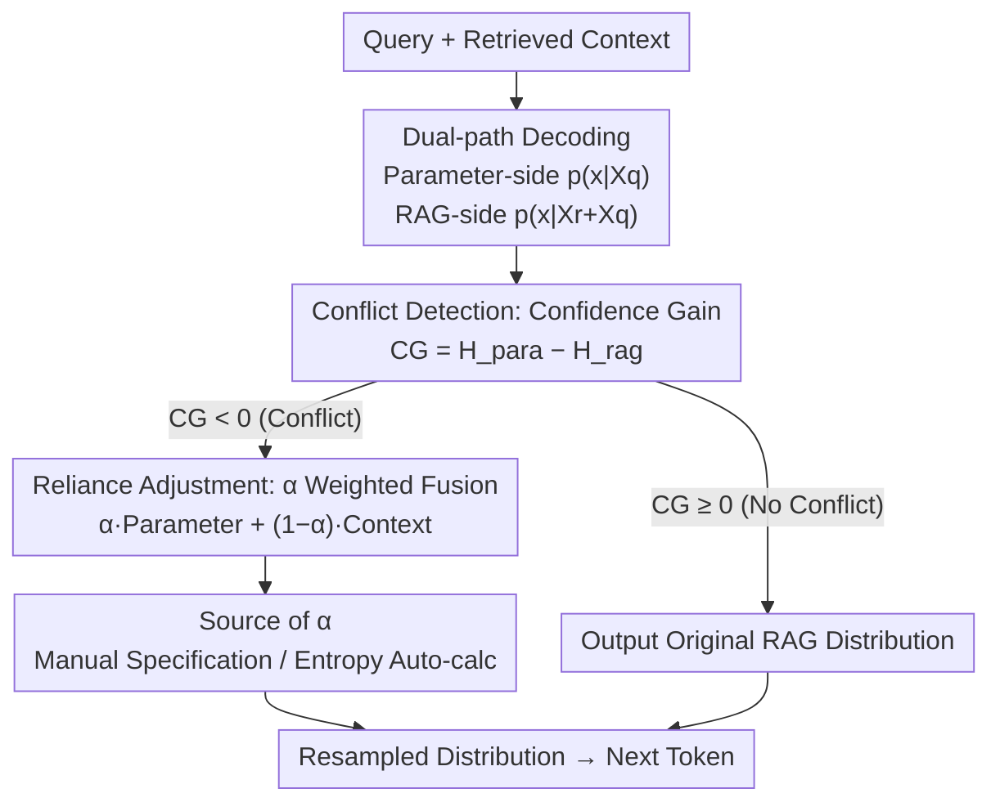

# Parameters vs. Context: Fine-Grained Control of Knowledge Reliance in Language Models

**Conference**: ICLR 2026  
**OpenReview**: [https://openreview.net/forum?id=TJ3DqFiGau](https://openreview.net/forum?id=TJ3DqFiGau)  
**Code**: https://github.com/byronBBL/CK-PLUG  
**Area**: LLM / NLP  
**Keywords**: RAG, Knowledge Conflict, Decoding Intervention, Parametric Knowledge, Contextual Faithfulness

## TL;DR
This paper proposes CK-PLUG, a plug-and-play, training-free decoding-stage method. It uses "Confidence Gain (CG)" to detect conflicts between parametric knowledge and retrieved context at the token level, then blends "parameter-side" and "context-side" probability distributions using a single hyperparameter $\alpha$. This enables continuous, bidirectional, and controllable adjustment between "the model's own memory" and "retrieved context"—allowing the Memory Recall (MR) on LLaMA3-8B to be tuned anywhere between 9.9% and 71.9% while maintaining generation fluency.

## Background & Motivation

**Background**: Retrieval-Augmented Generation (RAG) mitigates LLM hallucinations by integrating external knowledge into prompts, becoming the mainstream approach for QA and fact-checking. It inherently assumes that external retrieved content is more reliable than the knowledge stored in the model's parameters.

**Limitations of Prior Work**: Conflicts between parametric knowledge and the retrieved context occur frequently (e.g., outdated or noisy retrieval, or outdated model training). Models often fail to determine which source to trust: blindly following context leads to misinformation from poor retrieval, while blindly following parameters misses updated external facts.

**Key Challenge**: There is an inherent trade-off between parametric "factuality" and contextual "faithfulness." Existing alignment methods—whether pulling the model toward being more "fact-faithful" or "context-faithful"—are **unidirectional and uncontrollable**. They bake preferences into the weights, making it impossible to flexibly adjust between the two during deployment based on retrieval quality or model recency.

**Goal**: To develop a mechanism that allows for **bidirectional, continuous, and fine-grained** adjustment of knowledge reliance preferences without modifying model parameters or training multiple versions.

**Key Insight**: The authors observe a quantifiable signal: when conflicting context is inserted into the prompt, the **entropy of the probability distribution for knowledge-sensitive tokens increases** (the model becomes more uncertain); conversely, supportive context decreases entropy. This implies that the "change in confidence before and after inserting context" can serve as a conflict detector.

**Core Idea**: Use "Confidence Gain" (the change in entropy before and after context insertion) to locate conflict points token-by-token. For **conflict tokens only**, the parameter-side and context-side next-token distributions are recombined via weight $\alpha$, using a single "knob" to control reliance.

## Method

### Overall Architecture

CK-PLUG (Controllable Knowledge Plug-in) is a lightweight plugin integrated into the decoding loop without altering model weights or architecture. During each token generation, it performs three steps: ① Calculates two next-token distributions—the "parameter-side distribution" $p(x\mid X_q)$ using only the query, and the "RAG distribution" $p(x\mid X_r+X_q)$ using both query and context; ② Uses the entropy difference between the two (Confidence Gain, CG) to detect if the current token is a conflict point; ③ If it is a conflict token, it fuses the two distributions using hyperparameter $\alpha$ before sampling; otherwise, it proceeds with standard RAG decoding. A larger $\alpha$ favors parameters, while a smaller $\alpha$ favors context. An automated mode is also provided to calculate $\alpha$ based on distribution entropy.

### Key Designs

**1. Confidence Gain (CG): Pinpointing Conflict Tokens via Entropy Change**

Intervening on all tokens would collapse generation quality; thus, it is necessary to identify tokens where knowledge conflicts actually occur. This "gate" is based on Shannon entropy $H(a)=-\sum_i a_i\log_2 a_i$. On NQ data (Figure 2), the authors verified that inserting "Conflict Context" causes the entropy of gold-answer tokens to **increase**, while "Support Context" causes it to **decrease**. Confidence Gain is defined as:

$$\mathrm{CG} = H(p(x\mid X_q)) - H(p(x\mid X_r+X_q))$$

If $\mathrm{CG}<0$ (or below a model-specific threshold $\varepsilon$), the token is identified as a potential knowledge conflict. This token-level signal aligns with human intuition regarding where a model "hesitates" between sources.

**2. Parameter-Context Reliance Adjustment: Discrete Control via $\alpha$**

Upon detecting a conflict token, CK-PLUG separates the two sources in log-probability space. Let the "parameter-side log-distribution" be $q_{\text{para}}=\log p(x\mid X_q)$. The "context-side log-distribution" is isolated by subtracting the parameter distribution from the RAG distribution:

$$q_{\text{cont}}(x\mid X_r+X_q)=\log\frac{p(x\mid X_r+X_q)}{p(x\mid X_q)}$$

Conflicts tokens are fused linearly using $\alpha$:

$$F(q_{\text{cont}}, q_{\text{para}}) = \alpha\cdot q_{\text{para}} + (1-\alpha)\cdot q_{\text{cont}}$$

Increasing $\alpha$ shifts the model toward parametric knowledge, while decreasing it shifts toward context. To prevent the distribution from collapsing into long-tail noise, an adaptive plausibility constraint is used to re-rank only within a subset $V_{\text{head}}$ (the union of the top-k tokens from both sides).

**3. Adaptive Mode: Calculating $\alpha$ via Entropy**

To avoid manual tuning, $\alpha$ is defined as the normalized ratio of the perplexities (proxied by entropy): let $H_{\text{para}}=H(p(x\mid X_q))$ and $H_{\text{cont}}=H(p(x\mid X_r+X_q))$, then:

$$\alpha = \frac{H_{\text{cont}}}{H_{\text{para}}+H_{\text{cont}}}$$

Intuitively, if the context makes the model more confused ($H_{\text{cont}}$ is high), $\alpha$ increases to trust the parameters more, and vice versa.

## Key Experimental Results

### Main Results

Evaluations on NQ (with counterfactual context), ConFiQA, and MQuAKE use ConR (Context Recall), ParR (Parametric Recall), and Memory Ratio $\mathrm{MR}=\frac{\text{ParR}}{\text{ParR}+\text{ConR}}$. By tuning $\alpha$ from 0.0 to 1.0, MR can be shifted significantly:

| Model | Dataset | Baseline MR | $\alpha{=}0.0$ (Context) | $\alpha{=}1.0$ (Params) |
|------|--------|------|------|------|
| LLaMA3-8B | NQ | 43.5 | 9.9 (↓77.2%) | 71.9 (↑65.3%) |
| LLaMA3-8B | ConFiQA | 29.2 | 14.9 (↓48.9%) | 62.5 (↑114.0%) |
| LLaMA2-7B | MQuAKE | 40.9 | 21.0 (↓48.7%) | 79.9 (↑95.4%) |
| Mistral0.3-7B | NQ | 55.9 | 17.2 (↓69.3%) | 72.2 (↑29.2%) |

The adaptive mode provides stable gains across 6 general RAG tasks:

| Model | w/o RAG (Avg) | w/ RAG (Avg) | RAG + CK-PLUG (Avg) |
|------|------|------|------|
| LLaMA2-7B-Chat | 25.5 | 36.4 | 38.3 |
| LLaMA3-8B-Instruct | 30.7 | 42.3 | 43.5 |
| Qwen2.5-7B | 27.2 | 45.4 | 45.9 |

### Ablation Study

The core ablation removes Conflict Detection (ConD), intervening on every token indiscriminately. Generation quality is measured by hit rate:

| Configuration | LLaMA3-8B Hit Rate | Description |
|------|------|------|
| Baseline (Standard RAG) | 83.7 | No CK-PLUG |
| w/ ConD, $\alpha{=}1.0$ | 86.7 | With detection; comparable to baseline |
| w/o ConD, $\alpha{=}0.0$ | 53.8 | Performance collapses at extreme $\alpha$ without detection |

### Key Findings
- **ConD is critical**: Without ConD, the hit rate of LLaMA models drops from 80+ to the 50s at extreme $\alpha$ values. Localizing intervention to conflict tokens is essential to avoid catastrophic generation collapse.
- **Linear/Smooth Adjustment**: MR changes roughly linearly with $\alpha$, ensuring fine-grained controllability. 
- **Preserved Fluency**: Intervention occurs only on knowledge-sensitive tokens, maintaining logical consistency and sentence fluency.

## Highlights & Insights
- **Conflict as a Quantifiable Signal**: Using entropy change to detect conflicts allows for precise token-level localization, which is far more granular than paragraph-level judgments.
- **Isolating Contextual Contribution in Log-Space**: The calculation $q_{\text{cont}}=\log\frac{p(x\mid X_r+X_q)}{p(x\mid X_q)}$ effectively isolates the "contextual delta," allowing independent weighting.
- **Training-free and Adaptive**: The mechanism supports both manual adjustment (based on retrieval quality) and adaptive balancing based on model confidence.

## Limitations & Future Work
- Threshold $\varepsilon$ for conflict detection must be calibrated per model (e.g., -1 to -3), lacking universal transferability.
- The signal relies on the empirical trend of entropy increasing during conflict; this signal is weaker in models like Mistral and Qwen, potentially affecting robustness.
- Decoding requires an additional forward pass for the "query-only" distribution, roughly doubling the computational cost per token.
- Evaluation focuses on factual QA; efficacy in open-ended or long-form generation where conflict definitions are more complex remains to be verified.

## Related Work & Insights
- **vs. Alignment (e.g., DoLa, context-faithful models)**: These solidify preferences into weights during training. CK-PLUG moves the control to inference via $\alpha$.
- **vs. Contrastive Decoding**: CK-PLUG replaces the "expert vs. amateur" contrast with "parameter vs. context," and introduces entropy-driven gating.
- **vs. Knowledge Editing**: Editing solves "memory storage," while CK-PLUG solves "source reliance" during inference; the two are complementary.

## Rating
- Novelty: ⭐⭐⭐⭐ Combing entropy-based detection with log-space fusion for controllable reliance is a practical and novel approach.
- Experimental Thoroughness: ⭐⭐⭐⭐ Comprehensive testing across multiple models and tasks; however, cost/latency analysis is limited.
- Writing Quality: ⭐⭐⭐⭐ Clear logical flow from motivation to mechanism.
- Value: ⭐⭐⭐⭐ Training-free and plug-and-play, addressing a major pain point in RAG deployment.

<!-- RELATED:START -->

## Related Papers

- [\[ICLR 2026\] FACT: Fine-grained Across-variable Convolution for Multivariate Time Series Forecasting](fact_fine-grained_across-variable_convolution_for_multivariate_time_series_forec.md)
- [\[ICLR 2026\] Fine-Grained Activation Steering: Steering Less, Achieving More](fine-grained_activation_steering_steering_less_achieving_more.md)
- [\[ACL 2025\] SudoLM: Learning Access Control of Parametric Knowledge with Authorization Alignment](../../ACL2025/llm_nlp/sudolm_authorization_alignment.md)
- [\[ACL 2025\] BehaviorBox: Automated Discovery of Fine-Grained Performance Differences Between Language Models](../../ACL2025/llm_nlp/behaviorbox_automated_discovery_of_fine-grained_performance_differences_between_.md)
- [\[ICLR 2026\] Cite Pretrain: Retrieval-Free Knowledge Attribution for Large Language Models](cite_pretrain_retrieval-free_knowledge_attribution_for_large_language_models.md)

<!-- RELATED:END -->
## Related Papers

- [\[ICLR 2026\] Fine-Grained Activation Steering: Steering Less, Achieving More](fine-grained_activation_steering_steering_less_achieving_more.md)
- [\[ACL 2025\] BehaviorBox: Automated Discovery of Fine-Grained Performance Differences Between Language Models](../../ACL2025/llm_nlp/behaviorbox_automated_discovery_of_fine-grained_performance_differences_between_.md)
- [\[ICLR 2026\] Cite Pretrain: Retrieval-Free Knowledge Attribution for Large Language Models](cite_pretrain_retrieval-free_knowledge_attribution_for_large_language_models.md)
- [\[ACL 2025\] ChartLens: Fine-Grained Visual Attribution in Charts](../../ACL2025/llm_nlp/chartlens_fine-grained_visual_attribution_in_charts.md)
- [\[ACL 2025\] RetroLLM: Empowering Large Language Models to Retrieve Fine-grained Evidence within Generation](../../ACL2025/llm_nlp/retrollm_empowering_large_language_models_to_retrieve_fine-grained_evidence_with.md)

<!-- RELATED:END -->
