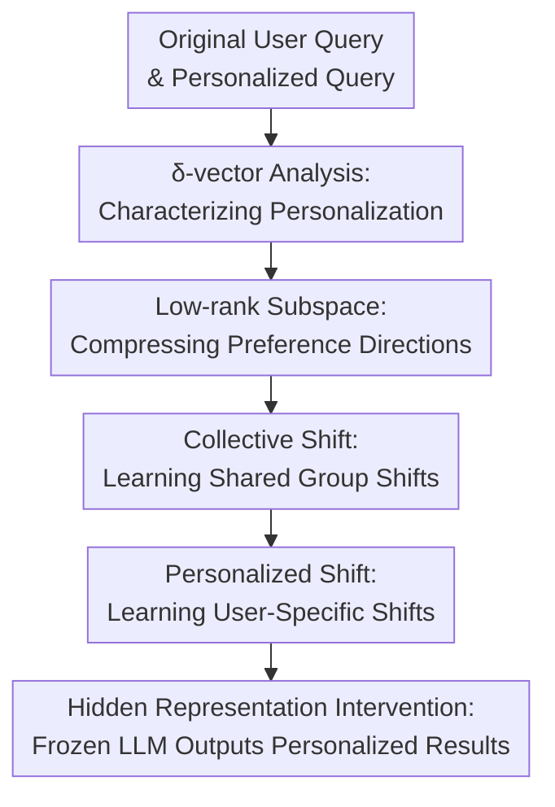

# PerFit: Exploring Personalization Shifts in Representation Space of LLMs

**Conference**: ICLR 2026  
**OpenReview**: [https://openreview.net/forum?id=Lwn67fk9e1](https://openreview.net/forum?id=Lwn67fk9e1)  
**Code**: The paper states that project code is provided; however, a specific URL is not provided in the cache.  
**Area**: LLM / NLP  
**Keywords**: Personalized LLM, Representation Fine-tuning, Activation Steering, Low-rank Subspace, User Preference

## TL;DR
PerFit discovers that personalized information in LLMs can be characterized by low-rank representation shifts. By employing a two-stage representation space intervention consisting of "collective shared shifts + personalized exclusive shifts," it approaches or exceeds LoRA/OPPU performance on six LaMP personalization tasks while reducing trainable parameters by approximately 92.3% on average compared to OPPU.

## Background & Motivation
**Background**: Personalized Large Language Models (LLMs) aim to provide distinct outputs for different users based on their history, writing styles, rating habits, or domain preferences using the same base LLM. Existing approaches generally fall into two categories: parameter-free methods like RAG, PAG, and profile prompting, which insert user history or profiles into the context; and Parameter-Efficient Fine-Tuning (PEFT), particularly LoRA/OPPU, which train personalized parameters for each user.

**Limitations of Prior Work**: Parameter-free methods are lightweight for deployment, but user history often contains noise, and retrieved context does not necessarily equate to true preferences. Consequently, they struggle with tasks involving implicit styles, headline habits, or evaluation scales, effectively "seeing the data" without truly "learning the user." LoRA-style methods are more powerful but require storing a set of adapted parameters for every user. Even with low-rank adaptation, this can involve millions of parameters, posing storage, communication, and scalability challenges in cloud-edge collaborative scenarios.

**Key Challenge**: Personalization does not require rewriting the capabilities of the entire model, yet existing strong methods primarily modify weights in the parameter space. If user preferences actually correspond to a few directions in the hidden representations, then training a massive number of parameters for each user is an over-representation. The core question of the paper is: Does there exist a discernible, compressible, and intervenable personalized signal in the hidden representation space of LLMs?

**Goal**: The authors first perform a mechanistic analysis to observe whether personalized information forms stable patterns in the representation space. They then translate these observations into a lightweight method that achieves user-level adaptation through low-rank representation intervention without updating the base LLM parameters. Finally, they validate the effectiveness, parameter count, training time, and robustness across multiple LaMP personalized classification and generation tasks.

**Key Insight**: The paper draws on ideas from activation steering and representation fine-tuning. Instead of encoding user preferences into LoRA weights, it is more effective to directly add a learnable intervention vector to the residual streams of specific layers. If these vectors possess a low-rank structure, they can be learned using very small matrices.

**Core Idea**: Personalization is viewed as a low-rank shift in hidden representations. This shift is decomposed into a "collective shift" shared by all users and a "personalized shift" specific to each user. PerFit directly learns and injects these representation shifts in two stages.

## Method
### Overall Architecture
The methodological chain of PerFit is straightforward: First, it extracts hidden state differences between original queries and personalization-enhanced queries to analyze the geometric structure of these differences in the representation space. Based on the observation of "low-rank subspaces + two types of shifts," it trains a two-stage representation intervention module. During inference, the base LLM is frozen, and only the learned low-rank interventions are added to the hidden representations of selected layers. The output is still decoded by the original LLM, but intermediate representations are steered toward the target user's preferences.

Formally, given a set of original queries $Q_i^{orig}$ and a set of queries with relevant personalized information $Q_i^{per}$ for user $u_i$, the paper extracts the residual stream representation of the last token at a specific layer $\ell$. It calculates the mean representations $m_i^{(\ell)}$ and $n_i^{(\ell)}$, using the difference $v_i^{(\ell)}=n_i^{(\ell)}-m_i^{(\ell)}$ as the $\delta$-vector induced by the user's personalized information. The $\delta$-vectors of all users are analyzed collectively, rather than searching for individual attribute directions as in traditional activation steering.

This analysis yields two findings: First, $\delta$-vectors can be explained by a very small orthogonal low-rank subspace; for instance, in some LaMP tasks, a few dimensions can explain 0.8 or 0.9 of the variance. Second, within the low-rank space, there is an initial directional shift shared by almost all users, which then diverges into different directions reflecting individual differences. PerFit’s two-stage design explicitly models these two types of shifts.

### Key Designs
**1. $\delta$-vectors: Decoupling Personalization from Input Length and Task Semantics**

Instead of training modules immediately, the paper first asks "what personalized information looks like inside an LLM." For each user, it constructs two types of inputs: a standard query and a query containing the most relevant user history/profile. It then compares their residual representations at the last token of the same layer. The difference $v_i^{(\ell)}=n_i^{(\ell)}-m_i^{(\ell)}$ represents how much and in what direction the internal representation is pushed when user information is added. This step is crucial because it pulls personalization from the output text level back into the model's internal space, allowing subsequent methods to avoid blindly guessing which weights to tune.

The authors also conducted an essential exclusion experiment: adding random text of equal length to the query also changes the representation, but the mean coordinate shift caused by random text is significantly smaller than the $\delta$-vectors corresponding to real personalized information. This indicates that the observed shifts are not artifacts of increased input length but primarily originate from preference signals carried in the user history.

**2. Low-rank Subspace: Using Small Matrices to Carry User Preferences**

SVD analysis shows that personalized differences do not require the full hidden dimension for expression. Using the Llama hidden dimension of 4096 as a reference, multiple LaMP tasks require very few dimensions to explain 0.8 or 0.9 of the variance. For example, LaMP-2N requires only 1 dimension for 0.8 and 4 dimensions for 0.9, while LaMP-5 requires 40 dimensions for 0.9. This implies that while user preferences appear diverse, they are concentrated in a few controllable directions within the model.

PerFit uses an orthogonal projection matrix $R\in\mathbb{R}^{r\times d}$ to project high-dimensional representations into a low-dimensional subspace, applies a low-dimensional transformation $Wx+b$ to learn the shift, and finally maps it back to the original space via $R^\top$. A single stage of intervention is written as $\phi_{\Delta\Theta}(x)=x+R^\top(Wx+b-Rx)$. Intuitively, $R$ identifies the low-rank coordinate system where personalization resides, while $W$ and $b$ handle the movement within this system. Since $r\ll d$, the number of trainable parameters is naturally much smaller than LoRA.

**3. Collective Shift + Personalized Shift: Learning Group Commonalities Before Individual Variances**

The second observation is that $\delta$-vectors are not entirely scattered. After low-rank projection, there is a clear mean shift in a primary direction, corresponding to the collective shift. Building on this shared shift, different users diffuse into different regions, corresponding to the personalized shift. PerFit integrates this geometric structure directly into the training process: Stage 1 trains a shared intervention using data from all users to learn "where personalized tasks generally push representations," and Stage 2 fine-tunes a second-stage intervention for each user based on the shared one.

This design is more stable than "learning a direct vector for each user in one stage" because individual user histories are often limited, and estimating a full shift from a few samples is prone to overfitting. Having a collective shift provides a common starting point for every user; Stage 2 only needs to learn the residual relative to this starting point. Ablations support this: using Stage 1 alone loses individual differences, while using Stage 2 alone lacks the group prior. The complete two-stage approach is generally superior.

**4. Layer and Position Selection: Personalization as a Mid-to-Early Layer Representation Problem**

PerFit intervenes in the representations of specific transformer layers, so "which layer to add the shift" is critical. Layer-wise analysis shows that $\delta$-vectors in mid-to-early layers are lower-rank and exhibit clearer collective shifts. In later layers, user style, task semantics, and generation formats become entangled, causing a decline in intervention effectiveness. Experiments show that single-layer intervention performance generally worsens from lower to higher layers, with the final layer potentially disrupting the output format.

This differs from knowledge editing, which often finds factual knowledge in mid-to-late layers. The task here is not writing a fact but enabling the model to process subsequent generation or classification with user style/preferences. If these signals are injected in mid-to-early layers, they can propagate and combine in subsequent layers. Modifying them too late makes it difficult to influence the complete generation process and more likely disrupts instruction formatting.

### Mechanism
Consider a user who frequently writes academic paper titles and prefers "splitting the method and goal using colons or dashes," while another user prefers simple method phrases like "using / based on." A standard LLM might generate an average title for the same abstract. PAG/RAG would insert historical titles into the context, but if the retrieved results are noisy, the model may not know which style to mimic.

PerFit handles this by comparing the difference in hidden representations between a "query with only the abstract" and a "query with the abstract + user history title info" during training. The first user's difference vector might be closer to a "punctuation-separated, more dramatic title structure" region, while the second user's vector is closer to a "direct method description" region. Stage 1 learns that "in title generation, adding user history usually pushes the representation from a general title direction toward a personalized title direction." Stage 2 then pushes each user from this common starting point to their specific style region. During inference, even if the long history is not fully included in the prompt, the low-rank intervention allows the LLM to generate titles closer to the user's habit.

Case studies in the appendix provide similar evidence: In tasks like LaMP-5 (title generation), users near the collective vector more frequently use punctuation like colons and dashes; users in the middle region more frequently use "based on / using"; and the farthest points are mostly samples with missing abstracts or anomalies. This confirms that the spatial positions of personalized shifts correspond to user text styles.

### Loss & Training
The training objective is the standard supervised personalization goal: making the personalized model $M_i$ generate the target output $y_j^{(i)}$ for user $u_i$'s query $q_j^{(i)}$ while minimizing additional parameters $|\Delta\Theta_i|$. In Stage 1, all users share the initialization of the two-stage intervention and update the shared shifts on the entire user dataset. In Stage 2, the shared portion from Stage 1 is fixed or inherited, and the second-stage parameters $\Delta\Theta_i^{(2)}$ are fine-tuned individually for each user.

Implementation-wise, base model weights remain frozen, and representation intervention parameters are trained. The paper uses AdamW with a learning rate of $1\times10^{-4}$, weight decay of $1\times10^{-2}$, BF16 precision, and a max gradient norm of 0.3. The base LLM training phase lasts 3 epochs, and the personal PEFT phase last 2 epochs. LoRA rank for LoRA/OPPU is set to 8. The low-rank dimensions, intervention layers, and positions for PerFit/ReFT are determined via 20 random searches. For example, collective rank is often set to 32, while user low-rank dimensions vary between 4 and 32, with intervention layers often falling around 14, 15, or 16.

## Key Experimental Results

### Main Results
The paper evaluates on six tasks from the LaMP benchmark, including three classification and three generation tasks. Classification tasks report Accuracy/F1 or MAE/RMSE, while generation tasks report ROUGE-1/ROUGE-L. The base model is primarily Llama2-7B. Baselines include Non-Personalized, PAG, RAG, StyleVector, LoRA-C, LoRA-P, LoFiT, and OPPU.

| Task | Metric | PerFit | OPPU | Conclusion |
|------|------|--------|------|------|
| LaMP-2N News Categorization | Acc / F1 | 0.818 / 0.586 | 0.810 / 0.589 | Higher Acc, F1 comparable |
| LaMP-2M Movie Tagging | Acc / F1 | 0.630 / 0.518 | 0.600 / 0.493 | Significantly better on both metrics |
| LaMP-3 Product Rating | MAE / RMSE | 0.179 / 0.443 | 0.179 / 0.443 | On par with OPPU |
| LaMP-4 News Headline Gen. | R-1 / R-L | 0.207 / 0.186 | 0.191 / 0.171 | Generation quality superior to OPPU |
| LaMP-5 Scholarly Title Gen. | R-1 / R-L | 0.521 / 0.451 | 0.519 / 0.442 | Slightly better than OPPU |
| LaMP-7 Tweet Paraphrasing | R-1 / R-L | 0.525 / 0.472 | 0.539 / 0.483 | Slightly lower than OPPU, but much fewer parameters |

| Task | PerFit Parameter Ratio Range | Parameter Reduction vs OPPU | Remarks |
|------|--------------------|----------------------|------|
| LaMP-2N | 0.0058% / 0.0117% | 93.75% / 81.25% | Blue/Red correspond to two-stage parameters |
| LaMP-2M | 0.0078% / 0.0010% | 91.67% / 98.44% | Performance and efficiency both improved on Movie Tagging |
| LaMP-3 | 0.0117% / 0.0015% | 87.50% / 97.66% | Comparable to OPPU with fewer parameters |
| LaMP-4 | 0.0117% / 0.0015% | 87.50% / 97.66% | Best R-1/R-L on Headline task |
| LaMP-5 | 0.0039% / 0.0010% | 95.83% / 98.44% | Efficiency advantage clear on Scholarly title task |
| LaMP-7 | 0.0078% / 0.0039% | 91.67% / 93.75% | Slightly behind OPPU performance, but massive parameter reduction |

### Ablation Study
| Config | News Categorization Acc/F1 | Movie Tagging Acc/F1 | News Headline R-1/R-L | Tweet Paraphrasing R-1/R-L | Description |
|------|----------------------------|----------------------|------------------------|-----------------------------|------|
| Ours | 0.818 / 0.586 | 0.630 / 0.518 | 0.207 / 0.186 | 0.525 / 0.472 | Full two-stage PerFit |
| @Stage-1 | 0.792 / 0.529 | 0.466 / 0.415 | 0.189 / 0.169 | 0.493 / 0.450 | Collective shift only, lacks variance |
| @Stage-2 (C+P) | 0.803 / 0.604 | 0.620 / 0.496 | 0.194 / 0.175 | 0.483 / 0.438 | Single-stage with larger rank, nearly hits baseline |
| @Stage-2 (P) | 0.801 / 0.594 | 0.599 / 0.473 | 0.190 / 0.171 | 0.478 / 0.433 | Personalized rank only, overall weaker |
| ref. LoRA-P | 0.591 / 0.397 | 0.528 / 0.383 | 0.120 / 0.108 | 0.398 / 0.333 | Individual LoRA baseline, more params and weaker |

### Key Findings
- PerFit's advantage is not just "fewer parameters"; it achieves OPPU-level or better performance on most tasks with far fewer parameters, particularly on classification task LaMP-2M and generation tasks LaMP-4/5.
- The two-stage structure is necessary. Keeping only Stage 1 flattens user differences, while keeping only Stage 2 lacks the shared group prior, showing significant drops on Movie Tagging and Tweet Paraphrasing.
- Parameter efficiency is outstanding. The paper reports parameter reductions compared to OPPU ranging from 81.25% to 98.44%, with an average of approximately 92.3%. Training time is also reduced by 17.0% to 35.8% compared to existing fine-tuning baselines.
- Intervention layer location is critical. Single-layer interventions perform best around layers 5 to 10. Performance drops when layers are too deep, and intervening in the final layer severely degrades task formatting. This aligns with the analysis that personalization is formed in mid-to-early low-rank representations.
- Cold-start experiments show that PerFit is relatively insensitive to the number of collective users. Even with only 10 collective users in Stage 1, PerFit remains more stable than OPPU, indicating that it learns robust group-level shifts rather than coincidental patterns of a specific group.

## Highlights & Insights
- The most valuable aspect of the paper is the progression from geometric observation of representations to methodological design, rather than just proposing a new adapter. The concepts of low-rank subspace, collective shift, and personalized shift are closely integrated.
- PerFit reframes personalization from "one set of parameters per person" to "one lightweight shift in the representation space per person." This is highly inspiring for edge-side personalization, privacy-sensitive personalization, and large-scale user systems, as the user-side only needs to store tiny intervention parameters.
- The empirical finding regarding the "layer of personalization signals" is intriguing: it does not favor mid-to-late layers like factual knowledge editing but behaves as a mid-to-early layer style/preference representation problem. This conclusion is transferable to personalized agent memory, profile compression, and controllable generation.
- Compared to RAG/PAG, PerFit suggests that user history doesn't always need to be inserted into the context as text; it can be distilled into representation space shifts. This reduces context noise and avoids the inference costs associated with long histories.

## Limitations & Future Work
- Experiments primarily focus on implicit personalization tasks in LaMP. While covering classification and generation, these are relatively standardized datasets. Whether PerFit remains stable in real chats, long-term agent memory, or cross-session preference drifts requires further verification.
- PerFit still requires user-level training data for Stage 2. For entirely new users, users with very short history, or rapidly changing preferences, updating interventions online without repetitive training remains a key deployment challenge.
- While emphasizing parameter reduction, personalization systems involve privacy and security. Although representation shifts are small, they might encode sensitive user information; if these shifts leak, there remains a risk of privacy infringement.
- Current collective shifts are mainly at the global user level. Future work could extend to community-level, group-level, or task-level multi-layered shifts—for example, learning a "scholarly writing user group" shift before learning an individual researcher's shift.
- The selection of layers and ranks relies on random search, which might require re-tuning for different backbones, tasks, and data distributions. Automatically inferring intervention layers and ranks from $\delta$-vector analysis would improve usability.

## Related Work & Insights
- **vs RAG / PAG**: RAG and PAG explicitly enhance input through historical retrieval or profile construction, offering flexibility without training. PerFit compresses user preferences into representation shifts, reducing noise and prompt length, though it requires training user-level interventions.
- **vs LoRA-P / OPPU**: LoRA-P trains parameters for each user, and OPPU combines collective and personalized LoRA. PerFit retains the two-stage idea but moves intervention from the parameter space to the representation space, resulting in significantly lower parameter counts and aligning with the observed low-rank shift structure.
- **vs StyleVector / activation steering**: Methods like StyleVector typically find style vectors through contrastive samples and perform training-free steering during inference. PerFit does not just manually construct a steering vector; it learns low-rank interventions using a supervised objective and explicitly models group and individual shifts.
- **vs ReFT / LoFiT**: ReFT and LoFiT demonstrate that directly modifying hidden representations is a viable path. PerFit distinguishes itself by tailoring this path into a personalization framework and using geometric analysis of $\delta$-vectors to explain current design choices.

## Rating
- Novelty: ⭐⭐⭐⭐⭐ Designing two-stage low-rank interventions based on the geometry of personalized representations is a sound and complete approach.
- Experimental Thoroughness: ⭐⭐⭐⭐ Coverage of six LaMP tasks, efficiency, ablation, layer analysis, cold-start, and backbones is good, though real interactive scenarios are lacking.
- Writing Quality: ⭐⭐⭐⭐ Clear main line with tight coupling between observations and methodology; some tables and appendix information are dense.
- Value: ⭐⭐⭐⭐⭐ Highly significant for large-scale personalized LLM deployment and provides a reusable framework for analyzing user preferences inside models.

<!-- RELATED:START -->

## Related Papers

- [\[ICML 2026\] The Cylindrical Representation Hypothesis for Language Model Steering](../../ICML2026/llm_nlp/the_cylindrical_representation_hypothesis_for_language_model_steering.md)
- [\[ICLR 2026\] The Lattice Representation Hypothesis of Large Language Models](the_lattice_representation_hypothesis_of_large_language_models.md)
- [\[ACL 2025\] HiCUPID: Exploring the Potential of LLMs as Personalized Assistants](../../ACL2025/llm_nlp/exploring_the_potential_of_llms_as.md)
- [\[ACL 2025\] LLMs Know Their Vulnerabilities: Uncover Safety Gaps through Natural Distribution Shifts](../../ACL2025/llm_nlp/llms_know_their_vulnerabilities_uncover_safety_gaps_through_natural_distribution.md)
- [\[AAAI 2026\] An Invariant Latent Space Perspective on Language Model Inversion](../../AAAI2026/llm_nlp/an_invariant_latent_space_perspective_on_language_model_inve.md)

<!-- RELATED:END -->
