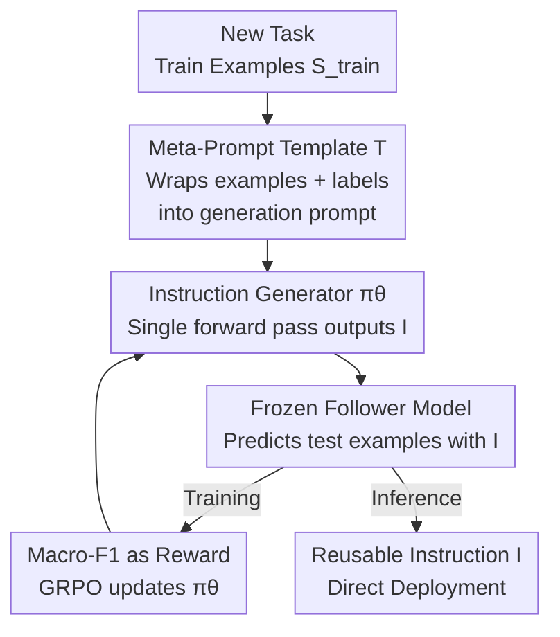

# Prompt-MII: Meta-Learning Instruction Induction for LLMs

**Conference**: ICLR 2026  
**OpenReview**: [https://openreview.net/forum?id=zD9fjEj4Oz](https://openreview.net/forum?id=zD9fjEj4Oz)  
**Code**: https://github.com/millix19/promptmii  
**Area**: NLP Understanding / Prompt Optimization / Meta-Learning  
**Keywords**: Instruction Induction, Prompt Optimization, Meta-Learning, Reinforcement Learning, In-Context Learning

## TL;DR
This paper transforms the task of "writing a high-quality task instruction from a set of examples" into a learnable policy. By meta-training an instruction generator on 3,000+ classification datasets using reinforcement learning, the generator can output a refined instruction for any new task in a single forward pass. The performance matches 100-shot In-Context Learning (ICL) while utilizing 3-13x fewer tokens.

## Background & Motivation
**Background**: Adapting Large Language Models (LLMs) to new tasks typically follows three paths: prompting, In-Context Learning (ICL, where training examples are placed directly in the context), and Supervised Fine-Tuning (SFT). Each has trade-offs: prompting is token-efficient and fast but requires manual iteration; ICL is powerful but suffers from high latency and cost as context size grows; SFT is efficient during inference but expensive to train and store, and often fails to outperform ICL on many tasks.

**Limitations of Prior Work**: Between ICL and prompting lies "instruction induction": taking training examples $S_{train}$ and automatically producing an instruction $I$. However, representative methods like APE and GEPA rely on expensive evolution or search algorithms at **test-time**. APE requires 2,000 LLM calls and GEPA requires 150 calls to search for each new task from scratch, making them slow and costly.

**Key Challenge**: The "effectiveness" and "efficiency" of instruction induction are coupled—high effectiveness requires on-site searching for every task, while high efficiency often necessitates crude one-shot generation. The root cause is that these methods treat each task as an isolated optimization problem, re-discovering "how to write a good instruction" for every new dataset without reusing cross-task knowledge.

**Goal**: To train a **universal** instruction induction capability that can generate an accurate and concise instruction for any new classification task in a single forward pass, eliminating per-task search at test-time.

**Key Insight**: The authors reformulate instruction induction as a **meta-learning** problem. Instead of optimizing $I$ for each task individually, they train an instruction induction policy $\pi_\theta$ to learn the meta-skill of "how to construct good instructions" across a diverse distribution of tasks.

**Core Idea**: $I = \pi_\theta(S_{train})$—replacing per-task search with a meta-learned policy, compressing "instruction writing" into a single forward pass and sharing instruction-writing knowledge across datasets.

## Method

### Overall Architecture
Prompt-MII trains an **instruction generator** $\pi_\theta$ with universal instruction induction capabilities. The process involves: taking a classification dataset, sampling a batch of training examples $S^{(i)}_{train}$, and wrapping them in a **meta-prompt template** $T$. After reading this meta-prompt, $\pi_\theta$ generates a task instruction $I$ in one forward pass. This instruction is then given to a **frozen instruction-following model** $LM_{eval}$ to make predictions on test examples $S_{test}$. The macro-F1 score of these predictions serves as the reward signal to update $\pi_\theta$ via reinforcement learning. Since public datasets generally lack "ground truth instructions" for supervised learning, using **downstream task performance** as a computable reward makes RL a natural choice. Training is conducted across 3,000+ datasets to ensure diversity; at inference, the process simply involves "feeding examples → outputting instruction" without any search.

### Key Designs

**1. Transforming Instruction Induction into a Meta-Learnable Policy: Single Forward Pass vs. Per-Task Search**

The design addresses the inefficiency of APE/GEPA's "search hundreds of times per task" approach. Instead of individual optimization, a policy $\pi_\theta$ is trained to perform a single forward pass for any new dataset: $I = \pi_\theta(T(S^{(i)}_{train}))$. This offers two benefits: first, it **shares** knowledge of instruction writing across datasets; second, it compresses expensive optimization into one inference step (Prompt-MII requires 1 LLM call at test-time compared to GEPA's 150 or APE's 2,000). This is the core paradigm shift: instruction induction changes from "test-time optimization" to "learning an instruction-writing model during training."

**2. RL Training with Downstream Performance as Reward: Optimizing Quality via GRPO**

Given the lack of "standard instructions" for supervision, RL is used to train $\pi_\theta$. The reward is directly derived from the downstream performance of the generated instruction on the test set:

$$R(I, S_{test}) = \mathbb{E}_{\{\hat{y}_j\},\{y_j\}}\big[\text{metric}(\{\hat{y}_j\}, \{y_j\})\big]$$

where $\hat{y}_j = LM_{eval}(I + \text{"Input: "} + x_j + \text{"Label:"})$. The following model $LM_{eval}$ remains frozen. The authors use macro-F1 (for label imbalance robustness) and sample $m=20$ test cases to balance stability and efficiency. The GRPO algorithm is used with enhancements like **asymmetric clipping** and **removing the KL loss** to encourage exploration. To prevent the model from wasting capacity on formatting, a fixed format constraint is appended to the generated instruction before calculating the reward, ensuring fair comparison across all baselines.

**3. Meta-Prompt Template: Guiding Generalizable Decision Rules over Example Memorization**

The meta-prompt template $T$ is critical. Simple summarization often leads models to copy specific examples or list label names. The structured template explicitly requires instructions to: define the task and label meanings, provide **general decision rules** for unseen inputs, and highlight common pitfalls while remaining concise. This injects a prior of "what a good instruction looks like." Ablations show that the optimal template is **model-dependent** (Llama prefers meta1, Qwen prefers meta2), so the best template for each model is used for both training and evaluation.

**4. Large-Scale Diverse Classification Training: Ensuring Generalization**

The success of meta-learning depends on the breadth of the training distribution. The authors collected 3,811 public text classification datasets from HuggingFace, splitting them into 3,430 for training and 381 for validation. Evaluation is conducted on 90 **unseen tasks** from the validation set. By observing such a wide variety of tasks, the policy learns the meta-skill of instruction induction rather than memorization. Contamination checks (MD5 hashing showed 0.35% leakage) and similarity binning analysis based on MPNet embeddings confirmed that Prompt-MII consistently outperforms zero-shot versions and matches 100-shot ICL even on datasets **least similar** to the training set.

### An Example: From Blurry Cues to Executable Rules
Consider a 4-class text classification task (n=10 examples, Llama-3.1-8B): An untrained Prompt-MII-Zero generates vague instructions like "tone and wording serve as cues," resulting in an F1 of 0.241. In contrast, the RL-trained Prompt-MII concretizes the decision boundaries for each label ("Label 0 concerns help with hardware... Label 3 is unrelated to computers, involving business/crypto..."), providing executable rules that boost F1 to 0.829. For the same batch of examples, pure ICL achieves an F1 of only 0.026. This illustrates that RL training enables the model to **distill generalizable decision standards** rather than relying on vague phrasing.

## Key Experimental Results

### Main Results
Evaluated on 90 unseen tasks using Llama-3.1-8B and Qwen-2.5-7B (Metric: macro-F1; instruction token counts in parentheses):

| Method | Llama n=20 | Llama n=100 | Qwen n=20 | Qwen n=100 |
|------|-----------|-------------|-----------|-----------|
| Naive | 0.253 | 0.253 | 0.303 | 0.303 |
| ICL | 0.406 (5177 tok) | 0.430 (11531 tok) | 0.431 | 0.482 (12027 tok) |
| Prompt-MII-Zero | 0.343 | 0.336 | 0.383 | 0.371 |
| **Prompt-MII** | **0.433 (901 tok)** | 0.405 | **0.441** | 0.424 |

Key comparison: Llama Prompt-MII with n=20 examples (0.433 F1, 901 tokens) matches ICL with n=100 examples (0.430 F1, 11531 tokens)—achieving **12.8× token compression with no statistical difference in performance**. Overall, Prompt-MII improves F1 by 4-9 points over ICL while using 3-13x fewer tokens.

Comparison with test-time search methods (macro-F1):

| Method | Test-time LLM Calls | Llama n=100 | Qwen n=100 |
|------|--------------------|-------------|-----------|
| APE | 2000 | 0.288 | 0.356 |
| GEPA | 150 | 0.299 | 0.347 |
| **Prompt-MII** | **1** | **0.405** | **0.424** |

Prompt-MII significantly outperforms expensive iterative search methods in a single forward pass.

### Ablation Study

| Configuration | Key Finding | Description |
|------|---------|------|
| Prompt-MII vs Zero | +9% absolute F1 for Llama n=20 | Core gain from RL training |
| Meta-prompt meta1 vs meta2 | Llama favors meta1 (+0.053), Qwen favors meta2 (+0.031) | Optimal template is model-dependent |
| Cross-model Transfer (Llama→Qwen) | 0.391-0.415, better than Zero but weaker than Qwen→Qwen | Training gains are partially transferable |
| Similarity Binning (>0.85 / 0.5-0.85 / <0.5) | Prompt-MII consistently beats Zero across all bins | Generalization is not due to data leakage |

### Key Findings
- **RL training is the primary source of gain**: Removing training (Zero) results in a 9-point absolute F1 drop for Llama n=20, proving that "one-pass instruction induction" is a learnable skill.
- **Benefits for both short and long examples**: While both benefit, long-example datasets offer higher compression rates as ICL is more likely to hit context limits.
- **Small model self-training outperforms large model zero-shot**: Prompt-MII Llama-3.1-8B outperforms the much larger Llama-3.1-405B Prompt-MII-Zero, demonstrating that targeted RL is more effective than scale alone.
- **Cross-model transfer is viable but suboptimal**: RL optimizes instructions for the specific follower model's preferences; changing models causes a performance dip, though it remains superior to untrained baselines.

## Highlights & Insights
- **Perspective Shift**: Reconstructing "per-task search" as "meta-learning a policy" moves optimization costs from inference to training. This is a classic approach applied systematically to instruction induction for the first time.
- **Clean Reward Design**: Using macro-F1 as a reward with a frozen evaluator bypasses the lack of ground truth instructions. Incorporating format constraints before reward calculation is a practical trick to focus model capacity.
- **Strong Transferability**: Natural language instructions are inherently transferable across black-box models, providing a fundamental advantage over soft prompts or fine-tuning.
- **Rules vs. Examples**: Case studies demonstrate that RL pushes the model to write **executable decision rules** rather than just copying examples, providing insights into the essence of prompt quality.

## Limitations & Future Work
- **Restricted to Classification**: The reliance on macro-F1 limits the method to classification tasks. Generative tasks (QA, summarization) would require different rewards like LLM-as-judge.
- **Fixed Small Evaluator**: $LM_{eval}$ was fixed as a small model for practicality; the impact of larger evaluators was not explored.
- **Manual Template Selection**: Optimal meta-templates are model-dependent and currently selected manually; future work could explore automatic template selection.
- **Generalization Scope**: While the dataset is large, all training data comes from HuggingFace classification tasks. Generalization to specialized domains (Law, Medicine) has not been independently verified.

## Related Work & Insights
- **vs. APE / GEPA**: These treat induction as a test-time evolution/search problem. Prompt-MII compresses knowledge into a policy, achieving better results at a fraction of the cost.
- **vs. RLPrompt / PRewrite / PRL**: These use RL but train a new policy **per task**. Prompt-MII learns a cross-task universal skill.
- **vs. Honovich et al. (2022)**: The earliest induction work focused on simple tasks with nearly perfect answers; this work expands to arbitrary classification with fuzzy boundaries.
- **vs. Ha et al. (2023)**: Uses SFT for meta-learning, which requires large-scale ground truth instructions. Prompt-MII's use of RL avoids this dependency.

## Rating
- **Novelty**: ⭐⭐⭐⭐ Reframing induction as meta-learning + RL is a clean and effective perspective shift. "Cross-task universal, single forward pass" is a substantial contribution.
- **Experimental Thoroughness**: ⭐⭐⭐⭐ Covers 90 unseen tasks, dual models, comparisons with search methods, and contamination analysis. Limited only by task type (classification) and evaluator scale.
- **Writing Quality**: ⭐⭐⭐⭐ Logical motivation and clear case studies. Tables and statistical significance are well-documented.
- **Value**: ⭐⭐⭐⭐ 3-13x token compression while matching ICL is highly attractive for cost-sensitive deployment. Open-sourcing code, models, and data adds significant value.

<!-- RELATED:START -->

## Related Papers

- [\[NeurIPS 2025\] System Prompt Optimization with Meta-Learning](../../NeurIPS2025/llm_nlp/system_prompt_optimization_with_meta-learning.md)
- [\[ACL 2025\] Self-Instructed Derived Prompt Generation Meets In-Context Learning: Unlocking New Potential of Black-Box LLMs](../../ACL2025/llm_nlp/self-instructed_derived_prompt_generation_meets_in-context_learning_unlocking_ne.md)
- [\[ACL 2026\] Model-Agnostic Meta Learning for Class Imbalance Adaptation](../../ACL2026/llm_nlp/model-agnostic_meta_learning_for_class_imbalance_adaptation.md)
- [\[ICLR 2026\] SIPDO: Closed-Loop Prompt Optimization via Synthetic Data Feedback](sipdo_closed-loop_prompt_optimization_via_synthetic_data_feedback.md)
- [\[ICML 2025\] Beyond Induction Heads: In-Context Meta Learning Induces Multi-Phase Circuit Emergence](../../ICML2025/llm_nlp/beyond_induction_heads_in-context_meta_learning_induces_multi-phase_circuit_emer.md)

<!-- RELATED:END -->
