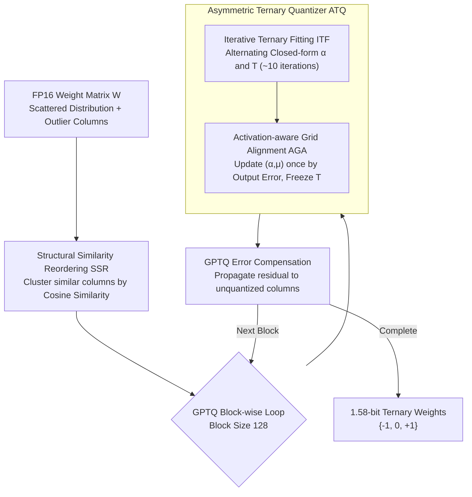

# PT2-LLM: Post-Training Ternarization for Large Language Models

**Conference**: ICLR 2026  
**arXiv**: [2510.03267](https://arxiv.org/abs/2510.03267)  
**Code**: [GitHub](https://github.com/XIANGLONGYAN/PT2-LLM)  
**Area**: LLM/NLP  
**Keywords**: Ternarization, Post-Training Quantization, Extreme Low-bit, LLM Compression, Column Reordering

## TL;DR

Ours proposes PT2-LLM, the first Post-Training Ternarization framework for LLMs. By employing an asymmetric ternary quantizer (comprising Iterative Ternary Fitting and Activation-aware Grid Alignment) alongside a Structural Similarity Reordering strategy, it achieves superior performance at 1.58-bit compared to 2-bit PTQ methods.

## Background & Motivation

Ternarization (constraining weights to $\{-1, 0, +1\}$) represents an extreme compression scheme:
- Compared to low-bit quantization (2-4 bit), ternarization eliminates most floating-point multiplications, requiring only additions.
- Compared to binarization, ternarization better matches the unimodal distribution of LLM weights, offering stronger expressive power.

Existing ternarization methods (BitNet b1.58, TernaryLLM) rely on QAT, which is impractical for large models. PTQ-based ternarization faces two major challenges:
1. Inability to optimize ternary parameters via gradients — requiring a training-free parameter optimization scheme.
2. Scattered weight distributions and outliers — extreme low-bit quantization leads to significantly larger errors.

## Method

### Overall Architecture

PT2-LLM aims to solve a critical problem: compressing LLM weights to 1.58-bit (ternary $\{-1, 0, +1\}$) while preserving accuracy **without gradient training** — it must be completed in a pure Post-Training Quantization (PTQ) setting. The framework integrates ternarization into the GPTQ block-wise error compensation pipeline: the original FP16 weight matrix is first rearranged via **Structural Similarity Reordering (SSR)** to ensure that columns within the same block are as compact as possible. Subsequently, GPTQ processes columns in blocks of 128, where each block is passed to an **Asymmetric Ternary Quantizer (ATQ)** to fit the optimal ternary representation. After quantizing a block, the residual is propagated to unquantized columns using GPTQ's error compensation, repeating until the entire matrix is ternarized. Inside ATQ, two training-free sub-stages are employed: Iterative Ternary Fitting (ITF) minimizes weight quantization error, followed by Activation-aware Grid Alignment (AGA), which aligns the optimization objective to output error using calibration data. The entire process uses closed-form solutions and minimal calibration data without any backpropagation.

### Key Designs

**1. Structural Similarity Reordering (SSR): Clustering similar columns to tame outliers**

Block-wise ternarization in the style of GPTQ slices blocks by original column order. Mixed columns with vast variance and isolated outliers often inhabit the same block — high intra-block variance coarsens the ternary grid and increases quantization error, while outliers skew the quantization range. Since a single block shares only one pair of $(\alpha, \mu)$, it is difficult to accommodate both types. Before slicing, SSR measures structural proximity via cosine similarity between columns:

$$S_{ij}=\frac{\mathbf{W}_{:,i}^\top\mathbf{W}_{:,j}}{\|\mathbf{W}_{:,i}\|_2\|\mathbf{W}_{:,j}\|_2}$$

By clustering aligned and numerically close columns into the same block, the intra-block distribution becomes more compact and the shared grid fits better. Once outliers are clustered together, they are no longer outliers relative to their intra-block reference. As the paper notes, "outliers are no longer outliers among themselves." Since reordering is a column permutation $\mathbf{W}'=\mathbf{W}\mathbf{P},\ \mathbf{X}'=\mathbf{X}\mathbf{P}$ satisfying $\mathbf{X}'\mathbf{W}'^\top=\mathbf{X}\mathbf{W}^\top$, it does not change the result of matrix multiplication and incurs nearly zero inference overhead. However, because GPTQ has inter-block dependencies, SSR uses a lightweight greedy approach: at each step, a mean reference $\bar{\mathbf{w}}$ is calculated from the residual sub-matrix, and the top-$k$ columns most similar to it are selected for the next block.

**2. Asymmetric Ternary Quantizer (ATQ): Fitting optimal ternary representations via row offsets and closed-form iterations**

LLM weights do not follow a zero-mean symmetric distribution. If a symmetric ternary grid $\hat{\mathbf{W}}=\alpha\mathbf{T}$ is applied, it systematically shifts entire rows. While QAT can reshape distributions via backpropagation, PTQ freezes weights. ATQ introduces a row-wise offset $\mu$ (initialized as the row mean), modifying the quantization form to $\hat{\mathbf{W}}=\alpha\mathbf{T}+\mu$, aligning the grid center with the actual mean. The difficulty lies in determining the scale $\alpha$ and ternary matrix $\mathbf{T}$ without gradients. **ITF** uses an alternating closed-form solution: given $\mathbf{T}$, the optimal scale is:

$$\alpha^* = \frac{m\cdot(\mathbf{W}\circ\mathbf{T})\mathbf{1} - (\mathbf{T}\mathbf{1})\circ(\mathbf{W}\mathbf{1})}{m\cdot(\mathbf{T}\circ\mathbf{T})\mathbf{1} - (\mathbf{T}\mathbf{1})^2}$$

Given the grid, the ternary matrix is determined by $\mathbf{T}_{ij}^*=\arg\min_{t\in\{-1,0,1\}}|Z_{ij}-t|$, where the normalized coordinate $Z_{ij}=(W_{ij}-\mu_i^*)/\alpha_i^*$. Every step has an analytical optimum, converging in about 10 iterations. While ITF focuses on weight quantization error $\mathcal{E}_w=\|\mathbf{W}-\hat{\mathbf{W}}\|_F^2$, the final performance depends on output error. Thus, **AGA** switches the objective to activation-aware output error $\mathcal{E}_x=\|\mathbf{WX}-\hat{\mathbf{W}}\mathbf{X}\|_F^2$. Solving for the derivatives of $(\alpha, \mu)$ also yields closed-form solutions. AGA freezes $\mathbf{T}$ and updates $(\alpha, \mu)$ once to align the grid with activation-sensitive directions while avoiding overfitting on the small calibration set.

### Loss & Training

The two stages have different optimization objectives: ITF minimizes weight quantization error $\mathcal{E}_w=\|\mathbf{W}-\hat{\mathbf{W}}\|_F^2$, while AGA switches to output error $\mathcal{E}_x=\|\mathbf{WX}-\hat{\mathbf{W}}\mathbf{X}\|_F^2$ and only updates $(\alpha, \mu)$ once (freezing $\mathbf{T}$). The block size is set to 128, and the framework is integrated into the GPTQ pipeline, utilizing Hessian-guided error compensation.

## Key Experimental Results

### Main Results (LLaMA-7B Zero-shot QA)

| Method | #W (bit) | Wiki2 PPL ↓ | C4 PPL ↓ | 7-Task Avg Acc ↑ |
|------|---------|------------|---------|--------------|
| FP16 | 16 | 5.68 | 7.34 | 61.73% |
| AWQ 2-bit | 2 | 2.60e5 | 2.86e5 | 32.50% |
| GPTQ 2-bit | 2 | 129.19 | 79.06 | 34.35% |
| Slim-LLM 2-bit | 2 | 14.58 | 30.71 | 39.74% |
| PB-LLM 1.7-bit | 1.7 | 82.76 | 76.63 | 33.44% |
| **PT2-LLM 1.58-bit** | 1.58 | **11.39** | **24.55** | **45.07%** |

### LLaMA-13B Results

| Method | #W (bit) | Wiki2 PPL ↓ | 7-Task Avg Acc ↑ |
|------|---------|------------|--------------|
| FP16 | 16 | 5.09 | 63.81% |
| GPTQ 2-bit | 2 | 20.46 | 41.00% |
| **PT2-LLM 1.58-bit** | 1.58 | **8.93** | **49.14%** |

### Key Findings

- PT2-LLM at 1.58-bit outperforms all 2-bit PTQ methods with lower memory footprint.
- The two-stage optimization of ITF and AGA effectively reduces weight error and output error, respectively.
- SSR successfully reduces intra-block variance; clustering outliers prevents them from being "outliers" relative to the block.
- Inference Speedup: End-to-end acceleration is achieved in both prefill and decode stages.

## Highlights & Insights

- First to achieve LLM ternarization in a PTQ setting, filling a major gap in the field.
- The alternating optimization strategy of ITF is elegant — every step has a closed-form optimal solution, removing the need for gradient optimization.
- Critical design decision in AGA: freezing $\mathbf{T}$ while updating grid parameters effectively prevents overfitting.
- Sharp intuition in SSR: "Outliers are no longer outliers among themselves."

## Limitations & Future Work

- 1.58-bit accuracy still shows a significant gap compared to FP16 (e.g., LLaMA-7B avg accuracy 45% vs 62%).
- Recalculating similarities in each SSR step incurs certain overhead.
- Lacks direct comparison with QAT-based ternarization methods like BitNet b1.58.
- Validated primarily on the LLaMA series; coverage for Qwen, Mistral, etc., is missing.

## Related Work & Insights

- Relation to GPTQ: PT2-LLM performs ternarization within the GPTQ framework, inheriting its block-wise error compensation.
- Difference from BitNet b1.58: PT2-LLM is a PTQ solution and does not require training from scratch.
- Insight: There is still significant potential in extreme low-bit PTQ; asymmetric quantization and structure-aware reordering are effective directions.

## Rating

- Novelty: ⭐⭐⭐⭐ PTQ ternarization is an unexplored setting.
- Experimental Thoroughness: ⭐⭐⭐⭐ Validated across multiple models and tasks with comprehensive ablations.
- Writing Quality: ⭐⭐⭐⭐ Clear mathematical derivations and intuitive visualizations.
- Value: ⭐⭐⭐⭐ Provides a new option for extreme low-bit LLM deployment.

<!-- RELATED:START -->

## Related Papers

- [\[NeurIPS 2025\] Q♯: Provably Optimal Distributional RL for LLM Post-Training](../../NeurIPS2025/llm_nlp/qsharp_provably_optimal_distributional_rl_for_llm_post-training.md)
- [\[ICLR 2026\] COSMOS: A Hybrid Adaptive Optimizer for Efficient Training of Large Language Models](cosmos_a_hybrid_adaptive_optimizer_for_efficient_training_of_large_language_mode.md)
- [\[ICLR 2026\] Massive Editing for Large Language Models Based on Dynamic Weight Generation](massive_editing_for_large_language_models_based_on_dynamic_weight_generation.md)
- [\[ICLR 2026\] Cite Pretrain: Retrieval-Free Knowledge Attribution for Large Language Models](cite_pretrain_retrieval-free_knowledge_attribution_for_large_language_models.md)
- [\[ICLR 2026\] Beyond Magic Words: Sharpness-Aware Prompt Evolving for Robust Large Language Models with TARE](beyond_magic_words_sharpness-aware_prompt_evolving_for_robust_large_language_mod.md)

<!-- RELATED:END -->
