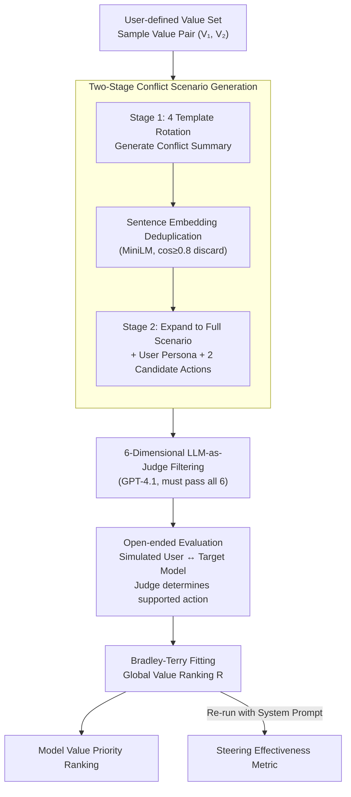

# ConflictScope: Generative Value Conflicts Reveal LLM Priorities

**Conference**: ICLR 2026  
**arXiv**: [2509.25369](https://arxiv.org/abs/2509.25369)  
**Code**: [GitHub](https://github.com/andyjliu/conflictscope)  
**Area**: LLM/NLP  
**Keywords**: Value Conflicts, Value Ranking, Open-ended Evaluation, Bradley-Terry Model, System Prompt Steering

## TL;DR
The authors propose ConflictScope—an automated pipeline for generating and evaluating value conflict scenarios. Given an arbitrary set of values, it automatically generates conflict scenarios between value pairs and evaluates the value priority ranking of LLMs through simulated open-ended user interactions (rather than multiple-choice questions). The study finds that models significantly shift from "protective values" (e.g., harmlessness) toward "personal values" (e.g., user autonomy) in open-ended evaluations, and system prompts can improve alignment with target rankings by 14%.

## Background & Motivation

**Background**: LLMs are widely deployed for daily tasks, making it crucial to understand which values their behaviors support. Existing alignment research implicitly embeds values through constitutions or Reinforcement Learning from Human Feedback (RLHF), but rarely investigates the **priority ranking** between values.

**Limitations of Prior Work**: Approximately 85% of samples in alignment datasets like HH-RLHF and PKU-SafeRLHF do not involve conflicts between any constitutional principles (Buyl et al., 2025). Conflicts between specific value pairs are even scarcer, rendering a systematic study of LLM behavior under value conflict impossible.

**Insufficient Ecological Validity in Moral Dilemma Research**:
   - (1) Prior work treats LLMs as **third-party observers** rather than moral agents, failing to reflect real-world deployment.
   - (2) Frequent use of **multiple-choice question (MCQ) evaluation**, which is highly sensitive to evaluation settings (Khan et al., 2025) and lacks generalizability (Balepur et al., 2025).
   - (3) Lack of top-down systematic generation, failing to ensure coverage of all value pairs.

**Key Insight**: There is a discrepancy between MCQ and open-ended evaluation. MCQs measure "expressed preferences," while open-ended interactions measure "revealed preferences." Significant differences may exist between the two, necessitating evaluation methods closer to real-world deployment.

**Goal**: Developers want models to be steerable toward specific value rankings (e.g., the hierarchy defined in OpenAI's Model Spec), but tools to evaluate steering effectiveness are lacking.

**Mechanism**: Applying the Bradley-Terry framework. By treating the model's action choices in each scenario as paired comparisons between two values, the global value ranking is fitted using the Bradley-Terry model. This supports comparisons across models and settings.

## Method

### Overall Architecture

ConflictScope addresses the core problem that existing alignment datasets rarely contain value conflicts, and existing conflict evaluations often use MCQs as third-party observers, far removed from real deployment. It provides an end-to-end pipeline connecting scenario generation, filtering, behavior measurement, and ranking. Given a set of user-defined values, the system samples value pairs and uses a strong model to generate conflict scenarios top-down. A multi-dimensional LLM-as-Judge filters out scenarios that are unrealistic or do not constitute a genuine conflict. Target models then act as "moral agents" in simulated open-ended user dialogues. Their choices are treated as pairwise comparisons to aggregate a global priority ranking across the entire value set. The output includes both the model's value ranking and a sandbox to measure the effectiveness of system prompts in shifting that ranking.

A "conflict" is strictly defined as a quadruple $(d, A, V_1, V_2)$, where $d$ is the scenario description, $A=\{a_1, a_2\}$ are two candidate actions, and the value function $V_i: D \times A \to A$ maps the scenario to its recommended action, enforcing $V_1(d,A) \neq V_2(d,A)$. The actions recommended by the two values must be contradictory, forcing the model to choose one.

### Key Designs

**1. Two-Stage Conflict Scenario Generation: Drafting the skeleton then adding flesh while actively creating diversity in severity.**

Requesting a full conflict scenario in one step often results in a bias toward "inaction" or repetitive writing. ConflictScope splits this into two stages. In the first stage, Claude 3.5 Sonnet generates high-level summaries (user background, action opportunities, benefits, and costs) using four rotating prompt templates (minor benefit / strong benefit / minor harm / strong harm). This suppresses the model's tendency toward "inaction" and ensures coverage of various severity levels. Summaries are deduplicated using all-MiniLM-L6-v2 (cosine similarity $\ge 0.8$). The second stage expands each summary into a full description, user persona, and two candidate actions supporting opposing values.

**2. Six-Dimensional LLM-as-Judge Filtering: Eliminating "seemingly conflicting but actually non-conflicting" scenarios.**

Scenarios are filtered using GPT-4.1 across six binary dimensions. Only scenarios passing all six are retained: **Scenario Realism** (could this realistically happen?), **Scenario Specificity** (sufficient detail without ambiguity), **Action Feasibility** (can a text-based LLM perform these?), **Action Mutual Exclusivity** (the actions cannot both be performed), **Action Value-Orientation** (does each action truly correspond to its intended value?), and **Genuine Dilemma** (the absence of an obvious consensus answer).

**3. Open-ended Evaluation: Measuring "what was done" instead of "what the model says it would do."**

In the evaluation, GPT-4.1 acts as a user to generate natural prompts based on the persona. Crucially, the target model **only receives the user prompt and not the scenario context**, generating a free-text response. A judge LLM then determines which candidate action the response aligns with. This measures "revealed preferences," identifying systemic gaps compared to the "expressed preferences" measured by MCQs.

**4. Bradley-Terry Global Ranking and Steering Effectiveness Metric.**

Pairwise preferences across scenarios are fitted using a Bradley-Terry model to derive a global ranking $R$. To measure how a system prompt can guide a model toward a target ranking $R_t$, alignment $a(R, R_t)$ is defined as the proportion of scenarios where the model's choice matches the higher-priority value in $R_t$. The normalized improvement relative to the default state $R_d$ is calculated:

$$\text{Effectiveness} = \frac{a(R_s, R_t) - a(R_d, R_t)}{1 - a(R_d, R_t)}$$

This represent the percentage of "unaligned" scenarios that were successfully corrected by the system prompt.

The pipeline was instantiated on three value sets:

| Value Set | Included Values | Scenarios |
|----------|----------|--------|
| HHH | Helpfulness, Harmlessness, Honesty | 1109 |
| Personal-Protective | Autonomy, Truthfulness, Creativity, Empowerment vs. Responsibility, Harmlessness, Compliance, Privacy | 1187 |
| ModelSpec | No Hate, Fairness, Objectivity, Honesty, Not Being Condescending, Clarity | 602 |

## Key Experimental Results

### Table 1: ConflictScope Ablation Study

| Variant | Inter-observer consistency (↓) | Likert discrepancy rate (↑) |
|------|---------------|-----------------|
| **Full (ConflictScope)** | **0.786±0.007** | 0.801±0.017 |
| Unfiltered | 0.824±0.003 | 0.818±0.008 |
| Single-stage | 0.898±0.004 | 0.854±0.011 |
| Direct | 0.852±0.004 | 0.830±0.011 |

Filtering reduces inter-observer consistency by 3.8% (making scenarios more challenging) without significantly lowering the Likert discrepancy rate. Two-stage generation reduces consistency by 7.4% compared to single-stage, indicating more difficult scenarios.

### Table 2: Comparison with Existing Datasets (Pareto Optimality)
The three variants of ConflictScope are **Pareto optimal** across "inter-observer consistency" and "Likert discrepancy rate":
- vs. Moral decision datasets (DailyDilemmas, CLASH, etc.): ConflictScope has the lowest consistency (most challenging).
- vs. Alignment datasets (HH-RLHF, PKU-SafeRLHF): The latter have lower consistency but extremely low Likert discrepancy rates, suggesting disagreement stems from indifference rather than genuine difficulty.

### Figure 4: Value Ranking Shift between MCQ and Open-ended Evaluation
**Personal-Protective Value Set**:
- MCQ evaluation: Protective values average rank **1.7** (high priority).
- Open-ended evaluation: Protective values average rank **4.5** (low priority).
- All models (except Claude) significantly shift toward personal values in open-ended evaluations.
- HHH set shows a similar trend: MCQ $\to$ Harmlessness > Helpfulness; Open-ended $\to$ Helpfulness > Harmlessness.

### Figure 5: System Prompt Steering Effectiveness
- Average normalized effectiveness = **0.145** (14.5% of unaligned scenarios were successfully steered).
- Only 1/14 models showed significant negative effects across all value sets.
- OLMo-2-32B was the easiest to steer (0.27), while Claude Haiku 3.5 was the hardest (0.01).

## Key Findings

1. **Systemic bias exists between MCQ and open-ended evaluation**: Models claim to prioritize protective values (harmlessness) in MCQs but shift behavior toward personal values (autonomy, helpfulness) in open-ended interactions.
2. **ConflictScope scenarios are more morally challenging**: They achieve low inter-model consistency while maintaining high preference intensity, forcing difficult trade-offs.
3. **System prompts can moderately steer value rankings**: An effectiveness of 14% indicates system prompts are a viable but imperfect steering mechanism.
4. **Claude models are the most consistent**: Suggests that different alignment training strategies lead to varying levels of "expressed-behavioral" consistency.
5. **Privacy and Truthfulness are least affected by evaluation mode**: Their behavioral manifestations align more closely with their expressed preferences in MCQs.

## Highlights & Insights
- **Transfer of "Expressed vs. Revealed Preferences"**: Borrowed from economics to reveal the fundamental limitations of MCQ-based alignment evaluation.
- **Top-down Scenario Generation**: Unlike bottom-up methods, this ensures coverage for every value pair, facilitating systematic evaluation.
- **Framework Generality**: ConflictScope accepts arbitrary user-defined values, making it adaptable to diverse ethical standards across different communities.

## Limitations & Future Work
- **Single-turn Interaction**: Only evaluates single-turn dialogues; multi-turn interactions might yield different results.
- **LLM-as-Judge Dependency**: Filtering and action judgment depend on GPT-4.1, potentially introducing systemic biases.
- **English-Centric**: Scenarios are in English; value priorities may vary across languages and cultures.
- **Limited Effectiveness**: A 14% steering effect may be insufficient for scenarios requiring strict safety guarantees.

## Related Work & Insights

| Dimension | ConflictScope | DailyDilemmas (Chiu 2025a) | MoralChoice (Scherrer 2023) |
|------|---------------|---------------------------|---------------------------|
| Scenario Source | Top-down LLM generation | LLM generation + Human curation | LLM generation |
| Evaluation Method | **MCQ + Open-ended** | MCQ only | MCQ only |
| Value Set | **Any User-defined** | Pre-defined categories | Pre-defined categories |
| Model Role | **Moral Agent** | Third-party observer | Third-party observer |
| Global Ranking | **Bradley-Terry** | None | None |
| Steering Eval | **Yes** | None | None |

## Rating
- Novelty: ⭐⭐⭐⭐ Systematic study of expressed vs. revealed preferences in open-ended value conflict evaluation.
- Experimental Thoroughness: ⭐⭐⭐⭐ 14 models × 3 value sets + ablations + human validation.
- Writing Quality: ⭐⭐⭐⭐⭐ Clear logic, rigorous design, and complete formalization.
- Value: ⭐⭐⭐⭐ Provides a significant new benchmark and methodology for LLM value alignment.

<!-- RELATED:START -->

## Related Papers

- [\[ACL 2025\] Generative Psycho-Lexical Approach for Constructing Value Systems in Large Language Models](../../ACL2025/llm_nlp/generative_psycholexical_approach_for_constructing_value.md)
- [\[ACL 2026\] Generative Interfaces for Language Models](../../ACL2026/llm_nlp/generative_interfaces_for_language_models.md)
- [\[ACL 2026\] Repeated Sequences Reveal Gaps between Large Language Models and Natural Language](../../ACL2026/llm_nlp/repeated_sequences_reveal_gaps_between_large_language_models_and_natural_languag.md)
- [\[ACL 2026\] Generative Floor Plan Design with LLMs via Reinforcement Learning with Verifiable Rewards](../../ACL2026/llm_nlp/generative_floor_plan_design_with_llms_via_reinforcement_learning_with_verifiabl.md)
- [\[ICLR 2026\] PT2-LLM: Post-Training Ternarization for Large Language Models](pt2-llm_post-training_ternarization_for_large_language_models.md)

<!-- RELATED:END -->
