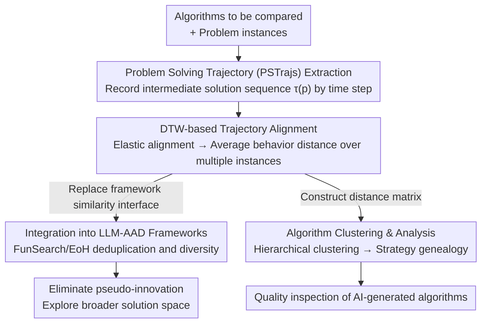

# Rethinking Code Similarity for Automated Algorithm Design with LLMs

**Conference**: ICLR 2026  
**arXiv**: [2603.02787](https://arxiv.org/abs/2603.02787) ⚠️ arXiv ID and code link are pending verification; refer to the original text.  
**Code**: [https://github.com/RayZhhh/behavesim](https://github.com/RayZhhh/behavesim)  
**Area**: LLM / Automated Algorithm Design / Code Similarity  
**Keywords**: LLM-AAD, Code Similarity, Behavioral Similarity, Dynamic Time Warping, FunSearch, EoH, Algorithmic Diversity

## TL;DR
This paper proposes BehaveSim, an algorithmic similarity metric based on "Problem Solving Trajectories" (PSTrajs) and Dynamic Time Warping (DTW). It measures algorithmic differences at the execution behavior level rather than the syntax or output level. Integrating BehaveSim into LLM-AAD frameworks like FunSearch/EoH significantly enhances performance.

## Background & Motivation
**Background**: LLM-driven Automated Algorithm Design (LLM-AAD) has emerged as a new paradigm for algorithm development. Frameworks like FunSearch and EoH can autonomously generate expert-level code implementations for algorithms, achieving remarkable results in classic problems such as Online Bin Packing, Cap Set, and TSP.

**Limitations of Prior Work**: In LLM-AAD, the core design principles of an algorithm are implicit within the generated code rather than expressed through explicit mathematical formulas or pseudocode. Existing code similarity metrics (e.g., AST edit distance, BLEU, Code Embedding cosine similarity) only capture superficial syntactic differences and fail to determine whether two code snippets implement fundamentally different algorithmic logic.

**Key Challenge**: Two code segments with completely different syntax may implement the same algorithmic concept (differing only in variable names or loop structures), while syntactically similar code may embody entirely different solving strategies. Existing metrics cannot distinguish between "genuine algorithmic innovation" and "superficial code variations."

**Key Gap**: LLM-AAD frameworks require similarity metrics for deduplication or selection during population maintenance and diversity management. Inaccurate similarity metrics cause frameworks to retain redundant "pseudo-innovative" algorithms, displacing truly valuable diversity and leading to reduced search efficiency.

**Limitations of Output Equivalence**: Another category of methods compares the final output of algorithms (e.g., objective function values). However, different algorithms may coincidentally produce the same output for a given input while performing drastically differently on others. Output equivalence fails to reveal differences in the solving process.

**Core Idea**: By recording the sequence of intermediate solutions generated by an algorithm during execution (Problem Solving Trajectories), DTW is used to align these trajectories to measure behavioral similarity between algorithms—focusing on "how it solves" rather than "what it solves."

## Method

### Overall Architecture
BehaveSim aims to address a challenge that other code similarity metrics cannot: determining whether two LLM-generated algorithms are "truly different." Its approach bypasses code text and final outputs, focusing instead on runtime behavior—the step-by-step process of generating intermediate solutions. The pipeline operates as follows: first, algorithms are executed on a set of problem instances, and intermediate solutions are recorded at each time step to form a "Problem Solving Trajectory" (PSTrajs); next, Dynamic Time Warping (DTW) is applied to align trajectories between two algorithms to compute a behavioral distance. This distance serves two downstream purposes: it can be integrated into LLM-AAD frameworks like FunSearch or EoH to replace their original deduplication/diversity mechanisms, or it can be used for clustering analysis on a large set of AI-generated algorithms. Closer alignment between trajectories indicates more similar solving strategies.

### Key Designs

**1. Problem Solving Trajectory (PSTrajs) Extraction: Recording the "Solving Process" as a Comparable Sequence**

Existing metrics fail to "see" algorithmic logic because they focus on static code or isolated outputs. PSTrajs shifts the observation point: it records the state of each intermediate solution at every time step during execution. For an algorithm $A$ executing on problem instance $p$, it produces a trajectory $\tau_A(p) = (s_1, s_2, \ldots, s_T)$, where $s_t$ is the intermediate solution state at step $t$. The granularity of the trajectory is determined by the problem itself: for bin packing, it is the packing decision for each item; for TSP, it is the sequence of next-city selections. This is distinct from program profiling; while profiling focuses on resource consumption like CPU or memory, PSTrajs records the evolution of the solution, capturing the algorithm's "thought process," which is crucial for determining fundamental identity.

**2. DTW-based Trajectory Alignment: Resolving Step-Count Inconsistency via Elastic Time Axes**

Point-by-point comparison of trajectories is ineffective because different algorithms often have different step counts—greedy algorithms use fewer steps, while backtracking algorithms use more. Direct alignment would misidentify the same strategy as two different ones. Dynamic Time Warping (DTW) allows for non-linear stretching of the time axis to find the optimal alignment between trajectories of varying lengths. BehaveSim uses the average DTW distance across multiple problem instances as the final similarity:

$$\text{BehaveSim}(A_1, A_2) = \frac{1}{|P|} \sum_{p \in P} \text{DTW}(\tau_{A_1}(p), \tau_{A_2}(p))$$

The distance $d(s_i, s_j)$ between two states during alignment is also problem-specific (e.g., Jaccard distance for bin packing or edit distance for paths). Averaging over multiple instances ensures the similarity reflects stable behavioral patterns rather than accidental consistency on a specific input.

**3. Integration into LLM-AAD Frameworks: A Plug-and-Play Behavioral Diversity Module**

BehaveSim is designed as a modular component that replaces the similarity metric interface within a framework without altering core logic. In FunSearch's population management, it replaces syntax-based deduplication/diversity mechanisms to ensure that the algorithms retained are behaviorally distinct. In EoH (Evolution of Heuristics), it guides crossover/mutation operations by prioritizing individuals with high behavioral variance. In both cases, the effect is the elimination of "pseudo-innovation"—algorithms that merely change variable names or loop structures while following the same strategy are identified, creating space for genuinely different strategies and allowing the framework to explore a broader solution space without premature convergence.

**4. Algorithm Clustering & Analysis: Mapping the Strategy Genealogy of AI-Generated Algorithms**

Beyond the search loop, BehaveSim can construct a complete distance matrix for a large volume of LLM-generated algorithms to perform hierarchical clustering. This allows researchers to systematically identify the types of strategies LLMs generate and which ones are truly novel. Clustering results can be visualized as dendrograms or heatmaps, showing the diversity distribution of algorithm families. In an era of exploding AI-generated algorithm counts, this provides a previously unavailable "quality inspection" perspective.

## Key Experimental Results

### Main Results: AAD Performance Gains after BehaveSim Integration

| Task | Framework | Original Performance | +BehaveSim | Gain | Description |
|------|------|---------|-----------|---------|------|
| Online Bin Packing | FunSearch | baseline score | Significant Improvement | Diversity-driven | Classic NP-hard problem |
| Cap Set | FunSearch | baseline score | Significant Improvement | More strategies found | Mathematical combinatorial optimization |
| TSP (Traveling Salesperson) | EoH | baseline heuristic | Significant Improvement | Avoided strategy redundancy | Path optimization |

### BehaveSim vs. Existing Code Similarity Metrics

| Similarity Metric | Distinguish Syntax Variants? | Distinguish Algorithmic Logic? | AAD Gain? | Description |
|-----------|---------------|---------------|----------|------|
| AST Edit Distance | ✓ | ✗ | Limited | Inspects code structure only |
| Code Embedding (CodeBERT, etc.) | Partial | ✗ | Limited | Semantic representation level |
| Output Equivalence | N/A | Partial | Limited | Ignores the solving process |
| **BehaveSim (Ours)** | ✓ | **✓** | **Significant** | Captures execution behavior |

### Key Findings
- BehaveSim effectively distinguishes syntactically similar code with different logic and identifies "pseudo-innovations" that are syntactically different but behaviorally identical.
- Across three AAD tasks, framework performance improved significantly after integrating BehaveSim, proving that behavioral diversity is key to enhancing LLM-AAD effectiveness.
- Clustering analysis reveals that LLM-generated algorithms can be grouped into distinct strategy families based on behavioral patterns, aiding the understanding of AI's "algorithmic design thinking."

## Highlights & Insights
- **Paradigm Shift from "Code-Centric" to "Behavior-Centric"**: BehaveSim proposes an elegant insight—measuring algorithm similarity should focus on "what it does" rather than "how it is written." This has implications for code understanding, software engineering, and program synthesis.
- **Clever Application of DTW**: It introduces a classic tool from time-series analysis to the field of code similarity, using elastic time alignment to solve the problem of inconsistent step counts in different algorithms.
- **Analyzability of LLM-Generated Algorithms**: Through behavioral clustering, it provides the first tool for systematically analyzing the strategy genealogy of AI-generated algorithms, which is vital for understanding LLM capabilities and limitations.
- **Infrastructure Contribution to the AAD Ecosystem**: As the number of LLM-generated algorithms explodes, BehaveSim provides a much-needed "quality inspection" tool to filter for genuine innovation rather than redundant variants.

## Limitations & Future Work
- **Problem-Specific Trajectory Definition**: Extracting PSTrajs requires defining "intermediate solution state" formats for each problem, which requires additional engineering for general programming tasks. For problems without clear intermediate solutions (e.g., classifier design), defining the trajectory remains an open question.
- **Computational Overhead**: The time complexity of DTW is $O(T_1 \times T_2)$. For long trajectories or large populations, pairwise similarity calculations may become a bottleneck.
- **Trajectory Granularity Choice**: Recording too coarsely might lose behavioral differences, while recording too finely might introduce noise. Granularity currently depends on domain knowledge.
- **Limited to Three Tasks**: While covering representative combinatorial optimization problems, its applicability to broader AAD tasks (e.g., hyperparameter optimization, program synthesis, constraint satisfaction) remains to be verified.
- **Handling Stochastic Algorithms**: For algorithms involving randomness (e.g., randomized greedy, simulated annealing), trajectories of the same algorithm may vary across runs. Statistical sampling may be needed to stabilize the metric.
- **Extreme Trajectory Length Differences**: When step counts differ drastically (e.g., $O(n)$ vs. $O(n^2)$), DTW might produce unreliable alignments, requiring additional normalization strategies.
- **Multi-Objective Scenarios**: When algorithms optimize multiple objectives simultaneously (e.g., latency vs. throughput), a single trajectory may not fully characterize behavioral differences, necessitating multi-dimensional trajectory alignment.

## Related Work & Insights
- **vs. FunSearch (Romera-Paredes et al., 2024)**: FunSearch is a Google DeepMind LLM-AAD framework that evolves algorithms. BehaveSim serves as a plug-and-play diversity module for FunSearch, enhancing its population diversity management.
- **vs. EoH (Liu et al., 2024)**: EoH is another LLM-AAD framework using evolutionary heuristics. BehaveSim replaces the original syntax-based deduplication mechanism in EoH.
- **vs. Code Clone Detection Literature**: Traditional clone detection focuses on "whether these code segments do the same thing." BehaveSim focuses on "whether they use the same strategy to do it"—a finer granularity that is more valuable for AAD.
- **vs. Program Equivalence Checking**: Program equivalence determines if two programs always produce the same output (an undecidable problem). BehaveSim is a practical approximation that measures the degree of behavioral similarity.
- **vs. Algorithm Selection / AutoML**: Algorithm selection focuses on "which algorithm fits the problem best," whereas BehaveSim focuses on "how similar these algorithms are," providing a structural representation of the algorithm space for the former.
- **vs. Neural Program Embedding**: Methods like Code2Vec embed programs into vector spaces based on static semantics. BehaveSim's dynamic behavioral perspective is complementary and could be combined for comprehensive algorithmic representation.

## Rating
- Novelty: ⭐⭐⭐⭐ A highly creative entry point by defining code similarity through behavior.
- Experimental Thoroughness: ⭐⭐⭐⭐ Three AAD tasks, comparisons with multiple similarity metrics, and clustering analysis.
- Writing Quality: ⭐⭐⭐⭐ Clear motivation and intuitive method descriptions.
- Value: ⭐⭐⭐⭐ Practical value for the LLM-AAD ecosystem; the DTW+Trajectory approach is transferable to other domains.

<!-- RELATED:START -->

## Related Papers

- [\[ACL 2026\] Solver-Independent Automated Problem Formulation via LLMs for High-Cost Simulation-Driven Design](../../ACL2026/llm_nlp/solver-independent_automated_problem_formulation_via_llms_for_high-cost_simulati.md)
- [\[CVPR 2025\] Rethinking Spiking Self-Attention Mechanism: Implementing a-XNOR Similarity Calculation in Spiking Transformers](../../CVPR2025/llm_nlp/rethinking_spiking_self-attention_mechanism_implementing_a-xnor_similarity_calcu.md)
- [\[ICLR 2026\] DreamOn: Diffusion Language Models For Code Infilling Beyond Fixed-size Canvas](dreamon_diffusion_language_models_for_code_infilling_beyond_fixed-size_canvas.md)
- [\[ICML 2026\] Automated Formal Proofs of Combinatorial Identities via Wilf–Zeilberger Guidance and LLMs](../../ICML2026/llm_nlp/automated_formal_proofs_of_combinatorial_identities_via_wilf-zeilberger_guidance.md)
- [\[ACL 2026\] Generative Floor Plan Design with LLMs via Reinforcement Learning with Verifiable Rewards](../../ACL2026/llm_nlp/generative_floor_plan_design_with_llms_via_reinforcement_learning_with_verifiabl.md)

<!-- RELATED:END -->
