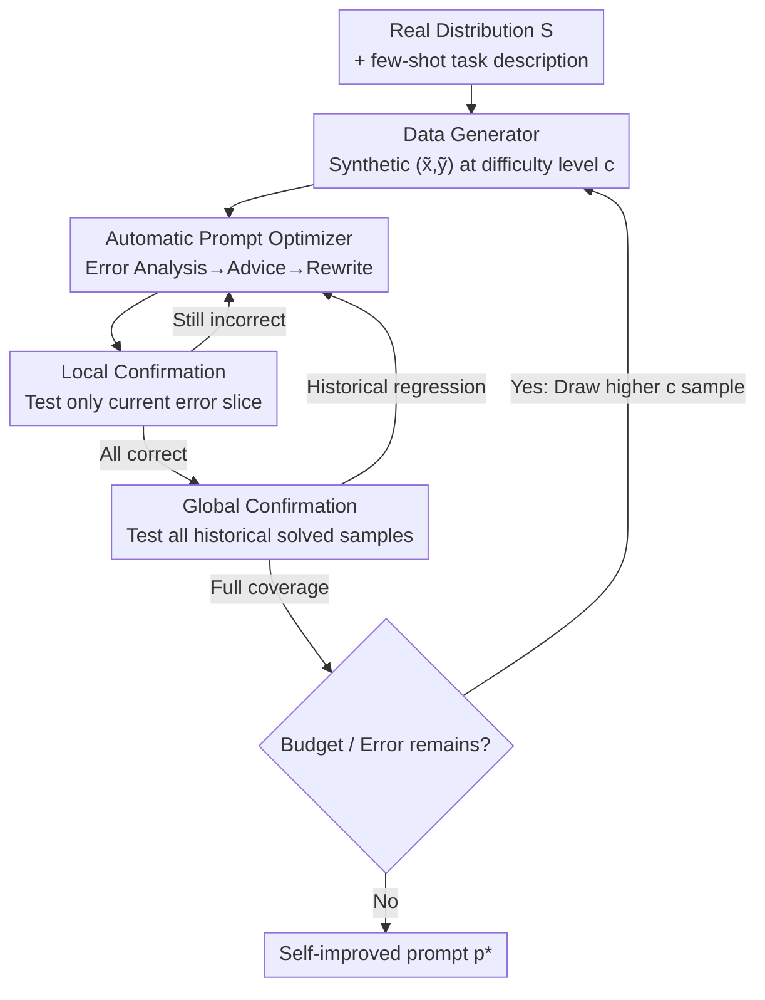

# SIPDO: Closed-Loop Prompt Optimization via Synthetic Data Feedback

**Conference**: ICLR 2026  
**OpenReview**: [https://openreview.net/forum?id=kpT5rbbLdY](https://openreview.net/forum?id=kpT5rbbLdY)  
**Area**: LLM / NLP (Prompt Optimization)  
**Keywords**: Prompt Optimization, Synthetic Data, Closed-loop Feedback, Curriculum Learning, Difficulty Gradient

## TL;DR
SIPDO transforms "data generation" into a real-time feedback signal for prompt optimization: a data generator continuously produces synthetic samples with increasing difficulty that target current prompt weaknesses, while an automatic prompt optimizer diagnoses errors and rewrites prompts per round. This allows prompts to continuously improve and outperform mainstream prompt tuning methods on multiple reasoning benchmarks without relying on external annotations.

## Background & Motivation

**Background**: Large language models (LLMs) are extremely sensitive to prompts. Subtle changes in wording, structure, or formatting can cause drastic performance fluctuations, making Automatic Prompt Engineering (APE) a core component for deploying LLMs in downstream tasks. Prior work has explored manual tuning, discrete search, gradient-based search, reinforcement learning, evolutionary algorithms, and recent iterative rewriting using "LLM as a feedback loop" (Self-Refine, Promptbreeder, TextGrad, REVOLVE, SPO, etc.).

**Limitations of Prior Work**: Most existing methods optimize prompts on a **fixed dataset**, implicitly assuming a static input distribution. Prompts obtained this way might show "good average performance" but can become fragile when encountering new linguistic variations, edge cases, or adversarial queries, leading to catastrophic forgetting. In other words, they optimize for "not making mistakes on seen samples" rather than "stability when facing unseen inputs."

**Key Challenge**: While data augmentation has long been used in supervised learning to improve robustness, and LLMs themselves can generate high-quality synthetic data, existing prompt optimization methods do not utilize synthetic data in a **dynamic, feedback-driven** manner. Simply "generating more data" is insufficient: samples that are too simple are easily solved, while those that are too complex provide no information. What is needed is **targeted, high-pressure** data that strikes the failure modes of the current prompt and escalates in difficulty as optimization progresses.

**Goal**: To transform prompt optimization from a "one-time static process" into a "dynamic adaptive learning loop," allowing prompts to evolve alongside the input distribution with minimal supervision for each new scenario (requiring only a general task description instead of manual prompt writing).

**Key Insight**: Since LLMs can both generate data and rewrite prompts, they should be placed in a competitive co-evolution: the generator creates samples that make the current prompt fail, while the optimizer fixes those specific failures.

**Core Idea**: Combine a "progressive difficulty synthetic data generator" and an "automatic error-correcting prompt optimizer" into a closed loop, turning data augmentation into a live feedback signal for prompt optimization.

## Method

### Overall Architecture
SIPDO is a **double-agent closed-loop system**. Let the real data distribution be $S$, the input-label pair be $(x,y)\in\mathcal{X}\times\mathcal{Y}$, and the LLM output function under prompt $p$ be $f(p,x)$. Accuracy is measured using a bounded surrogate loss $L(f(p,x),y)\in[0,1]$. The process is: starting from $S$, the **Data Generator** creates a synthetic QA pair $(\tilde{x},\tilde{y})$ at difficulty level $c$; the **Automatic Prompt Optimizer** evaluates the current prompt on this sample through "Error Analysis → Improvement Suggestion → Targeted Rewriting" modules. The revised prompt must pass a dual confirmation—first on the current error and then on all historical solved samples—failing which it returns for further revision. This loop continues until errors are cleared or the budget is exhausted, producing a self-improved prompt $p^*$.

### Key Designs

**1. Progressive Difficulty Adversarial Data Generator: Targeting Weaknesses with Increasing Stress**

This design addresses the pain point that "data must be high-pressure to be useful." The generator first samples a target label $\tilde{y}\sim p^*(y)$ (**Label-first** sampling ensures label validity) and a latent variable $z\sim g_\phi(z\mid S)$ representing the few-shot structure. A decoder then produces $\tilde{x}=q_\psi(z,\tilde{y},c)$ under controlled difficulty $c$. Generator parameters $\psi$ are learned via a **hybrid objective** that encourages causing prompt errors without deviating from the real label distribution:

$$\min_{\psi}\; R(\psi) + \lambda\, \mathbb{E}_{(\tilde{x},\tilde{y})\sim q_\psi}\big[L(f(p,\tilde{x}),y)\big],\quad R(\psi)=\mathrm{KL}\big(q_\psi(y)\,\|\,p^*(y)\big)$$

The KL term acts as a "tax," penalizing the generator for creating nonsensical outliers just to maximize loss (higher $\lambda$ increases this penalty, corresponding to the robustness-accuracy trade-off observed). The key innovation is the **Difficulty Curriculum**: the parameter $c\in\{1,\dots,n\}$ allows a single latent template $(z,y)$ to derive $n$ difficulty-aligned variants. Samples are drawn in order $c_1<\cdots<c_n$, and a summarizer $h_\phi$ distills previous samples into new latent cues fed back into the generator ($\tilde{x}^{(k)}=q_\psi(h_\phi(x^{(k-1)}),y,c_k)$), allowing semantic depth to accumulate and difficulty to grow monotonically, providing a learning gradient for the prompt.

**2. Three-Step Error Correction + Dual Confirmation Optimizer: Fixing Current Errors and Preventing Regressions**

For each new synthetic sample, the optimizer "probes the current prompt → locates weaknesses → fixes them." It defines the prompt score on set $A$ as $s_A(p)=\frac{1}{|A|}\sum_{(\tilde{x},\tilde{y})\in A}\mathbb{I}[f(p,\tilde{x})=\tilde{y}]$. The three steps are: **Error Analysis** evaluates $p^{(t)}$ and collects the error slice $E^{(t)}=\{(\tilde{x},\tilde{y})\in D: f(p^{(t)},\tilde{x})\neq\tilde{y}\}$; **Improvement Suggestion** via a reflection module $R_\varphi$ inspects the error, prompt, and output to produce a text patch $\Delta^{(t)}$ explaining the failure and necessary changes (clarifying instructions, removing distractors); **Targeted Rewriting** via editor $U_\theta$ applies the patch to get a revised prompt $\tilde{p}^{(t)}$.

Then follow two confirmation gates: **Local Confirmation** tests only on the current failure; if $s_{E^{(t)}}(\tilde{p}^{(t)})<1$, it continues patching. Once passed, **Global Confirmation** retests on all historical synthetic samples $D_t$. If any history regresses, they are treated as a new error set for re-optimization. This "locally fixed + globally stable" mechanism prevents fixing new errors at the cost of destroying old capabilities.

**3. Closed-Loop Coupling and Convergence Guarantees: Data Augmentation as Live Feedback**

The two agents are coupled via a feedback loop: difficulty $t=c$ increases per iteration, and the optimizer treats the prompt fixed in the previous round as the next target for the generator. Since coverage score $s_D(p^{(t)})$ is monotonically non-decreasing and bounded by 1, the process terminates after at most $M$ successful corrections or a maximum budget $T_{\max}$, outputting $p^*=\arg\max_{0\le t\le T} s_D(p^{(t)})$. The paper provides a theoretical guarantee (Theorem 3.1): under assumptions of label consistency and uniform convergence, the total worst-case error rate for any fixed prompt is bounded by the empirical risk, the "KL tax" of the hardest generator, $\varepsilon$, and a generalization term $q(|\mathcal{P}|,n,\delta)$.

### A Complete Example
For the BIG-Bench Causal Judgment task: The generator is set as a "Causal Attribution Expert" in its system prompt, instructed to create causal/non-causal statements. It receives the difficulty level $c$ and previous samples to ensure increasing complexity and logical consistency. If the optimizer fails a sample at $c=1$, the reflection module identifies prompt ambiguity and the editor rewrites it. After confirming the fix locally and globally, it moves to $c=2$. This continues up to $c=10$ (or $c=25$ for complex tasks like Penguins), outputting the final prompt when errors are cleared or the budget is spent.

### Loss & Training
The generator follows the hybrid objective in Equation (1). Difficulty budget $c=10$ (except $c=25$ for Penguins and Geometric Shapes). Temperature strategy: 0.5 for data generation consistency; 0.0 for deterministic error analysis and rewriting; 0.7 for diverse suggestions. High-difficulty benchmarks like MMLU use **Three-Vote Expert Verification**—three expert agents independently verify label-input consistency to suppress hallucinations.

## Key Experimental Results

### Main Results
On MMLU, BIG-Bench, and reasoning benchmarks (ProofWriter/FOLIO/PrOntoQA), SIPDO uses the same model driving all synthesis and rewriting, compared against CoT, APE, PromptAgent, TextGrad, REVOLVE, Neuro-Symbolic, and ANN.

| Benchmark | Model | Metric | SIPDO | Prev. SOTA | Gain |
|-----------|-------|--------|-------|------------|------|
| MMLU College CS | GPT-4o | Acc | 93 | REVOLVE 90 | +3.0 |
| MMLU Machine Learning | GPT-4o | Acc | 93.8 | ANN 90.1 | +3.7 |
| BIG-Bench Avg | GPT-4o-mini | Acc | 87.3 | PromptAgent 85.2 | +2.1 |
| FOLIO | GPT-4o | Acc | 83.2 | Neuro-S 79.2 | +4.0 |
| PrOntoQA | GPT-4o | Acc | 96.3 | CoT 95.6 | +0.7 |
| Logic Avg (3 tasks) | GPT-4o | Acc | 86.4 | Neuro-S 82.0 | +4.2 |
| Logic Avg (3 tasks) | GPT-4o-mini | Acc | 83.9 | Neuro-S 77.4 | +6.5 |

SIPDO achieved the highest scores in all MMLU categories and most BIG-Bench tasks. In logical reasoning, it swept FOLIO and PrOntoQA, slightly trailing Neuro-Symbolic in ProofWriter by 2% (GPT-4o) and 0.4% (GPT-4o-mini)—notably, Neuro-Symbolic relies on preset rule datasets, while SIPDO only uses generated synthetic data.

### Ablation Study

| Configuration | Key Metric | Description |
|---------------|------------|-------------|
| Full SIPDO (w/ Difficulty Gradient) | GPT-4o BIG-Bench Avg Acc | Base model |
| w/o Difficulty Gradient | Avg drop 17.3% (GPT-4o), 24.3% (GPT-4o-mini) | Removal of difficulty curriculum |
| w/o Difficulty Gradient (Worst Task)| Object Counting drop 40.9% / 54.4% | Complex tasks rely more on gradient |
| One-Shot Extremes | No measurable gain | Using "one-shot extreme samples" instead of curriculum |

### Key Findings
- **Difficulty gradient is the core source of gain**: Removing it caused performance drops across all BIG-Bench subtasks. Lower-tier models like GPT-4o-mini rely more on the gradient (24.3% drop vs. 17.3%).
- **"One-shot extreme samples" strategy fails**: Extreme samples are either solved immediately or are merely minor perturbations, failing to provide new error modes for the optimizer.
- **KL Coefficient $\lambda$ controls the robustness-accuracy trade-off**: Increasing $\lambda$ reduces the worst-case error rate but may sacrifice average accuracy.

## Highlights & Insights
- **Transforming data augmentation into a "live" feedback signal**: Unlike traditional offline augmentation, SIPDO uses a generator to create samples targeting current prompt failure modes in real-time, representing a paradigm shift from static optimization to an adaptive closed loop.
- **Dual Confirmation prevents regression**: Iterative methods often suffer from "fixing one error while breaking another." SIPDO's mandatory retesting of historical samples ensures monotonic coverage improvement.
- **Transferability of Difficulty Curriculum**: The "curriculum chain" design—using a summarizer to distill previous samples into cues—can be migrated to any scenario requiring progressive stress (adversarial training, red teaming).
- **Label-first + Expert Verification handles hallucinations**: Deciding labels before generating inputs, combined with expert voting, is a practical recipe for controlling hallucinations in synthetic evaluation.

## Limitations & Future Work
- **Validation focused on synthetic reasoning**: The failure of "One-Shot Extremes" suggests a current lack of real-world edge case representation; the method's value on real corpora (e.g., financial reports, clinical notes) remains to be tested.
- **Idealized theoretical assumptions**: Assumptions like label consistency (A1) and uniform convergence (A3) may not strictly hold for real LLM generators; theorems provide upper bounds rather than reachability guarantees.
- **Cost and budget sensitivity**: Difficulty budget $c$ and expert verification multiply LLM calls; the token/call overhead for these gains is not fully analyzed.
- **Future Directions**: Exploring "fully automated variants" that evolve under continuous model feedback and testing the closed loop on data streams with real distribution shifts.

## Related Work & Insights
- **vs TextGrad / REVOLVE**: These treat text feedback or trajectories as gradients to update prompts on fixed data. SIPDO **actively generates adversarial samples** in the loop, incorporating "what data to optimize" into the process.
- **vs PromptAgent / APE**: These rely on MCTS or discrete searches on existing datasets. SIPDO is driven entirely by synthetic data with a progressive difficulty curriculum.
- **vs Neuro-Symbolic**: Neuro-Symbolic converts LLM outputs into structured forms for rule reasoning, which is strong for ProofWriter but requires predefined rule sets. SIPDO achieves higher performance on FOLIO/PrOntoQA using only synthetic data, showing better generalization.
- **vs Self-Refine / Promptbreeder**: These are pure "feedback on output" loops. SIPDO's key increment is making **data synthesis** part of the loop with a difficulty curriculum.

## Rating
- Novelty: ⭐⭐⭐⭐ Upgrading data augmentation to real-time adversarial feedback with a difficulty curriculum is a novel perspective.
- Experimental Thoroughness: ⭐⭐⭐⭐ Coverage of MMLU, BIG-Bench, and 4 models with specific ablations, though lacking cost analysis.
- Writing Quality: ⭐⭐⭐ Methodology and theory are clear, though some notations and transitions are slightly abrupt.
- Value: ⭐⭐⭐⭐ Provides a reusable paradigm for co-strengthening synthetic data and prompt optimization.

<!-- RELATED:START -->

## Related Papers

- [\[ICLR 2026\] SPRIG: Improving Large Language Model Performance by System Prompt Optimization](sprig_improving_large_language_model_performance_by_system_prompt_optimization.md)
- [\[ACL 2025\] Evaluating Language Models as Synthetic Data Generators](../../ACL2025/llm_nlp/evaluating_lms_synthetic_data_gen.md)
- [\[ACL 2025\] Theorem Prover as a Judge for Synthetic Data Generation](../../ACL2025/llm_nlp/theorem_prover_as_a_judge_for_synthetic_data_generation.md)
- [\[ACL 2026\] Synthetic Eggs in Many Baskets: The Impact of Synthetic Data Diversity on LLM Fine-Tuning](../../ACL2026/llm_nlp/synthetic_eggs_in_many_baskets_the_impact_of_synthetic_data_diversity_on_llm_fin.md)
- [\[ICLR 2026\] Efficient Multi-objective Prompt Optimization via Pure-exploration Bandits](efficient_multi-objective_prompt_optimization_via_pure-exploration_bandits.md)

<!-- RELATED:END -->
