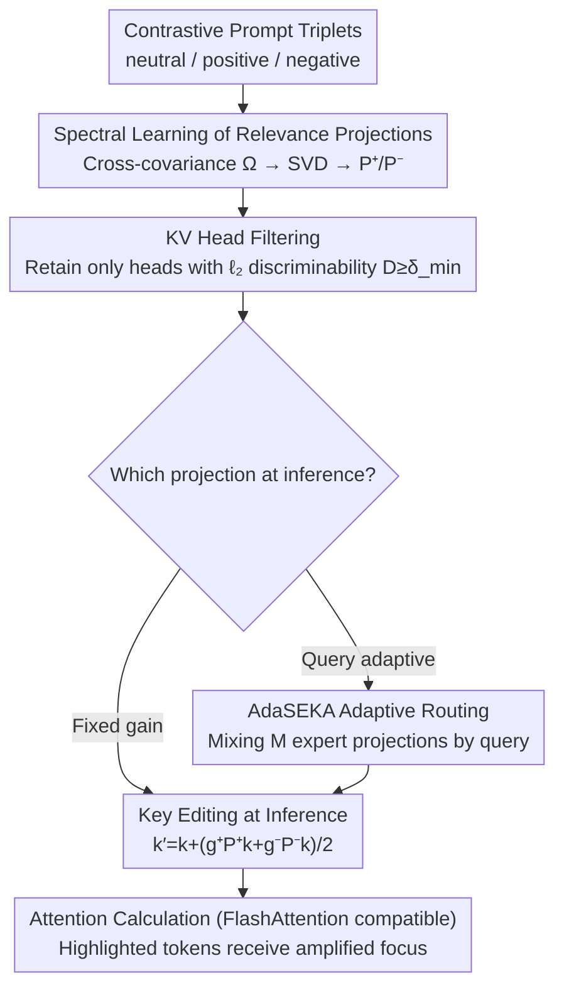

# Spectral Attention Steering for Prompt Highlighting

**Conference**: ICLR2026  
**arXiv**: [2603.01281](https://arxiv.org/abs/2603.01281)  
**Code**: [waylonli/SEKA](https://github.com/waylonli/SEKA)  
**Area**: LLM Evaluation  
**Keywords**: attention steering, prompt highlighting, spectral decomposition, FlashAttention, key embedding editing  
**Authors**: Weixian Waylon Li, Yuchen Niu, Yongxin Yang, Keshuang Li, Tiejun Ma, Shay B. Cohen (University of Edinburgh, RayNeo, Huawei Research, QMUL)

## TL;DR

Proposes SEKA/AdaSEKA, which learns a "relevance subspace" through spectral decomposition of key embeddings and implements prompt highlighting by directly editing key vectors before attention calculation. This approach requires no storage of the full attention matrix, is fully compatible with FlashAttention, and incurs minimal overhead (+0.03s/sample).

## Background & Motivation

**Practical Demand for Prompt Highlighting**: In high-risk scenarios, it is necessary to precisely guide LLMs to focus on user-specified key text in the prompt (e.g., new knowledge in factual conflicts, core constraints in instruction following), known as attention steering.

**Efficiency Bottlenecks of Prior Work**: SOTA methods like PASTA perform post-hoc modifications to the attention matrix after its calculation. This necessitates storing the full $T \times T$ attention matrix, which is incompatible with IO-aware efficient implementations like FlashAttention.

**Massive Extra Overhead**: PASTA results in an inference latency increase of +1.03s/sample and memory increase of +23.12 GB. SPA, based on logit distribution operations, does not support batch processing and is the slowest (+5.32s).

**Need for Expensive Head Search**: PASTA also requires searching for specific attention heads for different tasks to determine which heads to steer, increasing deployment costs.

**Structured Signals in Key Embeddings**: Through comparative experiments, the authors observed that when the status of a prompt question changes from irrelevant to relevant, key embeddings in specific layers/heads exhibit consistent directional shifts (as shown by PCA visualization). This indicates that "relevance" is encoded in the structured subspace of key representations.

**Feasibility of Pre-attention Intervention**: The attention score $\text{Attn}(i,j) = \frac{\boldsymbol{q}_i^\top \boldsymbol{k}_j}{\sqrt{d_k}}$ depends on the query-key inner product. Equivalent control can be achieved by editing the key side. Since keys are indexed by token position, they are naturally suited for controlling the degree to which individual tokens are attended to.

## Method

### Overall Architecture

The problem SEKA aims to solve is prompt highlighting—accurately amplifying the model's attention to specified tokens in the prompt—without undermining IO-efficient implementations like FlashAttention. Its core idea is "offline spectral learning, online editing": first, use synthetic contrastive prompt triplets to decompose a "relevance subspace" for each layer/head and solidify it into a projection matrix; simultaneously, identify the few heads that truly distinguish relevance. During inference, the key vectors of tokens to be highlighted are amplified along the direction of the relevance subspace only in these selected heads. Since only the keys are modified and the $T \times T$ attention matrix is never explicitly materialized for post-processing, it is naturally compatible with FlashAttention. The basic version uses a set of fixed-gain projections, while the advanced AdaSEKA prepares multiple domain-expert projections offline and dynamically mixes them based on the query during inference, avoiding repeated cross-task parameter tuning.

### Key Designs

**1. Spectral Learning of Relevance Projections: Distilling "Relevance" into an Offline Reusable Subspace**

Methods like PASTA require searching online for which heads to steer, leading to high deployment costs. SEKA aims to learn this offline once and for all. The authors construct three types of prompts—neutral (context only), positive (context + relevant question), and negative (context + irrelevant question)—and extract the key embeddings $\boldsymbol{h}, \boldsymbol{h}^+, \boldsymbol{h}^-$ of the same token span. The cross-covariance between neutral and positive, $\boldsymbol{\Omega}_{\ell,h}^{+} = \boldsymbol{h}^\top \boldsymbol{h}^+ / n$, is analyzed via SVD: $\boldsymbol{\Omega}_{\ell,h}^{+} = \boldsymbol{U}_{\ell,h}^{+} \boldsymbol{S}_{\ell,h}^{+} \boldsymbol{V}_{\ell,h}^{+\top}$. The positive projection uses the left singular vectors corresponding to the top $k^+$ largest singular values (the directions explaining "relevance"), and the negative projection uses the smallest $k^-$ (corresponding to directions least related to relevance), forming two projection operators: $\boldsymbol{P}_{\ell,h}^{+} = \boldsymbol{U}_{:,:k^+}^{+}(\boldsymbol{U}_{:,:k^+}^{+})^\top$ and $\boldsymbol{P}_{\ell,h}^{-} = \boldsymbol{U}_{:,k^-:}^{-}(\boldsymbol{U}_{:,k^-:}^{-})^\top$. The number of singular vectors is controlled by a cumulative singular value ratio threshold $\gamma$ ($\sum_{i\le k^+} S_i^+ / \sum_i S_i^+ \ge \gamma$). Thus, the direction representing relevance is solidified as a matrix for direct inference without further head searching.

**2. KV Head Filtering: Acting Only on Relevant Heads**

Not all heads are sensitive to relevance; forcibly projecting insensitive heads would inject noise. SEKA uses the average $\ell_2$ distance $D_{\ell,h} = \frac{1}{N}\sum_i \|\boldsymbol{h}_{\ell,h,i}^+ - \boldsymbol{h}_{\ell,h,i}^-\|_2$ between positive and negative key embeddings to measure the discriminability of each $(\text{layer}, \text{head})$ pair. Projections are only applied to heads where $D_{\ell,h} \ge \delta_{\min}$ (with $\delta_{\min}$ determined via grid search on a validation set, typically within $[0, 0.6]$). Visualizations show that mid-to-late layer heads possess significantly higher discriminability, aligning with research suggesting "retrieval heads" are concentrated in these layers. Ablations confirm that removing this step leads to catastrophic degradation.

**3. Key Editing at Inference: Pushing Keys Toward Relevant Directions Before Attention**

Attention scores $\text{Attn}(i,j) = \boldsymbol{q}_i^\top\boldsymbol{k}_j / \sqrt{d_k}$ depend solely on the query-key inner product. Since keys are indexed by token position, editing a specific token's key allows for precise control over its attention weight. For each highlighted token, SEKA applies $\boldsymbol{k}_j' = \boldsymbol{k}_j + (g^+ \boldsymbol{P}_{\ell,h}^+ \boldsymbol{k}_j + g^- \boldsymbol{P}_{\ell,h}^- \boldsymbol{k}_j)/2$ on selected heads, where $g^+, g^-$ are independently adjustable gains for amplification or suppression. In the attention formula, this is equivalent to adding a key-dependent bias $B_{ij} = \boldsymbol{q}_i^\top(g^+\boldsymbol{P}^+\boldsymbol{k}_j + g^-\boldsymbol{P}^-\boldsymbol{k}_j)/2\sqrt{d_k}$ to the original score. The key is that this bias is implemented by modifying the keys, thus maintaining compatibility with FlashAttention and providing a clear geometric interpretation: stretching the key along the relevance subspace.

**4. AdaSEKA Adaptive Routing: Automatically Mixing Expert Projections via Queries**

Fixed projections require repeated tuning across different tasks or models. AdaSEKA instead learns $M$ domain-expert projections offline (using four different datasets) and dynamically mixes them during inference based on the current input. It takes the query vector $\boldsymbol{q}_{\ell,h}$ of the last prompt token and calculates routing weights based on its alignment with the principal directions of each expert (singular-value weighted inner product, normalized by the maximum):

$$\alpha_{m,\ell,h}(\boldsymbol{q}) = \frac{\sum_k (\boldsymbol{q}^\top \boldsymbol{u}_m^{+(k)})\,\sigma_m^{+(k)}}{\max_{m'}\left|\sum_k (\boldsymbol{q}^\top \boldsymbol{u}_{m'}^{+(k)})\,\sigma_{m'}^{+(k)}\right|},$$

The final projection is a weighted combination of experts $\boldsymbol{P}_{\text{dynamic}} = \sum_m \alpha_m \boldsymbol{U}_m^{+}(\boldsymbol{U}_m^{+})^\top$, followed by key editing as $\boldsymbol{k}_j' = \boldsymbol{k}_j + g\,\boldsymbol{P}_{\text{dynamic}}\boldsymbol{k}_j$. This offers three benefits: plug-and-play experts for new domains, reduced cross-task tuning, and interpretable routing weights indicating the domain similarity of the prompt.

## Key Experimental Results

### Main Results: Standard Benchmarks

Evaluated on CounterFact (knowledge conflict), Bias in Bios (occupation extraction), and Pronoun Changing (pronoun rewriting instruction following):

| Model | Method | CounterFact ES | CounterFact PS | Bias in Bios Acc | Pronoun P.Score | Pronoun A.P.Score |
|------|------|:-:|:-:|:-:|:-:|:-:|
| Qwen3-4B | Original | 45.00 | 45.64 | 79.84 | 93.14 | 90.52 |
| | PASTA | 97.16 | 96.03 | 89.58 | 95.82 | 94.64 |
| | SPA | 65.24 | 57.71 | 68.00 | 80.27 | 78.19 |
| | **Ours (SEKA)** | **99.02** | **98.61** | **91.02** | 95.18 | 93.26 |
| | **Ours (AdaSEKA)** | 98.90 | 98.72 | **91.86** | 94.54 | 92.08 |
| Qwen3-8B | Original | 39.04 | 39.59 | 76.08 | 98.00 | 97.84 |
| | PASTA | 92.70 | 91.68 | 86.32 | 98.86 | 98.72 |
| | **Ours (SEKA)** | **99.08** | **98.96** | **88.74** | 98.56 | 98.26 |
| | **Ours (AdaSEKA)** | 99.00 | 98.97 | 88.50 | **99.68** | **99.52** |
| Qwen3-14B | Original | 37.56 | 36.12 | 85.22 | 98.42 | 98.22 |
| | PASTA | 76.84 | 66.33 | 88.46 | 90.98 | 90.94 |
| | **Ours (SEKA)** | **98.92** | **99.02** | 90.28 | 98.66 | 98.54 |
| | **Ours (AdaSEKA)** | 99.00 | 99.15 | **91.22** | **99.88** | **99.86** |

### Efficiency Comparison

| Method | Latency (s/sample) | Peak Memory (GB, B=10) | Peak Memory (GB, B=1) |
|------|:-:|:-:|:-:|
| Original | 0.55 | 27.63 | 16.72 |
| PASTA | 1.58 (+1.03) | 50.75 (+23.12) | - |
| SPA | 5.87 (+5.32) | - | 17.71 (+0.99) |
| **Ours (SEKA)** | **0.58 (+0.03)** | **27.66 (+0.03)** | **16.75 (+0.03)** |
| **Ours (AdaSEKA)** | 0.82 (+0.27) | 43.22 (+15.59) | 18.23 (+1.51) |

SEKA incurs almost zero overhead, while PASTA doubles memory and triples latency.

### Ablation Study

| Configuration | CounterFact ES (Qwen3-4B) | Bias in Bios Acc | Pronoun A.P.Score |
|------|:-:|:-:|:-:|
| Ours (SEKA, Full) | **99.02** | **91.02** | **93.26** |
| w/o learn (Random projection + filtering) | 94.96 | 86.62 | 88.66 |
| w/o learn & filt (Random + no filtering) | 86.12 | 71.76 | **36.95** |

### Key Findings

- Removing spectral learning and using random projections leads to a significant performance drop, proving the learned relevance subspace is substantial.
- Simultanously removing head filtering leads to catastrophic failure (Pronoun score drops from 90.52 to 36.95), which is worse than no steering at all. This indicates that applying projections to non-sensitive heads introduces severe interference.

**Lost-in-the-Middle Experiment**:
- **SEKA can reverse the U-shape performance curve** by highlighting middle passages, significantly improving exact match in those positions.
- Uniformly highlighting all passages may instead exacerbate the lost-in-the-middle effect.
- By adjusting $\delta_{\min}$ to control the number of steered heads, the U-shape curve can be flattened.
- PASTA underperforms the baseline in this task, highlighting the limitations of post-hoc methods in long-context scenarios.

## Highlights & Insights

1.  **Fully Compatible with FlashAttention**: This is the first method in its class to achieve this by using pre-attention key editing, bypassing the need to store the attention matrix.
2.  **Near-Zero Overhead**: SEKA only adds 0.03s/sample latency and 0.03 GB memory, offering a massive advantage over PASTA (+1.03s/+23.12 GB).
3.  **Strong Geometric Interpretability**: The transformation $\boldsymbol{k}' = \boldsymbol{k} + g \boldsymbol{P} \boldsymbol{k}$ has a clear geometric meaning—amplifying the key along the direction of the relevance subspace.
4.  **Training-free**: Requires no fine-tuning and relies only on a small number of synthetic contrastive prompts for offline spectral decomposition.
5.  **AdaSEKA's Adaptive Routing** reduces the need for hyperparameter tuning across tasks and models, making expert modules plug-and-play.
6.  **U-shape Reversal in Lost-in-the-Middle** is an interesting discovery, demonstrating the precision of attention steering in managing positional sensitivity.

## Limitations & Future Work

1.  **Dependence on Synthetic Data Quality**: The construction strategy for contrastive prompt triplets affects the quality of learned projections; adapting to new domains requires new triplets.
2.  **Hyperparameter Tuning Still Required**: Although AdaSEKA reduces some tuning, $g^+, g^-, \gamma, \delta_{\min}$ still require grid searching, and optimal values vary across models/tasks.
3.  **Limited to Prompt Highlighting Scenarios**: The method focuses on "making the model look at specific tokens" and does not cover broader activation steering goals like style control or safety.
4.  **Coarse Highlighting Range in Lost-in-the-Middle**: Positions 5-25 were manually specified; practical applications require knowing which segments are gold passages.
5.  **Non-negligible Memory for AdaSEKA**: At batch=10, it adds +15.59 GB, mainly for storing multiple expert SVD components.

## Related Work & Insights

- **vs PASTA** (Zhang et al., 2024): PASTA post-processes the attention matrix, is incompatible with FlashAttention, and has high latency/memory costs; SEKA surpasses it in accuracy with negligible overhead.
- **vs SPA** (Tian & Zhang, 2025): SPA operates on logit distributions and does not support batching, making it the slowest; it is far inferior to SEKA on CounterFact.
- **vs Activation Steering** (SEA, RepE, etc.): Activation steering modifies hidden states in MLP layers to control semantic attributes, while SEKA controls the attention mechanism to decide where the model looks. The two are complementary.
- **Support for Retrieval Head Research**: Studies like Wu et al. (2025) and Qiu et al. (2025) find retrieval heads concentrated in mid-to-late layers, which aligns with SEKA's head filtering strategies.

## Rating

- ⭐ Novelty: 8/10 — Pre-attention steering via key embeddings is a novel and meaningful idea; spectral decomposition and adaptive routing are elegantly designed.
- ⭐ Experimental Thoroughness: 8/10 — Covers 5 models across 3 standard benchmarks, lost-in-the-middle, ablations, and efficiency analysis.
- ⭐ Writing Quality: 8/10 — Clear logic, intuitive visualizations (PCA, heatmaps), and complete mathematical derivations.
- ⭐ Value: 8/10 — Solves the practical pain point of FlashAttention incompatibility in attention steering; simple, efficient, and engineering-friendly.

<!-- RELATED:START -->

## Related Papers

- [\[NeurIPS 2025\] Spectral Conditioning of Attention Improves Transformer Performance](../../NeurIPS2025/llm_nlp/spectral_conditioning_of_attention_improves_transformer_performance.md)
- [\[ICLR 2026\] Fine-Grained Activation Steering: Steering Less, Achieving More](fine-grained_activation_steering_steering_less_achieving_more.md)
- [\[ICLR 2026\] Efficient Multi-objective Prompt Optimization via Pure-exploration Bandits](efficient_multi-objective_prompt_optimization_via_pure-exploration_bandits.md)
- [\[ICLR 2026\] Statistical Advantage of Softmax Attention: Insights from Single-Location Regression](statistical_advantage_of_softmax_attention_insights_from_single-location_regress.md)
- [\[ICLR 2026\] Attend to the Active: Structure-Aware Dynamic Attention in LLMs for Compositional Instruction Following](attend_to_the_active_structure-aware_dynamic_attention_in_llms_for_compositional.md)

<!-- RELATED:END -->
