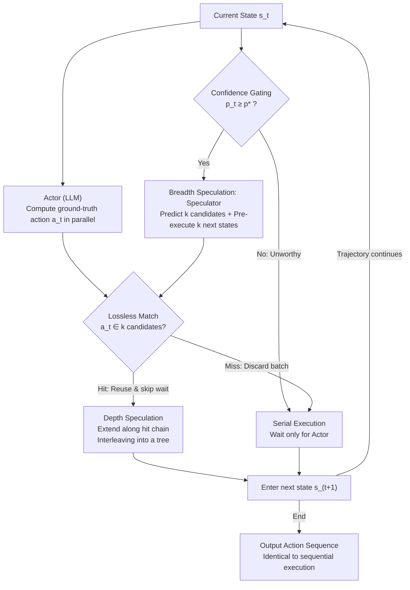

# Speculative Actions: A Lossless Framework for Faster AI Agents

**Conference**: ICLR 2026 Oral  
**OpenReview**: [https://openreview.net/forum?id=P0GOk5wslg](https://openreview.net/forum?id=P0GOk5wslg)  
**Code**: None  
**Area**: Other  
**Keywords**: speculative execution, AI agents, latency reduction, lossless acceleration, MDP  

## TL;DR
Drawing inspiration from CPU speculative execution and LLM speculative decoding, this paper proposes the Speculative Actions framework: while a slow Actor (large model) computes, a fast Speculator (small model) predicts and pre-executes future actions. If the prediction matches, the wait time is skipped to achieve lossless acceleration. The framework reduces latency by 15-30% in scenarios such as Chess, e-commerce, and QA. A confidence-based dynamic branching strategy achieves acceleration effects similar to 3 speculative branches using 40% fewer tokens.

## Background & Motivation

**Background**: AI Agents follow a strict serial interaction pattern with the environment: Agent generates action → Environment responds → Agent generates next action. When using large models (e.g., GPT-5, Gemini-2.5-Pro) as Agents, the latency of each API call becomes a bottleneck.

**Limitations of Prior Work**: (a) Speculative decoding only accelerates token generation and does not address Agent-environment interaction latency; (b) Existing Agent acceleration methods often sacrifice accuracy (e.g., replacing large models with small ones); (c) There is no theoretical framework to analyze the cost-latency trade-off of parallel speculation in Agents.

**Key Challenge**: Large model Agents are accurate but slow, while small models are fast but insufficiently accurate. Can one achieve both—maintaining the accuracy of large models while gaining the speed of small models?

**Goal**: Design a lossless acceleration framework that leverages the speed difference between large and small models to speculate actions in parallel, reducing end-to-end latency while fully maintaining the output quality of the large model.

**Key Insight**: A key insight from CPU speculative execution is that "predict then verify" does not change correctness, only efficiency. Similarly, in Agent interactions, predicting actions and pre-executing them allows for reusing results upon a match or discarding them upon a mismatch, ensuring the outcome is identical to pure serial execution.

**Core Idea**: Use a fast small model to predict Agent actions and pre-execute environment steps. When predictions are correct, a round of waiting is skipped, ensuring the output trajectory is exactly the same as serial execution.

## Method

### Overall Architecture
The pain point addressed in this paper is that large model Agents are "accurate but slow." Agents interact with the environment in a strictly serial manner, wasting time waiting for each large model API call. Speculative Actions applies the CPU speculative execution concept—where prediction and verification affect efficiency but not correctness—by running a fast Speculator (small model) and a slow Actor (large model) in parallel. The Speculator predicts future actions and pre-executes the environment, while the Actor computes the ground-truth action. If the ground-truth action matches a prediction, the pre-execution result is reused to skip the wait; otherwise, it is discarded.

The process follows these steps: at each state, a **confidence gate** determines if speculation is worthwhile. If so, the Speculator places $k$ parallel "bets" (**breadth**) and pre-executes $k$ next states. Once the Actor's ground-truth action arrives, an exact match is performed to decide between reuse or rollback (**Lossless Guarantee**). Upon a hit, the system continues along the hit chain (**depth**), connecting single-step acceleration into multi-step chains. Regardless of the hit outcome, the final action sequence is identical word-for-word to pure serial execution.

### Key Designs

**1. Confidence Dynamic Gating: Speculating only when the small model is confident to save tokens.**

The problem with fixed width $k$ is that it always places $k$ bets regardless of the small model's confidence, which is wasteful when confidence is low. Here, each state dynamically decides whether to speculate based on confidence: speculation is accepted at step $t$ if and only if $p_t \geq p^\star$,

$$\text{Accept speculation at step } t \iff p_t \geq p^\star$$

The threshold $p^\star$ is analytically derived from the cost-latency ratio. The paper proves this strategy is theoretically optimal under cost constraints. In practice, it achieves acceleration close to $k=3$ breadth speculation using approximately 40% fewer tokens by spending them only on steps likely to hit.

**2. Breadth Speculation: Placing $k$ bets at the same state to increase hit probability.**

When a state is worth speculating, the most direct acceleration involves running multiple speculations at $s_t$ simultaneously. The Speculator predicts $k$ candidate actions $\{\hat{a}_t^{(i)}\}_{i=1}^k$ in parallel, computes the next states for each, and pre-initiates corresponding Actor calls. These $k$ speculations are independent and can be fully parallelized. The hit probability increases with width as $p(k) = 1 - (1-p)^k$ (where $p$ is the hit rate of a single speculation). While a larger $k$ makes hits more stable, it incurs $k$ times the token cost, necessitating the aforementioned confidence gating.

**3. Lossless Guarantee: Reusing results only on exact matches to ensure identical trajectories.**

Candidates generated via breadth speculation can only be used if they do not change the outcome. The Actor reuses the cached result and skips the wait only when a pre-execution result **exactly matches** the computed ground-truth action $a_t$. If there is no match, the batch is discarded, and the system reverts to normal serial execution. Thus, the final action sequence is identical to sequential execution. This allows it to function as a pure backend optimization that is transparent to users—they do not need to trust the small model or worry about errors.

**4. Depth Speculation: Chaining hits to enable multi-step acceleration.**

Breadth speculation saves one step at a time, but true acceleration comes from continuing the speculation following a hit. Once a speculation matches at the current step, it extends to the next step and the one after that, interleaving multiple chains into a speculation tree. This allows multiple interactions to be processed in advance. Intuition might suggest computational explosion with increased depth, but the paper proves that the total computation for depth speculation is constrained by the Actor/Speculator speed ratio $a/b$ and **does not grow exponentially** with the horizon $T$. As long as the small model is fast enough, depth speculation is cost-effective, and higher single-step hit rates lead to more significant cumulative acceleration.

### Theoretical Results
**Latency Saving:** $\frac{E[T_{\text{seq}} - T_{\text{spec}}]}{E[T_{\text{seq}}]} \to \frac{p(k)}{1+p(k)} \cdot \frac{b}{a+b}$

**Cost Increase:** $\frac{E[M_{\text{spec}} - M_{\text{seq}}]}{E[M_{\text{seq}}]} \to \frac{k}{1+p(k)} - \frac{b}{a+b} \cdot \frac{p(k)}{1+p(k)}$

Where Actor/Speculator latencies follow $\text{Exp}(\beta)$ and $\text{Exp}(\alpha)$ respectively.

## Key Experimental Results

### Main Results

| Task | Speculation Count $k$ | Latency Saving | Extra Tokens |
|------|-----------|---------|-----------|
| Chess | $k=1$ | 4-8% | ~91% |
| Chess | $k=2$ | 11-18% | ~155% |
| Chess | $k=3$ | 19-31% | ~180% |
| Chess | Confidence Dynamic | **16-25%** | **~88%** |

### Ablation Study

| Analysis Dimension | Key Findings |
|---------|---------|
| Next-step Prediction Accuracy | Reaches 55% across domains |
| Confidence Dynamic vs. Fixed $k$ | Achieves $k=3$ speedup with $k=1$ token cost |
| Lossy Mode (OS Tuning) | Latency reduced by 93.5%, cost reduced by 92% |
| Speculator Choice | Small models from the same family (GPT-5-nano for GPT-5) perform best |

### Key Findings
- **Cross-domain Generalization**: Effective across four highly distinct domains: Chess, e-commerce, QA, and OS tuning.
- **Confidence Threshold is a Core Optimization**: Dynamic branch selection achieves the best trade-off between token efficiency and latency reduction.
- **Free Speculation for Self-hosted Deployment**: Using idle GPUs for speculation incurs almost no additional cost.
- **Significant Lossy Potential**: When lossy execution is permitted (e.g., OS Tuning), both latency and cost decrease substantially.

## Highlights & Insights
- **Perfect Analogy from CPU Speculative Execution to AI Agents**: CPU speculative execution has a 40-year history. Porting it to AI Agent interaction is a natural but previously overlooked direction.
- **Lossless Guarantee Enables Direct Deployment**: As a backend optimization, it is completely transparent to users and does not require them to trust speculative results.
- **Theoretically Guided Optimal Strategy**: Beyond proposing the method, the paper provides a theoretically optimal threshold $p^\star$, avoiding manual hyperparameter search.

## Limitations & Future Work
- **Dependency on Action Space Predictability**: For tasks where Agent actions are highly stochastic or creative (e.g., open-ended writing), prediction accuracy will be low, leading to wasted speculation.
- **Applicable Only to Deterministically Verifiable Environments**: Requires the ability to judge "Predicted Action = Ground-truth Action" exactly. Continuous action spaces would require defined matching thresholds.
- **Speculator Training Not Considered**: Uses off-the-shelf small models as Speculators; specialized training to improve match rates has not been explored.

## Related Work & Insights
- **vs. Speculative Decoding**: Speculative decoding accelerates token-level generation, while Speculative Actions accelerates action-level environment interaction. Both can be used concurrently.
- **Connection to LoongRL**: Action sequences generated by the plan-retrieve-reason-recheck pattern in LoongRL may be highly predictable (especially plan and retrieve steps), making them naturally suitable for Speculative Actions acceleration.

## Rating
- Novelty: ⭐⭐⭐⭐ Mapping a classic concept to a new scenario; elegant idea without changing underlying algorithms.
- Experimental Thoroughness: ⭐⭐⭐⭐ Multitask verification with theoretical alignment, though lacks larger-scale Agent tasks.
- Writing Quality: ⭐⭐⭐⭐⭐ Rigorous theoretical derivation and clear system design.
- Value: ⭐⭐⭐⭐⭐ High practical value; can be directly deployed to accelerate existing Agent systems.

<!-- RELATED:START -->

## Related Papers

- [\[ICML 2026\] Preregistration for Experiments with AI Agents](../../ICML2026/llm_nlp/preregistration_for_experiments_with_ai_agents.md)
- [\[AAAI 2026\] Whispering Agents: An Event-Driven Covert Communication Protocol for the Internet of Agents](../../AAAI2026/llm_nlp/whispering_agents_an_event-driven_covert_communication_protocol_for_the_internet.md)
- [\[ICLR 2026\] Optimas: Optimizing Compound AI Systems with Globally Aligned Local Rewards](optimas_optimizing_compound_ai_systems_with_globally_aligned_local_rewards.md)
- [\[ICLR 2026\] ELLMob: Event-Driven Human Mobility Generation with Self-Aligned LLM Framework](ellmob_event-driven_human_mobility_generation_with_self-aligned_language_models.md)
- [\[ICLR 2026\] BOTS: A Unified Framework for Bayesian Online Task Selection in LLM Reinforcement Finetuning](bots_a_unified_framework_for_bayesian_online_task_selection_in_llm_reinforcement.md)

<!-- RELATED:END -->
