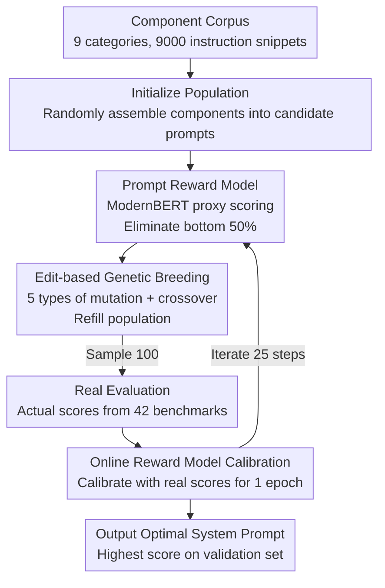

# SPRIG: Improving Large Language Model Performance by System Prompt Optimization

**Conference**: ICLR 2026  
**OpenReview**: [https://openreview.net/forum?id=VdVV24KSWK](https://openreview.net/forum?id=VdVV24KSWK)  
**Code**: https://github.com/orange0629/prompting  
**Area**: NLP Understanding / Prompt Optimization  
**Keywords**: System Prompt, Genetic Algorithm, Prompt Optimization, Reward Model, Generalization

## TL;DR
SPRIG utilizes an "edit-based genetic algorithm + proxy reward model" to automatically assemble a **task-agnostic system prompt**. A single system prompt's average improvement across 47 task categories matches "task-specific prompts optimized individually for each task," while the combination of both further achieves new SOTA results and transfers across model families and languages.

## Background & Motivation
**Background**: The quality of prompts significantly impacts the output quality of LLMs, making "prompt optimization" a critical research direction. Currently, the vast majority of work (GrIPS, APE, OPRO, and the current SOTA ProTeGi) focuses on optimizing **task prompts**—tuning instructions specifically for a particular task or benchmark.

**Limitations of Prior Work**: Task prompts are inherently non-generalizable. A new prompt must be crafted for every new task, and as the number of tasks explodes, this "one prompt per task" engineering burden becomes unsustainable. Another widely used category, **system prompts** (e.g., CoT’s "let's think step by step," persona, style, safety rules), has been proven effective, but existing research is fragmented and highly sensitive to scenario details, lacking a systematic method to construct a "universally effective" system prompt.

**Key Challenge**: The search space and optimization goals for system prompts differ greatly from task prompts. Task prompts have clear single-task supervision signals, whereas system prompts must perform well across dozens of heterogeneous tasks simultaneously. Existing task-level methods are difficult to transfer. Furthermore, the cost of evaluating every candidate system prompt across all benchmarks is prohibitively high.

**Goal**: To design an optimizer capable of automatically searching for "universal, generalizable" system prompts within a vast design space and to answer two questions: Do system prompt optimization and task prompt optimization learn the same strategy? Can it transfer across models, languages, and scales?

**Key Insight**: Treat "writing a system prompt" as a combinatorial optimization problem of selecting and arranging from a set of **composable instruction snippets (genes)**, using genetic algorithms for gradient-free search. A lightweight proxy model is trained to approximate expensive real evaluations, reducing search costs.

**Core Idea**: Use a "component corpus + proxy reward model + edit-based genetic algorithm" trio to iteratively assemble a system prompt that works well for all tasks.

## Method

### Overall Architecture
SPRIG (System Prompt Refinement for Increased Generalization) transforms system prompt optimization into a genetic algorithm loop. Each candidate prompt is a string composed of several "components." A generation of candidates is first scored by a **proxy reward model** to eliminate the bottom 50%; the remainder produces a new population via **mutation/crossover**. To calibrate the reward model, a small batch of candidates is sampled in each generation for real benchmark evaluation, and the **online retraining** of the reward model is performed using these real scores. This process repeats for 25 steps, and the best-performing prompt on the validation set is selected as the final system prompt.

The pipeline follows a clear serial and loop structure: "Corpus → Initialize Population → (Scoring & Filtering → Breeding → Sampling & Evaluation → Retraining Reward Model) Loop":

### Key Designs

**1. Component Corpus: Turning "Prompt Writing" into a Composable Gene Pool**

Directly generating prompt text from scratch (like token-level RL in RLPrompt) exhibits poor scalability under LLM scales and often produces semantically incoherent instructions. SPRIG instead selects fragments from a pre-constructed **component corpus $P$** to assemble prompts, ensuring semantic coherence and efficiency. A "component" is defined as the **smallest prompt unit with complete semantics** (usually a sentence, e.g., "Let's think step by step"), which is naturally concatenable without breaking fluency. The corpus construction involves a "human expert + synthetic data" two-step process: first collecting 300 human-written system prompts from existing literature, manually categorized into 9 types—good property, role, style, emotion, scenario, jailbreak, behavioral, Chain-of-Thought, and safety; then using GPT-4o to iteratively expand each category to $9{,}000$ components (1,000 per category), forming the "gene pool" for the genetic algorithm.

**2. Prompt Reward Model: Avoiding High Evaluation Costs via Lightweight Proxies**

It is impractical to evaluate every candidate system prompt across 47 benchmarks. Consequently, the optimal prompt cannot be found through exhaustive scoring. SPRIG borrows the reward model concept from RLHF, **fine-tuning a ModernBERT** as a proxy to quickly estimate and rank any system prompt. The training data consists of $10{,}000$ prompts generated by randomly combining components (length sampled from a heavy-tailed distribution, covering 0–30 components), forming $100{,}000$ prompt pairs with real scores, trained using a **max-margin pairwise loss**. The proxy achieves an average Spearman correlation of 0.59 and NDCG@50% of 0.72 on unseen prompts (compared to 0.00 / 0.48 for a random baseline), which is sufficient to stably capture the relative superiority of prompts, thus reducing the "evaluation cost" from dozens of benchmarks to a single forward pass.

**3. Edit-based Genetic Algorithm + Online Reward Model Calibration: Adaptive Alternation of Exploration and Refinement**

SPRIG utilizes a **gradient-free edit-based genetic loop** to search for optimal prompts. Each generation begins with a fixed population size (initialized using $P$): [Step 1] Use the reward model to score and eliminate the bottom 50%; [Step 2] Prompts in the top 10% are either **mutated** or **crossed over** with the top 50%. Mutation has five forms—Add (add a GPT-4o suggested component), Rephrase (rewrite a component), Swap (exchange orders), Delete (remove a component), and Merge (combine two components). Crossover takes random subsets from two parents to form an offspring (introducing variation while maintaining parent length). Breeding continues until the population is full; [Step 3] Randomly sample 100 prompts from the new population to obtain ground-truth scores on 42 benchmarks; [Step 4] **Retrain the reward model for one epoch** using the new scores and historical data. This closed-loop of "proxy screening + real sampling + rolling calibration" avoids full evaluation while preventing the proxy from drifting during iterations. Experiments show adaptive operator usage: early stages prefer add/crossover (exploration), while later stages shift to refine/rephrase/swap (refinement).

### Implementation Walkthrough
Using the evolution in Figure 2 as an example: the population contains candidates like `Prompt B'D` (0.84), `Prompt DB` (0.82), `Prompt ACA` (0.83), and `Prompt A` (0.73). **Step 1**: The reward model scores all candidates and eliminates the bottom half, such as `Prompt A` (0.73) and `Prompt BCD` (0.78). **Step 2**: Mutation/crossover is applied to surviving high-score prompts: `Prompt ACA` becomes `Prompt AC` via Delete, and `Prompt DB` crosses with `Prompt B'D` to yield `Prompt B'DA`, refilling the population. **Step 3**: 100 prompts are sampled for real evaluation on 42 benchmarks, obtaining ground-truth scores for `Prompt ACA` (0.86), `Prompt DB` (0.79), etc. **Step 4**: The reward model is retrained for one round with these scores to improve accuracy—after 25 steps, stable high-scoring combinations like `Prompt ACA` emerge as the final system prompt.

## Key Experimental Results

### Main Results
Evaluations were conducted on 42 in-domain benchmarks across 7 categories (reasoning, math, social, commonsense, faithfulness, knowledge, language understanding) using Llama3.1-8B, Mistral-Nemo, and Qwen2.5-7B. The metric is the Average Score of normalized sub-metrics. The improvement relative to "Blank System Prompt + Simple Task Prompt" is as follows:

| Configuration | System Prompt | Task Prompt | Relative Average Gain |
|------|---------|---------|------|
| Unoptimized | Blank | Simple | 0 (Baseline) |
| Base CoT | "let's think step by step" | Simple | Minor, significantly weaker than optimization |
| Task Optimized (ProTeGi) | Blank | ProTeGi Optimized | Strong |
| **System Optimized (SPRIG)** | SPRIG Optimized | Simple | ∼10%, roughly matching ProTeGi |
| **System+Task (SPRIG+ProTeGi)** | SPRIG Optimized | ProTeGi Optimized | Highest, exceeding all existing methods |

Core conclusion: A **single SPRIG system prompt** provides an improvement of approximately 10% over the unoptimized version, significantly exceeding the CoT baseline. While slightly lower than ProTeGi, SPRIG achieves this across all tasks with a single prompt, whereas ProTeGi requires per-task customization; the **SPRIG + ProTeGi** combination outperforms both, indicating system-level optimization triggers capabilities overlooked by task-level methods.

### Ablation Study

| Analysis Dimension | Key Findings |
|---------|---------|
| Component Evolution | CoT and Behavioral components increase rapidly, converging to 2–3 per prompt; good property (~1) acts as an auxiliary; Role components are selected far less than random. |
| System vs. Task Complementarity | Both correct in 54%, only one correct in 28% (roughly split), both wrong in only 18% → Large complementary space. |
| Per-domain Gain | Math and reasoning benefit most; knowledge and commonsense benefit least; SPRIG individually outperforms existing methods in math/faithfulness/commonsense. |
| Cross-model Transfer | Transferring optimized prompts to another model of similar size often does not preserve the gain. |
| Cross-language Transfer | English-optimized prompts significantly improve 4/5 multilingual benchmarks, outperforming ProTeGi’s direct optimization on those tasks. |
| Cross-scale Transfer | Solo transfer to 70B models is not significant; however, the **System+Task combination** yields a 1.6% improvement, showing generalizability. |

### Key Findings
- **CoT and Behavioral are the primary components**: High-quality system prompts tend to incorporate multiple "high-level strategy" components (e.g., "decompose first," "restate then answer") rather than stacking the same type. The order of components is less important than the effective **combination**.
- **Knowledge tasks benefit minimally**: The authors hypothesize these tasks test "retrieval of pre-trained knowledge" (dependent on pre-training) rather than "operations on knowledge," limiting prompt optimization headroom.
- **Embedding Space Perspective**: PCA reveals that system prompt optimization **shifts the entire distribution of hidden states** to a new region (global search for an optimal behavior space), whereas task prompt optimization only performs local micro-adjustments. This explains their complementarity and suggests a two-stage paradigm: search globally with system prompts, refine locally with task prompts.

## Highlights & Insights
- **Converting prompt engineering into "Genetics + Proxy Scoring"**: Using sentence-level components as genes ensures fluency while compressing the search space; the "proxy-real-calibrate" loop is a reusable methodology for any search problem with expensive evaluations.
- **System vs. Task prompts are complementary, not redundant**: Evidence from the 54/28/18 overlap table and PCA’s "global shift vs. local adjustment" provides a compelling explanation for why their combination yields further gains.
- **Task-agnostic prompts enable cross-language transfer**: English-optimized system prompts used in multilingual benchmarks outperform ProTeGi optimized specifically for those tasks, indicating system-level strategies capture more fundamental and universal "answering stances."

## Limitations & Future Work
- **Weak cross-model transfer**: System prompts optimized for one model largely lose their gain when used on another model of the same size, suggesting model-specific features.
- **Insignificant solo cross-scale transfer**: Transferring only system or task prompts to larger models is not significant; only the combination shows a small (1.6%) gain.
- **Proxy reward model ceiling**: A Spearman correlation of 0.59 implies the proxy is not perfect; search quality is capped by proxy accuracy.
- **Computational and bias costs**: SPRIG involves high computational overhead and carbon footprint; persona/role/behavioral components may amplify biases in the corpus.

## Related Work & Insights
- **vs. ProTeGi (Task-level SOTA)**: ProTeGi uses LLM agents to refine **single-task** prompts based on errors, making it task-specific; SPRIG optimizes **shared system prompts** that are task-agnostic, matching ProTeGi individually and showing complementarity when combined.
- **vs. Handcrafted prompts (CoT/Persona)**: Previous system prompts were fragmented rules; SPRIG decomposes them into components and uses genetic search, proving that combinations of high-level strategies significantly outperform single CoT.
- **vs. Token-level editing (GrIPS/RLPrompt)**: Token-level editing has a restricted search space and often generates incoherent instructions; SPRIG’s component-based approach maintains fluency while expanding the semantic search space.

## Rating
- Novelty: ⭐⭐⭐⭐ 
- Experimental Thoroughness: ⭐⭐⭐⭐⭐ 
- Writing Quality: ⭐⭐⭐⭐ 
- Value: ⭐⭐⭐⭐ 

<!-- RELATED:START -->

## Related Papers

- [\[ICLR 2026\] SIPDO: Closed-Loop Prompt Optimization via Synthetic Data Feedback](sipdo_closed-loop_prompt_optimization_via_synthetic_data_feedback.md)
- [\[NeurIPS 2025\] System Prompt Optimization with Meta-Learning](../../NeurIPS2025/llm_nlp/system_prompt_optimization_with_meta-learning.md)
- [\[ICLR 2026\] Prompt-MII: Meta-Learning Instruction Induction for LLMs](prompt-mii_meta-learning_instruction_induction_for_llms.md)
- [\[ICLR 2026\] Efficient Multi-objective Prompt Optimization via Pure-exploration Bandits](efficient_multi-objective_prompt_optimization_via_pure-exploration_bandits.md)
- [\[ICLR 2026\] Beyond Magic Words: Sharpness-Aware Prompt Evolving for Robust Large Language Models with TARE](beyond_magic_words_sharpness-aware_prompt_evolving_for_robust_large_language_mod.md)

<!-- RELATED:END -->
