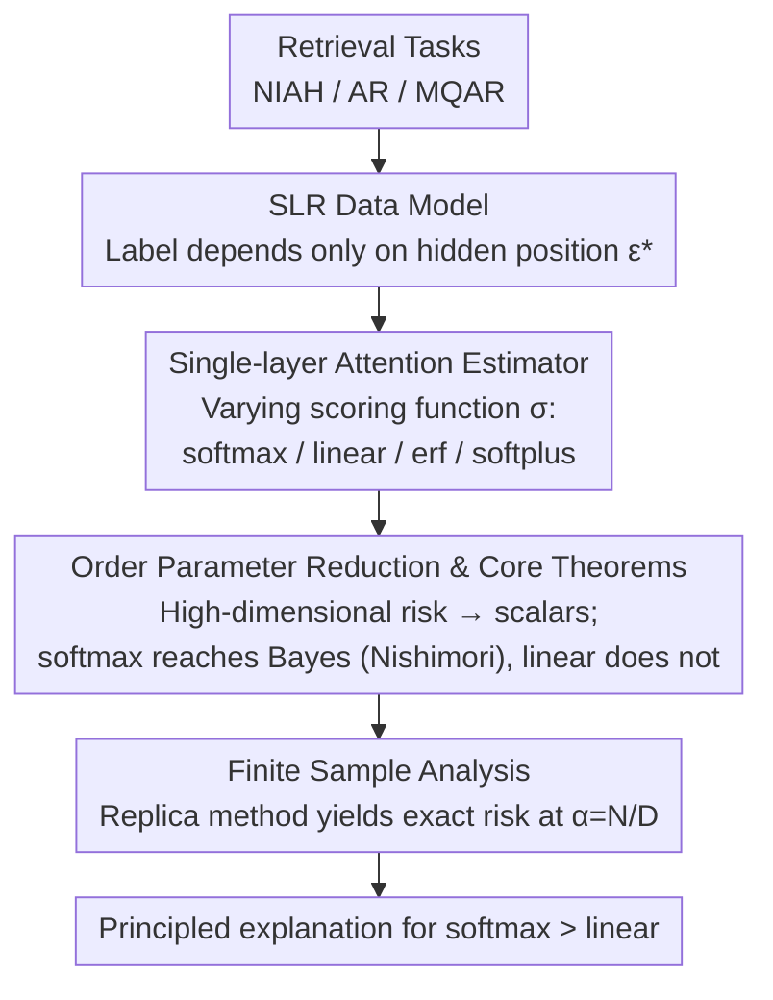

# Statistical Advantage of Softmax Attention: Insights from Single-Location Regression

**Conference**: ICLR2026  
**arXiv**: [2509.21936](https://arxiv.org/abs/2509.21936)  
**Code**: Provided (replication code included with the paper)  
**Area**: LLM/NLP  
**Keywords**: softmax attention, linear attention, information retrieval, statistical physics, high-dimensional analysis, Bayes optimality, single-location regression  

## TL;DR

By proposing the "Single-Location Regression" (SLR) theoretical framework and employing the order parameter method from statistical physics, this work rigorously proves that softmax attention reaches the Bayes risk at the population level in the high-dimensional limit, whereas linear attention fundamentally cannot. Furthermore, it confirms that softmax consistently outperforms linear attention in finite-sample scenarios, providing the first principled explanation for the superiority of softmax in retrieval tasks.

---

## Background & Motivation

**Practical Dominance of Softmax**: The core of current Large Language Models (LLMs) is the softmax attention in the Transformer architecture. However, the quadratic complexity of softmax has prompted numerous alternatives (linear attention, kernelized attention, SSMs, etc.).

**Shortcomings of Alternatives in Retrieval Tasks**: Large-scale experiments by Shen et al. (2024) show that while kernelized attention and SSMs (such as HGRN2) are comparable to softmax on language capability benchmarks, they systematically lag behind softmax attention in retrieval tasks (e.g., Needle-in-a-Haystack).

**Theoretical Gap**: Existing theoretical work often focuses on linear attention—which is easier to analyze (e.g., gradient descent interpretations of in-context learning)—leaving a lack of principled explanations for the advantages of softmax itself. Why are the **exponential nonlinearity** and **normalization** of softmax so critical?

**Over-study of Linear Attention**: A large body of theoretical literature (Ahn et al., 2023; von Oswald et al., 2023; Bai et al., 2023, etc.) treats linear attention as the primary object of analysis, implicitly assuming it can approximate softmax behavior. However, this assumption does not hold in retrieval scenarios.

**Formal Requirements for Retrieval Tasks**: Classic tasks such as Needle-in-a-Haystack, Associative Recall (AR), and Multi-Query AR (MQAR) lack a unified mathematical framework for theoretical analysis.

**Bridging the Gap Between Expressivity and Statistical/Computational Advantages**: While prior work (Arora et al., 2024) explained SSM deficiencies from an expressivity perspective, this study delves deeper into the **statistical** level (finite samples) and **computational** level (SGD convergence) to provide a more complete picture.

---

## Method

### Overall Architecture

This work addresses a long-standing question: Why does softmax attention consistently outperform linear attention in retrieval tasks? The authors abstract retrieval tasks into a strictly analyzable statistical model—"Single-Location Regression" (SLR): the label $y$ of a sequence $X \in \mathbb{R}^{L \times D}$ is determined solely by a token at a hidden position $\epsilon^*$. The model must first "retrieve" this position along the key direction $k^*$ and then read its information along the value direction $v^*$. Within this model, the authors unify various attention mechanisms as single-layer estimators by varying only the "scoring function $\sigma$", allowing for a direct comparison of softmax, linear, erf, and softplus. Using the order parameter method from statistical physics, they compress the high-dimensional risk into a function of several scalars in the high-dimensional limit ($D \to \infty$), rigorously proving who can reach Bayes optimality. Finally, the replica method is used to extend the analysis from "infinite-sample approximation capability" to "finite-sample ($\alpha = N/D$) statistical efficiency". The entire logical chain is tightly linked: **Modeling → Unified Estimator → Dimensionality Reduction & Theorems → Finite Samples**, ultimately providing a principled explanation for the advantage of softmax.

### Key Designs

**1. SLR Data Model: Mapping "Needle in a Haystack" to Analyzable Regression**

Retrieval tasks (NIAH, AR, MQAR) previously lacked a unified form for theoretical derivation. The authors capture their essence through single-location dependence, where the label:

$$y = \frac{1}{\sqrt{D}} X_{\epsilon^*} v^* + \Delta \xi$$

depends only on a single hidden position $\epsilon^*$ ($\xi$ is Gaussian noise, $\Delta$ controls noise intensity). Positional information is injected via a weighted Gaussian distribution $P(x \mid L, \epsilon^*, k^*) = g_\nu(\epsilon^*, \chi^*) \prod_\ell \mathcal{N}(x_\ell; 0, I_D)$, where $\chi = \tfrac{1}{\sqrt{D}}Xk^*$ is the projection of tokens in the key direction. The weight function $g_\nu$ is instantiated in two ways: **Spiked-SLR** uses $g_\nu=e^{\sqrt{\nu}\chi_\epsilon-\frac12\nu}$, creating a mean spike for the relevant token in the $k^*$ direction; **Max-SLR** uses $g_\nu=L\,e^{\nu\chi_\epsilon}/\sum_\ell e^{\nu\chi_\ell}$, making the relevant token the one with the largest inner product with $k^*$. $\nu$ represents signal strength; the larger it is, the more prominent the relevant position becomes. These variants cover "offset retrieval" and "argmax retrieval," grounding all subsequent conclusions in a clean, derivable toy model that captures the essence of retrieval.

**2. Single-Layer Attention Estimator: Decoupling Softmax Properties via Scoring Functions**

To understand the strength of softmax, it is crucial not to treat it as a black box, but to decouple its "exponential nonlinearity" and "global normalization." The authors unify the estimator as:

$$f_{\sigma, k, v}(X) = \sigma(\chi)^\top z, \quad \chi = \frac{1}{\sqrt{D}} X k, \quad z = \frac{1}{\sqrt{D}} X v,$$

where varying the scoring function $\sigma$ allows comparison of four attention types: Softmax ($\sigma(\chi)_\ell=e^{\chi_\ell}/\sum_{\ell'}e^{\chi_{\ell'}}$) possesses both properties; Linear ($\sigma(\chi)_\ell=1+\chi_\ell$) is its linearization at the origin (possessing neither); Element-wise erf ($\sigma(\chi)_\ell=1+\text{erf}(c+\chi_\ell)$) has nonlinearity but lacks normalization; Softplus kernelization ($\sigma(\chi)_\ell=\text{softplus}(\chi_\ell)/\sum_{\ell'}\text{softplus}(\chi_{\ell'})$) has normalization but grows slower than exponential. This controlled comparison allows the observed performance gaps to be precisely attributed to specific attributes.

**3. Order Parameter Reduction & Core Theorems: Proving Softmax Reaches the Bayes Lower Bound**

Directly analyzing high-dimensional vectors $k,v$ is infeasible. The authors utilize statistical physics to fully characterize the population risk as $D \to \infty$ using 7 order parameters: recovery parameters $m_{kk^*}=\tfrac1D k^\top k^*$ and $m_{vv^*}=\tfrac1D v^\top v^*$ measure alignment with hidden directions $k^*,v^*$; norm parameters $q_{kk}=\tfrac1D k^\top k$ and $q_{vv}=\tfrac1D v^\top v$ control scale; the remaining $m_{kv^*},m_{vk^*},q_{vk}$ are cross-terms. On the manifold $\mathcal{M}=\{(k,v): m_{kv^*}=m_{vk^*}=q_{vk}=0\}$, cross-terms vanish, and the risk reduces to a function of 4 scalars, making the optimization tractable. Two core theorems follow. Proposition 4.2 shows that if $g_\nu(\epsilon,\chi)/g_\nu(\epsilon',\chi)=e^{c_\nu(\chi_\epsilon-\chi_{\epsilon'})}$ (satisfied by both Spiked and Max SLR), softmax reaches the Bayes risk at $k=c_\nu k^*,\,v=v^*$, yielding $\min_{f}\mathcal{E}(y,f_{k,v}(X))=\mathcal{E}_{\text{Bayes}}$. This corresponds to the **Nishimori condition** in statistical physics, the structural reason why the exponential form of softmax is compatible with the Bayesian posterior. Corollary 4.3 quantifies the gap: in spiked-SLR as $\nu\to\infty$, linear attention error decays only polynomially as $\mathsf{E}_{\text{lin}}\sim\frac{L}{L-1}\cdot\frac1\nu$, while softmax decays exponentially as $\mathsf{E}_{\text{softmax}}=e^{-c_L\nu+o(\nu)}$. In max-SLR as $L\to\infty$, linear attention error tends to 1 (becoming a trivial predictor), while softmax remains at 0. Linear attention is not merely "worse by a constant factor" but is fundamentally incapable of reaching optimality.

**4. Finite Sample Analysis: Exact Risk at $\alpha=N/D$ via the Replica Method**

Population-level conclusions assume infinite samples, but practical interest lies in finite samples—this is a matter of "statistical efficiency." In the high-dimensional limit where $N,D\to\infty$ and $\alpha=N/D=\Theta(1)$, the authors use the replica method to derive the convergence of Empirical Risk Minimization (ERM) test risk to a deterministic value $\mathsf{E}_\sigma(\alpha)$ determined by self-consistent equations involving 6 order parameters. This advances the analysis to statistical efficiency at finite samples, providing prediction curves that align with numerical optimization and allowing for the precise comparison shown in Figure 3.

---

## Key Experimental Results

### Main Results: Population Risk Comparison (Figure 2)

| Activation Function | Spiked-SLR ($L=2$, $\nu=5$) | Max-SLR ($L=2$, $\nu \to \infty$) | Max-SLR ($L \sim \text{Unif}\{1,2,3\}$) |
|:---|:---|:---|:---|
| **Softmax** | $= \mathcal{E}_{\text{Bayes}}$ ✅ | $= 0$ ✅ | $= \mathcal{E}_{\text{Bayes}}$ ✅ |
| **Softplus Kernel** | Near Bayes | $> 0$, gap exists | Unaffected by variable length |
| **Element-wise erf** | Between linear and softmax | $> 0$, gap exists | **Severely affected by var-length** |
| **Linear** | Far from Bayes | $\to 1$ ($L \to \infty$) | **Severely affected by var-length** |

**Key Finding**: Only softmax achieves the Bayes risk across all settings. Normalization (softplus kernel) helps handle variable-length sequences, but kernels without exponential growth (softplus vs. exp) show widening gaps as $L$ increases.

### Finite Sample Experiments: Test Risk vs. Sample Complexity (Figure 3)

| Task | Signal $\nu$ | $L$ | Softmax ($\alpha=20$) | Linear ($\alpha=20$) | Bayes-optimal ($\alpha=20$) |
|:---|:---|:---|:---|:---|:---|
| Spiked-SLR | $\nu=1$ | 3 | $\approx 0.35$ | $\approx 0.55$ | $\approx 0.30$ |
| Spiked-SLR | $\nu=2$ | 3 | $\approx 0.15$ | $\approx 0.40$ | $\approx 0.10$ |
| Max-SLR | $\nu \to \infty$ | 3 | $\approx 0.20$ | $\approx 0.55$ | $\approx 0.15$ |

**Key Findings**:

1. **Softmax Consistently Outperforms Linear**: In all tested hyperparameter combinations, the test risk of softmax is lower than that of linear attention.
2. **Distance to Bayes-optimal**: Softmax is no longer Bayes-optimal under finite samples, but the gap narrows quickly as $\alpha$ increases.
3. **Alignment Between Theory and Experiment**: Predictions from the replica method (solid lines) highly align with actual optimization results using quasi-Newton methods (markers, $\sqrt{ND} = 10^4$), validating the accuracy of the theoretical framework.

### Ablation Study

**Impact of Variable Sequence Length** (Corollary 4.4):

| Setting | Linear Attention | Softmax Attention |
|:---|:---|:---|
| $L = 2$ (Fixed) | Baseline performance | $= \mathcal{E}_{\text{Bayes}}$ |
| $L \sim \text{Unif}\{1,2,3\}$ (Variable) | **Significant degradation** | $= \mathcal{E}_{\text{Bayes}}$ (Unaffected) |

**Impact of Signal Strength $\nu$**:

- Linear attention error decays at a polynomial rate $O(1/\nu)$.
- Softmax attention error decays at an exponential rate $e^{-c_L \nu}$.
- The gap widens **exponentially** as $\nu$ increases.

**Ablation of Activation Functions** (Summary from Figure 2):

- **Exponential nonlinearity** is essential: Softplus kernelization has normalization but grows too slowly, leading to a gap at large $L$.
- **Global normalization** is essential: Element-wise erf has nonlinearity but lacks normalization, leading to severe degradation with variable-length sequences.
- Both are necessary: Softmax is optimal because it **combines exponential growth and global normalization**.

---

## Highlights & Insights

1. **Theoretical Elegance**: By formalizing retrieval as an SLR model, the authors skillfully reduce complex softmax analysis to low-dimensional problems via order parameters, achieving the first tractable theoretical analysis of softmax.

2. **Multilevel Argumentation**: The study systematically demonstrates the advantages of softmax across population risk (approximation), finite-sample risk (statistical), and optimization feasibility (computational).

3. **Discovery of the Nishimori Condition**: It reveals the mechanism behind softmax reaching Bayes risk—its mathematical form coincides with the Nishimori condition in statistical physics, a profound structural insight.

4. **Decoupling Key Attributes**: By comparing four activation functions, it clearly decouples the individual contributions of "exponential nonlinearity" and "global normalization," providing operational guidance for understanding softmax.

5. **Finite-Sample Theory**: The analysis does not stop at the $N \to \infty$ limit; it characterizes the exact behavior at finite $\alpha = N/D$ using the replica method, bringing it closer to practice.

---

## Limitations & Future Work

1. **High Level of Simplification**: The SLR model only considers single-token dependence, single-head attention, lacks query vectors, and omits multi-layer stacking, leaving a gap with real Transformers.

2. **Gaussian Data Assumption**: All tokens follow Gaussian distributions, whereas real language data is far from Gaussian; the transferability of these conclusions requires verification.

3. **Manifold Assumption Not Rigorously Proven**: While numerical experiments support the validity of analysis on $\mathcal{M}$, rigorously proving that SGD converges to minima on this manifold remains an open question.

4. **Non-rigorous Replica Method**: The finite-sample analysis relies on the non-rigorous replica method. Although precedents for making it rigorous exist in related models (Vilucchio et al., 2025), it has not been completed here.

5. **Lack of Real-World Language Task Validation**: All experiments were conducted on synthetic data without validation on actual NLP tasks (e.g., NIAH, AR).

6. **Limited Sequence Length**: Experiments used small $L$ ($L=2, 3$). Whether the conclusions hold for very large $L$ (e.g., thousands of tokens) requires further investigation.

---

## Related Work & Insights

| Work | Focus | Difference from Ours |
|:---|:---|:---|
| Marion et al. (2025) | SLR with fixed sequence length | This work extends to variable length and introduces general $g_\nu$ weights |
| Arora et al. (2024) | SSM expressivity in MQAR | This work moves from expressivity to statistical and computational levels |
| Shen et al. (2024) | Experimental observation of softmax advantage | This work provides the theoretical explanation |
| Cui (2025); Troiani et al. (2025) | General theory of sequence multi-index models | This work focuses on the SLR special case to provide specific insights |
| Dohmatob (2025) | Softmax analysis at high signal strength | Parallel work focusing on different parameter regimes |
| Dragutinović et al. (2025) | Softmax > linear in in-context classification | Parallel work with different tasks and proof techniques |
| Barnfield et al. (2026) | High-dimensional analysis of sparse token classification | Parallel work analyzing progressive SGD training |

---

## Rating

- **Novelty**: ⭐⭐⭐⭐⭐ — First to rigorously establish the statistical advantage of softmax attention in retrieval from a physics perspective; the Nishimori condition link is especially novel.
- **Experimental Thoroughness**: ⭐⭐⭐⭐ — Synthetic experiments align perfectly with theory, but lacks validation on real language tasks.
- **Writing Quality**: ⭐⭐⭐⭐⭐ — Argumentation is clear across population, finite-sample, and computational layers; balances mathematical rigor with intuitive explanation.
- **Value**: ⭐⭐⭐⭐ — Provides a solid theoretical foundation for understanding Transformer architecture choices, though simplified assumptions limit direct utility.

<!-- RELATED:START -->

## Related Papers

- [\[ICLR 2026\] Spectral Attention Steering for Prompt Highlighting](spectral_attention_steering_for_prompt_highlighting.md)
- [\[ICLR 2026\] Eliciting Numerical Predictive Distributions of LLMs Without Auto-Regression](eliciting_numerical_predictive_distributions_of_llms_without_auto-regression.md)
- [\[ICML 2025\] Binary Hypothesis Testing for Softmax Models and Leverage Score Models](../../ICML2025/llm_nlp/binary_hypothesis_testing_for_softmax_models_and_leverage_score_models.md)
- [\[CVPR 2026\] Single-step Diffusion-based Video Coding with Semantic-Temporal Guidance](../../CVPR2026/llm_nlp/single-step_diffusion-based_video_coding_with_semantic-temporal_guidance.md)
- [\[ACL 2025\] Mitigate Position Bias in LLMs via Scaling a Single Hidden States Channel](../../ACL2025/llm_nlp/mitigate_position_bias_in_large_language_models_via_scaling_a_single_dimension.md)

<!-- RELATED:END -->
