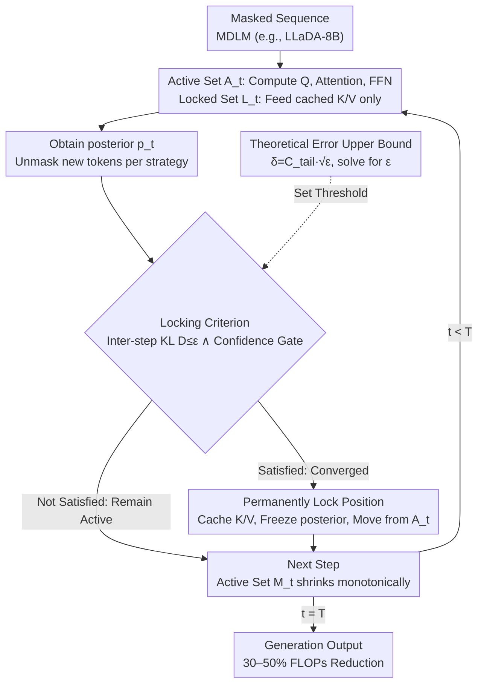

# Stopping Computation for Converged Tokens in Masked Diffusion-LM Decoding

**Conference**: ICLR 2026  
**arXiv**: [2602.06412](https://arxiv.org/abs/2602.06412)  
**Code**: [https://daioba.github.io/surelock](https://daioba.github.io/surelock)  
**Area**: LLM/NLP  
**Keywords**: Masked Diffusion LM, Inference Acceleration, Token Locking, KL Divergence, KV Cache

## TL;DR
The paper proposes SureLock, which permanently locks token positions in Masked Diffusion LMs once their posterior distributions stabilize (skipping Q projection and FFN, while caching KV). This reduces the per-step attention complexity from $O(N^2d)$ to $O(MNd)$, achieving a 30-50% reduction in FLOPs on LLaDA-8B without sacrificing generation quality.

## Background & Motivation

**Background**: Masked Diffusion LMs (MDLMs, such as LLaDA and Dream) generate text through iterative denoising. Each step requires recomputing attention and FFN for all $N$ token positions, leading to a computational complexity of $O(N^2d)$.

**Limitations of Prior Work**: Many tokens stabilize their posterior distributions quickly after being unmasked, yet standard samplers continue redundant computations for them, resulting in significant computational waste. Existing acceleration methods either reduce the number of steps (temporal) or reuse KV across steps (reuse), but they still emit $N$ query rows per step, leaving the spatial complexity unchanged.

**Key Challenge**: The bidirectional attention in MDLMs necessitates full computation at each step, even though many unmasked tokens have "converged" and do not require recomputation.

**Goal**: How to identify and permanently skip computation for converged tokens to achieve a monotonically decreasing computational load per step?

**Key Insight**: Monitor the KL divergence of each token position between adjacent steps and permanently lock positions that fall below a certain threshold.

**Core Idea**: Tokens with stable posteriors permanently exit the computation pipeline (locking KV and skipping Q/FFN), causing the active set to shrink monotonically as sampling progresses.

## Method

### Overall Architecture
The primary overhead in MDLM arises from bidirectional attention, which necessitates recomputing Q projections, attention, and FFN for all $N$ tokens at each iteration, resulting in $O(N^2d)$ complexity. However, many tokens reach posterior stability shortly after being unmasked. SureLock aims to permanently remove these "converged positions" from the computation flow. In each step, it maintains two sets: an active set $\mathcal{A}_t$, where positions undergo standard Q, attention, and FFN computation, and a locked set $\mathcal{L}_t$, where positions are skipped while retaining their previously cached $K$ and $V$. After computing posteriors and unmasking new tokens, a cost-effective convergence criterion (inter-step KL divergence, optionally combined with a confidence gate) identifies stable positions to be locked—caching their K/V, freezing their posterior, and moving them out of the active set. As sampling progresses, the active set shrinks monotonically, reducing the computational complexity from $O(N^2d)$ to $O(M_tNd)$ (where $M_t$ is the number of active positions). Since locked tokens can still be attended to by other tokens via the cache, information is preserved. The threshold $\varepsilon$ in the criterion is derived from a closed-form theorem mapping it to a terminal error upper bound, providing a formal budget for locking aggressiveness.

### Key Designs

**1. Permanent Locking + KV Caching: Removing Converged Positions from the Pipeline**

The design addresses the redundant computation performed by standard samplers on all unmasked tokens. Once a position $i$ is determined to have converged at step $t^*$, SureLock locks it—skipping its Q projection and FFN in all subsequent steps. The posterior is frozen at its value at the time of locking: $\hat{p}_t^{(i)} = p_{t^*}^{(i)}$. Locked positions are moved from the active set $\mathcal{A}_t$ to the locked set $\mathcal{L}_t$, where the active set is defined as $\mathcal{A}_t = \bar{\mathcal{M}}_t \setminus \mathcal{L}_t$ (unmasked but not yet locked). Locking does not mean disappearance; cached keys and values are fed back into the attention mechanism via $K^{\text{all}}[\mathcal{L}_t] \leftarrow \mathcal{C}.k[\mathcal{L}_t]$ (similarly for V), allowing active tokens to attend to these positions. This reduces the complexity of attention to $O(M_tNd)$ and FFN to $O(M_td^2)$. Unlike selective update methods like dLLM-Cache, which re-evaluate the active set at every step, SureLock's active set only decreases, making the computation reduction monotonic and predictable.

**2. Locking Criterion: Inter-step KL Divergence and Confidence Gating**

To implement "permanent removal," a cheap and reliable convergence signal is required. The primary criterion is the KL divergence between the posterior distributions of adjacent steps:

$$D_t^{(i)} \triangleq \text{KL}(p_t^{(i)} \| p_{t-1}^{(i)})$$

When this drops below a threshold $\varepsilon$, the position is marked as converged. Local KL is computationally inexpensive as posteriors are already computed. An **optional confidence gate** can be added as a safeguard: KL alone might occasionally misjudge a position that has low variation between steps but is still far from settling (flat posterior). The gate uses an uncertainty measure $u_t^{(i)} = 1 - \max_v p_t^{(i)}(v)$, accepting only positions within the top $m\%$ most confident active tokens ($u_t^{(i)} \leq q_m(u_t)$). The final locking rule is $D_{t^*}^{(i)} \leq \varepsilon \wedge u_{t^*}^{(i)} \leq q_m(u_{t^*})$; the method remains functional with only the KL criterion.

**3. Theoretical Error Upper Bound: Linking Local KL to Global Error**

This design justifies the use of a cheap local KL metric for permanent locking. Theorem 1 provides a closed-form bound:

$$\|\log p_T^{(i)} - \log \hat{p}_T^{(i)}\|_\infty \leq C_{\text{tail}}\sqrt{D_{t^*}^{(i)}}$$

where $C_{\text{tail}} = L_{\text{sm}} L / (1 - \sqrt{\rho})$ is determined by the operator norm constants of the model. It directly maps the locally computed $D_{t^*}^{(i)}$ at the moment of locking to the global deviation of the final token log-probability relative to a "no locking" baseline. This eliminates the need for trial-and-error thresholding; given a tolerable terminal error $\delta = C_{\text{tail}}\sqrt{\varepsilon}$, one can solve for $\varepsilon(\delta) = \delta^2 / C_{\text{tail}}^2$. The authors note that this bound is **intentionally conservative and design-oriented** rather than a precise predictor, and it relies on strong assumptions such as geometric tail contraction.

### Loss & Training
SureLock is a **training-free** inference-time method that does not modify model parameters. It is orthogonal to existing temporal (step reduction) and reuse (cross-step KV reuse) acceleration methods and can be combined with them.

## Key Experimental Results

### Main Results

**LLaDA-8B-Instruct (MT-Bench + WikiText-103)**:

| Configuration | FLOPs Reduction | Generation Quality |
|---------------|-----------------|--------------------|
| Baseline (No Locking) | 0% | Baseline |
| SureLock (ε=0.01) | ~30% | ≈ Baseline |
| SureLock (ε=0.05) | ~50% | ≈ Baseline |
| SureLock (ε=0.1) | ~50%+ | Slight Decrease |

### Ablation Study

| Configuration | FLOPs Savings | Quality | Description |
|---------------|---------------|---------|-------------|
| KL Criterion Only | Comparable to Full | ≈ | KL is sufficient as a standalone criterion |
| Confidence Gate Only | Less Savings | Maintained | Confidence alone is not aggressive enough |
| No KV Caching | Identical FLOPs | Significant Drop | Loss of information as locked tokens cannot be attended to |

### Key Findings
- The number of active positions $M_t$ **decreases monotonically** with the number of steps, validating the hypothesis that more tokens converge over time.
- A 30-50% reduction in FLOPs is achieved with **zero or negligible loss** in WikiText-103 perplexity and MT-Bench scores.
- The method is orthogonal to temporal and reuse methods and can be layered for cumulative gains.
- Although the theoretical bound is conservative, it provides clear guidance for hyperparameter ($\varepsilon$) selection.

## Highlights & Insights
- **Shift from "what to compute" to "what to permanently remove"**: This perspective shift is a key innovation. A shrinking-only active set makes the computation curve monotonic and more predictable than selective update methods.
- **Theory-Practice Loop**: The closed-form relationship between the KL threshold and terminal error bound provides a theoretical basis for hyperparameter selection, which is rare in systems acceleration work.
- **Complementary to d²Cache**: While d²Cache performs fine-grained selection of tokens to update at each step, SureLock permanently removes converged tokens—the two can be combined.

## Limitations & Future Work
- The geometric tail contraction assumption (A2) in Theorem 1 is strong and may not be strictly satisfied in practice.
- Permanent locking carries an irreversibility risk—if a token needs to change after locking due to shifts in other positions, it cannot recover.
- Verification was primarily conducted on LLaDA-8B; other MDLMs (e.g., Dream, original MDLM) remain untested.
- The locking threshold $\varepsilon$ still requires manual setting, as $C_{\text{tail}}$ is difficult to estimate precisely.

## Related Work & Insights
- **vs dLLM-Cache**: dLLM-Cache selectively updates tokens at each step (non-permanent), while SureLock permanently locks tokens, leading to greater long-term savings as the active set shrinks monotonically.
- **vs Fast-dLLM**: Fast-dLLM performs block-wise semi-autoregressive decoding, whereas SureLock operates at the token level, offering finer granularity and orthogonality.
- **vs AR KV Cache**: While AR KV caches naturally grow, SureLock’s KV cache simulates an "invariant cache" effect within bidirectional attention.

## Rating
- Novelty: ⭐⭐⭐⭐ The idea of permanently locking converged tokens is simple yet effective, supported by theoretical analysis.
- Experimental Thoroughness: ⭐⭐⭐ Limited model and task coverage.
- Writing Quality: ⭐⭐⭐⭐⭐ Clear motivation, precise algorithmic description, and complete theoretical derivation.
- Value: ⭐⭐⭐⭐ Provides a new orthogonal dimension for MDLM inference acceleration.

<!-- RELATED:START -->

## Related Papers

- [\[ICLR 2026\] Constrained Decoding of Diffusion LLMs with Context-Free Grammars](constrained_decoding_of_diffusion_llms_with_context-free_grammars.md)
- [\[ICLR 2026\] d²Cache: Accelerating Diffusion-Based LLMs via Dual Adaptive Caching](d2cache_accelerating_diffusion-based_llms_via_dual_adaptive_caching.md)
- [\[ACL 2026\] Masked by Consensus: Disentangling Privileged Knowledge in LLM Correctness](../../ACL2026/llm_nlp/masked_by_consensus_disentangling_privileged_knowledge_in_llm_correctness.md)
- [\[ICML 2026\] SPA-Cache: Singular Proxies for Adaptive Caching in Diffusion Language Models](../../ICML2026/llm_nlp/spa-cache_singular_proxies_for_adaptive_caching_in_diffusion_language_models.md)
- [\[ICLR 2026\] Toward Safer Diffusion Language Models: Discovery and Mitigation of Priming Vulnerabilities](toward_safer_diffusion_language_models_discovery_and_mitigation_of_priming_vulne.md)

<!-- RELATED:END -->
