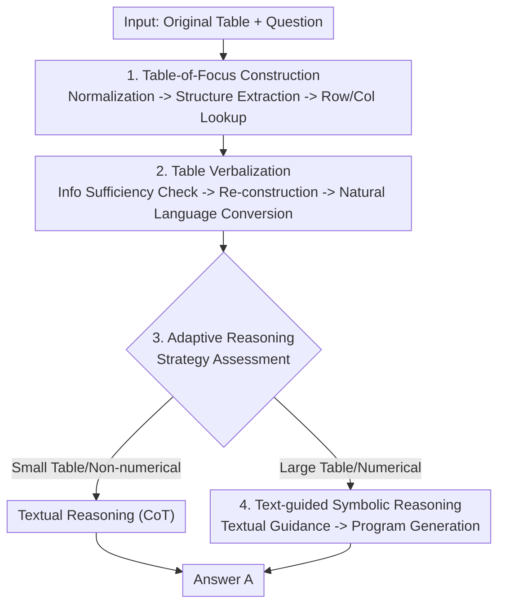

# TableMaster: A Recipe to Advance Table Understanding with Language Models

**Conference**: ICLR 2026  
**OpenReview**: [https://openreview.net/forum?id=YyPZPrPjQD](https://openreview.net/forum?id=YyPZPrPjQD)  
**Area**: NLP Understanding / Table Reasoning  
**Keywords**: Table Understanding, Table-of-Focus, Table Verbalization, Adaptive Reasoning, Symbolic Reasoning

## TL;DR
TableMaster systematically decomposes the "structural features" of tables into four categories of challenges. It then provides a "four-flavor recipe"—constructing a Table-of-Focus, verbalizing for semantic enrichment, adaptive switching between textual/symbolic reasoning, and text-guided symbolic reasoning—integrated into a training-free three-stage framework. This approach improves accuracy from 64.73% to 78.13% on WikiTQ using GPT-4o-mini.

## Background & Motivation
**Background**: When using language models (LMs) for Table QA or Table Fact-Checking, there are two mainstream training-free routes. One is "sub-table extraction"—methods like DATER and Chain-of-Table that crop a small table relevant to the question from the original table to shorten the context for the LM. The other is "programming"—methods like Binder and LEVER that enable LMs to generate SQL/Python to enhance numerical calculation and localization capabilities.

**Limitations of Prior Work**: These two routes each focus on only one aspect of table understanding, and the methods remain isolated from one another. There is a lack of work that thoroughly explains "why tables are difficult" and provides a systematic solution. Consequently, when switching to stronger base models (e.g., GPT-4o-mini), many older methods perform worse than they did with GPT-3.5-Turbo because they rely excessively on symbolic sub-table construction and fail to leverage the strengths of textual chain-of-thought reasoning.

**Key Challenge**: Tables are essentially 2D structured data, which naturally mismatches the linear text found in LM pre-training corpora. The authors categorize four features of tables—structured, intensive, concise, and numerical—mapping each to specific weaknesses that degrade LM performance, rather than simply stating that "tables are difficult."

**Goal**: To first quantify "where the difficulty lies" through experiments, then provide a targeted solution for each challenge, and finally integrate these solutions into a unified, training-free framework applicable to any advanced LM.

**Key Insight**: The authors observe that table difficulties are not monolithic but consist of four independent lesions caused by different features; thus, the solution must be a "combination punch" rather than a single-point optimization. The four challenges and solutions are mapped one-to-one: ① Data intensity $\rightarrow$ Difficulty in locating target data $\rightarrow$ Table-of-Focus construction; ② Semantic sparsity $\rightarrow$ Lack of table semantics $\rightarrow$ Table Verbalization; ③ Numerical density $\rightarrow$ Inaccurate textual reasoning $\rightarrow$ Symbolic reasoning; ④ Complex structure + Noise $\rightarrow$ "Semantic rigidity" in symbolic reasoning $\rightarrow$ Table normalization + Text-guided symbolic reasoning.

**Core Idea**: Decompose table understanding into three stages: "structural understanding $\rightarrow$ content understanding $\rightarrow$ reasoning." Targeted "remedies" are inserted into each stage, and an adaptive reasoner dynamically decides between textual or symbolic routes based on question characteristics.

## Method

### Overall Architecture
TableMaster is a training-free prompting framework. Given an original table $T$ and a question/statement $Q$, the goal is to predict an answer $A$ by learning $F(T, Q) = A$. The pipeline advances through three stages: first, contracting the large and noisy original table into a "Table-of-Focus" containing only relevant information; second, enriching the semantics of this sub-table and converting it into natural language; and finally, using an adaptive reasoner to determine whether to use textual or symbolic reasoning to generate the answer.

To improve efficiency, the framework employs a "table peek" trick: many structural analysis operations do not require reading the full table. Taking a peek table $T_{k\times n}$ of the first $k$ rows is often sufficient, preserving all columns while significantly shortening the context.

### Key Designs

**1. Table-of-Focus Construction: Directing LM Attention to Relevant Data**

This addresses the pain point of "data intensity $\rightarrow$ difficulty in locating target data." As tables grow larger, LM accuracy decreases (quantified by rows, columns, area, and token count, all showing a consistent decline), and models become prone to long-context hallucinations or ignoring middle-section information. The solution is to explicitly crop a sub-table containing only relevant information. First, the "wild table" $T_W$ is normalized by determining if it is row-major or column-major; if column-major, it is transposed ($T = \text{Transpose}(T')$), and all numerical columns are cleaned to unify date/number formats, resulting in $T_N$. Next, the header $H$ and key columns (acting as unique row identifiers) are extracted. Then, the LM performs Column Lookup ($C_0 = \text{Column Lookup}(T_N \mid Q)$), ranking candidate columns by relevance ($C = \text{Rank}(H)$) before selecting $b$ columns, and Row Lookup ($R = \text{Row Lookup}(T_N \mid Q)$), where the LM generates a SQL query to efficiently filter relevant rows. Finally, the initial Table-of-Focus $T^F_{a\times b} = \text{Table Construction}(T_N, C_0, R)$ is assembled.

**2. Table Verbalization: Mapping Concise Cells to Semantic-Rich Natural Language**

This addresses "semantic sparsity $\rightarrow$ lack of table semantics." Table cells are often isolated words or phrases, and descriptive information is often scattered in structures like headers. Understanding a single cell in isolation is difficult, which differs from the semantic-rich text LMs encounter during pre-training. The solution is to convert the table into a sequential natural language description $T^T = \text{Verbalization}(T^F_{a\times b})$, similar to table2text, bringing the data closer to the LM's pre-training distribution. Before verbalization, an information sufficiency check and reconstruction are performed: the LM assesses if $T^F_{a\times b}$ is sufficient to answer $Q$. If not, columns are incrementally added from the ranked candidates until information is sufficient or candidates are exhausted.

**3. Adaptive Reasoning: Dynamic Path Selection Based on Question Characteristics**

This addresses the fact that textual and symbolic reasoning each have distinct fatal flaws. Pure textual reasoning is strong on non-computational questions (72.4%) but drops by 20.1% when calculation is required; conversely, basic symbolic reasoning performs worse overall. Instead of a fixed route, a strategy assessment $S = \text{Strategy Assessment}(T^F, T^T, Q)$ is performed, where $S \in \{\mathcal{T}, \mathcal{S}\}$. The rules are intuitive: small tables or non-numerical questions use textual reasoning (CoT); large tables or numerical questions use symbolic reasoning (program execution). This is the component whose removal caused the largest performance drop—removing textual reasoning decreased WikiTQ performance by 4.28%.

**4. Text-guided Symbolic Reasoning: Thinking Before Coding**

This addresses "complex structure + noise $\rightarrow$ semantic rigidity in symbolic reasoning." When generating programs, LMs often fail to truly understand the context and instead apply memorized code templates. They collapse when encountering noisy tables (symbolic reasoning drops 31.8% under noise, worse than the 20.5% drop in textual reasoning). The solution is two-fold: first, the previously mentioned table normalization allows for batch processing; second, before generating the program, the LM performs textual reasoning to produce "guidance" $G$ (without the final answer). This $G$ is then fed into the symbolic reasoning module to write the program:
$$A = \begin{cases} \text{Chain-of-Thought}(T^F, T^T, Q), & S = \mathcal{T} \\ P(\text{Program-of-Thought}(T^F, T^T, Q \mid G)), & S = \mathcal{S} \end{cases}$$
where $P$ is a Python/SQL executor. This step, similar to "plan-and-solve," allows the model to "think thoroughly before reasoning."

## Key Experimental Results

### Main Results
Three datasets: WikiTQ (Table QA), TabFact (Fact Verification), and FetaQA (Free-form QA); WikiTQ/TabFact use Exact Match (EM) accuracy. TableMaster leads across three base models (GPT-3.5-Turbo, GPT-4o-mini, Llama-3.1-70B).

| Dataset | Base Model | TableMaster | Prev. SOTA | Gain |
| :--- | :--- | :--- | :--- | :--- |
| WikiTQ | GPT-3.5-Turbo | 68.21 | 64.70 (TabSQLify) | +3.51 |
| WikiTQ | GPT-4o-mini | 78.13 | 64.73 (PoTable) | +13.40 |
| WikiTQ | Llama-3.1-70B | 77.95 | 65.56 (PoTable) | +12.39 |
| TabFact | GPT-3.5-Turbo | 83.65 | 81.92 (Tree-of-Table) | +1.73 |
| TabFact | GPT-4o-mini | 90.12 | 88.93 (PoTable) | +1.19 |
| TabFact | Llama-3.1-70B | 91.16 | 87.06 (PoTable) | +4.10 |

Notably, methods like Binder, Dater, TabSQLify, and Chain-of-Table perform poorly on GPT-4o-mini (sometimes worse than on GPT-3.5-Turbo) because they rely heavily on symbolic sub-table construction and do not leverage textual chain-of-thought strengths.

### Ablation Study
Removing components sequentially on WikiTQ / TabFact (GPT-4o-mini, Full Model 78.13 / 90.12):

| Configuration | WikiTQ | Drop | Description |
| :--- | :--- | :--- | :--- |
| Full model | 78.13 | – | Complete framework |
| w/o Structure Extraction | 74.75 | −3.38 | Removing extraction leads to chain errors |
| w/o Row Lookup | 76.59 | −1.54 | Row lookup is more critical than column lookup |
| w/o Column Lookup | 77.00 | −1.13 | Column lookup has a smaller contribution |
| w/o Table-of-Focus | 76.40 | −1.73 | Without cropping the focusing sub-table |
| w/o Re-Construction | 75.55 | −2.58 | Without info completion |
| w/o Verbalization | 75.78 | −2.35 | Without semantic enrichment |
| w/o Textual Reasoning | 73.85 | −4.28 | Most significant drop |
| w/o Symbolic Reasoning | 76.10 | −2.03 | Without program-based reasoning |
| w/o Textual Guidance | 75.21 | −2.92 | Symbolic reasoning loses textual guidance |

### Key Findings
- **Reasoning stage is most critical**: Removing textual reasoning or textual guidance leads to drops of 4.28% and 2.92% on WikiTQ, respectively, proving that adaptive reasoning and "plan-then-code" are the core benefits.
- **Structure extraction is the foundation**: Removing it causes a 3.38% drop because errors in structural understanding propagate to lookup and construction.
- **Row Lookup > Column Lookup**: Row lookup is more important as large tables typically have far more rows than columns, making row localization harder and more vital.
- **Verbalization benefits complex tasks more**: It helps more on WikiTQ than on TabFact, suggesting semantic enrichment is more valuable for QA requiring deep understanding.

## Highlights & Insights
- **Turning "why tables are hard" into quantifiable diagnostics**: The one-to-one mapping between four features, four challenges, and four solutions is supported by controlled experiments. This "diagnosis before prescription" narrative is highly persuasive.
- **Adaptive reasoning is a cost-effective scheduler**: Without training, just by adding a strategy assessment prompt, the framework combines the semantic strengths of textual reasoning with the computational strengths of symbolic reasoning.
- **Text-guided symbolic reasoning is portable**: The "think clearly in natural language before implementing code" (plan-then-code) paradigm is applicable beyond tables to any scenario involving LMs writing code (mathematics, data analysis agents).
- **Practical normalization details**: Row/column major detection, transposition, and numerical cleaning are essential for handling "wild" tables; the paper explicitly includes these instead of assuming clean input.

## Limitations & Future Work
- **Heavy framework with multiple calls**: Structure extraction, lookups, sufficiency checks, verbalization, strategy assessment, and program generation require multiple LM calls, resulting in high latency and token costs.
- **Heavy reliance on LM self-evaluation**: Sufficiency checks and strategy assessments assume the LM can judge if information is adequate or which path to take. On weaker models, these judgments themselves may be inaccurate, causing error accumulation.
- **Verification limited to specific families**: Evaluation is focused on OpenAI models and Llama on relatively clean benchmarks; robustness on massive tables, multi-table joins, or highly noisy real-world tables remains to be tested.

## Related Work & Insights
- **vs. Dater / Chain-of-Table (Sub-table Extraction)**: These also crop tables but only solve the "localization" challenge. TableMaster layers verbalization and adaptive reasoning on top of the sub-table.
- **vs. Binder / LEVER / PoTable (Programming)**: These rely heavily on programs and become rigid when semantic flexibility is needed. TableMaster compensates for symbolic rigidity with textual guidance and adaptive switching.
- **vs. MIX-SC**: While both combine textual and symbolic routes, MIX-SC uses self-consistency voting to merge results, whereas TableMaster uses strategy assessment for explicit path selection, which is more targeted and call-efficient.

## Rating
- Novelty: ⭐⭐⭐⭐ While individual components draw from existing work, the systematic diagnostic integration of "four features $\rightarrow$ four challenges $\rightarrow$ four solutions" is a significant contribution.
- Experimental Thoroughness: ⭐⭐⭐⭐⭐ 3 datasets $\times$ 3 base models + 10 ablation groups + extensive diagnostic experiments provide a complete chain of evidence.
- Writing Quality: ⭐⭐⭐⭐⭐ The "diagnosis before prescription" narrative is clear, with diagrams well-integrated with the text.
- Value: ⭐⭐⭐⭐ Training-free and compatible with any advanced LM; a +13.4% gain on GPT-4o-mini is highly practical.

<!-- RELATED:START -->

## Related Papers

- [\[ACL 2025\] TableLoRA: Low-rank Adaptation on Table Structure Understanding for Large Language Models](../../ACL2025/llm_nlp/table_lora_structure_understanding.md)
- [\[ICLR 2026\] Transducing Language Models](transducing_language_models.md)
- [\[ICLR 2026\] Teaching Metric Distance to Discrete Autoregressive Language Models](teaching_metric_distance_to_discrete_autoregressive_language_models.md)
- [\[ICLR 2026\] The Lattice Representation Hypothesis of Large Language Models](the_lattice_representation_hypothesis_of_large_language_models.md)
- [\[ICLR 2026\] Massive Editing for Large Language Models Based on Dynamic Weight Generation](massive_editing_for_large_language_models_based_on_dynamic_weight_generation.md)

<!-- RELATED:END -->
