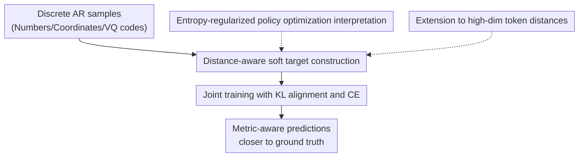

# Teaching Metric Distance to Discrete Autoregressive Language Models

**Conference**: ICLR 2026  
**OpenReview**: [https://openreview.net/forum?id=s0zLtkY7iu](https://openreview.net/forum?id=s0zLtkY7iu)  
**Code**: No public code found  
**Area**: LLM / NLP  
**Keywords**: distance-aware supervision, discrete autoregressive models, soft target distribution, metric space, DIST2Loss  

## TL;DR

This paper proposes DIST2Loss, which transforms metric distances between tokens—such as numerical values, coordinates, angles, and VQ codes—into distance-weighted soft target distributions. This allows discrete autoregressive language models to learn structural priors that "near misses are better than far misses" while maintaining the next-token training format, improving data efficiency and downstream performance in visual grounding, robotic manipulation, reward modeling, and image generation.

## Background & Motivation

**Background**: The fundamental training paradigm of Large Language Models (LLMs) is typically autoregressive prediction over discrete tokens. Given preceding tokens, the model outputs a categorical distribution over the vocabulary, which is then compressed onto the ground-truth token using cross-entropy. While originally designed for natural language, this paradigm has been transferred to tasks like vision, robotics, reward modeling, and image generation: bounding box coordinates can be written as numerical tokens, robotic arm actions as position/angle tokens, and images as sequences of discrete codes via VQ tokenizers.

**Limitations of Prior Work**: Standard one-hot supervision is too coarse once the output tokens possess numerical or geometric meaning. For instance, if the ground-truth x-coordinate is 500, predicting 499 and 102 are treated as equally "incorrect" by cross-entropy. The training signal only informs the model which token is correct, failing to convey which tokens are closer or more acceptable, thereby wasting the metric structure inherent in the task.

**Key Challenge**: The output interface of discrete autoregressive models is a categorical distribution, yet the label space for many downstream tasks is actually a metric space with distances. Directly modifying the model architecture would break the universal training stack of LLM/VLMs; meanwhile, using RL or sequence-level rewards requires sampling, rollouts, and high-variance estimation. The challenge is to incorporate inter-token distances as learnable supervision signals without changing the model, adding extra labels, or performing complex RL.

**Goal**: The paper decomposes the problem into three layers. First, define distance functions for subsets of tokens with metric meaning (e.g., squared distance for digits, Euclidean distance for coordinates, MSE or cosine distance for VQ embeddings). Second, convert these distances into a normalizable soft target distribution where tokens closer to the ground truth receive higher probability. Third, use a KL divergence loss—compatible with standard AR model training—to pull the model output toward this distance-aware distribution.

**Key Insight**: The authors observe that many "discrete outputs" are not truly unstructured categories but are results of discretizing continuous or ordered spaces via tokenizers. Since tokens near the ground truth are more reasonable, the target can be shifted from one-hot to an exponentially decaying distribution centered at the ground truth. This effectively re-injects the local geometric prior of regression problems back into categorical training.

**Core Idea**: Construct reward-weighted soft targets using predefined token distances and train discrete autoregressive models with KL divergence. This serves as a plug-and-play loss to replace one-hot supervision on metric outputs.

## Method

### Overall Architecture

The input to DIST2Loss remains standard autoregressive training samples: context tokens, target tokens, and the logits output by the model at each position. The difference lies in first identifying which positions in the sequence belong to the metric token subset $V_d$, then generating a soft target distribution $p_d$ for each target token using the task-defined distance function $d$. Finally, KL divergence is used to align the model's probability distribution with this distance-aware target, while original cross-entropy is retained to maintain exact token matching.

The core contributions in this diagram correspond to the four key designs below. The first two designs cover the actual training pipeline: deriving soft targets from metrics and performing KL alignment. The latter two designs explain why this loss acts as a sample-free version of RL and how it extends to high-dimensional discrete vocabularies like VQ codebooks.

### Key Designs

**1. Soft Target Construction: Explicitly modeling "near misses"**

Standard cross-entropy assigns zero probability to all candidates except the ground-truth token. While reasonable for natural language, this is unsuitable for coordinates, scores, angles, or quantized embeddings. DIST2Loss selects a metric-significant vocabulary subset $V_d$ and compares candidate tokens $v$ with the ground-truth component $x_t$ for each target position $t$. Smaller distances result in higher probabilities in the target distribution, which decays exponentially with distance.

The core formula is:

$$
p_d(v \mid x,t)=\frac{\exp(-d(v,x,t)/\tau)}{\sum_{v'\in V_d}\exp(-d(v',x,t)/\tau)}.
$$

Here, $\tau$ controls the smoothness. A small $\tau$ concentrates probability near the ground truth (approaching one-hot), while a large $\tau$ distributes probability to more neighbors. For numerical tokens, the paper uses squared Euclidean distance with $\tau=1$ by default, which is equivalent to a discretized unit-variance Gaussian. Thus, the model learns not just that "5 is correct," but that "4 and 6 are more reasonable than 1 and 9."

**2. KL Alignment & CE Joint Training: Modifying signals without changing architecture**

DIST2Loss does not require the model to output continuous values, nor does it alter the Transformer or tokenizer. The model still outputs $p_\theta(v\mid s_{<t})$ over the entire vocabulary, but at metric-relevant positions, the distribution is additionally pulled toward $p_d$. The distance loss is defined using KL divergence:

$$
L_{dist}=\sum_{t=1}^{n}\sum_{v\in V_d}p_d(v\mid x,t)\log\frac{p_d(v\mid x,t)}{p_\theta(v\mid s_{<t})}.
$$

The final training objective is $L=L_{CE}+\alpha L_{dist}$, with $\alpha=0.1$ fixed in experiments. This combination is crucial: $L_{CE}$ ensures the model places the highest probability on the exact ground-truth token, while $L_{dist}$ provides an ordered learning signal to all neighboring tokens. Compared to a "vocab baseline" that only performs one-hot CE over $V_d$, DIST2Loss is more informative because it conveys the relative proximity between numbers, coordinates, or codebook embeddings.

**3. Mechanism (Entropy-Regularized Policy Optimization): Closed-form soft policy vs. high-variance RL**

The authors view candidate tokens as actions and negative distances as rewards: the closer to ground truth, the higher the reward. The goal of entropy-regularized policy optimization is to maximize expected reward plus an entropy term: $\mathbb{E}_{a\sim\pi}[R(a)]+\tau H(\pi)$. This problem has a closed-form optimal solution $\pi^*(a)\propto\exp(R(a)/\tau)$. Setting $R(a)=-d(a,x,t)$ yields exactly the distance-weighted target distribution used in DIST2Loss.

This interpretation clarifies the positioning of DIST2Loss: it retains the core mechanism of reward alignment without needing online sampling, rollouts, or policy gradients. As long as the reward for each token can be calculated independently from a known metric, training simplifies to stable supervised learning. This also defines the boundaries: DIST2Loss is not naturally applicable if tokens lack interpretable distances or if rewards depend on global sequence combinations.

**4. High-Dimensional Token Distance Extension: Geometric supervision for VQ codebooks**

Distance-aware targets are not limited to 1D numbers. For VQ tokens in image generation, each code in the vocabulary corresponds to a high-dimensional embedding. Similarity can be measured by embedding space distance. The paper uses MSE distance between VQ token embeddings and also discusses a general cosine distance form $d(v(x),v(y))=1-\frac{v(x)\cdot v(y)}{\|v(x)\|\|v(y)\|}$.

This extends DIST2Loss from "numerical label smoothing" to a general discrete representation learning objective. Image experiments show that replacing a center VQ token with its neighbors preserves semantics, whereas distant tokens cause semantic drift. Therefore, assigning probability to semantic neighbors in the codebook during AR image generator training conveys the intended visual semantics better than one-hot labels.

### Main Mechanism Example

Consider a multimodal model outputting a bounding box for a referring expression, where the answer consists of four integer coordinate tokens, e.g., $(120, 340, 500, 780)$. In standard SFT, for the first coordinate, only token `120` is positive; `119`, `121`, and `400` are all negatives. The supervision penalty for predicting `121` versus `400` fails to reflect geometric differences.

With DIST2Loss, a distribution is constructed centered at `120`. Using squared error as the distance function, $d$ for `119` and `121` is very small, granting them high soft probabilities. `100` receives lower probability, and `400` receives almost none. During training, the model's output distribution is encouraged to form a "local peak" around the ground truth rather than a flat distribution over all non-truth tokens. This explains the observed improvement in "hard-case IoU": even when the model misses the IoU $\ge 0.5$ threshold, its predicted boxes are closer to the ground truth.

### Loss & Training

During training, DIST2Loss is only applied to tokens with metric properties; standard text tokens are supervised by standard CE. The paper notes that when multiple structured elements appear in the same sequence, their respective distance losses are summed. For multi-token structures, the authors use position-wise decomposition rather than enumerating all candidate sequences to avoid exponential growth in length.

Hyperparameters are conservative. The loss weight $\alpha$ is fixed at $0.1$ across main experiments without per-task tuning. The temperature is $\tau=1$ for digits, while for VQ codebooks, $\tau$ is determined via entropy matching (reporting $\tau\approx 9.7$ for a $K=16,384$ codebook). This setup makes the method a plug-and-play objective rather than a task-specific trick requiring heavy tuning.

The authors also discuss credit assignment for multi-token structures. If a ground-truth structure requires multiple tokens, individual distances are hard to attribute to specific positions. The main experiments focus on scenarios where token-level rewards decompose naturally (integers, coordinates, angles). The appendix provides contrastive target augmentation and place-value weighting as compromise solutions.

## Key Experimental Results

### Main Results

The paper validates the approach across five task types: toy linear regression, visual grounding, robotic manipulation, generative reward modeling, and VQ image generation. The versatility is shown by gains not just in vision, but also in LLM reward modeling and image token generation.

| Task | Backbone / Setting | Main Metric | SFT Baseline | DIST2Loss | Conclusion |
|------|--------------------|-------------|--------------|-----------|------------|
| Visual grounding | Phi3V (RefCOCO fine-tuned) | RefCOCO test-A accuracy | 93.5 | 94.5 | Better localization with coord distance |
| Visual grounding | Phi3V (RefCOCO+ test-B) | accuracy | 78.7 | 81.4 | +2.7 points on more difficult split |
| Robotic manipulation | LLaRA / VIMABench L2 (1K data) | accuracy | 46.2 | 51.5 | Significant gain in low-data action learning |
| Reward modeling | Llama-3.1-8B / RewardBench | average accuracy | 75.3 | 85.3 | High utility for scoring tokens |
| Image generation | LlamaGen-111M / ImageNet (50ep) | FID ↓ / IS ↑ | 10.03 / 116.37 | 9.41 / 127.44 | VQ neighbor supervision improves early training |
| Image generation | LlamaGen-343M / ImageNet (300ep) | FID ↓ / IS ↑ | 3.08 / 256.07 | 3.04 / 258.19 | Small gains sustained in large models |

In visual grounding, DIST2Loss outperforms Phi3V-sft across RefCOCO/+/g splits. The "vocab baseline" shows inconsistent results, proving that "emphasizing the number vocabulary" is not equivalent to "learning geometric distance." Robotics experiments show a similar trend, especially with 1K samples (L2 score 46.2 -> 51.5), suggesting metric priors are highly valuable in low-data regimes.

Reward modeling is a noteworthy cross-domain validation. The model generates overall scores (0-20) and sub-scores (0-4). Score tokens are naturally ordered; DIST2Loss informs the model that 19 is closer to 20 than 8 is. Llama-dist reached 85.3% on RewardBench, 10.0 points higher than Llama-sft, with significant improvements in Chat Hard, Safety, and Reasoning.

### Ablation Study

| Configuration | MAE ↓ | RMSE ↓ | Description |
|---------------|-------|--------|-------------|
| Llama-dist | 0.092 | 0.124 | Best performance on meta linear regression |
| - Place value weighting | 0.098 | 0.137 | Weakened error attribution for multi-digit numbers |
| - Contrastive loss | 0.099 | 0.139 | Worse structural learning without neighbor negatives |
| - Distance-aware target | 0.099 | 0.142 | Uniform label smoothing degrades significantly |
| Llama-sft | 0.113 | 0.154 | One-hot CE only; weakest low-data generalization |

| Checkpoint | Setting | Result | Interpretation |
|------------|---------|--------|----------------|
| Loss weight $\alpha$ | reward modeling sweep | 85.3 acc at $\alpha=0.1$ | Balanced. Too large hurts exact matching |
| Random metric | Replace Euclidean with Random | 76.0 vs SFT 75.3 | Non-semantic distances offer little gain |
| Catastrophic forgetting | Reward model on MMLU | 43.9 vs SFT 42.8 | No damage to general LLM capability |
| Visual generalization | RealWorldQA after grounding | 54.3 vs 54.4 | Standard vision capabilities preserved |
| Hard-case IoU | Error samples (RefCOCO testA)| 40.3 vs SFT 31.0 | Incorrect boxes are geometrically closer |

### Key Findings

- Improvement stems from "distance semantics," not vocabulary constraints. The vocab baseline was unstable and random metrics failed, proving that meaningful inter-token distances are the driver.
- Greater gains in low-data scenarios. Toy regression and VIMABench 1K show that metric priors provide crucial inductive bias when samples are scarce. As data increases, SFT eventually learns some structure, but the gap remains.
- Transferability across output spaces. Coordinates, action angles, score digits, and VQ embeddings are diverse, but all fit the same $p_d$ construction and KL training framework.
- Clear limitations: It is unsuitable for non-metric vocabularies or tasks requiring non-decomposable sequence-level rewards. It is a closed-form supervised alternative to RL when metric rewards are known.

## Highlights & Insights

- The approach elegantly converts "regression-style distance" into a categorical soft target without changing the LLM output head to a continuous one. This preserves autoregressive interfaces, tokenizers, and teacher-forcing infrastructures with low engineering overhead.
- It addresses a specific flaw in one-hot CE: not all token categories should be treated as mutually exclusive, unordered labels. For coordinates and numbers, one-hot supervision discards the task's most important geometric information.
- The RL interpretation is enlightening. DIST2Loss can be viewed as directly defining an entropy-regularized optimal policy for known token rewards and distilling it via supervised KL. This explains why RL methods (PPO/DPO) are unnecessary when rewards are analytically computable.
- High-dimensional VQ token experiments expand the scope. In multimodal generation, codebook embedding geometry can guide the model to favor semantically similar codes over unrelated ones if the exact code is missed.
- Natural fit for LLM reward modeling. Since scores are inherently ordered, DIST2Loss provides a much more reasonable supervision signal than treating scores as arbitrary text tokens.

## Limitations & Future Work

- Dependent on the semantic correctness of the predefined metric. Random metric experiments show that incorrect metrics provide no gain or may even mislead the model. Defining distances for natural language or subjective preference categories is non-trivial.
- Sequence-level credit assignment remains largely unaddressed. While coordinates and scores decompose position-wise, complex structures with global constraints (where quality depends on token combinations) are not yet fully captured.
- Although $\alpha=0.1$ is robust, the optimal balance between CE and distance loss likely varies between high-precision coordinate prediction and semantic code generation.
- Broad scope but limited depth per domain. For example, image generation was only tested in LlamaGen/VQ settings. Future work could explore complex manipulation, time-series forecasting, or medical value prediction.
- A promising future direction is learning the metric itself. Currently, distances are fixed; calibrating distances from data or learning non-Euclidean distances from human preferences could extend this to more weakly structured outputs.

## Related Work & Insights

- **vs Standard SFT / Cross-Entropy**: SFT treats tokens as unordered categories. DIST2Loss adds neighborhood structure without changing the AR interface. It is simpler and more stable but relies on metric availability.
- **vs Label Smoothing**: Standard smoothing applies uniform probability to all non-truth classes. DIST2Loss applies non-uniform probability based on distance, providing directed smoothing.
- **vs RLHF / Policy Optimization**: RL handles complex rewards but requires sampling and high-variance optimization. DIST2Loss targets known token-level rewards using a closed-form optimal policy for stable, cheaper training.
- **vs Knowledge Distillation**: KD uses a teacher's distribution as a soft label. DIST2Loss requires no teacher and no extra inference; soft labels are derived from the ground-truth geometric structure.
- **vs Ordinal Classification Loss**: Often designed for fixed label spaces, DIST2Loss brings these ideas to the universal LLM vocabulary and AR training.

## Rating

- Novelty: ⭐⭐⭐⭐☆ Systematically integrating distance-aware soft targets into discrete AR LLM/VLM training; simple but addresses a significant blind spot in one-hot supervision.
- Experimental Thoroughness: ⭐⭐⭐⭐☆ Covers vision, robotics, reward modeling, and image generation. However, some areas lack large-scale or multi-seed statistical validation.
- Writing Quality: ⭐⭐⭐⭐☆ Clear narrative with helpful RL interpretations; some implementation details for the various tasks require appendix reading to fully replicate.
- Value: ⭐⭐⭐⭐⭐ A low-intrusion, highly transferable objective with direct utility for any task involving tokenized continuous or ordered data.

<!-- RELATED:START -->

## Related Papers

- [\[ACL 2025\] Language-Codec: Bridging Discrete Codec Representations and Speech Language Models](../../ACL2025/llm_nlp/language_codec_bridging_discrete_codec_speech_language_models.md)
- [\[ACL 2025\] Comparing Linguistic Acceptability Judgments of Autoregressive Language Models](../../ACL2025/llm_nlp/comparing_linguistic_acceptability_judgments_of_autoregressive_language_models.md)
- [\[ACL 2025\] Analyzing and Mitigating Inconsistency in Discrete Speech Tokens for Neural Codec Language Models](../../ACL2025/llm_nlp/analyzing_and_mitigating_inconsistency_in_discrete_speech_tokens_for_neural_code.md)
- [\[ACL 2025\] Detecting Referring Expressions in Visually Grounded Dialogue with Autoregressive Language Models](../../ACL2025/llm_nlp/detecting_referring_expressions_in_visually_grounded_dialogue_with_autoregressiv.md)
- [\[ICML 2025\] Generalized Interpolating Discrete Diffusion](../../ICML2025/llm_nlp/generalized_interpolating_discrete_diffusion.md)

<!-- RELATED:END -->
## Related Papers

- [\[ACL 2025\] Comparing Linguistic Acceptability Judgments of Autoregressive Language Models](../../ACL2025/llm_nlp/comparing_linguistic_acceptability_judgments_of_autoregressive_language_models.md)
- [\[ACL 2025\] Language-Codec: Bridging Discrete Codec Representations and Speech Language Models](../../ACL2025/llm_nlp/language_codec_bridging_discrete_codec_speech_language_models.md)
- [\[ACL 2025\] Analyzing and Mitigating Inconsistency in Discrete Speech Tokens for Neural Codec Language Models](../../ACL2025/llm_nlp/analyzing_and_mitigating_inconsistency_in_discrete_speech_tokens_for_neural_code.md)
- [\[ACL 2025\] Detecting Referring Expressions in Visually Grounded Dialogue with Autoregressive Language Models](../../ACL2025/llm_nlp/detecting_referring_expressions_in_visually_grounded_dialogue_with_autoregressiv.md)
- [\[ICML 2025\] Generalized Interpolating Discrete Diffusion](../../ICML2025/llm_nlp/generalized_interpolating_discrete_diffusion.md)

<!-- RELATED:END -->
