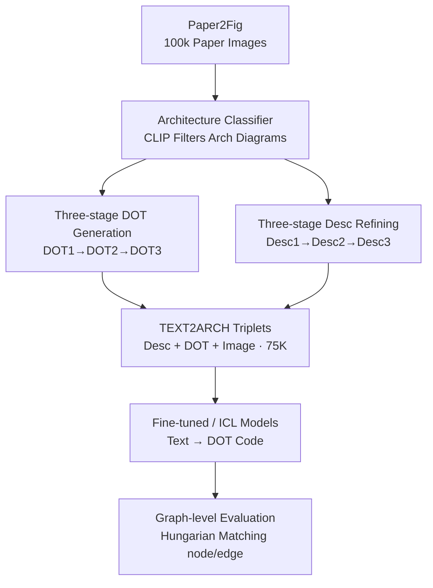

# TEXT2ARCH: A Dataset for Generating Scientific Architecture Diagrams from Natural Language Descriptions

**Conference**: ICLR 2026  
**OpenReview**: [https://openreview.net/forum?id=dHWtOTiceO](https://openreview.net/forum?id=dHWtOTiceO)  
**Code**: https://github.com/shivank21/text2arch (Including models and dataset)  
**Area**: NLP Understanding / Code Generation / Multimodal  
**Keywords**: Text-to-Diagram, Architecture Diagrams, DOT Code, Dataset Construction, Graph-level Evaluation Metrics

## TL;DR
This paper proposes TEXT2ARCH—a large-scale dataset containing 75,000 "architecture image + clean text description + DOT code" triplets. It formalizes the under-explored task of "text description → scientific architecture diagram" as "text → intermediate DOT code → compilation into image." A series of 7B–8B small models are fine-tuned on this data, significantly outperforming DiagramAgent and matching GPT-4o's in-context learning performance.

## Background & Motivation
**Background**: Converting text to diagrams currently follows two main paths. One involves text-to-image/diffusion models (e.g., Stable Diffusion), which excel at natural scenes. The other is "text → intermediate diagram description language (TikZ / DOT) → compiler rendering," typically used for simple charts. Recent work like DiagramAgent uses a multi-agent framework to support generation and editing across eight diagram types.

**Limitations of Prior Work**: Diffusion models are nearly unusable for "structured architecture diagrams"—their input context window is short (the CLIP text encoder only accepts 77 tokens), making them unable to understand long descriptions or express explicit logical structures. They often generate garbled text, erroneous connections, and are almost impossible to fine-tune for editing. While the code-based route is editable, existing methods struggle with complex diagrams that are "semantically rich and hierarchically clear." Fundamentally, **this field lacks a clean, large-scale, open-access dataset**—existing datasets like ACL-Fig and Paper2Fig contain mixed diagram types, inconsistent annotations, and lack text descriptions strictly aligned with "architecture diagrams." Without data, effective open-source models cannot be built.

**Key Challenge**: Architecture diagram generation requires strict semantic alignment, structural coherence, and fine-grained precision (which nodes, which directed edges), which differs from the "visual similarity" goal of natural image generation. The lack of clean "text ↔ code ↔ image" aligned corpora makes both training and rigorous evaluation impossible.

**Goal**: To establish "text → scientific architecture diagram" as a new task and provide three missing pieces: (1) a clean, large-scale dataset; (2) a suite of deployable open-source models; (3) an evaluation system that truly measures "structural fidelity."

**Key Insight**: Instead of directly generating pixel images, the model generates intermediate DOT code (composed of labeled nodes + directed edges), which is then rendered by a standard DOT compiler. This preserves structure and editability while transforming the task into "structured code generation," an area where language models excel.

**Core Idea**: Utilize a multi-step automated annotation pipeline to **filter architecture diagrams, synthesize high-quality DOT code, and refine clean descriptions** from the massive Paper2Fig collection. This creates the TEXT2ARCH triplet dataset for fine-tuning small models. Additionally, since the final evaluation targets DOT code rather than pixels, graph-level matching metrics are designed to quantify structural fidelity.

## Method

### Overall Architecture
The core of TEXT2ARCH is the "clean triplet data construction" rather than a specific new network architecture. The workflow is divided into two phases: **The front-end data construction pipeline** (processing 100k images from Paper2Fig into aligned triplets of "Description Desc3 + DOT code DOT3 + Image") and **the back-end modeling and evaluation** (fine-tuned / ICL small models mapping text to DOT code, evaluated via text and graph-level metrics).

The data construction pipeline consists of three serial steps: first, a classifier is trained to separate architecture diagrams from non-architecture diagrams in Paper2Fig. Second, for each diagram, a three-stage process ("GPT extraction → detection+OCR reconstruction → GPT fusion refinement") synthesizes DOT code (DOT1 → DOT2 → DOT3). Third, a three-stage process ("original paragraph + TF-IDF retrieval + GPT rewriting") produces clean descriptions (Desc1 → Desc2 → Desc3). Both refinement paths follow the logic of "start with a coarse version, correct with structural info, and fuse using GPT."

### Key Designs

**1. Architecture vs. Non-architecture Classifier: Filtering the noise**
The data source is Paper2Fig, which includes many non-architecture diagrams (plots, tables, flowcharts). The authors define "architecture diagrams" as visualizations of systems/models/processes, including neural networks, software systems (microservices, databases, APIs), or research flows. A training set was constructed from: 103 neural networks + 105 architecture diagrams as positives from ACL-Fig; 6,482 positives from SciFig; and 2,004 manually labeled images from Paper2Fig (1,239 pos, 765 neg). Models like CLIP, ViT, BEiT, and ResNet were tested. CLIP achieved the best results with 83.45% accuracy and 0.92 recall (high recall being preferred to avoid missing architecture diagrams), and an F1 of 0.87. Inference on Paper2Fig yielded ~80,000 candidate architecture diagrams.

**2. Three-stage DOT Generation: Correcting structure with detection-based reconstruction**
Since manual annotation for 80,000 images is unfeasible, a complementary synthesis pipeline was designed. **DOT1** uses GPT-4o to extract DOT code directly—good for semantics, but weak in spatial reasoning, often resulting in messy connections (Edge F1 only 31.2). **DOT2** uses a vision-only approach: a Faster-RCNN-based detector identifies nodes/arrows/text boxes, Florence-2 OCR reads node text, and edges are assigned based on detected arrow directions to the nearest nodes (preventing self-loops by choosing the second nearest if necessary). While node-text alignment is good, connectivity is poor (Edge F1 8.3). **DOT3** feeds DOT2 and the original image back to GPT-4o for fusion: using DOT2's structural anchors while leveraging GPT's generative power for semantic completion. DOT3 significantly outperforms DOT1/DOT2 (Node F1 74.5, Edge F1 51.7) and serves as the ground truth.

**3. Three-stage Description Refining: Aggregating scattered information**
A "clean, semantically complete" text description is required. **Desc1** is the original text from Paper2Fig where the figure was first cited. **Desc2** uses retrieval augmentation: relevant paragraphs containing "Figure/Fig." are extracted from the PDF, and TOP-3 paragraphs are selected via TF-IDF cosine similarity between OCR labels + caption. **Desc3** feeds these TOP-3 paragraphs and the image to GPT for a comprehensive rewrite. GPT-based evaluation shows Desc3 is preferred over 90% of the time. The final subset contains 75,127 samples (60,519 train / 7,565 val / 7,043 test), with an average of 15.24 nodes and 13.89 edges per diagram.

**4. Graph-level Evaluation Metrics: Measuring structure over text similarity**
Since models output DOT code to be compiled, visual pixel similarity is less relevant than structural fidelity. In addition to standard NLG metrics (ROUGE-L, CodeBLEU), graph-level metrics were designed: restore the predicted and ground truth DOT into graph structures, use the Hungarian algorithm for optimal node matching based on label similarity, and calculate Node Precision/Recall/F1. Node PR-AUC measures robustness across similarity thresholds. Based on matched nodes, Edge Precision/Recall, Edge PR-AUC, and Edge Jaccard similarity are calculated.

## Key Experimental Results

### Main Results
DiagramAgent, Zero-shot GPT-4o, and few-shot ICL/fine-tuned versions of three small models were compared. Fine-tuned DeepSeek-7B performed best overall.

| Set | Method | ROUGE-L | CodeBLEU | Node F1 | Edge F1 |
|------|------|---------|----------|---------|---------|
| Test Set | DiagramAgent | 42.2 | 31.0 | 55.1 | 24.8 |
| Test Set | GPT-4o Zero-shot | 30.8 | 17.7 | 60.7 | 44.6 |
| Test Set | Llama-3-8B (ICL) | 34.9 | 21.5 | 59.7 | 32.5 |
| Test Set | **DeepSeek-7B (FT)** | **46.8** | **34.5** | **65.7** | 38.0 |
| Human Set | DiagramAgent | 49.1 | 40.9 | 54.3 | 25.3 |
| Human Set | GPT-4o Zero-shot | 28.2 | 16.3 | 63.0 | 46.2 |
| Human Set | **DeepSeek-7B (FT)** | **55.2** | **49.3** | **69.4** | **49.1** |

Fine-tuning significantly outperforms few-shot ICL and GPT. On the human-annotated set, fine-tuned DeepSeek-7B's ROUGE-L (55.2) and CodeBLEU (49.3) far exceed ICL results. GPT-4o shows high precision in some areas but falls behind the fine-tuned model in comprehensive metrics.

### Ablation Study
Effectiveness of the three-stage DOT generation (measured on the Human Set relative to DOT3):

| DOT Variant | Source | Node F1 | Edge F1 | Jaccard |
|----------|------|---------|---------|---------|
| DOT1 | Direct GPT Extraction | 67.5 | 31.2 | 22.9 |
| DOT2 | Detection + OCR | 54.6 | 8.3 | 5.1 |
| **DOT3** | DOT2 + Image → GPT Fusion | **74.5** | **51.7** | **41.2** |

### Key Findings
- **DOT3 fusion strategy is critical for quality**: While DOT1 has decent semantics and DOT2 has good node alignment, DOT3 fusion increases Edge F1 to 51.7.
- **Fine-tuning > Few-shot ICL**: Fine-tuned DeepSeek-7B leads consistently, demonstrating the value of domain-specific data fine-tuning for structured code generation.
- **GPT-4o subjective evaluation aligns with metrics**: In GPT-based scoring (0-5), DeepSeek-7B (2.68) and GPT-4o (2.72) both exceed DiagramAgent and other models.
- **Desc3 preferred >90%**: RAG-based rewriting significantly improves description quality over original single-paragraph sources.

## Highlights & Insights
- **Diagramming as Code**: By using DOT intermediate representation, the work avoids the pitfalls of diffusion models (short context, lack of logic, non-editability) while allowing expert refinement.
- **Complementary Synthesis Paradigm**: The workflow of "Weak model draft → Structural correction via alternative modality → Strong model fusion" is a transferable pattern for data synthesis tasks.
- **Structural Metrics**: Using the Hungarian algorithm to match nodes before evaluating edges provides a more meaningful evaluation for structured output than text similarity.
- **Small Model Potency**: A 7B model can match or exceed GPT-4o on specific tasks given high-quality data and fine-tuning.

## Limitations & Future Work
- **Synthetic Ground Truth**: DOT3 and Desc3 are GPT-refined, potentially inheriting systemic biases; the manually annotated set is limited (99 images).
- **No Pixel-level Evaluation**: While DOT accuracy is measured, the visual layout (overlapping nodes, readability) is not explicitly evaluated.
- **Geometric Heuristic Fragility**: The "nearest neighbor" edge heuristic in DOT2 can fail on dense/complex diagrams.
- **Graph Scope**: The task is limited to directed graphs with labeled nodes, excluding complex layouts like swimlanes or specific grouping boxes.

## Related Work & Insights
- **vs. DiagramAgent**: DiagramAgent yields TikZ and uses a multi-agent framework across many types. Our work focuses specifically on scientific architecture diagrams with a single end-to-end model and stricter triplet alignment, outperforming it on this subset.
- **vs. Diffusion Models**: Diffusion models lack the context window and structural precision required for architecture diagrams. Our "Text → DOT → Image" pipeline ensures editability.
- **vs. Existing Datasets (ACL-Fig, SciCap)**: These are often noisy or lack standardized code labels. TEXT2ARCH provides a cleaner, specifically architecture-focused corpus.

## Rating
- Novelty: ⭐⭐⭐⭐ Establishes a new task with a complete system; DOT representation and graph metrics are significant contributions.
- Experimental Thoroughness: ⭐⭐⭐⭐ Covers ICL/FT, dual metrics, human evaluation, and comprehensive ablations.
- Writing Quality: ⭐⭐⭐⭐ Pipeline and metrics are clearly explained.
- Value: ⭐⭐⭐⭐ The 75K dataset and metrics fill a significant gap in automated technical visualization.

<!-- RELATED:START -->

## Related Papers

- [\[ICLR 2026\] VERIFY: A Novel Multi-Domain Dataset Grounding LTL in Contextual Natural Language via Provable Intermediate Logic](verify_a_novel_multi-domain_dataset_grounding_ltl_in_contextual_natural_language.md)
- [\[ACL 2025\] QualiSpeech: A Speech Quality Assessment Dataset with Natural Language Reasoning](../../ACL2025/llm_nlp/qualispeech_a_speech_quality_assessment_dataset_with_natural_language_reasoning_.md)
- [\[ICLR 2026\] Evaluating Text Creativity across Diverse Domains: A Dataset and Large Language Model Evaluator](evaluating_text_creativity_across_diverse_domains_a_dataset_and_large_language_m.md)
- [\[ACL 2026\] Identifying the Periodicity of Information in Natural Language](../../ACL2026/llm_nlp/identifying_the_periodicity_of_information_in_natural_language.md)
- [\[ACL 2026\] LinkNav: Surfacing Interconnected Information in Scientific Articles](../../ACL2026/llm_nlp/linknav_surfacing_interconnected_information_in_scientific_articles.md)

<!-- RELATED:END -->
## Related Papers

- [\[ICLR 2026\] VERIFY: A Novel Multi-Domain Dataset Grounding LTL in Contextual Natural Language via Provable Intermediate Logic](verify_a_novel_multi-domain_dataset_grounding_ltl_in_contextual_natural_language.md)
- [\[ACL 2025\] QualiSpeech: A Speech Quality Assessment Dataset with Natural Language Reasoning](../../ACL2025/llm_nlp/qualispeech_a_speech_quality_assessment_dataset_with_natural_language_reasoning_.md)
- [\[ICLR 2026\] Evaluating Text Creativity across Diverse Domains: A Dataset and Large Language Model Evaluator](evaluating_text_creativity_across_diverse_domains_a_dataset_and_large_language_m.md)
- [\[ACL 2026\] Identifying the Periodicity of Information in Natural Language](../../ACL2026/llm_nlp/identifying_the_periodicity_of_information_in_natural_language.md)
- [\[ACL 2026\] Repeated Sequences Reveal Gaps between Large Language Models and Natural Language](../../ACL2026/llm_nlp/repeated_sequences_reveal_gaps_between_large_language_models_and_natural_languag.md)

<!-- RELATED:END -->
