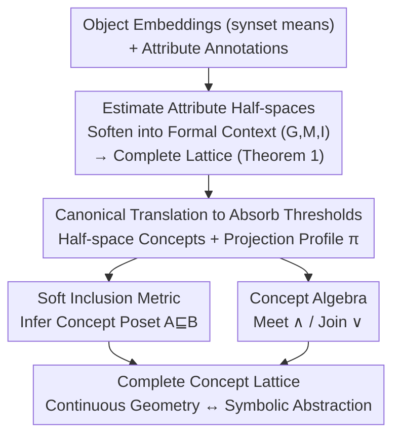

# The Lattice Representation Hypothesis of Large Language Models

**Conference**: ICLR2026  
**arXiv**: [2603.01227](https://arxiv.org/abs/2603.01227)  
**Authors**: Bo Xiong (Stanford University)  
**Area**: LLM/NLP (Representation Learning / Interpretability)  
**Keywords**: Linear Representation Hypothesis, Formal Concept Analysis, Concept Lattice, Half-space Model, Embedding Geometry, Symbolic Reasoning  

## TL;DR

Ours proposes the **Lattice Representation Hypothesis (LRH)** for LLMs: by unifying the Linear Representation Hypothesis (LRH) with Formal Concept Analysis (FCA), it proves that attribute directions in LLM embedding spaces implicitly encode a **concept lattice** through intersections of half-spaces, thereby bridging continuous geometry with symbolic abstraction.

---

## Background & Motivation

**The Mystery of Conceptual Knowledge in LLMs**: While LLMs excel at capturing conceptual knowledge and performing logical reasoning, a systematic theoretical explanation is still lacking regarding how these symbolic conceptual hierarchies are encoded within continuous geometric embedding spaces.

**Limitations of the Linear Representation Hypothesis**: The existing Linear Representation Hypothesis (LRH) posits that semantic features are encoded as linear directions. However, it primarily focuses on the linear separability of binary concepts and lacks explanatory power for **compositional semantics** (e.g., concept inclusion, intersection, and union).

**Deficiencies of the Extensional Perspective**: Park et al. (2025) modeled concepts as sets of tokens (extensional perspective), such as $Y(\text{animal}) = \{\text{predator}, \text{bird}, \text{dog}, \ldots\}$, but ignored the **intensional properties** (attributes and relations defining a concept), making it difficult to explain set-theoretic semantics like concept subsumption, intersection, and union.

**Inspirations from Formal Concept Analysis (FCA)**: FCA defines concepts through binary object-attribute relations, where each concept is an (extension, intension) pair. This dual perspective naturally induces a concept lattice structure.

**Needs for AI Safety and Controllability**: Understanding the hidden geometric structures of LLMs is crucial for reliably controlling and guiding model reasoning behavior, serving as a foundational step for advancing AI safety.

**Theoretical Unification Gap**: A systematic theoretical bridge between the Linear Representation Hypothesis and Formal Concept Analysis in symbolic AI has been missing. This work fills that gap.

---

## Method

### Overall Architecture

The core problem addressed in this paper is: where does the LLM hide the hierarchical structure of concepts (subsumption, intersection, and union) within continuous embedding geometry? The answer is a construction pipeline from embeddings to concept lattices. First, each attribute $m$ is viewed as a linear boundary in the embedding space—an attribute direction $\bar{\ell}_m$ plus a threshold $\tau_m$ defining a half-space; whether an object embedding $\mathbf{v}_g$ falls on a specific side determines its possession of that attribute. Attribute directions and thresholds are statistically estimated from annotated object sets and then softened into differentiable associations to derive an FCA formal context $(G, M, I)$. Subsequently, a global translation absorbs all thresholds, making all half-spaces pass through the origin. Thus, a "concept" is mapped to a geometric region formed by the "intersection of multiple half-spaces," accompanied by a continuous projection profile as its "fingerprint." Finally, soft inclusion metrics (to infer partial orders) and concept algebra (Meet/Join for combinations) are defined over these profiles. The entire pipeline recovers a **complete concept lattice** under the extensional inclusion order, connecting continuous geometry with symbolic abstraction.

### Key Designs

**1. Estimating attribute half-spaces and softening into formal contexts: Converting statistically estimated linear boundaries into differentiable "object-attribute" associations**

To extract an FCA formal context from embeddings, the first step is to obtain the geometric boundary for each attribute. Attribute directions are estimated using regularized Fisher Discriminant Analysis, $\bar{\ell}_m := (\Sigma_+ + \Sigma_- + \lambda I)^{-1}(\bm{\mu}_+ - \bm{\mu}_-)$, with covariance stabilized via Ledoit-Wolf shrinkage. Thresholds are set as the midpoint of the projected means of positive and negative objects: $\tau_m := \frac{1}{2}(\mathbb{E}_{g \in G_+}[\text{Proj}_m(\mathbf{v}_g)] + \mathbb{E}_{g \in G_-}[\text{Proj}_m(\mathbf{v}_g)])$. Object embeddings are taken as the mean embeddings of WordNet synsets to mitigate word-level lexical noise. Once directions and thresholds are obtained, while a hard criterion $\mathbf{v}_g \cdot \bar{\ell}_m \geq \tau_m$ could define the relationship, it is non-differentiable and noise-sensitive. Therefore, the association is softened as:

$$P_\alpha(m(g) = 1) := \sigma\!\left(\alpha \cdot (\mathbf{v}_g \cdot \bar{\ell}_m - \tau_m)\right),$$

where $\sigma$ is the sigmoid function and $\alpha > 0$ controls the sharpness of the boundary. Given a confidence level $\delta$, truncating the probability into a binary relation $I_\delta := \{(\mathbf{v}_g, \bar{\ell}_m) \mid P_\alpha(m(g) = 1) \geq \delta\}$ yields a deterministic formal context $(G, M, I_\delta)$. This step is critical: Theorem 1 guarantees that the resulting set of formal concepts $\mathcal{F}_\delta$ satisfies the closure property of Galois connections and forms a **complete lattice** under extensional inclusion—providing the geometric foundation for the "Lattice Representation Hypothesis."

**2. Canonical translation and half-space concepts: Zeroing thresholds via global translation to map symbolic concepts to geometric regions passing through the origin**

Different attributes have different thresholds $\tau_m$, scattering boundaries throughout the space and complicating intersection and algebraic operations. Proposition 1 provides a solution: by arranging attribute directions into a matrix $D$ and thresholds into a vector $\bm{\tau}$, if a point $\mathbf{c} \in \mathbb{R}^d$ exists such that $D\mathbf{c} = \bm{\tau}$ (true when attribute directions are linearly independent), then translating all embeddings $\mathbf{v}_g \mapsto \mathbf{v}_g - \mathbf{c}$ eliminates the thresholds without altering the induced lattice: $\sigma(\alpha(\mathbf{v}_g \cdot \mathbf{d}_i - \tau_i)) = \sigma(\alpha((\mathbf{v}_g - \mathbf{c}) \cdot \mathbf{d}_i))$. After translation, each attribute corresponds to a **half-space passing through the origin**. A concept defined by an attribute set $Y \subseteq M$ is then the intersection of these half-spaces:

$$\mathcal{R}(Y) := \{\mathbf{v} \in \mathbb{R}^d \mid \mathbf{v} \cdot \mathbf{d}_m \geq 0,\ \forall m \in Y\},$$

which geometrically represents a convex polyhedral cone—the concept's extensional region. To characterize the concept's intension and soften hard regions for noise tolerance, each concept $C$ is assigned a projection profile $\pi_C(m) := \frac{1}{n} \sum_{i=1}^{n} \mathbf{v}_i \cdot \mathbf{d}_m$, representing the mean projection of all object embeddings in the concept onto attribute direction $m$. This serves as a continuous generalization of discrete FCA intension; all profile vectors are $\ell_2$ normalized to ensure comparability between concepts.

**3. Soft Inclusion Metric: Inferring partial orders directly from projection profiles without ground-truth hierarchies**

With profiles, judging concept subsumption $A \sqsubseteq B$ ($A$ is a specific case of $B$) does not require querying a real hierarchy. Instead, it involves checking if the profile of $A$ satisfies the attributes emphasized by $B$:

$$\text{Inclusion}(A \sqsubseteq B) = \frac{\sum_{m \in M} \phi(\pi_B(m)) \cdot \sigma(\pi_A(m))}{\sum_{m \in M} \phi(\pi_B(m))},\quad \phi(x) = \log(1 + e^x).$$

Here, the softplus function $\phi$ assigns higher weights to more significant attributes in $B$, while weak or inactive attributes are smoothly suppressed. $\sigma(\pi_A(m))$ interprets the projection of $A$ on that attribute as the "soft likelihood of $A$ satisfying the attribute." Inclusion is thus modeled as a continuous, geometrically-driven profile compatibility rather than strict set inclusion, allowing poset relationships to be inferred without access to the ground-truth hierarchy.

**4. Concept Algebra: Defining Meet and Join on embedding regions to transform compositional reasoning into geometric operations**

Concept combinations are computed directly within the half-space model. The Meet operation $A \wedge B := \mathcal{R}(Y_A \cup Y_B)$ represents the narrower region satisfying all attributes of both (geometrically the intersection of two sets of half-spaces). The Join operation $A \vee B := \mathcal{R}(Y_A) \cup \mathcal{R}(Y_B)$ represents the smallest region covering both, approximated by the conic hull of their attribute directions. On continuous profiles, these are implemented using fuzzy logic t-norms/co-norms: $\pi_{A \wedge B}(m) = \min\{\pi_A(m), \pi_B(m)\}$ and $\pi_{A \vee B}(m) = \max\{\pi_A(m), \pi_B(m)\}$. Consequently, compositional reasoning (e.g., $dog \vee wolf$ yielding a hypernym, $horse \wedge zebra$ yielding a refined intersection) becomes an algebraic operation directly executable on embeddings.

---

## Key Experimental Results

### Experimental Setup

- **Datasets**: 5 domain datasets constructed from WordNet hierarchies (WN-Animal, WN-Plant, WN-Food, WN-Event, WN-Cognition). The first three are physical domains; the latter two are abstract.
- **Attribute Annotation**: GPT-4o was used to generate attribute schemas and annotate binary attribute matrices as ground truth.
- **Models**: LLaMA3.1-8B, Gemma-7B, Mistral-7B.
- **Baselines**: Random, Mean (Centroid embeddings).

### Main Results Table 1: Formal Context Recovery (Half-space Model Validation)

| Model | Method | WN-Animal F1 | WN-Plant F1 | WN-Food F1 | WN-Event F1 | WN-Cognition F1 |
|------|------|:---:|:---:|:---:|:---:|:---:|
| LLaMA3.1-8B | Random | 45.3 | 47.3 | 46.4 | 48.6 | 50.1 |
| LLaMA3.1-8B | Mean | 63.7 | 63.3 | 68.1 | 63.9 | 68.4 |
| LLaMA3.1-8B | **Linear** | **82.5** | **82.4** | **80.1** | **71.5** | **75.0** |
| Gemma-7B | Random | 45.3 | 47.3 | 46.3 | 47.8 | 50.1 |
| Gemma-7B | Mean | 50.1 | 51.3 | 51.2 | 52.2 | 56.3 |
| Gemma-7B | **Linear** | **83.2** | **83.2** | **80.0** | **71.4** | **75.4** |
| Mistral-7B | Random | 45.0 | 47.5 | 45.5 | 49.0 | 49.3 |
| Mistral-7B | Mean | 62.0 | 61.4 | 62.1 | 56.5 | 63.3 |
| Mistral-7B | **Linear** | **81.8** | **81.7** | **78.2** | **69.7** | **74.1** |

**Findings**: The Linear method significantly outperforms baselines across all models and domains, achieving F1 > 78% in physical domains and > 69% in abstract domains, validating the half-space model.

### Main Results Table 2: Poset Inference (Lattice Geometry Validation)

| Model | Method | WN-Animal F1 | WN-Plant F1 | WN-Food F1 | WN-Event F1 | WN-Cognition F1 |
|------|------|:---:|:---:|:---:|:---:|:---:|
| LLaMA3.1-8B | Random | 47.3 | 47.6 | 33.3 | 50.2 | 49.8 |
| LLaMA3.1-8B | Mean | 66.7 | 63.8 | 55.7 | 59.1 | 56.8 |
| LLaMA3.1-8B | **Linear** | **77.1** | **70.4** | **75.4** | **68.3** | **69.6** |
| Gemma-7B | Random | 50.6 | 49.5 | 39.1 | 49.9 | 49.5 |
| Gemma-7B | Mean | 63.4 | 60.9 | 50.6 | 55.6 | 53.4 |
| Gemma-7B | **Linear** | **75.1** | **71.4** | **75.6** | **65.6** | **66.4** |
| Mistral-7B | Random | 49.3 | 48.2 | 33.3 | 49.2 | 48.8 |
| Mistral-7B | Mean | 64.9 | 60.5 | 54.8 | 55.0 | 52.6 |
| Mistral-7B | **Linear** | **72.1** | **57.1** | **62.0** | **61.8** | **61.1** |

**Findings**: The soft inclusion metric based on projection profiles can infer concept subsumption directly from embedding geometry without accessing the ground-truth hierarchy.

### Ablation Study

- **Qualitative Validation of Concept Algebra (Table 3)**: Join operations reliably return hypernyms (e.g., $dog \vee wolf \to predator/canine/mammal$), while Meet operations produce refined intersections (e.g., $horse \wedge zebra \to pony/stallion/foal$), aligning with WordNet.
- **Physical vs. Abstract Domains**: Physical domains (Animal, Plant, Food) consistently outperform abstract ones (Event, Cognition) because physical concepts rely on concrete perceptual attributes, whereas abstract concepts depend on complex contextual attributes.
- **Model Scaling Effects (LLaMA-3, 3B→70B)**: Increasing scale has limited impact on physical domains (small models already encode perceptual attributes well) but significant impact on abstract domains, suggesting larger models allocate more capacity to abstract conceptual structures.
- **Attribute Correlation Analysis**: PCA visualization shows that attribute directions naturally organize into semantic clusters (e.g., "herbivorous" is close to "eating plants"), validating semantic coherence.

---

## Highlights & Insights

1. **Elegant Theoretical Unification**: This work is the first to formally unify the Linear Representation Hypothesis and Formal Concept Analysis through half-space intersections, providing a new mathematical framework for understanding LLM conceptual encoding.
2. **Bridge from Continuous to Symbolic**: It proves that symbolic concept lattice structures can naturally emerge from continuous embedding geometry without explicit symbolic systems.
3. **Actionable Concept Algebra**: By defining Meet/Join operations directly on the embedding space, compositional reasoning becomes possible within the geometry.
4. **Comprehensive Experimental Verification**: The hypothesis is validated progressively through half-space verification, poset inference, and concept algebra, combining quantitative and qualitative analysis.
5. **Value for AI Safety**: Understanding the geometric encoding of concepts facilitates more reliable control and guidance of LLM reasoning pathways.

---

## Limitations & Future Work

1. **Dependence on GPT-4o for Attribute Labels**: Ground-truth contexts were generated by GPT-4o, which may introduce annotation bias.
2. **Validation Limited to WordNet Sub-hierarchies**: Experiments were restricted to 5 WordNet domains and lack validation on larger, more diverse knowledge systems.
3. **Performance Gap in Abstract Domains**: F1 scores for Event and Cognition domains are significantly lower than for physical domains, indicating the need for improved modeling of non-perceptual concepts.
4. **Single-layer Analysis**: Only the final hidden states were used, leaving layer-wise differences in lattice structures unexplored.
5. **Strong Constraints of Linear Assumptions**: The requirement for linear separability of attribute directions may not hold for highly entangled or context-dependent attributes.
6. **Lack of Downstream Task Validation**: The utility of the Lattice Representation Hypothesis for practical tasks like NLI or knowledge graph completion has yet to be demonstrated.

---

## Related Work & Insights

- **Concept Knowledge Probing in LLMs**: Studies have verified that LMs capture conceptual knowledge in ontologies like WordNet (Wu et al., 2023), but didn't explain the encoding mechanism.
- **Linear Representation Hypothesis**: Semantic features are encoded as linear directions from Word2Vec (Mikolov et al., 2013) to modern LLMs (Gurnee & Tegmark, 2024); Ours extends this to lattice structures.
- **Causal Inner Product Unification**: Park et al. (2024a) unified context embeddings and token de-embedding spaces; Ours builds lattice geometry upon this unified space.
- **Emergence of Polytopes**: Elhage et al. (2022) observed polyhedral structures in toy models, hinting at richer geometries beyond single directions.
- **FCA and Language Models**: Xiong & Staab (2025) first linked FCA with masked language models; Ours extends this to autoregressive LLMs.

---

## Rating

- **Novelty**: ⭐⭐⭐⭐⭐ — Unifying LRH with FCA via LRH is highly original.
- **Experimental Thoroughness**: ⭐⭐⭐⭐ — Triple-layer validation across multiple models, though attribute reliability could be strengthened.
- **Writing Quality**: ⭐⭐⭐⭐⭐ — Rigorous mathematical formalism and clear illustrations.
- **Value**: ⭐⭐⭐⭐ — Provides a profound theoretical framework, though downstream utility is yet to be proven.

<!-- RELATED:START -->

## Related Papers

- [\[ICML 2026\] The Cylindrical Representation Hypothesis for Language Model Steering](../../ICML2026/llm_nlp/the_cylindrical_representation_hypothesis_for_language_model_steering.md)
- [\[ACL 2025\] Leveraging Large Language Models to Measure Gender Representation Bias in Gendered Language Corpora](../../ACL2025/llm_nlp/leveraging_large_language_models_to_measure_gender_representation_bias_in_gender.md)
- [\[ICLR 2026\] COSMOS: A Hybrid Adaptive Optimizer for Efficient Training of Large Language Models](cosmos_a_hybrid_adaptive_optimizer_for_efficient_training_of_large_language_mode.md)
- [\[ICLR 2026\] Differential Fine-Tuning Large Language Models Towards Better Diverse Reasoning Abilities](differential_fine-tuning_large_language_models_towards_better_diverse_reasoning_.md)
- [\[ACL 2025\] Representation Bending for Large Language Model Safety](../../ACL2025/llm_nlp/repbend_representation_bending_safety.md)

<!-- RELATED:END -->
