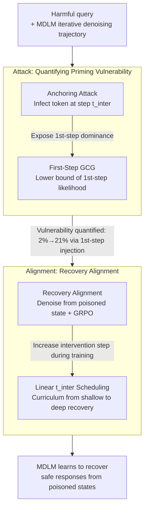

# Toward Safer Diffusion Language Models: Discovery and Mitigation of Priming Vulnerabilities

**Conference**: ICLR 2026  
**arXiv**: [2510.00565](https://arxiv.org/abs/2510.00565)  
**Code**: [GitHub](https://github.com/mdl-lab/dlm-priming-vulnerability)  
**Area**: AI Safety / Diffusion Language Models  
**Keywords**: diffusion language models, jailbreak attacks, priming vulnerability, safety alignment, masked diffusion

## TL;DR

This paper reveals "priming vulnerability" in Masked Diffusion Language Models (MDLM)—where injecting affirmative tokens during intermediate denoising steps can bypass safety filters. It proposes Recovery Alignment (RA) to train models to recover from contaminated intermediate states to secure responses.

## Background & Motivation

**Background**: Masked Diffusion Language Models (MDLM), such as LLaDA and MMaDA, generate tokens in parallel through iterative denoising. They have emerged as alternatives to Autoregressive Models (ARMs) due to lower latency and bidirectional context modeling. However, research into the safety risks of MDLMs remains sparse.

**Limitations of Prior Work**: Existing safety alignment methods (SFT, DPO, MOSA) assume denoising starts from a fully masked sequence, training the model to produce safe responses only under this condition. If affirmative tokens appear during intermediate denoising steps, the model fails to recover a safe output from this "contaminated" state. The unique parallel iterative generation mechanism of MDLMs presents safety threats distinct from those facing ARMs.

**Key Challenge**: A distribution shift exists between the initialization conditions of safety alignment (full mask) and the intermediate states encountered during inference (containing harmful tokens). Since the model is never exposed to contaminated intermediate states during training, it fails to learn how to "recover" from them.

**Goal**: (1) Systematically quantify the severity of the priming vulnerability in MDLMs; (2) Design an MDLM-specific safety alignment method to mitigate this vulnerability.

**Key Insight**: Analysis of the iterative denoising mechanism in MDLMs shows that injecting a single affirmative token in the very first step can increase the Attack Success Rate (ASR) from 2% to 21%. Recovery Alignment is designed to enable the model to restore safe outputs from contaminated states.

**Core Idea**: Construct intermediate states containing harmful tokens during training to teach the model to recover from "poisoned" states and generate safe responses.

## Method

### Overall Architecture

This paper quantifies the "priming vulnerability" using two types of attacks—demonstrating that models struggle to maintain safety once affirmative tokens contaminate intermediate denoising steps. Subsequently, Recovery Alignment (RA) explicitly incorporates these "contaminated intermediate states" into training via GRPO to teach the model to return to safe trajectories. The attack side exposes and measures the risk, while the alignment side performs the repair. Both share the observation that MDLM safety depends on the denoising trajectory rather than just the starting point.

### Key Designs

**1. Anchoring Attack: Quantifying Vulnerabilities via Controlled Intervention**

To prove the existence of priming vulnerabilities, a method to stably trigger and measure them is required. The Anchoring Attack assumes an attacker can intervene in the denoising process, replacing the model's currently predicted tokens with harmful tokens at an intermediate step $t_{inter}$. These replaced tokens are partially retained during subsequent re-masking, acting as "anchors" that pull the generation trajectory toward harmful content. This provides a tunable mechanism: sweeping $t_{inter}$ illustrates how vulnerability changes with injection timing. Results show that injecting even one token at the first step ($t_{inter}=1$) causes the ASR to jump from 2% to 21%, indicating extreme sensitivity to early-stage contamination.

**2. First-Step GCG: Proxi-Optimization via First-Step Likelihood**

Since anchoring attacks require runtime intervention, an input-only optimization attack is needed. Optimizing GCG against an entire stochastic re-masked denoising trajectory is difficult due to high-variance Monte Carlo estimates. This work derives a tractable lower bound: the log-likelihood of the entire trajectory is bounded by the log-likelihood of the first step, $\log p_{\pi,m_t}(\mathbf{r}_T|\mathbf{q},\mathbf{r}_0) \geq \frac{1}{T}\log\pi_\theta(\tilde{\mathbf{r}}_1|\mathbf{q},\mathbf{r}_0)$ (Theorem 4.1). By maximizing the likelihood of predicting harmful responses in the first step, one can approximate the attack on the full process. This reduces costs from full trajectory sampling to a single forward pass, making it ~20x faster than Monte Carlo GCG while being 3–4x more effective.

**3. Recovery Alignment: Training from Poisoned States**

Standard alignment (SFT, DPO, MOSA) assumes denoising starts from a full mask. These models only learn to be safe from that specific starting point. RA constructs mismatches: given a harmful query-response pair $(q, r)$, a contaminated intermediate state $r_{t_{inter}} \sim m_{t_{inter}}(\cdot|r)$ is sampled at step $t_{inter}$. The model then denoises from this state and is optimized via GRPO using scores from a reward model. By exposing the model to scenarios where harmful tokens have already been "produced," it learns the path to recover—a capability missing in standard alignment.

**4. Linear Scheduling of $t_{inter}$: A Recovery Curriculum**

Larger intervention steps $t_{inter}$ leave fewer steps for the model to recover, increasing task difficulty. Training with large $t_{inter}$ initially is unstable. The paper uses a linear schedule $t_{inter} = \lfloor t_{min} + \frac{s}{S}(t_{max} - t_{min}) \rfloor$ over training steps $s$, starting with shallow contamination and progressing to deep recovery. This curriculum maintains training stability and results in superior robustness compared to fixed $t_{inter}$ settings.

### Loss & Training

RA utilizes GRPO to optimize the recovery target. Rewards are derived from a pre-trained DeBERTaV3 safety classifier without further fine-tuning. Training data utilizes harmful query-response pairs from BeaverTails, incurring no additional data construction costs. The intervention step is linearly scheduled within $[t_{min}, t_{max}]$, and alignment is completed in approximately 2,500 steps, making it a lightweight, plug-and-play solution.

## Key Experimental Results

### Main Results

**Priming Vulnerability Attack Results (JBB-Behaviors, GPT-4o Eval, ASR %)**

| Method | No Attack | Anchoring t=1 | Anchoring t=16 | First-Step GCG |
|------|-----------|---------------|----------------|----------------|
| LLaDA Original | 2.0 | 17.3 | 88.7 | 58.0 |
| LLaDA + SFT | 8.3 | 19.0 | 87.7 | 48.2 |
| LLaDA + DPO | 4.3 | — | — | — |
| **LLaDA + RA** | **Significantly Reduced** | **Significantly Reduced** | **Significantly Reduced** | **Significantly Reduced** |

**First-Step GCG vs. Monte Carlo GCG**

| Method | LLaDA ASR% | LLaDA 1.5 ASR% | Time per Prompt |
|------|-----------|----------------|-------------|
| Monte Carlo GCG | 20.0 | 12.5 | 4.1-4.3h |
| First-Step GCG | 58.0 | 49.5 | 0.2h |

First-Step GCG is approximately 20x faster and 3-4x more effective.

### Ablation Study

| Component Ablation | Effect |
|----------|------|
| RA w/o intervention (t=0) | Equivalent to standard RLHF; fails to mitigate priming vulnerability |
| Fixed $t_{inter}$ | Unstable training |
| Linear scheduling of $t_{inter}$ | Stable training and better robustness |
| Different models (LLaDA / LLaDA1.5 / MMaDA) | RA is effective across all tested models |

### Key Findings

1.  **Universal Priming Vulnerability**: The vulnerability is observed across LLaDA Instruct, LLaDA 1.5, and MMaDA MixCoT.
2.  **Extreme Sensitivity**: Injecting a single token in the first step significantly increases ASR (e.g., from 2% to 21% in LLaDA).
3.  **Ineffectiveness of Existing Defenses**: SFT, DPO, and MOSA fail to effectively mitigate priming vulnerabilities.
4.  **RA Enhances General Robustness**: RA not only mitigates priming vulnerabilities but also improves defense against traditional jailbreak attacks (PAIR, ReNeLLM, Crescendo).
5.  **No Capability Degradation**: RA shows no significant performance decline across 11 general benchmarks.

## Highlights & Insights

*   **First Systematic Reveal of MDLM Vulnerabilities**: Distinct from ARM prefilling attacks, these are new vulnerabilities caused by the iterative denoising mechanism.
*   **Theoretical Contribution**: Proof that the first-step log-likelihood acts as a lower bound for the full denoising likelihood (Theorem 4.1), enabling efficient attack design.
*   **Simple & Practical**: RA requires no extra data construction and completes training in 2,500 steps using existing harmful datasets and reward models.
*   **Security vs. Capability**: RA enhances safety without sacrificing the model's general performance.
*   **Forward-looking**: Establishes a foundation for MDLM safety as these models move toward real-world deployment.

## Limitations & Future Work

1.  **MDLM Scope**: Generalizability to continuous diffusion language models remains unknown.
2.  **Attack Assumptions**: Anchoring attacks assume intervention in the denoising process, which is difficult in actual deployments (though First-Step GCG avoids this).
3.  **Reward Model Dependency**: RA's effectiveness is constrained by the quality of the reward model (DeBERTaV3).
4.  **Fixed Generation Length**: Experiments used $L=T=128$; results for longer generations require verification.
5.  **Adaptive Attacks**: Exploration of adaptive attacks specifically targeting RA is needed.

## Related Work & Insights

*   **Relation to ARM Safety**: ARM prefilling attacks use prefixes to suppress refusal; MDLM priming vulnerabilities exploit intermediate denoising to guide generation. The mechanisms are fundamentally different.
*   **Comparison with MOSA**: MOSA aligns safety only from a full mask state, leaving it unable to handle contaminated intermediate states.
*   **Deployment Implications**: MDLM deployments must consider the safety of the denoising process itself; ARM-based safety solutions cannot be directly applied.
*   **Inspiration for Robustness**: The philosophy of Recovery Alignment (training to recover from adversarial states) could be extended to other generative models.

## Rating

*   **Novelty**: ⭐⭐⭐⭐⭐ — First to identify and quantify unique MDLM safety vulnerabilities.
*   **Experimental Thoroughness**: ⭐⭐⭐⭐ — Tested across three models and multiple attack types, though generation length was fixed.
*   **Writing Quality**: ⭐⭐⭐⭐⭐ — Clear problem definition with a strong combination of theory and experiment.
*   **Value**: ⭐⭐⭐⭐⭐ — Highly practical safety and defense solutions for the emerging field of MDLMs.

<!-- RELATED:START -->

## Related Papers

- [\[ICLR 2026\] DreamOn: Diffusion Language Models For Code Infilling Beyond Fixed-size Canvas](dreamon_diffusion_language_models_for_code_infilling_beyond_fixed-size_canvas.md)
- [\[ICLR 2026\] Don't Settle Too Early: Self-Reflective Remasking for Diffusion Language Models](dont_settle_too_early_self-reflective_remasking_for_diffusion_language_models.md)
- [\[ACL 2026\] Unlocking the Potential of Diffusion Language Models through Template Infilling](../../ACL2026/llm_nlp/unlocking_the_potential_of_diffusion_language_models_through_template_infilling.md)
- [\[ICLR 2026\] LLEMA: Evolutionary Search with LLMs for Multi-Objective Materials Discovery](llema_evolutionary_search_with_llms_for_multi-objective_material_design.md)
- [\[ICML 2026\] Reasoning on the Manifold: Bidirectional Consistency for Self-Verification in Diffusion Language Models](../../ICML2026/llm_nlp/reasoning_on_the_manifold_bidirectional_consistency_for_self-verification_in_dif.md)

<!-- RELATED:END -->
## Related Papers

- [\[ICLR 2026\] DreamOn: Diffusion Language Models For Code Infilling Beyond Fixed-size Canvas](dreamon_diffusion_language_models_for_code_infilling_beyond_fixed-size_canvas.md)
- [\[ICLR 2026\] d²Cache: Accelerating Diffusion-Based LLMs via Dual Adaptive Caching](d2cache_accelerating_diffusion-based_llms_via_dual_adaptive_caching.md)
- [\[ICLR 2026\] Stopping Computation for Converged Tokens in Masked Diffusion-LM Decoding](stopping_computation_for_converged_tokens_in_masked_diffusion-lm_decoding.md)
- [\[ACL 2025\] Segment-Level Diffusion: A Framework for Controllable Long-Form Generation with Diffusion Language Models](../../ACL2025/llm_nlp/segment_level_diffusion.md)
- [\[ICLR 2026\] LLEMA: Evolutionary Search with LLMs for Multi-Objective Materials Discovery](llema_evolutionary_search_with_llms_for_multi-objective_material_design.md)

<!-- RELATED:END -->
