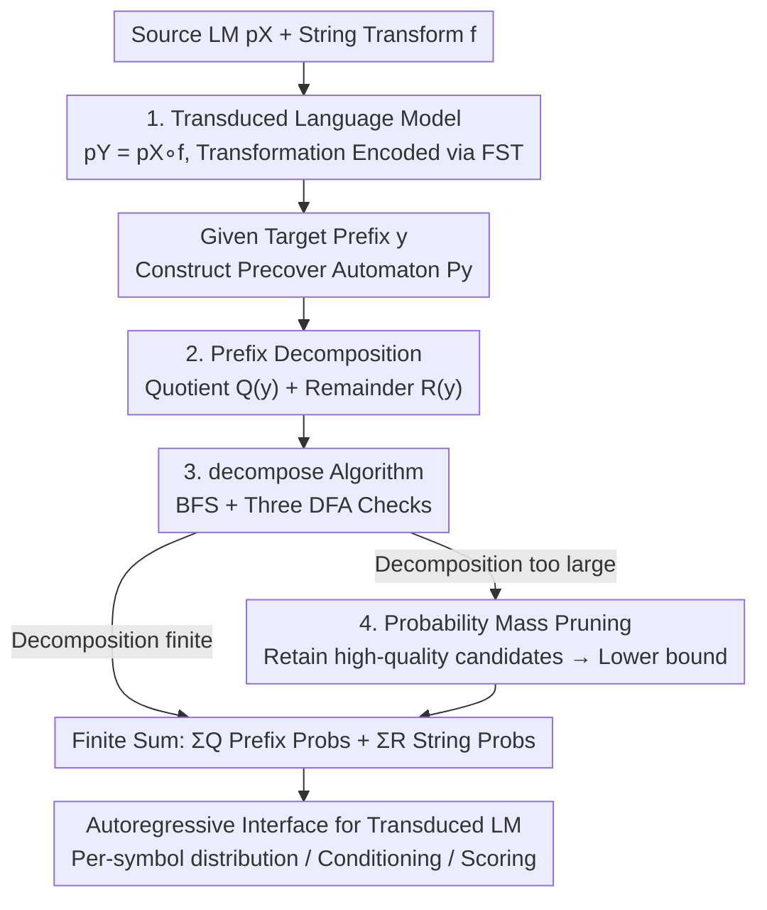

# Transducing Language Models

**Conference**: ICLR 2026  
**OpenReview**: [https://openreview.net/forum?id=qOyF214xmg](https://openreview.net/forum?id=qOyF214xmg)  
**Code**: https://github.com/rycolab/transducing-language-models  
**Area**: NLP Understanding / LLM Efficiency  
**Keywords**: Finite-State Transducers, String Transformations, Subword-to-Byte, Prefix Probabilities, Inference-time Adaptation

## TL;DR
This paper formally elevates the engineering task of "applying deterministic string transformations to language model outputs" to a new class of language models. By encoding transformations using Finite-State Transducers (FSTs) and combining them with pre-trained LMs, the authors propose an algorithm capable of summing over all "source strings mapping to a target string" in finite time. This restores an autoregressive interface (symbol-by-symbol distribution, prefix probability, conditioning) to transformed models **without changing any parameters**, as demonstrated in "subword-to-byte," "subword-to-word," and "DNA-to-amino acid" scenarios.

## Background & Motivation
**Background**: Modern language models fundamentally define a "probability distribution over strings." However, the generated strings depend on the units used during training—mainstream LLMs output BPE subword sequences (Sennrich et al., 2016), while DNA models output nucleotide sequences. Downstream tasks often require different units: psycholinguistics and controlled generation prefer character/byte levels, syntactic analysis requires "orthographic words" like those in the Penn Treebank, and protein applications require amino acid sequences.

**Limitations of Prior Work**: Practically, practitioners often append a string transformation (lowercase, subword-to-byte, codon translation) to the generation pipeline. The authors term this the **string mismatch problem**. The issue is that while **sampling remains simple** (sample $x \sim p_X$, then apply $f$), other operations become impossible—calculating the "probability of a transformed string $y$" or "conditioning on the transformed output" is no longer feasible.

**Key Challenge**: The root cause is that the transformation $f$ is **many-to-one**. Given a target string $y$, the set of source strings mapping to it (preimage) $f^{-1}(y)=\{x: f(x)=y\}$ is typically exponential or even infinite. A correct transformed language model must sum the probabilities of **all** source strings: $p_Y(y)=\sum_{x\in f^{-1}(y)} p_X(x)$. Fig. 1 provides an intuitive example—numerous BPE sequences can lowercase to `hello` (`HE|LL|O`, `hell|o`, `H|ello`...). As the output sequence grows, the number of candidate source prefixes doubles. Transforming a string is trivial; transforming a **distribution** is not.

**Goal**: To provide an autoregressive interface (incremental next-symbol distribution + prefix probability) for "transformed language models," allowing them to be invoked like standard LMs by any existing system—without retraining or parameter modification.

**Key Insight**: This is a classic trick in probability theory—applying a function $f$ to a random variable $X \sim p$ yields a new random variable $f(X)$ with an induced distribution. String transformations should thus be treated as **first-class citizens** in the language modeling pipeline. To make this summation **computable**, the transformation must have a **structured representation**: a Finite-State Transducer. FSTs are sufficiently expressive (encoding lowercase, subword-to-byte, PTB tokenization with lookahead, codon translation) and tractable (the state machine structure can be explicitly exploited by algorithms).

**Core Idea**: Encode string transformations as FSTs and compose them with a pre-trained LM to form a **transduced language model** $p_Y$. Utilizing the FST's state structure, the "infinite sum over the preimage" is decomposed into a finite computation of "quotient set prefix probabilities + remainder probabilities," thereby restoring the autoregressive interface.

## Method

### Overall Architecture
To provide an autoregressive interface for a transduced language model $p_Y = p_X \circ f$, the core task is to calculate its **prefix probability** $\overrightarrow{p_Y}(y) = \Pr_{X \sim p_X}[y \preceq f(X)] = \sum_{x \in P(y)} p_X(x)$, where $P(y) = \{x : y \preceq f(x)\}$ is the **precover** of $y$: the set of all source strings that, when transformed, start with $y$. Given prefix probabilities, standard $\overrightarrow{p_Y}(y' \mid y)$ conditional decomposition enables symbol-by-symbol left-to-right generation. The difficulty lies in $P(y)$ being generally infinite.

The approach works as follows: represent the transformation $f$ as an FST and compose it with the source LM. For a target prefix $y$, construct a **precover automaton** $P_y$ that accepts exactly $P(y)$ (a DFA obtained via determinization and pruning of an NFA). A BFS-based `decompose` algorithm is run on this DFA to split the infinite $P(y)$ into two parts: a set of maximal cylinder sets (the **Quotient set** $Q(y)$), where any extension of a string in $Q(y)$ is guaranteed to be in $P(y)$, and a set of scattered **Remainders** ($R(y)$). The infinite sum then collapses into a finite sum: $\overrightarrow{p_Y}(y) = \sum_{x \in Q(y)} \overrightarrow{p_X}(x) + \sum_{x \in R(y)} p_X(x)$, reducible to a finite number of prefix/string probability queries to the source LM. If the decomposition is still too large (e.g., exponential expansion in DNA), an lower-bound approximation is calculated by pruning based on probability mass.

### Key Designs

**1. Transduced Language Models: String Transformations as First-Class LMs**

Addressing the pain point where transformations are often treated as mere post-processing, the authors provide a formal definition: for a source LM $X \sim p_X$ and transformation $f$, the probability mass function of $f(X)$ is $p_Y(y) = \Pr_{X \sim p_X}[y = f(X)] = \sum_{x \in f^{-1}(y)} p_X(x)$. A key observation is that while direct calculation of $p_Y(y)$ is infeasible due to the preimage size, **sampling is trivial**. The practical blockers are scoring transformed strings and conditioning on transformed output, both of which rely on the prefix probability $\overrightarrow{p_Y}(y) = \sum_{x \in P(y)} p_X(x)$.

FSTs are chosen to encode $f$ because they map source strings to target prefixes via state transition paths with input/output labels. This explicit structure allows the decomposition algorithm to "trace the machine" and make decisions in finite steps. FSTs cover transformations like lowercase, subword-to-byte, PTB tokenization, and DNA codon translation.

**2. Prefix Decomposition: Converting Infinite Sums to Finite Sums via "Quotient + Remainder"**

The precover $P(y)$ is typically infinite but structured. The authors define $C(y) = \{x : \langle x \rangle \subseteq P(y)\}$ as the **maximal cylinder set** within $P(y)$—if a source string $x$ falls into $C(y)$, all its extensions also cover $y$. The probability of this entire cylinder $\langle x \rangle$ can be calculated with a **single prefix probability query** $\overrightarrow{p_X}(x)$ to the source LM. The precover is thus split into the Quotient set $Q(y) = \text{pf}(C(y))$ (the shortest prefix representatives) and the Remainder set $R(y) = P(y) \setminus C(y)$ (strings that cover $y$ themselves but whose extensions might not). This decomposition satisfies: $Q(y)$ is prefix-free, $P(y) = \langle Q(y) \rangle \sqcup R(y)$ (validity), and $\langle Q(y) \rangle = C(y)$ (maximality).

This enables the computational shortcut:
$$\overrightarrow{p_Y}(y) = \sum_{x \in P(y)} p_X(x) = \sum_{x \in Q(y)} \overrightarrow{p_X}(x) + \sum_{x \in R(y)} p_X(x)$$
As long as $Q(y)$ and $R(y)$ are finite, the infinite sum becomes a finite number of queries.

**3. decompose Algorithm: BFS and Three-State Checks on Precover DFA**

The `decompose` algorithm (Fig. 2) finds $Q(y)$ and $R(y)$ by performing a BFS on the precover DFA $P_y$. For each candidate source string $x$, three checks are performed (Fig. 3):
- **Cylinder**: Is $\langle x \rangle \subseteq P(y)$? This is equivalent to checking if the reached state is "universal" (all future paths are accepted). If yes, $x$ is added to $Q$ and its branches are pruned.
- **Member**: Is $x \in P(y)$? Equivalent to checking if the state is an accepting state. If yes, $x$ is added to $R$ but the algorithm continues exploring extensions.
- **Live**: Are any extensions of $x$ in $P(y)$? Equivalent to checking if the state can reach an accepting or universal state. Only live extensions are queued.

Engineering optimizations include **lazy determinization** (Frontier-based subset construction to avoid building the full DFA), **incremental next-symbol decomposition** (computing all $y'$ extensions from $y$ in one BFS pass), and **label pushing** (moving output labels forward to trigger cylinder checks earlier).

**4. Probability Mass Pruning: Approximation when Decomposition Explodes**

When the decomposition of $P(y)$ is too large (e.g., DNA translation), the `prune` strategy sorts candidates by prefix probability and discards the tail such that the cumulative sum of discarded mass is below $\tau$. Since pruning only removes elements from the sum, the result remains a **lower bound** of the true prefix probability. This provides a tunable knob: smaller $\tau$ leads to higher accuracy (lower JSD) at the cost of lower throughput.

## Key Experimental Results

### Main Results
Experiments were conducted across three transformation scenarios using metrics such as **Jensen–Shannon Divergence (JSD)** and throughput (bytes/sec) across various pruning thresholds $\tau$. Source models included GPT-2, LLaMA 3.2-1B, LLaMA 3.1-8B, Phi-4, and a DNA model trained on the human genome.

| Scenario | Monotonicity | Transformation/Data | Summary of Results |
|----------|--------------|---------------------|--------------------|
| Subword→Byte (T2B) | Strict Prefix-Monotonic | $f_\alpha$, $O(\|X\|)$ states; wikitext-2 | Lower $\tau$ gives lower JSD and throughput; JSD comparable to Vieira et al. 2025a. |
| Subword→Word (PTB) | Non-monotone | $p_X \circ f_\alpha \circ f_{ptb}$ (PTB tokenizer) | Follows "lower threshold, lower JSD" trend; handles non-monotone lookahead. |
| DNA→Amino Acid | Prefix-Monotonic (2-sym lookahead) | $f_{dna2aa}$; 65 human proteins | Exponential candidate expansion requires caps; approximation is effective. |

### Ablation Study
The primary sensitivity analysis focused on the **pruning threshold $\tau$**, which characterizes the cost-accuracy trade-off.

| Configuration | Key Observation |
|---------------|-----------------|
| $\tau \to 0$ (Precise) | JSD ↓, Throughput ↓. Approaches the true distribution at higher computational cost. |
| Large $\tau$ (Aggressive) | JSD ↑, Throughput ↑. Fast but biased (always a lower bound). |
| T2B vs. Vieira et al. 2025a | Vieira's specific trie-based method has higher throughput but is limited to strict prefix-monotonic tasks. |

### Key Findings
- **Useful approximations are cheap**: A practical pruning threshold provides good probability estimates at a fraction of the cost of the exact algorithm.
- **Generality vs. Specific Speed**: While specialized algorithms for subword-to-byte are faster, this framework covers the entire prefix-monotonic spectrum (including non-monotone PTB) at the cost of some throughput.
- **DNA-to-Amino Acid is the hardest**: Candidate sets expand exponentially with sequence length, necessitating pruning and caps—this serves as a stress test for the approximation strategy.

## Highlights & Insights
- **First-Class induced distributions**: The core insight is treating the random variable transformation $f(X)$ seriously. The difficulty is not in sampling but in scoring/conditioning, and identifying this mismatch is a major contribution.
- **Decomposition Core**: The "Quotient + Remainder" decomposition is the technical heart. Summing over a cylinder set using a single source LM query is the key to making infinite sums finite.
- **FST as an Algorithmic Engine**: FSTs are more than just a representation; their state structure reduces abstract set membership tests (Cylinder/Member/Live) to simple DFA state properties.

## Limitations & Future Work
- **Throughput Bottlenecks**: Exact computation depends on finite decomposition. Some transformations (like PTB) possess infinite quotients, necessitating pruning. High-cost models (e.g., Phi-4) struggle on long sequences with tight thresholds.
- **Lower Bound Bias**: Pruning always yields a lower bound. There is currently no explicit error bound for single estimates; applications requiring exact conditional probabilities must be cautious.
- **FST Constraint**: The transformation must be representable as an FST. Transformations requiring unbounded memory or context-free grammars are not directly supported.
- **Exponential Expansion in DNA**: The "one-to-many" nature of codon translation poses a challenge for scalability, requiring aggressive pruning.

## Related Work & Insights
- **vs. Vieira et al. (2025a)**: They handle **strict prefix-monotonic** subword-to-byte transformations using specialized tries. Ours is a strict generalization—handling multi-symbol lookahead and **non-monotone** transformations (like PTB) via the "Remainder" set.
- **vs. Constraint Decoding**: While both use automata, constrained decoding typically focuses on "restricting the generation space." This work focuses on "calculating correct probabilities and conditioning on the transformed distribution."

## Rating
- Novelty: ⭐⭐⭐⭐⭐ Formalizes transformations as first-class LMs with a clean theoretical core (Quotient/Remainder).
- Experimental Thoroughness: ⭐⭐⭐⭐ Broad verification across monotonicity types, though lacks end-to-end downstream task metrics.
- Writing Quality: ⭐⭐⭐⭐⭐ Rigorous formalization and helpful, incremental examples.
- Value: ⭐⭐⭐⭐ Provides a theoretically grounded tool for inference-time adaptation without retraining.

<!-- RELATED:START -->

<!-- Related papers would go here -->

<!-- RELATED:END -->

## Related Papers

- [\[ICLR 2026\] TableMaster: A Recipe to Advance Table Understanding with Language Models](tablemaster_a_recipe_to_advance_table_understanding_with_language_models.md)
- [\[ICLR 2026\] Neural Synchrony Between Socially Interacting Language Models](neural_synchrony_between_socially_interacting_language_models.md)
- [\[ICLR 2026\] Toward Safer Diffusion Language Models: Discovery and Mitigation of Priming Vulnerabilities](toward_safer_diffusion_language_models_discovery_and_mitigation_of_priming_vulne.md)
- [\[ICLR 2026\] PT2-LLM: Post-Training Ternarization for Large Language Models](pt2-llm_post-training_ternarization_for_large_language_models.md)
- [\[ICLR 2026\] Massive Editing for Large Language Models Based on Dynamic Weight Generation](massive_editing_for_large_language_models_based_on_dynamic_weight_generation.md)

<!-- RELATED:END -->
