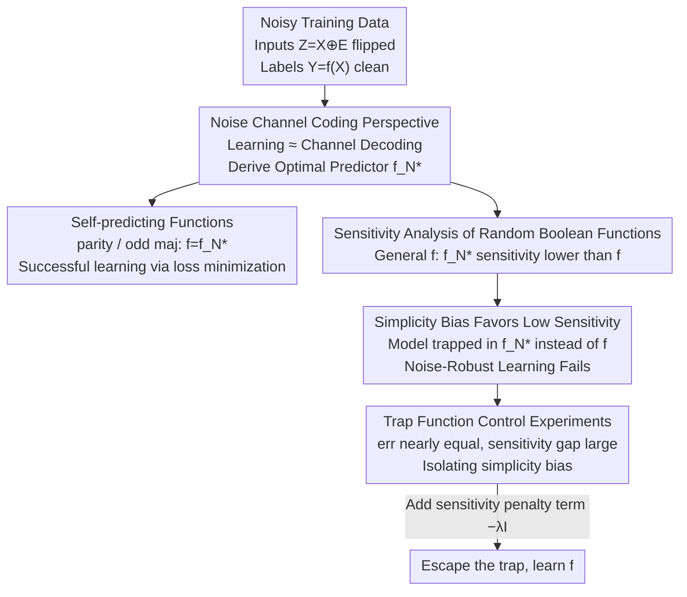

# Trapped by simplicity: When Transformers fail to learn from noisy features

**Conference**: ICLR 2026  
**arXiv**: [2602.08695](https://arxiv.org/abs/2602.08695)  
**Code**: [https://github.com/peterse/noise-robust-boolean-learning/](https://github.com/peterse/noise-robust-boolean-learning/)  
**Area**: LLM NLP / Transformer Theoretical Analysis  
**Keywords**: Noise-robust learning, simplicity bias, Boolean functions, Transformer, sensitivity

## TL;DR
Research demonstrates that Transformers fail to learn Boolean functions from data containing feature noise—their simplicity bias (tendency to learn low-sensitivity functions) causes models to be trapped by optimal noise predictors that are simpler than the target function, preventing the recovery of the true noise-free target.

## Background & Motivation

**Background**: Training data for LLMs commonly contains noise (typos, grammatical errors, semantic inconsistencies), yet these models are often applied to tasks highly sensitive to noise (e.g., arithmetic reasoning), where each token prediction depends on previous noise-free inputs. Prior studies show Transformers exhibit robustness to test-time noise after noise-free training, but learning capabilities when the "training data itself contains feature noise" remain under-explored.

**Limitations of Prior Work**: Transformers are known to possess a **simplicity bias**, favoring the learning of Boolean functions with low sensitivity. Previous work primarily focused on the impact of label noise, whereas the impact of feature noise (input bit flips) is qualitatively different—it renders the optimal predictor $f_N^*$ simpler than the target function $f$.

**Key Challenge**: When training data contains feature noise, the Bayesian optimal predictor $f_N^*$ typically has lower sensitivity than the target function $f$. The simplicity bias of Transformers specifically biases them toward learning $f_N^*$ rather than $f$, leading to generalization failure on noise-free data.

**Goal**: Can Transformers learn the correct noise-free target function from feature-noisy data (noise-robust learning)? Under what conditions does this succeed or fail? How can these failures be explained and mitigated?

**Key Insight**: An analysis is conducted through the theoretical framework of Boolean functions—using sensitivity as a complexity measure. A framework for noise-robust learning is established from the perspectives of information theory and noise channel coding, accompanied by "trap function" control experiments to isolate the effects of simplicity bias.

**Core Idea**: The simplicity bias of Transformers causes them to be "trapped" by simpler optimal noise predictors under feature noise, resulting in systematic failures in noise-robust learning for random Boolean functions.

## Method

### Overall Architecture
This paper addresses a specific question: Can Transformers learn the true target function when training inputs are corrupted by noise while labels remain clean? To this end, the authors abstract the problem into Boolean function learning, supported by a theoretical framework and controlled experiments. The setup utilizes a binary string $X$ of length $n$ as input, with the target being a Boolean function $f(X)$. During training, the model observes inputs $Z = X \oplus E$ subject to independent bit-flip noise (flip probability $p$), while labels $Y = f(X)$ are noise-free. Key to this is the distribution shift between training and testing—the model trains on noisy data $(Z, Y)$ but must generalize to noise-free data $(X, Y)$. The analysis revolves around what the model converges to under this shift: first deriving the theoretical optimal predictor $f_N^*$ from a noise channel coding perspective, then distinguishing between two classes of functions. For "self-predicting functions" like parity and odd-bit majority, $f$ itself is the optimal solution and learning succeeds; for general random Boolean functions, $f_N^*$ is systematically simpler, and Transformer simplicity bias traps the model on $f_N^*$. Finally, trap function experiments confirm that simplicity bias, rather than a gap in validation error, drives the failure.

As this is a theoretical/analytical paper, there is no fixed network architecture to illustrate; however, the argumentation follows a branching logical chain. The inference process—from noisy data to success/failure paths and mitigation strategies—is visualized in the flowchart below, corresponding to the four key designs (top-down: noise channel coding $\rightarrow$ sensitivity analysis of self-predicting/random functions $\rightarrow$ trap function experiments):

### Key Designs

**1. Noise Channel Coding: Translating "Learning from Noise" into Communication**

To analyze the impact of feature noise, a framework is needed to characterize it precisely. The authors model next-token prediction as a communication task: a sender Alice encodes information $Y = f(X)$ into a sequence $X$, and a receiver Bob receives a noisy version $Z$. "Learning" thus becomes equivalent to "decoding over a noisy channel." In this perspective, the Bayesian optimal predictor has a closed-form $f_N^*(x) := \text{sign}(T_{1-2p} f(x))$, where $T_\rho$ is the noise operator. The optimal error rate is bounded by Fano’s inequality using information-theoretic bounds:

$$\Phi^{-1}(H(Y|Z)) \leq \text{err}_f(f_N^*) \leq \phi^{-1}(H(Y|Z))$$

This noise channel coding language differs from traditional compression-based (source coding) analyses—source coding focuses on shortening clean information, whereas the core contradiction here is how noise alters the optimal solution.

**2. Self-predicting Functions: Why Parity and Majority Seem "Fine"**

Focusing only on parity and odd-bit majority leads to overly optimistic conclusions. Proposition 1 proves that for $\text{maj}_n$ (where $n$ is odd) and $\text{parity}$, the target function itself is the optimal predictor on noisy data, i.e., $f = f_N^*$. This implies that for these functions, standard loss minimization is sufficient to learn the target function, as no "trap" by simpler solutions exists. Experiments confirm this: Transformers successfully perform noise-robust learning on $\text{maj}(20,5)$, $\text{maj}(40,5)$, and $\text{parity}(20,4)$, with median Transformers outperforming the best LSTMs. In other words, these commonly studied functions are special cases—their success does not generalize.

**3. Sensitivity Analysis of Random Boolean Functions: Optimal Noise Predictors are Systematically Simpler (Core Theoretical Contribution)**

Shifting focus to general random Boolean functions flips the conclusion. Proposition 2 proves that for a Boolean function $f$ sampled uniformly at random, the average sensitivity of the optimal noise predictor for sufficiently large $n$ is:

$$\mathbb{E}_f[I[f_N^*]] \approx \frac{n}{\pi} \arccos\left(\frac{2p(1-p)}{p^2+(1-p)^2}\right)$$

Furthermore, $\mathbb{E}_f[I[f]] > \mathbb{E}_f[I[f_N^*]]$, meaning the optimal noise predictor is on average simpler (lower sensitivity) than the target function. Experiments on 3200 random $k$-juntas verified this, with $I[f] \geq I[f_N^*]$ holding for all samples. This is the central discovery: since $f_N^*$ is simpler than $f$ and Transformers inherently prefer low-sensitivity solutions, they learn $f_N^*$ instead of the true $f$.

**4. Trap Function Control Experiments: Isolating Simplicity Bias from Other Confounders**

Proving "simpler" is not enough; one must rule out the possibility that the model simply chooses $f_N^*$ because it has lower validation error. The authors construct a class of "trap functions" where the validation error is nearly identical ($\text{err}_f(f_N^*) \approx \text{err}_f(f)$) but the sensitivity gap is large ($I[f_N^*] \ll I[f]$). In this setting, the model could theoretically learn $f$ via loss minimization, yet Transformers remain "trapped" by simplicity bias, converging to the simpler $f_N^*$. LSTMs also fail, but for a different reason—overfitting the training data. Furthermore, adding a sensitivity penalty $-\lambda I[\hat{f}]$ to the loss (penalizing low-sensitivity solutions) allows Transformers to escape the trap and learn $f$. This causal chain confirms that simplicity bias itself causes the failure.

### Loss & Training
- Standard Training: Minimize cross-entropy loss on noisy data.
- Improved Training: Add a complexity preference term $-\lambda I[\hat{f}]$ to penalize low-sensitivity solutions.
- The choice of $\lambda$ is critical—there exists a narrow window allowing the Transformer to escape the trap.

## Key Experimental Results

### Main Results
Comparison between Transformers and LSTMs in noise-robust learning (300 runs per setup):

| Function | Model | Noise Rate $p$ | Noise-Robust Learning Success Rate | Description |
|------|------|---------|-------------------|------|
| $\text{maj}(20,5)$ | Median SAN | 0-0.4 | Near optimal | Self-predicting; Success |
| $\text{maj}(20,5)$ | Best LSTM | 0.1+ | Significantly below optimal | Fails with moderate noise |
| $\text{parity}(20,4)$ | SAN | 0-0.3 | Higher than LSTM | Self-predicting |
| $\text{parity}(20,4)$ | LSTM | 0.05+ | Nearly zero | Fails even with low noise |
| Random $k$-junta | SAN | 0.2 | Mostly fail | Non-self-predicting |
| $\text{maj}(30,4)$ Even | SAN | 0.32 | Fail | Non-self-predicting (unbalanced) |

### Ablation Study

| Configuration | Key Finding | Description |
|------|---------|------|
| No Sensitivity Penalty | Transformer trapped in $f_N^*$ | Val error near optimal; poor noise-free generalization |
| $\lambda$ Sensitivity Penalty (Opt) | Transformer escapes trap, learns $f$ | Requires precise tuning of $\lambda$ |
| Excessive $\lambda$ | Learning fails | Bias toward overly complex solutions |
| LSTM + Sensitivity Penalty | Still fails | Overfitting issues cannot be solved by sensitivity penalty |

### Key Findings
- **Systematic Failure on Random $k$-juntas**: Out of 3200 random functions, only a few where $I[f] \approx I[f_N^*]$ resulted in successful learning.
- **Simplicity Bias as the Root Cause**: Transformers achieve near-optimal validation error (high performance on noisy data) but poor noise-free test performance—validation loss fails to guide the selection of the correct model.
- **LSTM Failure Reason**: Unlike Transformers, LSTMs fail due to overfitting training data rather than simplicity bias.
- **Correlation with Sensitivity Gap**: The difficulty of learning increases as the gap $I[f] - I[f_N^*]$ grows.

## Highlights & Insights
- **Dual Nature of Simplicity Bias**: Previous research viewed simplicity bias as an advantage for generalization; this paper reveals it as a root cause of systematic failure under feature noise. This shift in perspective is highly insightful.
- **Trap Function Design**: By constructing cases where $\text{err}(f_N^*) \approx \text{err}(f)$ but $I[f_N^*] \ll I[f]$, the authors elegantly isolate simplicity bias, ruling out "validation error gap" as a confounder.
- **Information-Theoretic Perspective**: Linking noise-robust learning to noise channel coding (rather than the usual source coding/compression) provides a fresh analytical toolkit.
- **Implications for LLM training**: If training corpora contain significant noise, LLMs may fail to learn precise discrete reasoning rules (e.g., arithmetic) because simplicity bias favors "approximate but imprecise" solutions. This translates to the unreliability observed in LLM mathematical reasoning.

## Limitations & Future Work
- **Oversimplified Noise Model**: Only independent bit flips are considered; structured features of natural language noise (grammatical errors, etc.) are not captured.
- **Limited Function Types**: Experiments are restricted to random $k$-juntas, which may not represent the complexity of real-world learning problems.
- **High Noise Requirements**: Many observed effects require relatively high noise rates that might be uncommon in natural datasets.
- **Impracticality of Sensitivity Penalty**: Escaping traps requires precise $\lambda$ tuning, which lacks operability in practical applications.
- **Future Directions**: Investigating the impact of complex noise models (e.g., semantic noise) on these conclusions; exploring alternative mitigation methods (e.g., curriculum learning).

## Related Work & Insights
- **vs. Bhattamishra et al. (2023b)**: They proved Transformer simplicity bias favors low sensitivity and is robust to label noise. The key difference here is the study of **feature noise**, where simplicity bias is found to be harmful.
- **vs. Vasudeva et al. (2025)**: They showed Transformers are robust to test-time noise after noise-free training. This paper asks the inverse: Does training on noisy data generalize to noise-free tests? The answer is generally negative.
- **vs. Deletang et al. (2024)**: They analyzed LMs via source coding/compression. This paper uses noise channel coding, which is better suited for describing noisy training scenarios.

## Rating
- Novelty: ⭐⭐⭐⭐⭐ Reveals the negative effects of simplicity bias under feature noise; solid theoretical contributions.
- Experimental Thoroughness: ⭐⭐⭐⭐ 3200 random functions and sophisticated control designs, though limited to synthetic Boolean scenarios.
- Writing Quality: ⭐⭐⭐⭐⭐ Clear logical chain; natural progression from success to failure cases; tight integration of theory and experiments.

<!-- RELATED:START -->

## Related Papers

- [\[ICLR 2026\] Is the Reversal Curse a Binding Problem? Uncovering Limitations of Transformers from a Basic Generalization Failure](is_the_reversal_curse_a_binding_problem_uncovering_limitations_of_transformers_f.md)
- [\[ICML 2025\] When Will It Fail?: Anomaly to Prompt for Forecasting Future Anomalies in Time Series](../../ICML2025/llm_nlp/when_will_it_fail_anomaly_to_prompt_for_forecasting_future_anomalies_in_time_ser.md)
- [\[ACL 2026\] Characterizing the Expressivity of Local Attention in Transformers](../../ACL2026/llm_nlp/characterizing_the_expressivity_of_local_attention_in_transformers.md)
- [\[AAAI 2026\] Vision Transformers are Circulant Attention Learners](../../AAAI2026/llm_nlp/vision_transformers_are_circulant_attention_learners.md)
- [\[AAAI 2026\] Learning Spatial Decay for Vision Transformers](../../AAAI2026/llm_nlp/learning_spatial_decay_for_vision_transformers.md)

<!-- RELATED:END -->
