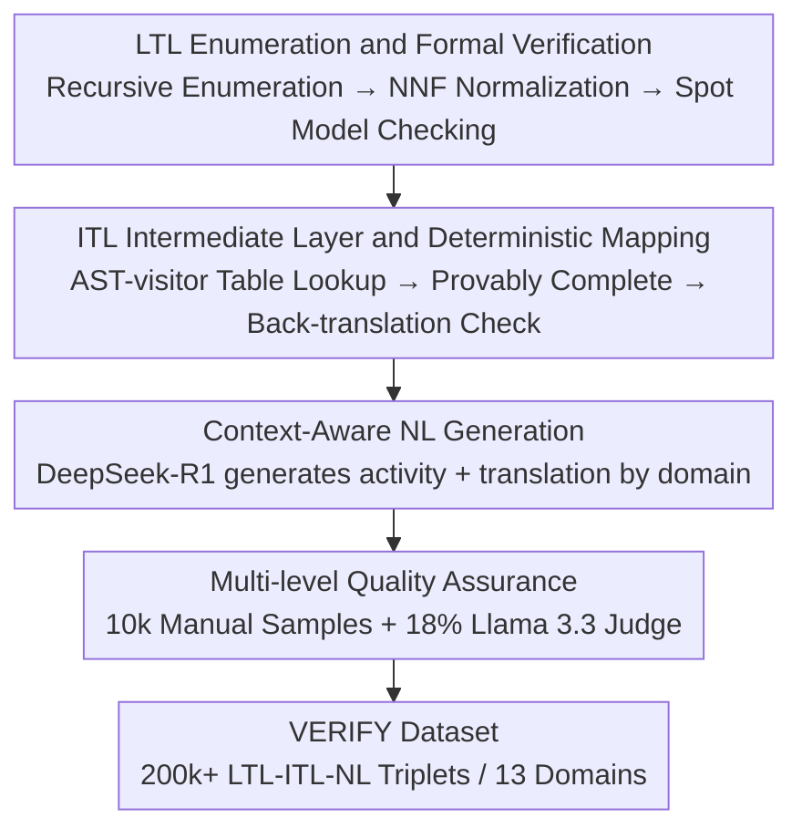

# VERIFY: A Novel Multi-Domain Dataset Grounding LTL in Contextual Natural Language via Provable Intermediate Logic

**Conference**: ICLR 2026  
**OpenReview**: [https://openreview.net/forum?id=NChBLvOr7I](https://openreview.net/forum?id=NChBLvOr7I)  
**Code**: https://github.com/sedislab/Verify (Data also released on HuggingFace / Kaggle)  
**Area**: NLP Understanding / Semantic Parsing / Formal Methods  
**Keywords**: Linear Temporal Logic, Dataset, Intermediate Representation, Semantic Parsing, LLM Generation

## TL;DR
VERIFY constructs the first large-scale (200k+ triplets, 13 domains) three-layer aligned dataset of "LTL Formula — Intermediate Technical Language (ITL) — Contextual Natural Language." By employing a pipeline including "enumeration + model checking + provably complete deterministic mapping + LLM generation + multi-level verification," it ensures formal correctness and semantic fidelity. Baselines using T5/Llama/CodeLlama reveal the core challenge: the NL→LTL direction remains extremely difficult (best semantic equivalence is only 31.5%).

## Background & Motivation
**Background**: Formal methods, particularly Linear Temporal Logic (LTL), precisely describe temporal properties that systems must satisfy and are widely used for the specification and verification of hardware, software, and critical infrastructure. However, the symbolic syntax of LTL is obscure to domain experts and most developers, while real-world requirements are almost always documented in Natural Language (NL). NL is flexible and readable but inherently ambiguous, incomplete, and inconsistent. Aligning these two sides (NL↔LTL translation) is a long-standing bottleneck in reliable engineering, robotics, and AI safety.

**Limitations of Prior Work**: Training models for this translation requires large-scale, multi-domain, and context-rich paired corpora, but existing datasets fail in several dimensions. In terms of scale, most contain only a few thousand to tens of thousands of entries (e.g., Lang2LTL ≈2.1k, NL2TL ≈28k), which is insufficient for training modern neural models to capture the complex coupling between logical structures and linguistic variations. In terms of domains, they are often limited to narrow scenarios like robot instructions or navigation. Regarding linguistic form, many are "imperative" or "technology-heavy sentences written following logic" rather than context-aware descriptions found in real requirement documents. Furthermore, formats vary across different research teams, making them fragmented and difficult to use.

**Key Challenge**: Directly mapping complex LTL formulas to fluent, accurate, and contextual NL is extremely difficult—translations are either too technical/template-based or lose semantic fidelity. A massive semantic gap exists between the symbolic abstraction of LTL and the context-rich nature of NL; a single-step leap is prone to failure.

**Goal**: To create a dataset that simultaneously satisfies "large-scale + multi-domain + context-rich + formally verifiable" requirements, systematically aligning unambiguous formal expressions with rich-context NL, and providing baselines to expose the actual difficulty of this task.

**Key Insight**: Instead of performing a direct two-layer LTL↔NL mapping, the authors insert an **Intermediate Technical Language (ITL)** as a bridge for "structure + semantics." It preserves the logical structure of the LTL abstract syntax tree while replacing symbolic operators with controlled English keywords. It is more structured than NL and more readable than LTL, thus decomposing one large leap into two smaller ones.

**Core Idea**: By using a three-layer representation of "LTL — ITL — Contextual NL" and a formally verifiable construction pipeline, the authors create VERIFY, the first large-scale multi-domain corpus unifying these three elements.

## Method

### Overall Architecture
VERIFY is essentially a **dataset construction pipeline** aimed at producing "formally correct, semantically faithful, and contextually relevant" LTL-ITL-NL triplets. The pipeline consists of four serial stages: first, an enumerator exhaustively generates LTL formulas, which are filtered via model checking to identify non-trivial, satisfiable formulas; second, deterministic rules map each valid LTL formula to an ITL intermediate representation, followed by back-translation to verify semantic equivalence; third, a reasoning LLM generates contextualized NL from LTL/ITL under specified domain contexts; finally, multi-level quality assurance is performed through manual inspection and LLM-as-a-judge. The following framework diagram illustrates the data flow from top to bottom across the four stages.

The three-layer representation is the foundation: **LTL** uses operators like $G$ (Always), $F$ (Eventually), $X$ (Next), $U$ (Until), $W$ (Weak Until), and $R$ (Release) to precisely express temporal properties, providing machine-verifiable unambiguous semantics. **ITL** preserves the LTL syntax tree structure but replaces symbols with keywords; for example, $G(\text{system\_ready} \rightarrow (\text{check\_a}\ U\ \text{check\_b}))$ is written as `Always(IF system_ready THEN (check_a Until check_b))`. **NL** must combine `domain` (e.g., "Financial Services," "Home Automation") with `activity` (natural language definitions for each atomic proposition variable) to ground abstract formulas into specific contexts. For example, the aforementioned formula in a financial scenario might be translated as: "It must always be ensured that: if the trading system reports as ready, then check A must remain valid until check B is completed."

### Key Designs

**1. LTL Enumeration and Formal Verification: Ensuring "Non-trivial and Valid" Formalism**

The foundation of the dataset is a set of syntactically correct and semantically meaningful LTL formulas. The authors use a programmatic enumerator to recursively construct formulas (maximum recursion depth of 25, using $G, F, X, U, R, W$ and Boolean connectives acting on atomic propositions $p$ through $w$), with random selection at each step to ensure structural diversity. To manage the astronomical space of candidates and eliminate trivial duplicates, each formula undergoes **structural normalization**: conversion to Negation Normal Form (NNF), expansion of implications/equivalences, application of associative/distributive laws, and sorting of operands for commutative operators. A canonical hash is then calculated and stored in SQLite, retaining only structurally distinct formulas. The most critical step is formal verification using the model checking tool **Spot**, which filters out syntactically invalid or trivial formulas and stores the canonical strings provided by Spot back into the database. Notably, the enumeration depth of 25 is merely a search space control parameter; after normalization by Spot, the actual average AST depth of retained formulas is approximately 5.0, as many deep nestings are simplified to shorter equivalent forms. This step ensures that all LTL formulas passed to subsequent stages are well-formed, standardized, and anchored in formal tools.

**2. ITL Layer and Provably Complete Deterministic Mapping: Bridging Semantic Gaps**

This is the core innovation of the paper, addressing the difficulty of "direct LTL-to-NL generation." ITL (Intermediate Technical Language) is a newly designed intermediate representation that is more structured and less ambiguous than free-form NL, yet more readable and linguistically closer to NL than raw LTL. Its generation is **deterministic and rule-driven**: Spot is first used to parse verified LTL into an Abstract Syntax Tree (AST), then an AST-visitor script traverses the tree. At each operator node, an $O(1)$ dictionary lookup is performed against a carefully curated library of "human-readable temporal expression" templates (e.g., $G(p)$ maps to `Always p`, $pUq$ maps to `p Until q`), and the canonical ITL string is recursively assembled. Since the mapping strictly follows the AST structure and each operator has a fixed correspondence, the LTL→ITL transformation is deterministic and structure-preserving. The authors provide a **provably complete** proof of the relationship between source LTL and canonical ITL in the appendix. As a safeguard, ITL verification is added: a grammar-constrained parser back-translates ITL to LTL, which is then compared with the original LTL using Spot’s semantic equivalence checker to confirm that the ITL preserves precise logical semantics under its grammar. This layer decomposes the single large leap into two smaller, more manageable ones, and experiments demonstrate that it indeed reduces translation difficulty (see Experiment A).

**3. Context-Aware NL Generation: Focusing on Domain Relevance**

The meaningful NL translation of an abstract formula like $G(p \rightarrow Fq)$ depends entirely on what $p$ and $q$ represent in a specific scenario. Therefore, the authors use a reasoning LLM (**DeepSeek-R1**) to generate NL constrained by domain context, rather than using generic templates. For each LTL/ITL pair in the database, a target domain is first selected using a probability sampling strategy (designed to balance 13 domains). A prompt then instructs the model to act as an expert in "Formal Methods + that specific domain," requiring it to output two parts within specified tags: `<activity>`—natural language descriptions defining the meaning of each atomic proposition in the domain context; and `<translation>`—a clear and accurate NL translation of the LTL/ITL logic combined with the activity context. Because the generation is conditioned on domain and variable semantics, the produced NL is largely unique or near-unique within its respective domain context, providing true contextual richness rather than repetitive sentence patterns.

**4. Multi-level Quality Assurance: Human + LLM Judge Verification**

The correctness of the formal and ITL layers is "guaranteed by construction" through Spot and deterministic mapping, but the NL layer is generated by an LLM and requires additional validation. Two checks were performed: first, **manual inspection**—10,000 triplets were randomly sampled and reviewed for semantic equivalence (whether NL accurately conveys LTL/ITL meaning, especially temporal relations), context relevance (whether activities fit the domain and the translation is consistent), and linguistic quality (fluency, grammar, understandability). The error rate was found to be below 1%, mostly minor fluency issues or subtle temporal deviations, leading to iterative prompt improvements. Second, an **LLM Judge**—Llama 3.3 70B Instruct was used to evaluate a 18% subset of the dataset. Given LTL+ITL+NL, it outputs a structured JSON (with `is_correct` boolean, `score` 0–10, list of `issues`, and text reasoning). Together, these estimate a semantic accuracy rate exceeding 97%.

## Key Experimental Results

The authors stratified the dataset by domain into 80%/10%/10% train/val/test splits and established baselines for five tasks to expose task difficulty and the value of VERIFY's design. Evaluation metrics were selected based on direction: NL generation used BERTScore (semantic, DeBERTa-v3-large) and ROUGE-L (lexical); logic generation used Semantic Equivalence (Spot), Exact Match (EM), Tree Edit Distance (TED), and Syntactic Correctness (SynCorr).

### Main Results

The NL→LTL/ITL direction (Task 3 & 4) is overall difficult, which is a core challenge highlighted by the dataset:

| Model | NL→LTL (SemEq / EM / SynCorr) | NL→ITL (EM / TED / SynCorr) |
| :--- | :--- | :--- |
| T5-large | 22.3 / 2.8 / 66.1 | 2.2 / 11.8 / 68.3 |
| Llama-3-8B-Instruct (FT) | 28.2 / 4.1 / 73.6 | 4.3 / 23.5 / 77.2 |
| Mistral-7B-Instruct (FT) | 25.6 / 2.9 / 68.4 | 1.6 / 17.9 / 74.5 |
| CodeLlama-7b-Instruct (FT) | 25.4 / 3.3 / 71.1 | 3.2 / 19.2 / 74.8 |
| DeepSeek-Coder (FT) | **31.5** / 5.4 / 74.2 | 4.1 / 18.8 / 79.5 |

The inverse direction (generating NL) is significantly easier: fine-tuned LLMs generally achieve BERTScore F1 above 0.91 on LTL/ITL→NL, showing a clear **asymmetry** in capability—reading logic to write "human language" is feasible, but accurately reconstructing logical formulas from human language is difficult. For Task 5 (LTL↔ITL), due to deterministic mapping, LTL→ITL EM reaches about 31.7%, and ITL→LTL semantic equivalence reaches about 56.4%, indicating that models can learn structural correspondences relatively well.

### Ablation Study

Two sets of analysis experiments directly validate VERIFY's core design choices:

| Configuration | Key Metric | Description |
| :--- | :--- | :--- |
| Exp A: LTL→NL (Llama-3-8B FT) | BERTScore 0.91 / ROUGE-L 0.67 | Direct generation from LTL to NL |
| Exp A: ITL→NL (Llama-3-8B FT) | BERTScore 0.94 / ROUGE-L 0.73 | Via ITL intermediate, improved semantic and lexical metrics |
| Exp A: T5-large LTL→NL | BERTScore 0.67 | Weak models struggle significantly with direct translation |
| Exp A: T5-large ITL→NL | BERTScore 0.89 | Significant leap for the same model via ITL intermediate |
| Exp B: NL→LTL with Context | SemEq 28.2 / EM 4.1 | Includes domain + activity |
| Exp B: NL→LTL w/o Context | SemEq 7.7 / EM 0.8 | Semantic equivalence drops sharply without context |

### Key Findings
- **ITL intermediate layer provides clear gains**: All models perform better translating NL from ITL than from LTL directly. Weaker models benefit the most (T5-large BERTScore F1 jumps from 0.67 to 0.89), supporting the strategy of using an intermediate representation to bridge formal and informal languages.
- **Context is mandatory**: Removing domain/activity details causes NL→LTL semantic equivalence to plummet from 28.2 to 7.7 and EM from 4.1 to 0.8, confirming the necessity of context-aware NL generation.
- **Failures in NL→LTL are structural**: Analysis of 100 error cases from Llama-3-8B shows that 41% are logical scope errors (incorrect parenthesis/nesting, e.g., writing $(G(p\rightarrow q))\,U\,r$ instead of $G(p\rightarrow(q\,U\,r))$); 28% are temporal operator confusions (most commonly interchanging $U$ and $W$, misinterpreting liveness requirements as safety properties); and only 5% are pure syntactic errors. This indicates models have mastered LTL surface syntax, but the difficulty lies in "scope + operator semantics," suggesting a need for structured decoding or neuro-symbolic architectures.
- It should be noted that Spot's semantic equivalence is a strict binary judgment; even a single incorrect operator results in zero points. Thus, low scores in NL→LTL reflect both real failures and the rigor of the metric. The authors suggest supplementing evaluations with metrics like TED in the future.

## Highlights & Insights
- **"Inserting an intermediate language" decomposes a hard task into two easier ones**: ITL preserves structure (provably complete mapping from LTL) while remaining close to natural language. This division of labor—"deterministic verifiable intermediate layer + LLM responsible for flexible final-hop generation"—is a paradigm transferable to other "formal ↔ informal" bridging tasks.
- **Formal correctness via tools, semantic fidelity via LLM, alignment quality via double judges**: Assigning "formally guaranteed parts" (LTL verification, LTL→ITL mapping) to Spot and deterministic rules, and the "softly guaranteed parts" (NL generation) to LLMs, followed by human + LLM judge oversight, represents a valuable division of labor: "prove if possible, generate otherwise."
- **The error taxonomy is itself a valuable output**: Categorizing NL→LTL failures into "scope, operator, atom, context, and syntax" provides a more diagnostic perspective than simple accuracy. It directly points to why autoregressive decoding is ill-suited for generating well-formed logical formulas.

## Limitations & Future Work
- **Core metrics are overly strict**: Using Spot’s binary semantic equivalence for NL→LTL means a single operator error results in zero. This makes it difficult to distinguish "total failure" from "near misses." The authors suggest introducing metrics like TED for partial credit, as the current approach may underestimate actual model capabilities.
- **NL generation relies on a single LLM (DeepSeek-R1)**: Despite multi-level validation, stylistic preferences and potential systematic biases of the model might permeate the data, giving the "contextual NL" the specific imprint of that model. Furthermore, the LLM Judge (Llama 3.3) only covers 18% of samples, meaning the >97% accuracy is an estimate.
- **Baselines favor "direct fine-tuning"**: Experiments mostly involve fine-tuning existing seq2seq/LLMs on various directions. They do not truly implement the "LTL→ITL→NL two-stage pipeline" or structural decoding/neuro-symbolic methods suggested by the authors. Thus, the actual end-to-end gain from ITL remains to be fully verified.
- **Future Improvements**: Training two-stage models with ITL as a mandatory step, introducing constrained decoding or grammar-guided decoding to solve scope errors, and re-evaluating with partial-credit metrics are natural next steps.

## Related Work & Insights
- **vs NL2TL (Chen et al., 2023)**: NL2TL uses GPT-3 to create "lifted" (abstracted) NL-temporal logic pairs and fine-tunes T5 for cross-domain generalization (scale ≈ 28k). VERIFY instead **grounds** NL into specific variable semantics across 13 domains (scale 200k+), features a unique ITL intermediate layer, and utilizes Spot for formal verification, emphasizing contextual richness over abstract templates.
- **vs Early Rules/NMT Methods (Brunello 2019; Cherukuri 2022)**: Early methods relied on attribute grammars/heuristics over parse trees for LTL→NL or translated at the symbol level using OpenNMT. These were brittle, hard to scale, and produced technical language. VERIFY uses deterministic mapping only for the provable LTL↔ITL segment, leaving the contextualized, fluent final hop to a reasoning LLM, balancing scale and fidelity.
- **vs Robot/Navigation Command Datasets (Lang2LTL, Language-to-Landmarks, etc.)**: These are limited to robotic imperative language with scales of only a few thousand, failing to generalize beyond "command-control" scenarios. The cross-domain breadth and contextual depth of VERIFY are specifically designed to train generalizable models.

## Rating
- Novelty: ⭐⭐⭐⭐ First to unify "LTL-ITL-NL" into three layers across 200k+ samples and 13 domains. The ITL intermediate layer + provably complete mapping is a solid new design.
- Experimental Thoroughness: ⭐⭐⭐⭐ Five tasks with multiple baselines + two sets of ablations (ITL and context) + five-category error analysis. Evidence is comprehensive for a dataset paper; however, baselines are limited to direct fine-tuning without implementing two-stage pipelines.
- Writing Quality: ⭐⭐⭐⭐ The three-layer framework and pipeline are clearly explained. Metrics and caveats (like Spot’s strictness) are well-addressed.
- Value: ⭐⭐⭐⭐ Fills a large-scale corpus gap between formal methods and practical NLP, providing an immediate resource for requirements engineering, AI safety, and neuro-symbolic research.

<!-- RELATED:START -->

## Related Papers

- [\[ICLR 2026\] TEXT2ARCH: A Dataset for Generating Scientific Architecture Diagrams from Natural Language Descriptions](text2arch_a_dataset_for_generating_scientific_architecture_diagrams_from_natural.md)
- [\[ACL 2025\] QualiSpeech: A Speech Quality Assessment Dataset with Natural Language Reasoning](../../ACL2025/llm_nlp/qualispeech_a_speech_quality_assessment_dataset_with_natural_language_reasoning_.md)
- [\[ICLR 2026\] Discovering Novel LLM Experts via Task-Capability Coevolution](discovering_novel_llm_experts_via_task-capability_coevolution.md)
- [\[ACL 2025\] NewsInterview: a Dataset and a Playground to Evaluate LLMs' Grounding Gap via Informational Interviews](../../ACL2025/llm_nlp/newsinterview_a_dataset_and_a_playground_to_evaluate_llms_grounding_gap_via_info.md)
- [\[ACL 2025\] Enhancing Transformation from Natural Language to Signal Temporal Logic Using LLMs with Diverse External Knowledge](../../ACL2025/llm_nlp/enhancing_transformation_from_natural_language_to_signal_temporal_logic_using_ll.md)

<!-- RELATED:END -->
