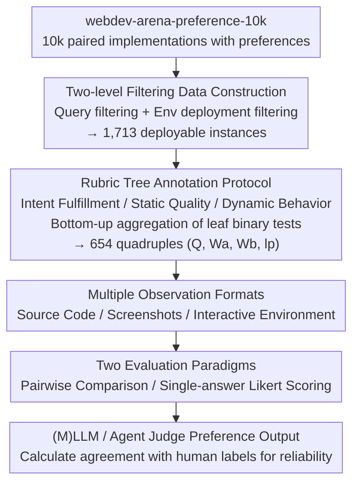

# WebDevJudge: Evaluating (M)LLMs as Critiques for Web Development Quality

**Conference**: ICLR 2026
**arXiv**: [2510.18560](https://arxiv.org/abs/2510.18560)
**Code**: [github.com/lcy2723/WebDevJudge](https://github.com/lcy2723/WebDevJudge)
**Area**: LLM/NLP
**Keywords**: LLM-as-a-judge, meta-evaluation, web development, pairwise comparison, agentic workflow

## TL;DR

The meta-evaluation benchmark WebDevJudge was constructed to systematically evaluate the capability of (M)LLMs and agentic workflows as judges in web development quality assessment tasks. The study found a ~15% agreement gap between current top-tier models and human experts, revealing two fundamental bottlenecks: failures in identifying functional equivalence and weak feasibility verification.

## Background & Motivation

**Background**: The LLM-as-a-judge paradigm has become a scalable alternative for automated evaluation, performing exceptionally well on well-defined tasks (e.g., QA, reasoning). As language agent capabilities enhance, this paradigm is extending from simple static tasks to complex real-world problems.

**Limitations of Prior Work**: Reliability verification for existing LLM-as-a-judge approaches focuses on static final results. In open-ended tasks involving dynamic environments and complex interactions (such as web development), their reliability remains largely unexplored. Web development requires real-time interaction assessment and is inherently open-ended—lacking a single gold standard answer.

**Key Challenge**: While the application range of automated evaluators is expanding, rigorous validation in complex interaction scenarios is severely lacking. Existing benchmarks (e.g., MT-Bench with only 63% annotator agreement) lack reliable ground truth.

**Key Insight**: Using web development as a testbed, this work introduces a structured annotation method called "rubric tree" to establish high-quality preference labels (agreement >80%), supporting both static (screenshots/code) and interactive (dynamic web environment) evaluations.

## Method

### Overall Architecture

WebDevJudge aims to answer a higher-level question: **how reliable are (M)LLMs as judges for web development quality?** It functions as a meta-evaluation benchmark: human experts first produce high-confidence preference labels as ground truth, and various judges attempt to replicate these labels. Performance is measured by the agreement rate between judge decisions and human labels.

The pipeline consists of two main stages. **The first stage is data construction**: starting from `webdev-arena-preference-10k` containing 10,000 paired web implementations, a two-level filter removes non-evaluable samples to obtain 1,713 deployable instances. The rubric tree protocol is then used to decompose "quality" into verifiable binary tests for manual annotation, resulting in 654 instances with reliable preference labels. Each instance is a quadruple $(Q, W_a, W_b, l_p)$ comprising a query $Q$, two implementations $W_a, W_b$, and a human preference label $l_p$. **The second stage is evaluation**: implementations are fed to (M)LLM or agent judges in three observation formats—source code, rendered screenshots, or interactive real-time environments. Judges output "win $a$ / win $b$ / tie" under pairwise comparison or point-wise scoring paradigms, and agreement with $l_p$ is calculated.

### Key Designs

**1. Two-level Filtering: Extracting evaluable instances from noisy preference data**
Raw data from `webdev-arena-preference-10k` cannot serve directly as an evaluation set due to undeployable, unclear, or harmful queries. WebDevJudge applies two levels of filtering: first, Query Filtering removes short/repetitive samples, then uses LLMs to filter by safety, clarity, and feasibility. Second, Environment Filtering deploys implementations to a unified environment, discarding those that fail or rely on obscure libraries. Multi-modal LLMs filter out blank pages or error screens. This results in 1,713 high-quality deployable instances.

**2. Rubric Tree Annotation Protocol: Decomposing subjective judgment into verifiable binary tests**
Web development evaluation lacks standard answers; direct human scoring often leads to disagreement (only 65% agreement including ties without structural protocols). WebDevJudge constructs a rubric tree for each query across three dimensions: **Intent Fulfillment, Static Quality, and Dynamic Behavior**. General quality is refined into leaf nodes representing explicit binary tests (e.g., "does a confirmation box appear after clicking submit"). Results aggregate bottom-up to the root preference. This increased agreement (including ties) from 65% to 92%. Automated generation of these trees via few-shot LLMs showed 95.1% agreement with human-written trees (excluding ties), proving scalability. Final human agreement stood at 89.7%.

**3. Multiple Observation Formats: Enabling judges to read code, view screenshots, and interact**
Static code or screenshots often miss quality issues that only appear during runtime (e.g., unresponsive buttons), which is the primary reason for using web development as a platform. Implementations are provided in three forms: source code for static analysis, rendered screenshots for visual assessment, and an interactive real-time environment for dynamic behavior verification. Interactive verification is performed by a GUI Agent (UI-TARS-1.5) in the deployed environment. This allows comparison between traditional judges and interactive agent judges, facilitating bottleneck analysis.

**4. Two Evaluation Paradigms: Concurrent pairwise and point-wise scoring**
WebDevJudge supports two paths for judge output using the same instances and labels. Pairwise comparison presents $W_a$ and $W_b$ simultaneously to determine the winner based on relative judgment. Single-answer scoring independently rates each implementation on a four-dimensional Likert scale (Functionality, UI Quality, Code Quality, Interactivity; 1–5 scale), with preferences derived from score differences. Experiments revealed that pairwise comparison typically outperforms single-answer scoring by over 8 percentage points, suggesting relative comparison is an ability more effectively internalized by models.

## Key Experimental Results

### Main Results: Agreement Rate of Different Evaluators (%)

| Model | Single-answer Likert | Pairwise Comparison |
|------|----------|---------|
| GPT-4.1 | 60.86 | **70.34** |
| GPT-4o | 57.65 | 67.74 |
| Claude-4-Sonnet | 59.17 | 70.18 |
| Claude-3.7-Sonnet | 63.91 | 68.96 |
| DeepSeek-R1-0528 | 54.59 | 66.97 |
| Qwen3-235B | 59.94 | 66.06 |
| Agentic Workflow (Combined) | 60.55 | - |
| **Human Expert** | - | **84.56** |

### Ablation Study: Comparison of Annotation Agreement

| Condition | No Rubric Tree | With Rubric Tree (Human) | With Rubric Tree (LLM-Gen) |
|------|---------|---------------|-------------------|
| % Agreement (incl. tie) | 65.0 | 92.0 | 90.0 |
| % Agreement (excl. tie) | 91.3 | 95.5 | 95.1 |

### Key Findings

- **Significant Human-AI Gap**: The strongest model (GPT-4.1) achieved 70.34% pairwise agreement, lagging ~14% behind the human benchmark (84.56%).
- **Pairwise Superiority**: Pairwise comparison consistently outperformed single-answer scoring by an average of over 8 percentage points.
- **Reasoning Models No Advantage**: Reasoning models (e.g., Claude-4-Sonnet) performed similarly to non-reasoning counterparts.
- **Agentic Workflows Underperform**: Error accumulation in plan-execute-summarize pipelines led to performance degradation compared to single-model judges.
- **Limited Gain from Structured Guidance**: Under pairwise comparison, "Direct" settings performed comparably to guidance from rubric trees or Likert scales.

## Highlights & Insights

1. **High-Quality Benchmark Construction**: Improved annotation agreement from 63% (MT-Bench) to 89.7% via rubric trees, providing a transferable methodology for other open-ended evaluation tasks.
2. **Systematic Failure Mode Analysis**: Identified major bottlenecks in functional equivalence recognition (e.g., misjudging identical header functionality due to different text) and insufficient feasibility verification.
3. **In-depth Paradigm Analysis**: The comparison between pairwise and single-answer scoring provides practical guidance for evaluation protocol design.
4. **Negative Findings on Agentic Workflows**: The error accumulation issue in multi-stage pipelines is a critical observation for the autonomous agent research community.

## Limitations & Future Work

- The benchmark scale is relatively small (654 instances), potentially not covering all web development scenarios.
- Rubric trees are generated by LLMs and human-verified; fully automated high-quality generation remains a challenge.
- Interactive evaluation depends on the GUI Agent (UI-TARS-1.5), whose own limitations introduce noise.
- Deep dimensions like code security and maintainability are not yet considered.
- The gap reduction potential of fine-tuning dedicated web evaluation models remains unexplored.

## Related Work & Insights

- Complementary to text-based benchmarks like MT-Bench and JudgeBench, WebDevJudge introduces interactive dynamic environment evaluation.
- Aligns with the "Agent-as-a-Judge" direction but provides realistic negative results: multi-stage pipelines are not always superior to end-to-end evaluation.
- The rubric tree methodology is applicable to other complex scenarios (e.g., UI design or game testing evaluation).
- Functional equivalence issues suggest a need for better code semantic understanding.

## Rating

- **Novelty**: ⭐⭐⭐⭐ — First meta-evaluation benchmark supporting interactive web development.
- **Experimental Thoroughness**: ⭐⭐⭐⭐⭐ — Comprehensive experiments across multiple models, paradigms, and observations.
- **Writing Quality**: ⭐⭐⭐⭐ — Clear structure and in-depth analysis.
- **Value**: ⭐⭐⭐⭐ — Provides critical warnings and baselines for LLM-as-a-judge in complex tasks.

<!-- RELATED:START -->

## Related Papers

- [\[ICLR 2026\] Evaluating Text Creativity across Diverse Domains: A Dataset and Large Language Model Evaluator](evaluating_text_creativity_across_diverse_domains_a_dataset_and_large_language_m.md)
- [\[ACL 2025\] Game Development as Human-LLM Interaction](../../ACL2025/llm_nlp/game_development_as_human-llm_interaction.md)
- [\[ACL 2025\] ComfyUI-Copilot: An Intelligent Assistant for Automated Workflow Development](../../ACL2025/llm_nlp/comfyui-copilot_an_intelligent_assistant_for_automated_workflow_development.md)
- [\[ACL 2025\] Achieving Certification-by-Design Through Model-Driven Development](../../ACL2025/llm_nlp/achieving_certification-by-design_through_model-driven_development.md)
- [\[ICML 2026\] Optimizing Diversity and Quality through Base-Aligned Model Collaboration](../../ICML2026/llm_nlp/optimizing_diversity_and_quality_through_base-aligned_model_collaboration.md)

<!-- RELATED:END -->
