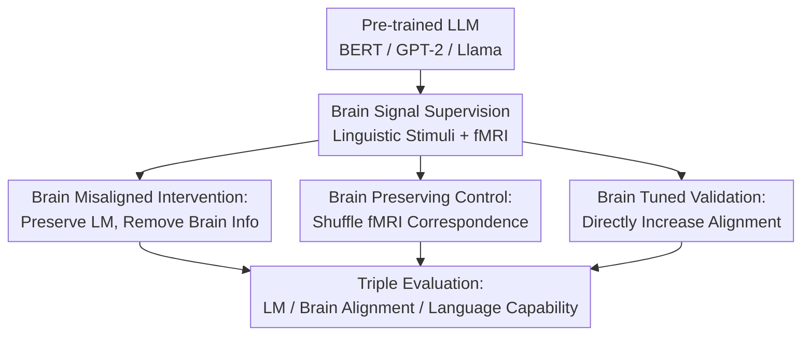

# When Language Models Lose Their Mind: The Consequences of Brain Misalignment

**Conference**: ICLR 2026  
**OpenReview**: [https://openreview.net/forum?id=MkrsbXl1GI](https://openreview.net/forum?id=MkrsbXl1GI)  
**Code**: To be confirmed  
**Area**: LLM Others  
**Keywords**: Brain alignment, fMRI, language capability, adversarial fine-tuning, causal intervention  

## TL;DR
This paper uses "brain misalignment" interventions to deliberately remove information from LLM representations that predicts fMRI signals in the human brain's language areas while maintaining language modeling loss. It finds that such a decrease in brain alignment systematically impairs over 200 language probing tasks, including semantics and syntax, whereas enhancing brain alignment yields linguistic performance gains.

## Background & Motivation
**Background**: Recent work in cognitive neuroscience and NLP has found that intermediate representations of pre-trained language models (LLMs) can predict human brain activity, particularly fMRI responses in language-related areas, when given the same linguistic stimuli. This phenomenon is often termed "brain alignment," suggesting that models capture structural representations similar to human language processing.

**Limitations of Prior Work**: The primary issue is that observing "alignment" does not equate to knowing "alignment is useful." One possibility is that brain alignment is merely a byproduct of training strong language models; another is that the representations aligned with the human language system are foundational for the model to perform tasks like semantics, syntax, and discourse reasoning. Correlation analysis alone cannot distinguish between these explanations.

**Key Challenge**: The central conflict addressed is: if brain alignment is just a byproduct, then weakening it while maintaining language modeling performance should not significantly harm downstream linguistic capabilities. Conversely, if brain alignment carries essential information for language, "misalignment" should cause degradation in fine-grained language tasks. A key difficulty is that brain alignment lacks explicit counterfactual inputs (unlike POS tags or entity types), making it impossible to remove "brain information" by simply modifying tokens.

**Goal**: The authors aim to construct sets of comparable models: one set where brain alignment is actively reduced while maintaining language modeling ability; another control set that undergoes similar training and perturbations without destroying the correspondence between stimuli and brain activity; and a third set where brain alignment is actively enhanced. This allows for controlling factors like "training process," "continued fine-tuning," and "adversarial removal" to isolate the impact of brain alignment on language capability.

**Key Insight**: The paper approaches the problem via representation intervention rather than input counterfactuals. The authors attach brain mapping heads to BERT, GPT-2, and Llama-3.2-1B and use fMRI supervision to measure brain predictability. They then use gradient reversal layers (GRL) to update backbone representations in a direction that prevents the brain mapping head from predicting fMRI signals well. This forces the model to discard brain-related information while still performing language modeling on the same stimuli.

**Core Idea**: Construct "brain-misaligned" LLMs via dual-objective fine-tuning (Language Modeling Preservation + Adversarial Brain Prediction Removal) and compare them with "brain-preserving" and "brain-tuned" models to test whether brain alignment serves as a functional support for language capabilities.

## Method

### Overall Architecture
The methodology is framed as a causal intervention experiment rather than a new downstream task model. Inputs consist of natural language stimuli and corresponding fMRI recordings. The outputs are three categories of models fine-tuned via LoRA: Brain Misaligned, Brain Preserving, and Brain Tuned. The authors measure language modeling loss, brain alignment coefficients, and performance on over 200 linguistic probing tasks to isolate the effects of brain alignment.

The authors utilize two public fMRI datasets: the Harry Potter dataset (8 subjects reading a chapter) and the Moth Radio Hour dataset (6 subjects reading story texts). Only voxels with a noise ceiling greater than 0.05 and located in language-related regions are selected to minimize the impact of fMRI noise.

The model suite covers BERT-base-cased, GPT-2 small, and Llama-3.2-1B. Training samples consist of word sequences corresponding to 5 TRs (Repetition Times). Interventions are performed via LoRA to prevent global updates from causing uncontrollable drifts in overall model capability.

### Key Designs
**1. Brain Misaligned Intervention: Removing Brain-Predictable Information While Preserving LM**

The key to the Brain Misaligned model is not simply making the model worse, but ensuring it "remains largely unchanged in language modeling while becoming significantly worse at brain prediction." Two objectives are attached to the LLM: a standard language modeling head and a brain mapping head. A GRL is placed before the brain mapping head; during backpropagation, the gradient direction is flipped, forcing the backbone to learn representations from which the mapping head cannot easily read out fMRI signals.

This design addresses the biggest loophole in correlation studies: performance drops might stem from training noise or general LM degradation. By maintaining LM loss, the intervention specifically targets whether brain-related information remains decodable from the representations. The total loss is defined as $L=\omega_{lm}L_{lm}+\omega_{ba}L_{ba}$, where $L_{lm}$ is cross-entropy and $L_{ba}$ relates to the Pearson correlation between predicted and real fMRI signals.

**2. Brain Preserving Control: Controlling for Adversarial Training and Continued Fine-tuning**

The Brain Preserving model follows an identical training process but shuffles the correspondence between fMRI images and linguistic stimuli. The model still undergoes adversarial training and LoRA fine-tuning on the same stimuli, but the brain loss no longer carries meaningful information about the actual brain activity corresponding to the text. This control group helps distinguish whether degradation in the Misaligned group is due to the removal of brain alignment or merely the byproduct of fine-tuning and adversarial structures.

**3. Brain Tuned Validation: Verifying Alignment as Beneficial**

The Brain Tuned model removes the GRL, allowing the brain mapping head to encourage the model to improve fMRI predictability. This provides a bidirectional verification: if reducing alignment hurts performance, does increasing it provide gains? Results indicate that the Brain Tuned model systematically outperforms the Brain Preserving model, particularly in semantic and syntactic tasks.

**4. Triple Evaluation: Language Modeling, Brain Alignment, and Fine-grained Language Capability**

Evaluation is split into three layers. First, LM loss on held-out stimuli checks basic modeling integrity. Second, brain alignment is measured using Pearson correlation between predicted and real fMRI. Third, over 200 classifier-based probing datasets from the Holmes benchmark are used, covering semantics, syntax, morphology, discourse, and reasoning. This allows the authors to pinpoint exactly which linguistic phenomena are most affected by brain misalignment.

### Loss & Training
Language modeling utilizes standard cross-entropy for masked tokens (BERT) or causal next-token prediction (GPT-2/Llama). For brain alignment, representations from the last transformer block (concatenating the current TR and 5 previous TRs to account for hemodynamic delay) are used.

The brain mapping head is a linear function with ridge regularization. Brain alignment is measured as the Pearson correlation between predicted voxel values $\hat{y}_j$ and real values $y_j$: $brain\ alignment(q,v_j)=corr(\hat{y}_j,y_j)$. For all models, LoRA is used with 5 epochs, a batch size of 16, and the AdamW optimizer. Weights are set to $\omega_{lm}=0.1$ and $\omega_{ba}=10$ to balance the two objectives.

## Key Experimental Results

### Main Results
| Comparison | Model / Data | Evaluation Object | Main Results | Conclusion |
|------|-------------|----------|----------|------|
| Brain Misaligned vs Brain Preserving | BERT, GPT-2, Llama; HP & Moth | All Holmes tasks | Preserving significantly outperforms Misaligned ($p<0.05$ overall) | Removing brain alignment degrades general language capability |
| Brain Misaligned vs Brain Preserving | BERT-Harry | Semantics, Syntax, Morph, etc. | Preserving better across all sub-fields | Brain misalignment effects are most stable on BERT |
| Brain Misaligned vs Brain Preserving | GPT2-Harry | All tasks | Preserving better, trend $p=0.055$ | Consistent trend but weaker statistical power on GPT-2 |
| Brain Misaligned vs Brain Preserving | Llama-Harry | All tasks & sub-fields | Preserving significantly better ($p<0.001$) | Brain misalignment impairments persist in newer LLMs |
| Brain Tuned vs Brain Preserving | All settings (Avg) | All Holmes tasks | Tuned significantly outperforms Preserving ($p<0.05$) | Increasing brain alignment yields linguistic gains |

### Ablation Study
| Configuration | Key Metric | Description |
|------|---------|------|
| Brain Preserving | High BA, comparable LM loss | Control group; preserves training pipeline but shuffles fMRI mapping |
| Brain Misaligned | Significantly lower BA, lower capability | Intervention group; removes brain-related info via GRL |
| Brain Tuned | Increased BA, generally higher capability | Validation group; enhances alignment signals |
| GPT2-Moth Misaligned | Weaker brain removal effect | Highlights that results depend on model/data quality and intervention intensity |
| Sub-field breakdown | Semantics and Syntax most affected | Brain alignment is crucial for fine-grained linguistic structures |

### Key Findings
- The Brain Misaligned model shows significantly lower Pearson correlation in language ROIs, proving the intervention successfully targets brain-predictable information.
- With comparable LM loss, Brain Misaligned models perform worse on the Holmes benchmark, supporting the "functional necessity" hypothesis over the "byproduct" hypothesis.
- Semantics and syntax are the most consistently affected sub-fields across BERT, Llama, and various datasets.
- Brain Tuned models provide counter-verification: increasing brain alignment significantly improves overall language performance, with the clearest gains in semantics and syntax.

## Highlights & Insights
- The greatest strength of this paper is moving brain alignment from a "correlational phenomenon" to an "intervenable variable." It asks: if the model is made less like a brain, can it still do language? This is a much stronger causal explanation than a simple brain score.
- The Brain Preserving control is ingenious. By shuffling fMRI mapping, the authors isolate the effect of "brain-relevant information" from "adversarial training perturbations."
- The Holmes benchmark's inclusion of over 200 tasks allows for a more nuanced view of language than standard GLUE scores, revealing which linguistic structures depend most on brain-like representations.
- The study provides a template for NeuroAI: any emergent property that lacks natural counterfactuals can be investigated using this triad of preservation, removal, and enhancement groups.

## Limitations & Future Work
- **fMRI Scale**: Data is limited to specific subjects and narratives (Harry Potter, Moth Radio). Conclusions may vary with different languages or reasoning tasks.
- **Benchmark Coverage**: While comprehensive, Holmes is still a proxy. Certain areas like discourse have fewer samples, which may affect statistical significance.
- **Linearity**: The paper focuses on linear predictability. Future work could explore whether non-linear alignments or hierarchical mapping across brain regions play different roles.
- **Cost**: While Brain Tuned results are promising, using fMRI signals for training is expensive. Finding scalable proxies (e.g., distilled representation constraints) is a vital next step.
- **Mechanism Deep-dive**: The paper does not fully explain *why* semantics and syntax are most affected. Finer correspondence analysis between specific brain regions and linguistic phenomena is needed.

## Related Work & Insights
- **Comparison to correlation studies**: Unlike Toneva & Wehbe or Schrimpf, who measure similarity, this work uses adversarial removal to test functional necessity.
- **Comparison to brain-tuning**: While previous work tried to improve models using brain signals, this paper's simultaneous use of negative removal and positive enhancement more clearly distinguishes the utility of brain signals from general supervision effects.
- **Causal NLP**: This research provides a pathway for causal analysis of abstract cognitive attributes that do not have simple input-level counterfactuals.

## Rating
- Novelty: ⭐⭐⭐⭐⭐ Advancing from correlation to causal intervention via misaligned/preserving/tuned model triads.
- Experimental Thoroughness: ⭐⭐⭐⭐☆ Extensive coverage across models and tasks, though constrained by brain data availability.
- Writing Quality: ⭐⭐⭐⭐☆ Clear logic and intuitive control design, although some quantitative details are buried in appendices.
- Value: ⭐⭐⭐⭐⭐ Highly influential for NeuroAI and LLM interpretability, providing a template for studying the functional role of emergent properties.

<!-- RELATED:START -->

## Related Papers

- [\[NeurIPS 2025\] Do Language Models Use Their Depth Efficiently?](../../NeurIPS2025/llm_nlp/do_language_models_use_their_depth_efficiently.md)
- [\[ACL 2025\] Improve Language Model and Brain Alignment via Associative Memory](../../ACL2025/llm_nlp/improve_language_model_and_brain_alignment_via_associative_memory.md)
- [\[ICLR 2026\] Trapped by simplicity: When Transformers fail to learn from noisy features](trapped_by_simplicity_when_transformers_fail_to_learn_from_noisy_features.md)
- [\[ACL 2025\] Theory of Mind in Large Language Models: Assessment and Enhancement](../../ACL2025/llm_nlp/theory_of_mind_llm.md)
- [\[ACL 2026\] CoSToM: Causal-oriented Steering for Intrinsic Theory-of-Mind Alignment in Large Language Models](../../ACL2026/llm_nlp/costomcausal-oriented_steering_for_intrinsic_theory-of-mind_alignment_in_large_l.md)

<!-- RELATED:END -->
