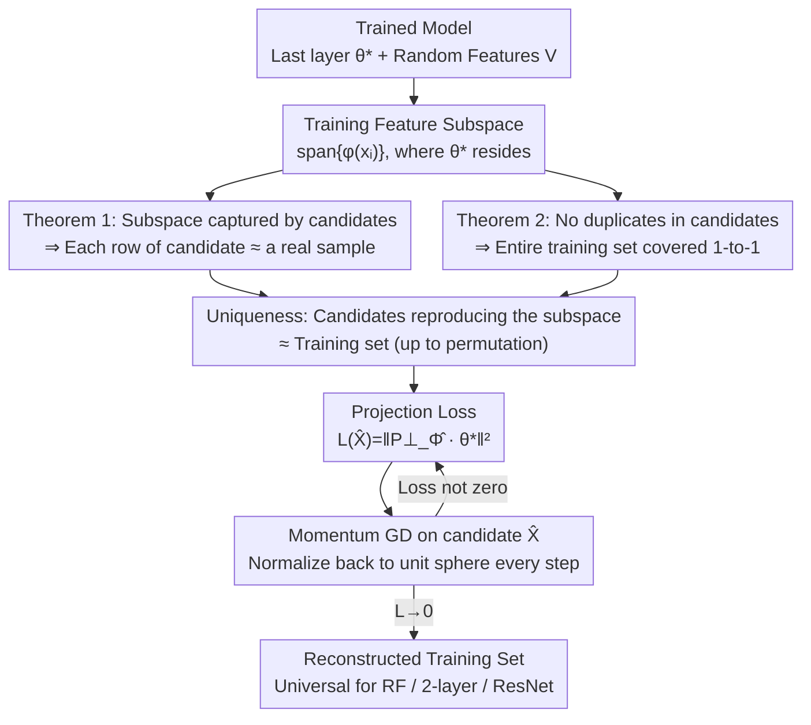

# A Law of Data Reconstruction for Random Features (and Beyond)

**Conference**: ICLR 2026  
**arXiv**: [2509.22214](https://arxiv.org/abs/2509.22214)  
**Code**: [https://github.com/iurada/data-reconstruction-law](https://github.com/iurada/data-reconstruction-law)  
**Area**: Machine Learning Theory / Privacy  
**Keywords**: Data Reconstruction, Over-parameterization, Random Features, Memorization, Privacy  

## TL;DR
This paper demonstrates an information-theoretical and algebraic "data reconstruction law" in random feature (RF) models: when the number of parameters $p \gg dn$ (where $d$ is data dimension and $n$ is the number of samples), the training data can be fully reconstructed. The universality of this threshold is verified across RF, two-layer networks, and ResNet using a projection loss optimization method.

## Background & Motivation

**Background**: It is well-established that neural networks can interpolate (memorize labels) when the number of parameters $p \gg n$. Classical theory often equates memorization with label fitting.

**Limitations of Prior Work**: There is a lack of theoretical characterization regarding the reconstruction of training data from model parameters (rather than just fitting labels). While empirical observations suggest that larger models facilitate easier reconstruction, a rigorous theoretical threshold for the parameter count is missing. Data extraction attacks on foundation models (e.g., GPT-4, Stable Diffusion) highlight significant privacy risks, necessitating an understanding of the conditions for reconstruction feasibility.

**Key Challenge**: Label fitting requires $n$ degrees of freedom ($n$ equations), but data reconstruction requires recovering the entire $d \times n$ dimensional input matrix. Intuitively, this requires $p \geq dn$ degrees of freedom—yet a formal proof of this condition was missing.

**Goal**: To establish a parameter threshold theory for data reconstruction, answering "how large a model must be to memorize the training data itself (not just the labels)."

**Key Insight**: Establish theory on analytically tractable Random Feature (RF) models by deriving sufficiency conditions for reconstruction based on feature subspace properties, then generalize to deep networks through numerical experiments.

**Core Idea**: A phase transition threshold exists for data reconstruction at $p \approx dn$. Below this value, reconstruction is impossible; above it, the training data can be fully recovered from model parameters.

## Method

### Overall Architecture
The study centers on one question: How large must a model be for training data to be extracted from its parameters? Theoretically, the Random Feature regression model $f_{RF}(x,\theta) = \varphi(x)^\top \theta$ is used as a proxy—its training solution has a closed-form expression, allowing for precise analysis of the feature subspace's algebraic structure. The workflow is as follows: given the trained last-layer parameters $\theta^*$ and the random feature matrix $V$, they jointly determine the subspace spanned by the training samples in the feature space. The authors prove two theorems which together demonstrate that for $p \gg dn$, the set of candidate inputs that can reproduce this subspace is essentially only the training set itself (up to a permutation). With this uniqueness, reconstruction transforms from "guessing data" to "solving constraints"—by minimizing a projection loss that enforces the candidate subspace to contain $\theta^*$. Gradient descent is then applied to the candidate inputs until the loss reaches zero. Finally, this loss is applied directly to the last layers of two-layer networks and ResNets to verify the threshold's universality.

### Key Designs

**1. Theorem 1: Feature Subspace Equality ⇒ Input Data Similarity**

This serves as the foundation of the reconstruction argument. The core challenge is proving that if a candidate $\hat{X}$ fits the output, it must resemble the original data. The theorem asserts that for $p \gg dn$, if the subspace spanned by candidate features contains the original features, then every row of the candidate $\hat{X}$ must be close to some original training sample $x_i$. The proof relies on two points: using the concentration of RF kernels to ensure rows of the feature matrix $\Phi$ are linearly independent, and analyzing the Hermite expansion of the non-linear activation. By decomposing the constraint $\varphi(\hat{x}) = \sum_i a_i \varphi(x_i)$ into Hermite components, $\hat{x}$ is forced to lie near some $x_i$. To ensure this holds uniformly for all possible $\hat{x}$, the authors use an $\varepsilon$-net to discretize the continuous space and apply uniform concentration—this step is where the $p \gg dn$ condition is critical for the inequality to hold across the entire net.

**2. Theorem 2: Excluding Duplicates to Ensure Full Dataset Recovery**

Theorem 1 leaves a gap: it ensures each candidate row is near *some* training sample, but does not prevent multiple rows from collapsing to the same sample $x_1$ while missing others. Theorem 2 addresses this by proving for the $n=2$ case that $\hat{x}_1, \hat{x}_2$ cannot both approach $x_1$ simultaneously, ensuring a one-to-one coverage of the training set. This is proven by contradiction using Taylor expansion: assuming two rows converge to $x_1$, projecting the residual along the $\varepsilon_2 - \varepsilon_1$ direction and using the generalized Stein's Lemma on high-order non-linear terms leads to a contradiction. Together, Theorem 1 and 2 support the conclusion that the training set is reconstructed in its entirety.

**3. Projection Loss: Transforming Uniqueness into an Optimizable Objective**

The algebraic structure of the training solution provides a practical algorithm: the least squares solution $\theta^* = \Phi^+ Y$ must reside in the subspace $\text{span}\{\varphi(x_i)\}$. Conversely, if a candidate $\hat{X}$ is correct, its subspace must contain $\theta^*$. The smaller the component of $\theta^*$ in the orthogonal complement of the candidate subspace, the better the candidate. This leads to the loss function:

$$\mathcal{L}(\hat{X}) = \big\|P_{\hat{\Phi}}^\perp\, \theta^*\big\|_2^2,$$

where $P_{\hat{\Phi}}^\perp$ is the orthogonal projection onto the complement of the candidate feature subspace. Optimization is performed via momentum gradient descent on $\hat{X}$, with each row normalized back to the unit sphere. This loss is a natural derivation of the theory rather than a heuristic and can be migrated to the last layer of two-layer networks and ResNets without modification.

### Loss & Training
Reconstruction does not involve training a new model; it optimizes candidate inputs $\hat{X}$ using momentum gradient descent on the projection loss. This assumes access to the trained last-layer parameters $\theta^*$ and the random feature matrix $V$ (or equivalent preceding parameters). Essentially, an attacker only needs to read the model weights to reverse-engineer the training data.

## Key Experimental Results

### Main Results

**CIFAR-10 RF Model Reconstruction ($n=100$, $d=3072$, ReLU):**

| Parameters $p$ | Training Loss | Recon. Error $\rho$ | Status |
|-----------|---------|---------------|------|
| $p = n$ | ~0 | ~1.0 | Label fitting only |
| $p = dn$ | ~0 | ~0.5 | Reconstruction starts |
| $p = 10dn$ | ~0 | **~0** | Full reconstruction |

### Ablation Study

| Configuration | Recon. Threshold | Description |
|------|---------|------|
| RF (Spherical data) | $p \approx dn$ | Perfectly aligns with theory |
| 2-layer Net (GD) | $p^{(L)} \approx dn$ | Dictated by last layer width |
| ResNet (GD) | $p^{(L)} \approx dn$ | Remains consistent |
| Logistic loss (Clf) | $p \approx dn$ | Not limited to regression |
| Cross-entropy | $p^{(L)} \approx dn$ | Remains consistent |

### Key Findings
- The label fitting threshold $p = n$ and data reconstruction threshold $p = dn$ are two distinct phase transitions—there exists a large "gray zone" between them where the model remembers labels but cannot reconstruct data.
- ReLU Sign Ambiguity: Since ReLU's odd-order Hermite coefficients (for orders $\geq 3$) are zero, reconstruction may involve sign flips. Using $\phi(z) = \text{ReLU}(z) + \tanh(z)$ eliminates this issue.
- The $p \gg dn$ threshold matches the "smooth interpolation" threshold found in adversarial robustness literature, suggesting an intrinsic link between adversarial robustness and data reconstruction capability.
- In cases where the estimated sample size $\hat{n} \neq n$: if $\hat{n} > n$, the model generates correct samples plus duplicates; if $\hat{n} < n$, samples are merged.

## Highlights & Insights
- **Elegant Phase Transition**: Identifying $p=n$ for label memorization and $p=dn$ for data memorization, where the ratio is precisely the data dimension $d$, provides a clear physical intuition—reconstruction requires recovering $dn$ degrees of freedom.
- **Theory-Driven Algorithm**: The projection loss is not arbitrary but derived naturally from algebraic analysis—if $\theta^*$ is within the feature subspace, reconstruction succeeds.
- **Cross-Architecture Universality**: Although the theory is proven for RF models, experiments show the threshold holds for two-layer networks, ResNet, and ViT, implying last-layer over-parameterization is the decisive factor.

## Limitations & Future Work
- Theorem 2 is only proven for $n=2$; proving the exclusion of duplicates for $n \geq 3$ involves technical difficulties with combinatorial explosions.
- Theoretical assumptions require activation functions with specific Hermite coefficients (which ReLU does not fully satisfy), though ReLU still works in practice with sign ambiguity.
- There is no proof that the global optimum of the projection loss is always a permutation of the training data—guarantees in the non-convex optimization landscape are still lacking.
- Preliminary discussions exist for the "intermediate regime" $n \ll p \ll dn$, but it remains unclear if individual samples can be reconstructed information-theoretically.

## Related Work & Insights
- **vs Haim et al. 2022**: Haim reconstructs boundary samples via maximum-margin KKT conditions; this method reconstructs all samples via subspace projection.
- **vs Loo et al. 2022**: Loo derives reconstruction in the infinite-width limit ($p \to \infty$); this work identifies a specific finite threshold $p \gg dn$.
- **vs Adversarial Robustness**: The $p \gg dn$ threshold is also a necessary/sufficient condition for smooth interpolation, suggesting a deep link: "smooth memorization → reconstructability."

## Rating
- Novelty: ⭐⭐⭐⭐⭐ First to provide a parameter phase transition threshold for data reconstruction with deep theoretical depth.
- Experimental Thoroughness: ⭐⭐⭐⭐⭐ Comprehensive coverage from synthetic data to CIFAR-10/Tiny-ImageNet, and from RF to ResNet/ViT.
- Writing Quality: ⭐⭐⭐⭐⭐ Theory and experiments are tightly coupled; Figure 1 is highly persuasive, and the proof sketches are clear.
- Value: ⭐⭐⭐⭐⭐ Critical implications for privacy and security—provides a quantitative characterization of model vulnerability related to size.

<!-- RELATED:START -->

## Related Papers

- [\[NeurIPS 2025\] Optimal Online Change Detection via Random Fourier Features](../../NeurIPS2025/llm_pretraining/optimal_online_change_detection_via_random_fourier_features.md)
- [\[ICLR 2026\] What Scales in Cross-Entropy Scaling Law?](what_scales_in_cross-entropy_scaling_law.md)
- [\[ICLR 2026\] Understanding the Emergence of Seemingly Useless Features in Next-Token Predictors](understanding_the_emergence_of_seemingly_useless_features_in_next-token_predicto.md)
- [\[ICLR 2026\] FoNE: Precise Single-Token Number Embeddings via Fourier Features](fone_precise_single-token_number_embeddings_via_fourier_features.md)
- [\[ICLR 2026\] Beyond Length: Quantifying Long-Range Information for Long-Context LLM Pretraining Data](beyond_length_quantifying_long-range_information_for_long-context_llm_pretrainin.md)

<!-- RELATED:END -->
