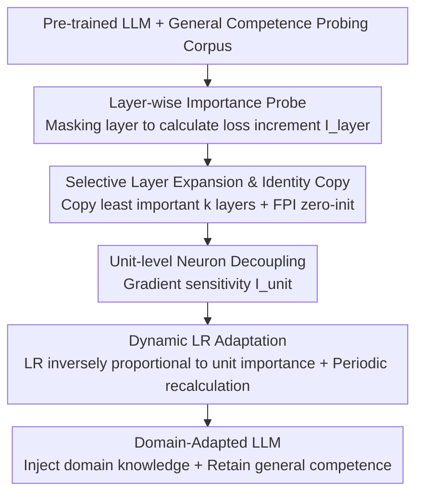

# ADEPT: Continual Pretraining via Adaptive Expansion and Dynamic Decoupled Tuning

**Conference**: ICLR 2026  
**OpenReview**: [https://openreview.net/forum?id=vcWDDfA4Ev](https://openreview.net/forum?id=vcWDDfA4Ev)  
**Code**: https://github.com/PuppyKnightUniversity/ADEPT.git  
**Area**: LLM Pretraining / Continual Pretraining / Domain Adaptation  
**Keywords**: Continual Pretraining, Catastrophic Forgetting, Layer Expansion, Functional Specialization, Decoupled Tuning

## TL;DR
ADEPT discovers that the contributions of different layers and parameter units in LLMs to "general competence" are highly non-uniform. Consequently, it only replicates the layers least important to the general domain to create new capacity and assigns asymmetric learning rates within these expanded layers based on unit importance. In continual pretraining (CPT) for math and medical domains, this method injects new knowledge with almost no damage to general competence—tuning only 15% of parameters in less than 50% of the training time, yet achieving 5.76% higher performance on general benchmarks and 5.58% higher on domain benchmarks compared to full-parameter CPT.

## Background & Motivation

**Background**: To adapt general LLMs to specialized fields like mathematics or medicine, the mainstream approach is Continual Pretraining (CPT)—continuing next-token prediction on domain-specific corpora using a pre-trained model.

**Limitations of Prior Work**: The primary challenge of CPT is **catastrophic forgetting**. Pre-trained model parameters are already "saturated" with general knowledge, leaving little capacity for domain knowledge. Using gradients to force-fit domain signals over-writes existing parameters, leading to a collapse of general capabilities. Existing mitigation methods have flaws: data replay partially preserves old knowledge but does not increase model capacity, leaving the conflict between injection and retention unresolved; layer expansion (e.g., LLaMA-Pro) adds capacity by inserting new layers but does so **uniformly** across depths and updates all new parameters **indiscriminately**.

**Key Challenge**: Uniform expansion ignores the **functional specialization** within LLMs. The authors' probing experiments found that layers critical for general knowledge are concentrated in the **shallow layers**, becoming less important in deeper stages. Within the same layer, the contribution of different parameter units (attention projections, MLP, normalization) to general competence is also highly uneven. Blindly expanding and updating under such a structure writes new knowledge into regions critical for general tasks, failing to solve the forgetting problem.

**Goal**: Make capacity allocation "importance-guided" and optimization "functionally decoupled," both aimed at minimizing interference with general competence.

**Key Insight**: Since layers and units have functional divisions, expansion should target layers with the **weakest constraints from the general domain** (as they are more "plastic" and better at absorbing domain knowledge), and updates should **protect general critical units while allowing plastic units to adapt**.

**Core Idea**: Make both expansion and updates "function-aware"—replicating only the least important layers for the general domain to expand capacity, and assigning learning rates inversely proportional to unit importance within those expanded layers.

## Method

### Overall Architecture

ADEPT is a two-stage framework. **Stage 1 (General-Competence Guided Selective Layer Expansion)** uses a probe to assign a "general domain importance score" to each layer, selecting the $k$ least important layers for identity copying to create "blank slate" capacity. **Stage 2 (Adaptive Unit-Wise Decoupled Tuning)** then decomposes these expanded layers into semantic units and assigns asymmetric learning rates inversely proportional to unit importance, ensuring general critical units are updated conservatively while plastic units freely learn domain knowledge. Throughout the process, the original layers are frozen, and only the replicated expansion layers are trained.

### Key Designs

**1. Layer/Unit Importance Probe: Quantifying functional specialization by "loss of general competence upon ablation"**

ADEPT relies on measuring which parameters are important for the general domain through two levels of probing. **Layer-level**: Given a general probing corpus $D_{\text{probe}}$, first calculate the baseline next-token prediction loss $L_{\text{base}}=\frac{1}{|D_{\text{probe}}|}\sum_x \ell(M_0(x),x)$. Then, use a residual bypass to mask the output of layer $l$ and recalculate the loss $\hat{L}^{(l)}$. The layer importance is the loss increment $I^{(l)}_{\text{layer}}=\hat{L}^{(l)}-L_{\text{base}}$. Results show that general critical layers are concentrated in the shallow regions. **Unit-level**: Decompose each layer into functional units (attention projections, MLP, normalization). Use a first-order Taylor approximation to estimate the importance of each parameter $\theta_j$ within unit $U$ as $I_j=\theta_j\cdot\nabla_{\theta_j}L$. Unit importance is the average $I_{\text{unit}}=\frac{1}{|U|}\sum_{j\in U}I_j$. This metric is more cost-effective than neuron-wise analysis and finer than layer-wise analysis.

**2. Selective Layer Expansion + Identity Copy: Adding capacity only in "most plastic" layers with non-disruptive initialization**

To address the issue that uniform insertion overwrites general critical layers, ADEPT sorts layers by $I^{(l)}_{\text{layer}}$ in ascending order and selects the $k$ layers with the lowest importance $S_k=\arg\min_{|S|=k}\sum_{l\in S} I^{(l)}_{\text{layer}}$, termed **Domain-Adaptable Layers**. Parameters of these selected layers are directly copied ($\tilde{\Theta}^{(l)}=\Theta^{(l)}$) rather than reinitialized. To maintain stability, the expansion branch follows the **Function-Preserving Initialization (FPI)** principle: zero-initializing the **output projections** of the copied attention and FFN sub-layers ($W^{\text{out}}_{\text{MHSA}}=0,\,W^{\text{out}}_{\text{FFN}}=0$). Thus, the initial output of the expanded model is identical to the original model $M_1(x)=M_0(x)$. This makes the expansion layers a "blank slate" that provides domain representation capacity while minimizing risks to general competence. Appendix F.1 proves that expanding the least important general layers provably minimizes forgetting risk.

**3. Unit-Wise Decoupling + Dynamic Asymmetric LR: Assigning LR inversely proportional to importance**

Expansion alone is insufficient as plasticity varies within expansion layers. ADEPT performs unit-level decoupling on these layers: reusing $I_{\text{unit}}$, each unit is assigned a learning rate $lr_U=2\cdot(1-I_{\text{unit}})\cdot lr_{\text{base}}$, where 2 is a normalization coefficient to keep the effective average LR roughly constant. The logic is straightforward—units critical to general competence (higher $I_{\text{unit}}$) receive a smaller LR to prevent overwriting, while less important units are allowed to learn domain data more aggressively. The training objective is the standard autoregressive loss $L=-\sum_{t=1}^{T}\log P(x_t\mid x_{<t};\Theta)$. Crucially, this allocation is **dynamic**: unit importance shifts during training, so ADEPT periodically recalculates $I_{\text{unit}}$ and refreshes the LR. Appendix F.2 further proves that this inverse-importance LR allocation minimizes the upper bound of general domain forgetting.

### Mechanism

Taking the adaptation of Qwen3-1.7B-Base to the medical domain as an example: First, importance scores are assigned to all 28 layers using a probing corpus. It is found that shallow layers (e.g., $L_1, L_2$) have high scores while deep layers have low scores. The $k$ lowest-scoring layers are selected for identity copying (with zeroed output projections to keep initial behavior unchanged). All original layers are frozen, and only these replicated expansion branches are trained. During training, each expansion layer is split into attention/MLP/normalization units to calculate $I_{\text{unit}}$. Normalization layers often remain critical for general competence and receive suppressed LRs, while certain unimportant MLP units receive LRs amplified up to nearly $2\,lr_{\text{base}}$. This is recalculated periodically. Ultimately, performance on MedQA improves from 48.39% to 50.75% and CMB from 63.67% to 65.43%, while MMLU/CMMLU remain stable or slightly increase.

### Loss & Training
The training target is the standard autoregressive next-token prediction loss. Only the expansion layers from Stage 1 (approx. 15% of total parameters) are updated, while original layers remain frozen. Within expansion layers, a dynamic unit-level LR $lr_U=2(1-I_{\text{unit}})lr_{\text{base}}$ is used, with unit importance recalculated periodically.

## Key Experimental Results

### Main Results
Evaluations were conducted in Math (OpenWebMath + AceReason-Math) and Medical (MMedC + IndustryIns + MMedBench) domains across four backbones (Qwen3-1.7B/4B/8B, LLaMA3-8B). General benchmarks used MMLU/CMMLU; math benchmarks used GSM8K/ARC; medical benchmarks used MedQA/MMCU-Medical/CMB.

| Backbone/Benchmark | Metric | Vanilla | PT-Full | LLaMA-Pro | ADEPT |
|--------|------|------|------|------|------|
| Qwen3-1.7B · GSM8K (Math) | Acc | 57.62 | 51.86 | 60.03 | **70.51** |
| Qwen3-1.7B · MMLU (General) | Acc | 62.57 | 60.07 | 61.54 | **62.62** |
| LLaMA3-8B · CMB (Medical) | Acc | 35.61 | 61.65 | 47.05 | **61.78** |
| Qwen3-8B · MedQA (Medical) | Acc | 66.30 | 67.24 | 66.77 | **69.24** |

ADEPT consistently achieves SOTA across all backbones and domain benchmarks. Compared to full-parameter CPT, domain benchmarks see an average Gain of up to 5.58%, and general benchmarks up to 5.76%. While most baselines significantly degrade on MMLU/CMMLU, ADEPT maintains or even slightly surpasses the vanilla model (e.g., Qwen3-4B CMMLU rising from 77.92 to 78.77 after medical CPT). These gains involve tuning only 15% of parameters in less than half the training time of other baselines.

### Ablation Study (Medical Domain)

| Configuration | Qwen3-1.7B · MMCU-Medical | LLaMA3-8B · MMCU-Medical | Note |
|------|------|------|------|
| ADEPT | **70.98** | **67.03** | Full model |
| w/o Stage-1 | 61.55 | 53.32 | No selective expansion; direct decoupled tuning on plastic layers (largest drop) |
| w/o Stage-2 | 66.19 | 50.68 | No dynamic decoupled tuning; tuning all expansion layers equally |
| Uniform Expansion | 66.51 | 47.05 | Replaced with uniform insertion (equivalent to LLaMA-Pro strategy) |

### Key Findings
- **Stage-1 provides the most contribution**: Removing selective layer expansion results in the sharpest drop, indicating that "adaptive capacity allocation" is the prerequisite for effective domain adaptation without sacrificing general competence.
- **Importance-guided > Uniform Expansion**: Replacing importance-guided expansion with uniform insertion lead to significantly worse results, validating the value of expanding only the most plastic layers.
- **Expansion is the prerequisite for decoupling**: KDE activation analysis shows that domain/general activations still heavily overlap (strong parameter coupling) in the plastic layers of the original model. Without expansion (w/o Stage-1), decoupling fails to separate them. Only after replicating "blank slate" layers do the activations clearly diverge.

## Highlights & Insights
- **Operationalizing "Functional Specialization"**: By using simple metrics like "masking loss increment" and "first-order Taylor unit importance," the model quantifies which parameters are untouchable and uses this to drive both expansion and optimization—a unified and cost-effective approach.
- **Identity Copy + FPI Zero-Init is elegant**: Copying layers instead of random initialization, combined with zeroed output projections, preserves initial output, providing new capacity without perturbing existing abilities.
- **Learning rate as "soft freezing"**: The formula $lr_U=2(1-I_{\text{unit}})lr_{\text{base}}$ treats "protection vs. learning" as a continuous spectrum, which is more nuanced than hard freezing/tuning, and the coefficient 2 ensures no heavy hyperparameter retuning for LR.
- **Theoretical Forgetfulness Guarantees**: Appendices prove that "expanding least important layers" and "LR inversely proportional to importance" minimize forgetting risks and upper bounds, respectively, providing sound theoretical support for empirical designs.

## Limitations & Future Work
- The importance probe relies on a manually constructed "general competence probing corpus." Its coverage directly determines the reliability of importance estimates; corpus bias may cause misjudgment of critical regions.
- Only verified in Math and Medical domains using Qwen3/LLaMA backbones. Generalizability to long-tail domains (law, code) or larger scales remains to be tested.
- Unit granularity (attention/MLP/norm) is pre-defined; the impact of finer or coarser divisions was not explored. The frequency of periodic recalculation of unit importance is also a hyperparameter.
- The number of expansion layers $k$ is a hyperparameter. The paper does not fully discuss the relationship between $k$ and domain difficulty/data volume; automatic selection of $k$ is a direction for improvement.

## Related Work & Insights
- **vs LLaMA-Pro**: Both use layer expansion, but LLaMA-Pro uses uniform insertion and indiscriminate tuning. ADEPT expands only the least important layers and uses unit-wise importance-based LRs. The "Uniform Expansion" ablation shows this strategy is significantly inferior.
- **vs Replay**: Replay relies on mixing general data to preserve knowledge without increasing capacity, failing to resolve the injection/retention conflict. ADEPT uses expansion to create independent capacity, structurally decoupling the domains.
- **vs PT-LoRA / TaSL**: LoRA-based methods update fewer low-rank parameters, offering parameter efficiency but limited capacity. TaSL further decouples LoRA by layer for multi-tasking. ADEPT is more stable for both domain and general tasks and saves training time.

## Rating
- Novelty: ⭐⭐⭐⭐⭐ Extends functional specialization to both expansion and optimization; Identity Copy + Unit-wise inverse LR is a clear and novel combination.
- Experimental Thoroughness: ⭐⭐⭐⭐ Four backbones across two domains with ablation, activation analysis, and theory, though domain variety is somewhat limited.
- Writing Quality: ⭐⭐⭐⭐⭐ Logical flow from probe observations to methodology is smooth, with clear charts.
- Value: ⭐⭐⭐⭐⭐ Tuning 15% parameters in half the time while improving both domain and general results offers strong engineering utility.

<!-- RELATED:START -->

- **LLaMA-Pro**: Progressive LLaMA with Block Expansion (arXiv:2401.02415)
- **TaSL**: Task-Specific Layer-wise Decoupling for LLM Adaptation (arXiv:2410.xxxxx)

<!-- RELATED:END -->

## Related Papers

- [\[ACL 2025\] Velocitune: A Velocity-based Dynamic Domain Reweighting Method for Continual Pre-training](../../ACL2025/llm_pretraining/velocitune_a_velocity-based_dynamic_domain_reweighting_method_for_continual_pre-.md)
- [\[ICLR 2026\] Synthetic Bootstrapped Pretraining](synthetic_bootstrapped_pretraining.md)
- [\[ACL 2026\] Data Mixing Agent: Learning to Re-weight Domains for Continual Pre-training](../../ACL2026/llm_pretraining/data_mixing_agent_learning_to_re-weight_domains_for_continual_pre-training.md)
- [\[ICLR 2026\] Reformulation for Pretraining Data Augmentation](reformulation_for_pretraining_data_augmentation.md)
- [\[ICML 2026\] SPARe: Stacked Parallelism with Adaptive Reordering for Fault-Tolerant LLM Pretraining Systems with 100k+ GPUs](../../ICML2026/llm_pretraining/spare_stacked_parallelism_with_adaptive_reordering_for_fault-tolerant_llm_pretra.md)

<!-- RELATED:END -->
