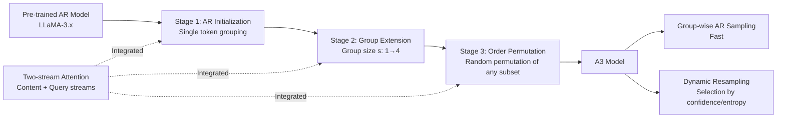

# Autoregressive Models Rival Diffusion Models at Any-Order Generation

**Conference**: ICLR 2026  
**OpenReview**: [https://openreview.net/forum?id=vtDUomlazQ](https://openreview.net/forum?id=vtDUomlazQ)  
**Code**: [https://github.com/PKU-ML/Any-order-Any-subset-AR](https://github.com/PKU-ML/Any-order-Any-subset-AR)  
**Area**: LLM Pre-training / Language Modeling Paradigms  
**Keywords**: Any-order generation, Autoregressive, Diffusion language models, Two-stream attention, Progressive adaptation  

## TL;DR
This paper proposes **A3 (Any-order Any-subset Autoregressive modeling)**, which reintegrates the "any-order, any-subset" flexibility of diffusion language models into the autoregressive framework. By using group-wise factorization to preserve the multi-layer dependency modeling capabilities of AR, and employing two-stream attention with a progressive curriculum to smoothly transform a pre-trained AR model into an any-order generator, A3 comprehensively outperforms diffusion language models of the same scale while using significantly less training data.

## Background & Motivation

**Background**: Masked Discrete Diffusion Language Models (MDLM, e.g., LLaDA, DiffuLlama, Dream) have recently emerged as popular alternatives to autoregressive (AR) models. By iteratively denoising partially masked sequences, they inherently support any-order generation and bidirectional conditioning, enabling tasks like infilling, global rewriting, and self-correction that are challenging for standard AR models.

**Limitations of Prior Work**: The training paradigm of diffusion modeling involves "predicting one part of a sequence from another in a single step"—partitioning the index set into two disjoint subsets $G_1, G_2$ to predict $P(x_{G_2}\mid x_{G_1})=\prod_{t\in G_2}P(x_t\mid x_{G_1})$. This constitutes only a **single-layer dependency structure**, where each token in $G_2$ depends directly on $x_{G_1}$ but lacks recursive dependencies among tokens within $G_2$. Compared to the multi-step compositional nature of AR factorization, this shallow dependency weakens the capacity for deep, hierarchical modeling. Consequently, diffusion models often lag behind AR models in generation quality and training stability, while remaining sensitive to noise schedules and hyperparameters.

**Key Challenge**: There is an inherent trade-off between the **expressiveness of AR factorization** (multi-layer recursive dependencies, probabilistic rigor, training stability) and the **flexibility of diffusion-style generation** (parallelism, bidirectional context, any-order generation), suggesting they might be mutually exclusive.

**Goal**: To construct a unified framework that retains the multi-layer dependency and stability of AR models while inheriting the any-order flexibility of diffusion models.

**Core Idea**: Instead of treating diffusion as a separate paradigm, this work generalizes it from "two-group prediction" to "multi-group prediction." By partitioning the index set into $K$ ordered groups $\{G_1,\dots,G_K\}$ and performing **group-wise autoregressive factorization** $P(x_{1:N})=\prod_{k=1}^{K}P(x_{G_k}\mid x_{G_{<k}})$, each group can contain one or more tokens in arbitrary order. This reduces the single-layer diffusion prediction to a "multi-layer dependent AR," maintaining flexibility (parallelism, any-subset, any-order) while restoring modeling depth.

## Method

### Overall Architecture
A3 consists of three components: (1) A **unified group-wise AR factorization** that generalizes standard token-level AR $P(x_{1:N})=\prod_t P(x_t\mid x_{<t})$ to arbitrary groupings and orders (essentially a group-level extension of XLNet's permutation language model); (2) A **two-stream attention architecture** using separate content and query stream representations to decouple generation order constraints while maintaining recursive dependencies; (3) A **three-stage progressive curriculum** that smoothly adapts a pre-trained AR checkpoint into an any-order generator, complemented by flexible inference modes (group-wise AR sampling and dynamic resampling).

### Key Designs

**1. Group-wise AR Factorization: Unifying AR and Diffusion via "Grouping."** Standard AR is a token-by-token chain decomposition, and diffusion is a two-group single-layer prediction. A3 treats both as special cases of "group-wise AR": it degenerates to standard AR when each group is a single token and corresponds to a single-step diffusion prediction when there are only two groups. In general, $P(x_{1:N})=\prod_{k=1}^{K}P(x_{G_k}\mid x_{G_{<k}})$ allows parallel prediction within a group while preserving multi-layer recursive dependencies between groups. Random sampling of group partitions and permutations during training makes the model robust to various conditional structures, lifting XLNet's permutation LM objective to the group level.

**2. Two-stream Attention: Decoupling "What to Predict" from "Where to Predict."** Decoder-only Transformers assume a fixed left-to-right order due to causal masking, while encoder-style masked LMs reconstruct any subset in parallel but lack multi-layer dependencies. A3 combines the best of both using XLNet's two-stream attention: each position maintains a **content stream** $H_c$ (encoding semantics/context; tokens in group $k$ can attend to all groups $\le k$, including themselves) and a **query stream** $H_q$ (encoding positional conditions; can only attend to groups $<k$). Formally,
$$H_c^{(l)}(i)=\mathrm{Attn}\big(Q=H_c^{(l-1)}(i),\,K,V=H_c^{(l-1)}(\le G_k)\big),$$
$$H_q^{(l)}(i)=\mathrm{Attn}\big(Q=H_q^{(l-1)}(i),\,K,V=H_c^{(l-1)}(<G_k)\big),$$
where the query stream is initialized with a learnable vector $w$ shared across positions. The final prediction is $p(x_i\mid X_{<G_k})=\mathrm{Softmax}(W\cdot H_q^{(L)}(i))$. The query stream handles "where to predict" (positional conditioning), and the content stream handles "what to predict" (contextual support), preserving recursive structure while removing order constraints.

**3. Three-stage Progressive Curriculum: Adapting AR into an Any-order Generator.** To leverage the stability and strong initialization of existing AR models, A3 uses three stages: **Stage 1 (AR Initialization)** sets the two-stream mask to exactly replicate left-to-right decomposition with single-token groups $G_t=\{t\}$, providing a stable starting point equivalent to standard AR. **Stage 2 (Group Extension)** allows group sizes $s>1$ using contiguous segments, gradually increasing $s$ from 1 to 4 to teach the model parallel prediction within groups while maintaining inter-group AR dependencies. **Stage 3 (Order Permutation)** uses random permutations $\pi$ to assign arbitrary indices to groups $G_1, G_2, \dots$. Every token belongs to exactly one group and is predicted, maximizing learning signals and computational efficiency.

**4. Flexible Inference: Group-wise AR Sampling + Dynamic Resampling.** The unified form of A3 supports multiple decoding modes. **Group-wise AR Sampling** samples groups sequentially (reduces to standard AR if $s=1$; parallel speedup if $s\in\{2,4\}$; for infilling, masked groups are placed after context groups to condition on both sides). **Dynamic Resampling** does not fix groups: at each step, it calculates $p_\theta(x_i\mid x_{F_t})$ for all uncompleted positions $U_t$ and selects a subset $S_t$ based on maximum confidence, minimum entropy, or random criteria. This allows the model to adaptively determine "easy" tokens first and postpone uncertain positions, using the conditional distribution defined by the AR factorization to ensure training-inference consistency.

## Key Experimental Results

### Main Results
Models were initialized from LLaMA-3.1-8B/3.2-3B/3.2-1B and fine-tuned on 8B tokens (FineWeb + SlimPajama). Evaluation follows the DiffuLlama protocol.

| Model | Size | Type | TriQA | HSwag | Wino. | SIQA | PIQA | ROCStories(R1/2/L) |
|------|------|------|-------|-------|-------|------|------|------|
| Llama-3.1 | 8B | AR | 52.1 | 76.0 | 63.9 | 46.7 | 80.3 | 11.7/2.3/10.5 |
| Plaid* | 1B | Cont. Diff. | 1.2 | 39.3 | 51.3 | 32.3 | 54.5 | 12.1/1.1/11.2 |
| Dream | 7B | Disc. Diff. | 18.3 | 26.9 | 51.8 | 36.6 | 55.8 | 11.7/2.3/10.5 |
| DiffuLlama* | 7B | Disc. Diff. | 18.5 | 58.7 | 56.4 | 43.2 | 63.3 | 23.3/5.5/21.2 |
| **A3** | 1B | A3 | 10.2 | 40.2 | 52.8 | 35.1 | 64.7 | 11.8/1.7/11.1 |
| **A3** | 3B | A3 | 15.9 | 49.6 | 54.3 | 38.9 | 70.1 | 11.3/2.3/10.2 |
| **A3** | 8B | A3 | 19.4 | 58.4 | 60.2 | 45.2 | 78.1 | 19.2/4.6/18.6 |

A3-8B generally outperforms diffusion baselines of similar scale (e.g., TriQA 19.4 / PIQA 78.1) despite using only 8B tokens, whereas DiffuLlama used 65B tokens. A gap remains compared to pure AR baselines, which the authors attribute to limited training data.

Conditional generation quality (measured by Llama-3.1-8B perplexity, lower is better):

| Model | Random(512/1024) | Confidence(512/1024) | Entropy(512/1024) |
|------|------|------|------|
| Dream | 58.4/46.2 | 21.3/17.2 | 18.7/16.4 |
| DiffuLlama | 72.3/58.4 | 24.1/18.3 | 20.9/14.3 |
| **A3-8B** | 66.4/49.3 | 20.1/16.8 | **14.3/11.2** |

Under confidence/entropy dynamic sampling, A3-8B consistently achieves the lowest perplexity (Entropy 1024-step 11.2 vs. Dream 16.4 / DiffuLlama 14.3).

### Ablation Study
Effect of the training curriculum (trained on 2B tokens):

| Curriculum | TriQA | HSwag | Wino. | SIQA | PIQA | ROCStories |
|------|-------|-------|-------|------|------|------|
| Original Three-stage | 15.6 | 49.3 | 56.7 | 39.6 | 69.4 | 13.2/2.3/12.6 |
| Skip Stage 1&2 (Direct Stage 3) | 11.3 | 44.2 | 54.1 | 37.3 | 64.2 | 13.1/2.2/12.4 |

Skipping the first two stages and training directly on arbitrary permutations leads to performance degradation across all tasks (e.g., TriQA 15.6→11.3), proving the necessity of the "AR Initialization → Group Extension → Order Permutation" curriculum.

### Key Findings
- **Clear Scaling Trends**: A3 shows stable performance improvements from 1B to 8B, indicating it benefits from model scaling like standard AR.
- **High Data Efficiency**: Achieving superior performance over DiffuLlama with 8B vs. 65B tokens suggests that building flexibility atop an AR foundation is significantly more data-efficient.
- **Sampling Strategy Trade-offs**: Fixed grouping is fast but relies on alignment with text structure; dynamic resampling is slower but more adaptive, resulting in lower perplexity.
- **Curriculum Order is Critical**: Progressively relaxing constraints is far superior to "one-shot" any-order training.

## Highlights & Insights
- **Perspective Reversal**: Instead of trying to catch up to diffusion as a new paradigm, A3 "reduces" diffusion to a special case of AR. Group-wise factorization unifies standard AR, multi-token prediction, and masked diffusion into a single elegant framework.
- **Asset Reuse**: Starting from LLaMA checkpoints with a progressive curriculum avoids the high cost and instability of training diffusion LMs from scratch.
- **Training-Inference Consistency**: Dynamic resampling uses the AR conditional distribution directly, avoiding the need for predefined noise schedules and the sensitivity associated with them.
- The two-stream attention explicitly decouples "positional conditioning (where to predict)" from "contextual support (what to predict)," which is key to supporting any-order generation without losing recursive dependencies.

## Limitations & Future Work
- **Still trails pure AR baselines**: A3-8B lags behind LLaMA-3.1-8B in most tasks. While attributed to training data volume (8B tokens), this remains unverified at scale.
- **Infilling advantage not fully realized**: In ROCStories, A3-8B (19.2/4.6/18.6) performed worse than DiffuLlama (23.3/5.5/21.2), suggesting any-order potential for infilling is not yet fully tapped.
- **High overhead for dynamic resampling**: Re-evaluating all uncompleted positions at each step is computationally expensive; the speed-quality trade-off needs task-specific tuning.
- **Limited scale and scope**: Scaling only reached 8B and tasks were limited to QA/commonsense/infilling, without verifying performance on code, long-form text, or instruction following.

## Related Work & Insights
- **Masked Diffusion Language Models (LLaDA, DiffuLlama, Dream, Plaid)**: Direct competitors to A3, which borrows their flexibility but replaces single-layer denoising with AR factorization.
- **AR Multi-token Prediction / Speculative Decoding**: Focuses on accelerating AR but remains locked in left-to-right order; A3 generalizes this to any-order parallel prediction.
- **XLNet Permutation LM and Two-stream Attention**: The methodological foundation for A3, which scales the permutation objective to groups and utilizes the stream decoupling.
- **Insight**: When a "new paradigm" lags in quality behind an established one, reformulating the new paradigm as a generalization of the old (rather than a replacement) often yields the benefits of both. This unified framework approach may be applicable to other domains like image or audio generation.

## Rating
- **Novelty**: ⭐⭐⭐⭐ Unifying diffusion as group-wise AR via two-stream attention and a progressive curriculum is both novel and theoretically sound.
- **Experimental Thoroughness**: ⭐⭐⭐ Covers key metrics, scaling, and ablations, but stops at 8B and has not yet closed the gap with pure AR baselines.
- **Writing Quality**: ⭐⭐⭐⭐ The narrative effectively bridges motivation, formulation, and implementation with clear diagrams.
- **Value**: ⭐⭐⭐⭐ Offers a practical compromise between generation flexibility and AR quality, showing promising data efficiency and scaling trends.

<!-- RELATED:START -->

## Related Papers

- [\[ICLR 2026\] Soft-Masked Diffusion Language Models](soft-masked_diffusion_language_models.md)
- [\[ICLR 2026\] Time is a Feature: Exploiting Temporal Dynamics in Diffusion Language Models](time_is_a_feature_exploiting_temporal_dynamics_in_diffusion_language_models.md)
- [\[CVPR 2025\] ScaMo: Exploring the Scaling Law in Autoregressive Motion Generation Model](../../CVPR2025/llm_pretraining/scamo_exploring_the_scaling_law_in_autoregressive_motion_generation_model.md)
- [\[CVPR 2025\] Improving Autoregressive Visual Generation with Cluster-Oriented Token Prediction](../../CVPR2025/llm_pretraining/improving_autoregressive_visual_generation_with_cluster-oriented_token_predictio.md)
- [\[NeurIPS 2025\] Composition and Alignment of Diffusion Models using Constrained Learning](../../NeurIPS2025/llm_pretraining/composition_and_alignment_of_diffusion_models_using_constrai.md)

<!-- RELATED:END -->
