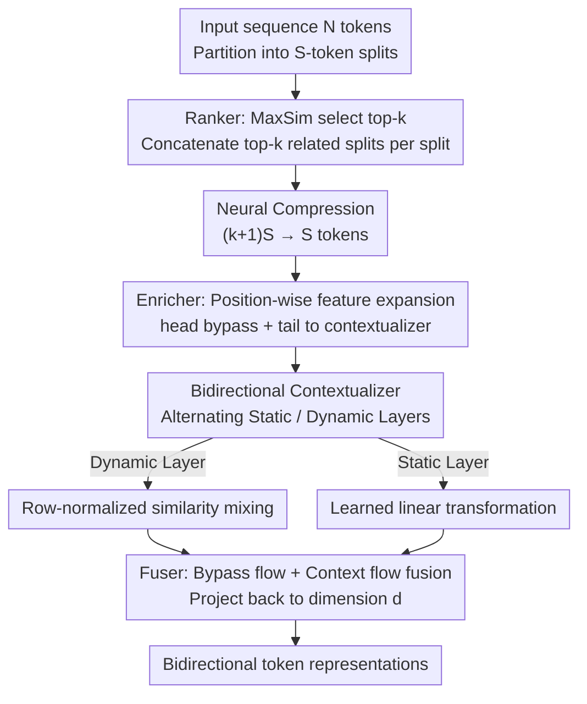

# Avey-B: Refactoring Attention-Free Architectures into Bidirectional Encoders

**Conference**: ICLR2026  
**OpenReview**: [https://openreview.net/forum?id=kQ9j5RY8ff](https://openreview.net/forum?id=kQ9j5RY8ff)  
**Code**: To be confirmed (the paper states all implementations and pre-trained checkpoints have been open-sourced)  
**Area**: LLM Pre-training / Encoder Architecture / Attention-Free Architecture  
**Keywords**: Bidirectional Encoder, Attention-Free, Retrieval-based Context, Dynamic Parameterization, Long Context

## TL;DR
Avey-B transforms the originally autoregressive, attention-free Avey architecture into a BERT-style bidirectional encoder by removing causal masks, decoupling static weights and dynamic similarity into alternating layers, applying row normalization to dynamic layers, and integrating a neural compressor within the ranker. Consequently, it consistently outperforms BERT/RoBERTa/ModernBERT/NeoBERT in token classification and information retrieval, using approximately $11\times$ fewer pre-training tokens than ModernBERT while achieving $3.38\times$ faster throughput at a context length of 96K.

## Background & Motivation
**Background**: In industrial NLP scenarios with constrained compute and memory, compact pre-trained bidirectional encoders (BERT, RoBERTa, ModernBERT, NeoBERT) remain the primary workhorses. By utilizing self-attention to observe both left and right context, they produce fully contextualized representations for each token, making them stronger than unidirectional decoders for discriminative tasks like classification, retrieval, and extractive QA while maintaining manageable deployment latency and memory.

**Limitations of Prior Work**: The time and memory complexity of full self-attention scale quadratically with sequence length, creating an unavoidable bottleneck that limits the expansion of context windows in cost-sensitive applications. Although significant work has been done to mitigate this (linear attention, RNN-style architectures, state-space models), most were designed for the **unidirectional/decoder** paradigm, with few adaptations to the **bidirectional, encoder-only** framework.

**Key Challenge**: Bidirectional encoders require "full contextualization for every token," which naturally demands computing all positions in a single forward pass. Achieving this while reducing computation and maintaining bidirectional context quality necessitates a mechanism that enables selective global interaction without relying on $O(N^2)$ attention.

**Goal**: To transform the recently proposed attention-free autoregressive architecture, Avey, into a bidirectional encoder and introduce three architectural innovations. This allows Avey-B to outperform Transformer encoders on discriminative tasks while being more efficient for long contexts. Specific sub-problems include: (1) how to remove causality for bidirectionality; (2) how to fix the element-wise coupling of static weights and dynamic similarity in Avey, which breaks the monotonicity of "higher relevance implies higher contribution"; (3) how to handle the sequence expansion in Avey, where each split is concatenated with its top-k splits, ballooning the sequence by approximately $k+1$ times.

**Key Insight**: The authors observe that Avey's cosine-similarity-based selection mechanism and learned cross-embedding linear transformations do not inherently depend on causal ordering. Thus, it is **naturally suited for bidirectional conversion**—akin to the transition from GPT (decoder) to BERT (encoder), but with an attention-free Avey backbone.

**Core Idea**: Retain the Avey skeleton of "ranker-selected relevant splits + neural processor contextualization," remove the causal mask for bidirectionality, and employ "static/dynamic decoupling + row normalization + neural compression of retrieved content" to simultaneously enhance quality and inference efficiency.

## Method

### Overall Architecture
Avey-B takes a sequence of length $N$ as input and outputs bidirectional contextualized representations for each token. It inherits two main components from Avey: the **ranker** and the **neural processor**. The sequence is first partitioned into splits of $S$ tokens. For each target split, the ranker calculates relevance using MaxSim against other splits and selects the top-k most relevant ones. These selected splits undergo **neural compression** before entering the neural processor, where they are processed through the enricher → contextualizer → fuser modules to produce the final representation.

The modifications in Avey-B relative to the original Avey focus on: **removing causal masks for bidirectionality**, **decoupling coupled static weights and dynamic similarity into alternating layers with row normalization for dynamic layers**, and **adding a neural compressor to the ranker**. The overall data flow is shown below:

To understand the key designs, two background components of Avey are supplemented. **Ranker**: Partitions the sequence into $S$-token splits, calculates relevance via MaxSim, and selects the top-k splits. Selected splits are weighted by normalized MaxSim scores and concatenated with the current split (weighted-selective-split), pruning irrelevant content. The training complexity is $O(N^2 d)$. **Neural Processor**: The enricher expands $d$-dimensional embeddings to $m>d$ dimensions $Z=\sigma(XU+b)$, splitting them into a bypass head $Z_h$ (sent to the fuser to preserve original features) and a tail $Z_t$ (sent to the contextualizer). The contextualizer mixes embeddings in $Z_t$. Finally, the fuser concatenates the bypass and context flows, projects back to $d$ dimensions $f(Z)=[Z_h\,\|\,c(Z_t)]O$, and adds a residual connection.

### Key Designs

**1. Bidirectional Contextualization: Removing masks to see both directions**

The original Avey is autoregressive with a causal mask in the contextualizer. Avey-B discards this mask. When a split is contextualized with its top-k splits, **all tokens are allowed to interact with each other** without causal constraints. This step transforms Avey from a decoder-style to an encoder-style architecture while retaining the "selective global access" provided by the ranker. Consequently, it inherits Avey's ability to decouple context width from sequence length.

**2. Decoupling Static/Dynamic Parameterization: Avoiding contribution reversal**

This is the core architectural change. Avey's contextualizer originally performed an **element-wise multiplication** between a learned static weight matrix $V$ and the data-dependent cosine similarity matrix $N(Z_{tr})N(Z_{tr})^\top$. This coupling creates a pathology where a token more similar to the target may contribute less than a less similar token. In Example 1(a), if $s_{21} > s_{31}$, then $e_2$ should contribute at least as much as $e_3$ to neuron $n_1$. However, if $w_{31} \gg w_{21}$, the effective contributions $s_{21}w_{21}$ and $s_{31}w_{31}$ might be **reversed**, weakening evidence accumulation from the most informative tokens. This violates "relevance monotonicity."

Avey-B resolves this by **decoupling** the two parameter sources into **alternating layers**. A **Static Layer** performs a pure learned linear transformation $c_{static}(Z)=\sigma(VZ_{tr}+b^{(s)})$. A **Dynamic Layer** mixes solely based on cosine similarity $S=N(Z_{tr})N(Z_{tr})^\top$, $c_{dyn}(Z)=\sigma(\tilde S Z_{tr}+b^{(d)})$. This preserves monotonicity in the dynamic layer: $s_{21} > s_{31}$ ensures token 2 contributes more than token 3. The static layer remains "similarity-agnostic," potentially applying a global gain but not altering the relative magnitude ranking established by the dynamic layer (since $|w_{11}s_{21}|/|w_{11}s_{31}|=s_{21}/s_{31}>1$). The most effective arrangement is the $S \to D$ alternating pattern.

**3. Row Normalization for Dynamic Layers: Enhancing deep training stability**

The authors found that dynamic layers without normalization cause issues in deeper models. Avey-B applies row normalization to the similarity scores: $\tilde S_{i,j}=S_{i,j}/(\sum_{j} S_{i,j}+\varepsilon)$ (Eq. 6). This effectively turns the similarity matrix into a **row-stochastic operator** (row sum $\le 1$), bounding the gain at each position and suppressing large singular values that would otherwise cause activations and gradients to explode. Ablations show row normalization consistently outperforms softmax or RMS-style alternatives.

**4. Neural Compression in Ranker: Decoupling per-split computation from $k$**

In bidirectional inference, every split must be contextualized to produce token-level representations, unlike autoregressive inference where only the last split is expanded. Concatenating top-k splits expands the sequence by $k+1$ times, causing prohibitive overhead.

Avey-B introduces a **neural compressor** in the ranker: it uses a learnable matrix $P \in \mathbb{R}^{S \times (k+1)S}$ to linearly project the concatenated $(k+1)S$ tokens back to $S$ representative tokens, $\hat X = PX_{cat}$ (Eq. 8). $\hat X$ is then fed into the neural processor. Because $P$ is learned, it can retain globally useful information while discarding redundancy, achieving a superior trade-off between accuracy and throughput. A residual connection is added between the compressor output and the original $S$ tokens of the current split to ensure stability. This reduces the tokens processed by the neural processor to $S$, improving throughput by $4.37\times$.

### Loss & Training
Pre-training uses the Masked Language Modeling (MLM) objective from BERT with an optimal masking rate of 20%. Models (base and large) were pre-trained on 180B FineWeb tokens. Hyperparameters include sequence length $N=2048$, split size $S=256$, and top-$k=3$. Downstream fine-tuning spans 1-4 epochs depending on the task (SC, TC, QA, IR), with learning rates swept across $\{2\times10^{-5}, 6\times10^{-5}, 1\times10^{-4}, 5\times10^{-4}\}$ using linear decay and 10% warmup.

## Key Experimental Results

### Main Results
Evaluation covers four task categories: Sequence Classification (SC), Token Classification (TC), Question Answering (QA), and Information Retrieval (IR). Average scores for base models:

| Model (base/medium) | SC Avg. | TC Avg. | QA Avg. | IR Avg. |
|--------|------|------|------|------|
| **Avey-B** | 88.78 | **93.59** | 62.45 | **63.83** |
| BERT | 87.14 | 89.82 | 57.65 | 57.42 |
| RoBERTa | 89.44 | 90.27 | **75.05** | 56.07 |
| ModernBERT | **89.61** | 92.78 | 74.44 | 54.29 |
| NeoBERT (M) | 85.36 | 88.20 | 55.67 | 39.98 |

Avey-B base outperforms BERT and NeoBERT in all categories and **beats all Transformer encoders** in TC and IR. While SC performance is competitive (best on SST-2), it lags slightly behind RoBERTa/ModernBERT on MNLI. In QA, it leads on SQuAD-v2 but falls behind in ReCoRD/SQuAD. Notably, **Avey-B base outperforms all Large Transformer encoders in TC and IR**, despite using $11\times$ fewer pre-training tokens than ModernBERT.

### Efficiency Experiment
Measured on H200 with `torch.compile` compared against FlashAttention-optimized ModernBERT and NeoBERT:

| Sequence Length | Avey-B vs. ModernBERT | Avey-B vs. NeoBERT |
|------|------|------|
| 128–96K | Consistently faster | Consistently faster |
| N = 96K | 3.38× | 11.63× |

Throughput decay follows $T(N) \propto N^{-\alpha}$. Avey-B’s $\alpha \approx 0.44$ is significantly lower than ModernBERT (0.77) or NeoBERT (0.81), meaning its throughput drops at roughly half the rate as sequences grow, increasing its advantage at length.

### Key Findings
- **Tripartite Contribution**: Decoupling, row normalization, and neural compression all contribute to performance gains; neural compression alone provides a $4.37\times$ throughput boost.
- **TC/IR Strength**: Avey-B’s split-based processing and pruning of low-relevance content sharpen token-level representations (crucial for TC) and inject a strong inductive bias for global relevance coupling (crucial for IR). Transformers may suffer from noise dilution in these tasks as sequences lengthen.
- **Design Choices**: Optimal results were found with $S \to D$ alternating layers, row normalization, $S=256, k=3$, and a unidirectional ranker.

## Highlights & Insights
- **Decoupling Monotonicity**: The observation that learned weights can invert the "similarity-to-contribution" relationship is a profound insight. The authors fix this cleanly with alternating layers, ensuring similarity logic is never corrupted by static weights.
- **Retrieval as a Bidirectional Skeleton**: Avey’s retrieval mechanism is inherently order-agnostic. Converting it to bidirectional by simply removing the mask allows it to inherit long-context capabilities for zero cost.
- **Industrial Practicality of the Compressor**: Addressing the sequence expansion problem with a learned linear projection allows the model to scale $k$ (retrieving more context) without a corresponding linear increase in neural processor computation.
- **Efficiency via Inductive Bias**: Beating Large models with $11\times$ fewer tokens in TC/IR suggest that "selective retrieval + local sharpening" is a more suitable inductive bias for certain discriminative tasks than indiscriminate global attention.

## Limitations & Future Work
- **Asymptotic Complexity**: Neural compression only reduces the constant factor; overall training complexity remains $O(N^2 d)$.
- **Lack of Fused Kernels**: The throughput comparison is "unoptimized vs. optimized" (e.g., against FlashAttention). Implementing custom CUDA/Triton kernels for Avey-B might increase its advantage further.
- **QA Weakness**: Lower performance on SQuAD/ReCoRD suggests local sharpening may not favor tasks requiring fine-grained cross-span alignments.
- **Hyperparameter Dependency**: Performance rests on swept values for $N/S/k$ and masking rates, which may vary across different corpora.

## Related Work & Insights
- **vs. BERT / RoBERTa**: All are bidirectional MLM encoders, but BERT relies on $O(N^2)$ self-attention. Avey-B’s attention-free retrieval is more efficient for long sequences and superior in TC/IR.
- **vs. ModernBERT / NeoBERT**: These "modernized" BERTs use RoPE, FlashAttention, and SwiGLU. Avey-B changes the architectural core instead of just the components, achieving higher throughput and better TC/IR results with significantly fewer pre-training tokens.
- **vs. Original Avey**: Avey-B is the "BERT-ification" of Avey, refactoring it for bidirectional, encoder-only usage.
- **vs. Linear Attention / SSMs (Mamba)**: While most attention alternatives target decoders, Avey-B fills the gap for a performant, attention-free, bidirectional encoder.

## Rating
- Novelty: ⭐⭐⭐⭐ Solid refactoring of an attention-free architecture with a precise fix for monotonicity pathologies.
- Experimental Thoroughness: ⭐⭐⭐⭐ 12 benchmarks, multiple scales, efficiency scaling, and extensive ablations, though kernel optimization is uneven.
- Writing Quality: ⭐⭐⭐⭐ Clear motivation, formal proofs, and well-structured methodology.
- Value: ⭐⭐⭐⭐ Significant wins in TC/IR with fewer tokens and faster long-context throughput provide high utility for industrial encoder deployment.

<!-- RELATED:START -->

## Related Papers

- [\[ICLR 2026\] Conditioned Initialization for Attention](conditioned_initialization_for_attention.md)
- [\[ICLR 2026\] Should We Still Pretrain Encoders with Masked Language Modeling?](should_we_still_pretrain_encoders_with_masked_language_modeling.md)
- [\[ICLR 2026\] Seq vs Seq: An Open Suite of Paired Encoders and Decoders](seq_vs_seq_an_open_suite_of_paired_encoders_and_decoders.md)
- [\[ICLR 2026\] LLM-JEPA: Large Language Models Meet Joint Embedding Predictive Architectures](llm-jepa_large_language_models_meet_joint_embedding_predictive_architectures.md)
- [\[ICLR 2026\] Deconstructing Positional Information: From Attention Logits to Training Biases](deconstructing_positional_information_from_attention_logits_to_training_biases.md)

<!-- RELATED:END -->
