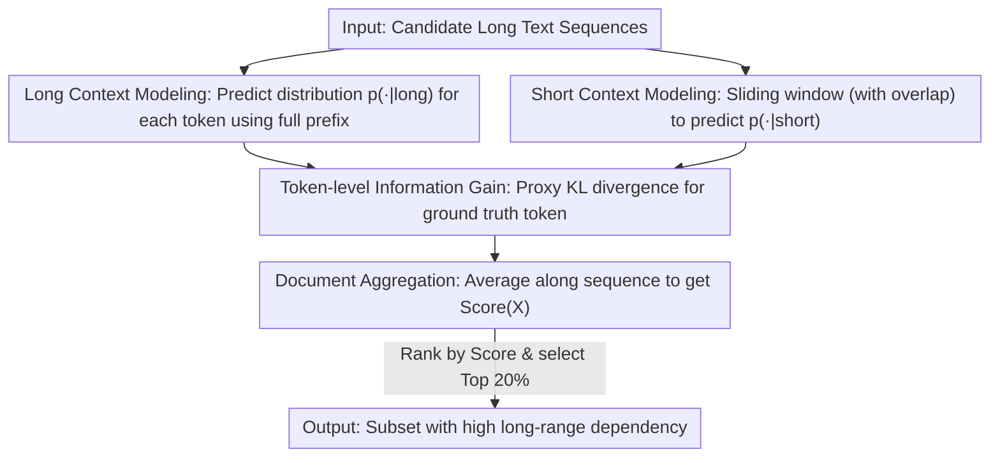

# Beyond Length: Quantifying Long-Range Information for Long-Context LLM Pretraining Data

**Conference**: ICLR2026  
**OpenReview**: [https://openreview.net/forum?id=C9TDQ8Wwx7](https://openreview.net/forum?id=C9TDQ8Wwx7)  
**Code**: To be confirmed  
**Area**: LLM Pretraining / Long Context / Data Selection  
**Keywords**: Long-context Pretraining, Data Selection, Information Gain, Conditional Mutual Information, KL Divergence

## TL;DR
Addressing the overlooked fact that "long text $\neq$ long-range dependency," this paper proposes LongFilter. It quantifies the "information gain from extended context" by comparing a language model's prediction distributions under long vs. short context for each token. Samples that are long but predictable using only local context are filtered out. Continuing pretraining LLaMA-3-8B (8K $\rightarrow$ 64K) with filtered data yields an average improvement of over 2 points on HELMET, LongBench, and RULER, achieving equivalent performance with approximately half the data.

## Background & Motivation
**Background**: To equip language models with long-context capabilities, the mainstream approach involves initial pretraining on short contexts followed by "continued pretraining" on long-context data. This is typically combined with techniques like RoPE frequency adjustment and positional interpolation to extend the effective window from 8K to 64K/128K. This pipeline is relatively mature, and training costs are decreasing.

**Limitations of Prior Work**: Most long-context data engineering focuses solely on **sequence length**: either increasing the proportion of long sequences or adjusting the mix ratio of short and long sequences. However, length does not guarantee long-range dependency. A collection of poems may be long, but there is little dependency between individual poems, which are themselves short and better suited for short contexts. Many long web pages contain repetitive segments, independent snippets, or tokens predictable from just the preceding few dozen tokens. Training on such data dilutes learning signals because the loss is averaged over all tokens, and tokens that do not require long context effectively dilute the gradient, potentially harming performance on long-context tasks.

**Key Challenge**: Sequence length alone cannot determine if a segment truly depends on long-range context. A signal is needed to directly measure the strength of long-range dependency. Existing attempts either use metrics applicable to short text (failing to capture long-range aspects) or use attention scores as a proxy for dependency strength—the latter of which has been shown to inconsistently reflect token importance.

**Goal**: Design a scoring function specifically to measure whether "extended context assists in predicting the current token" and use it to select samples rich in long-range dependency from large corpora.

**Key Insight**: The authors view existing methods of "increasing the proportion of long sequences" as moving from "0 to 1"—introducing the model to long context. This work aims to move from "1 to 2" by further increasing the proportion of sequences that **truly require long-context understanding**, allocating more learning signal to tokens that depend on extended context.

**Core Idea**: A data sequence is valuable for long-context training if and only if "long context significantly improves prediction accuracy." This "information gain" is formalized as the KL divergence between the prediction distributions of the same model under long vs. short context conditions, computed per token and aggregated into a sequence-level score.

## Method

### Overall Architecture
LongFilter is a data selection framework for continued pretraining. It requires no modifications to the model or training process; it only optimizes data selection. The core mechanism involves using an off-the-shelf causal language model to estimate the next-token prediction distribution under both **long context** and **short context** conditions. If the prediction distribution changes significantly (high KL divergence) when the "extended context" (the part of the long context exceeding the short context) is added, it indicates a real information contribution. These token-level gains are averaged across the sequence to derive a LongFilter score. Samples are ranked, and the top-scoring subset is used for continued pretraining.

The pipeline consists of three steps: long-context modeling, short-context modeling, and LongFilter scoring.

### Key Designs

**1. Information Gain = Conditional Mutual Information, implemented via Proxy KL**

To determine how much additional information the extended context $E$ provides for predicting the next token $T$ given the short context $S$, the theoretical tool is **Conditional Mutual Information** (CMI) $I(T;E\mid S)$. It measures the reduction in uncertainty of $T$ after observing $E$, given $S$. CMI can be expressed as the expected KL divergence between prediction distributions:

$$I(T; E \mid S) = \mathbb{E}_{p(s,e)}\Big[D_{\mathrm{KL}}\big(p(T\mid S=s, E=e)\,\|\,p(T\mid S=s)\big)\Big]$$

This measures the distance between the "posterior belief after seeing the extended context" $p(T\mid S,E)$ and the "prior belief based only on the short context" $p(S)$. For a single sample $(e^*, s^*)$, the KL divergence of this term is used as an approximation. However, using the KL over the entire vocabulary has two drawbacks: it does not depend on the ground truth token $t^*$, and the summation over the entire vocabulary $V$ is computationally expensive.

**2. Token-level Proxy Score: Ground truth focus and confidence weighting**

To utilize the ground truth token and avoid vocabulary traversal, the authors retain only the term corresponding to the **ground truth token $t^*$** in the KL summation, resulting in the token-level proxy score:

$$\text{score}(t^*, s^*, e^*) = p(t^*\mid e^*, s^*)\,\log\frac{p(t^*\mid e^*, s^*)}{p(t^*\mid s^*)}$$

This represents the gain provided by the extended context $e^*$ for predicting target $t^*$, given $s^*$. Averaging these scores across sequence $X^*$ gives the final LongFilter score:

$$\text{Score}(X^*) = \frac{1}{N}\sum_{i=1}^{N} p(x^*_i\mid x^*_{i-\ell_{\text{Long}}:i-1})\,\log\frac{p(x^*_i\mid x^*_{i-\ell_{\text{Long}}:i-1})}{p(x^*_i\mid x^*_{i-\ell_{\text{Short}}:i-1})}$$

In terms of standard cross-entropy loss (negative log-likelihood), if $L^{\text{long}}_i$ and $L^{\text{short}}_i$ are the losses using long and short context respectively:

$$\text{Score}(X^*) = \frac{1}{N}\sum_{i=1}^{N}\exp(-L^{\text{long}}_i)\,\big(L^{\text{short}}_i - L^{\text{long}}_i\big)$$

The score favors tokens where the loss decreases significantly when using long context ($L^{\text{short}}-L^{\text{long}}$). This delta is weighted by $\exp(-L^{\text{long}})=p(x^*_i\mid \text{long})$, representing the model's **confidence** under full context. This weighting prevents interference from noisy tokens; a gain is only considered significant if the model finds the token inherently credible under long context. This is a key improvement over naive KL, anchoring the signal to ground truth and model confidence.

**3. Long/Short Context Modeling: Full prefix vs. Overlapping sliding windows**

**Long context modeling** follows standard causal LM training. **Short context modeling** splits the text into short blocks, each fed into the same model independently to limit context. To prevent inaccuracies for tokens at the start of blocks due to insufficient prefix, the authors use **overlapping sliding windows**, ensuring block-initial tokens receive adequate short context. In experiments, the short window was 4K and the long window 64K, using Llama-3.1-8B as the scorer.

### Loss & Training
LongFilter does not introduce a new loss function; it is an **offline data scoring and selection** pre-processing step. The training follows the ProLong configuration to extend LLaMA-3-8B from 8K to 64K, with the RoPE base frequency increased from $5\times10^5$ to $8\times10^6$. The main change is the **training data**: replacing unrefined data with the subset selected by LongFilter. The batch size is 4M tokens, trained for 1000 steps (4B tokens total). Data composition is 80% long text + 20% short text, with filtering applied only to the long-text portion (Top 20% by score).

## Key Experimental Results

### Main Results
Continued pretraining of LLaMA-3-8B (8K $\rightarrow$ 64K) was conducted on three SlimPajama sub-corpora (Arxiv / Book / CommonCrawl), comparing against ProLong and LongWanjuan. LongBench Overall results:

| Corpus | Method | LongBench Overall |
|------|------|-------------------|
| Arxiv | ProLong | 38.58 |
| Arxiv | LongWanjuan | 39.36 |
| Arxiv | **LongFilter (Ours)** | **39.52** |
| Book | ProLong | 37.47 |
| Book | LongWanjuan | 37.69 |
| Book | **LongFilter (Ours)** | **39.81** |
| CC | ProLong | 38.37 |
| CC | LongWanjuan | 40.02 |
| CC | **LongFilter (Ours)** | **40.66** |

RULER Overall results (focused on NIAH/structured retrieval) showed even more significant advantages, especially in the Book corpus:

| Corpus | Method | RULER Overall |
|------|------|---------------|
| Arxiv | ProLong / LongWanjuan / **LongFilter (Ours)** | 69.28 / 69.69 / **70.13** |
| Book | ProLong / LongWanjuan / **LongFilter (Ours)** | 73.35 / 73.74 / **78.95** |
| CC | ProLong / LongWanjuan / **LongFilter (Ours)** | 72.59 / 74.08 / **75.37** |

### Data Efficiency / Convergence Analysis

| Configuration | Key Metric | Description |
|------|---------|------|
| Unfiltered Data | ~3–4B tokens | Training required to reach a specific HELMET level |
| LongFilter Selection | ~1.5B tokens | Same performance reached with **half the data** |
| HELMET Growth | Higher and stabler | Exceeded baselines at 0.5B–1B tokens; Recall tasks >90 at 4B |

### Key Findings
- **50% Data Efficiency**: Using 1.5B filtered tokens matches the performance of 3–4B unfiltered tokens, indicating that information gain filtering concentrates learning signals on "essential tokens."
- **Highest Gains on Long-range Tasks**: Improvements were most notable on synthetic tasks in LongBench and structured retrieval (MultiKey/Query) in RULER, which rely heavily on retrieving information from arbitrary context positions.
- **Score Interpretability**: Token-level visualizations show that coherent academic prose in a PhD thesis receives high scores, while repetitive or non-semantic content like TikZ drawing code receives low scores. High-score documents (AvgScore $\approx$ 0.55) differ from low-score ones (AvgScore $\approx$ 0.01) by nearly two orders of magnitude.

## Highlights & Insights
- **Quantifying "Long Text $\neq$ Long Context"**: By comparing prediction distributions under long/short conditions, the paper moves beyond the heuristic of "length as a proxy for dependency."
- **Elegant Proxy KL Simplification**: Reducing full vocabulary KL to a single ground-truth term (saving computation and anchoring to truth) and adding $\exp(-L^{\text{long}})$ weighting (filtering noise) transforms the theoretical CMI into a practical engineering metric.
- **Zero Model Changes, Pure Data Gain**: Achieving a 2+ point gain by only changing the data suggests this method can be orthogonally applied to any long-context pretraining pipeline.
- **Transferability**: The "long vs. short prediction delta" approach can serve as a diagnostic tool for data quality or potentially be used for token-level loss weighting during training.

## Limitations & Future Work
- **Scoring Cost**: Running a forward pass at a 64K window for every sample is expensive; the authors used 32 H100s. Scaling to larger corpora or longer windows remains secondary to computational overhead.
- **Scorer Model Capacity**: The information gain is defined by the scorer (Llama-3.1-8B). If the scorer itself has weak long-context capabilities, it might underestimate true long-range dependencies.
- **Proxy Score Bias**: The approximation of CMI using only the ground-truth term lacks a comprehensive theoretical characterization of its error bounds, though empirical results are strong.
- **Empirical Ratios**: The Top 20% threshold and 80/20 mix are empirical; optimal ratios for different corpora or target windows require further exploration.

## Related Work & Insights
- **vs. ProLong (Gao et al., 2024)**: ProLong adjusts the mix ratio but treats all long sequences equally. LongFilter demonstrates that "long-range information content" is a critical missing dimension.
- **vs. LongWanjuan (Liu et al., 2024c)**: LongWanjuan uses quality indicators often applicable to short text. LongFilter explicitly defines signals based on the prediction delta between long and short contexts.
- **vs. LongAttn (Wu et al., 2025)**: LongAttn uses attention scores for dependency, which are often unreliable. LongFilter uses the KL divergence of distributions, bypassing the interpretability issues of attention.
- **vs. Short-context Selection**: Most quality/deduplication methods target short-context pretraining; LongFilter fills the gap in specialized data engineering for long context.

## Rating
- Novelty: ⭐⭐⭐⭐ Formalizes "Long Text $\neq$ Long Context" into a computable CMI proxy score with a clear perspective.
- Experimental Thoroughness: ⭐⭐⭐⭐ Comprehensive across three corpora and major benchmarks, though limited to a single model/window setting.
- Writing Quality: ⭐⭐⭐⭐ Clear progression from motivation to formulas to implementation.
- Value: ⭐⭐⭐⭐ Significant data efficiency gains and zero model changes make it highly practical for long-context pretraining.

<!-- RELATED:START -->

## Related Papers

- [\[ICLR 2026\] Beyond URLs: Metadata Diversity and Position for Efficient LLM Pretraining](beyond_urls_metadata_diversity_and_position_for_efficient_llm_pretraining.md)
- [\[ICLR 2026\] Pretraining with Hierarchical Memories: Separating Long-Tail and Common Knowledge](pretraining_with_hierarchical_memories_separating_long-tail_and_common_knowledge.md)
- [\[ICML 2026\] On Training Large Language Models for Long-Horizon Tasks: An Empirical Study of Horizon Length](../../ICML2026/llm_pretraining/on_training_large_language_models_for_long-horizon_tasks_an_empirical_study_of_h.md)
- [\[ICLR 2026\] Distilled Pretraining: A modern lens of Data, In-Context Learning and Test-Time Scaling](distilled_pretraining_a_modern_lens_of_data_in-context_learning_and_test-time_sc.md)
- [\[ICLR 2026\] Beyond Multi-Token Prediction: Pretraining LLMs with Future Summaries](beyond_multi-token_prediction_pretraining_llms_with_future_summaries.md)

<!-- RELATED:END -->
