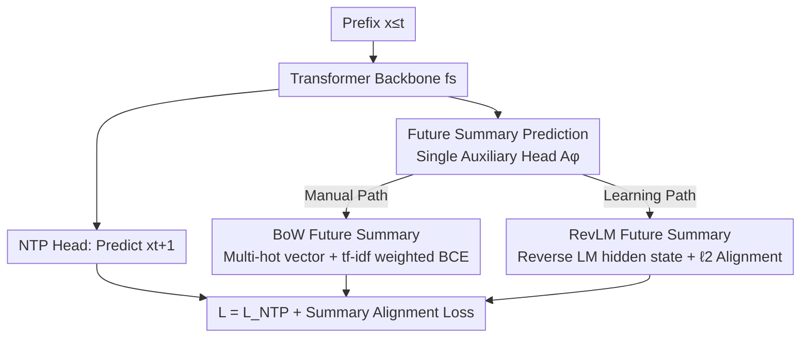

# Beyond Multi-Token Prediction: Pretraining LLMs with Future Summaries

**Conference**: ICLR2026  
**OpenReview**: [https://openreview.net/forum?id=aeYIFVn4vb](https://openreview.net/forum?id=aeYIFVn4vb)  
**Code**: To be confirmed  
**Area**: LLM Pretraining / Pretraining Objectives  
**Keywords**: Pretraining objectives, multi-token prediction, teacher forcing, reverse language model, future summaries

## TL;DR
This paper proposes **Future Summary Prediction (FSP)**: adding an auxiliary head to the standard next-token prediction to predict a **compact summary of a long-range future sequence** (instead of predicting future tokens one by one). Two summary construction methods are provided: a manual bag-of-words summary (FSP-BoW) and a learned summary distilled from a reverse language model (FSP-RevLM). Large-scale pretraining experiments at the 3B/8B scale demonstrate that FSP consistently outperforms Next-Token Prediction (NTP) and Multi-Token Prediction (MTP) on mathematical, reasoning, and coding tasks, with improvements up to 4–5 percentage points in mathematics.

## Background & Motivation
**Background**: The cornerstone of current LLM pretraining is **Next-Token Prediction (NTP) + teacher forcing**, where the model is always trained to predict the next token $x_{t+1}$ given the ground-truth history $x_{\le t}$. As the "data wall" approaches and returns from simply scaling data/compute diminish, researchers have sought to extract more signals from fixed datasets, leading to **Multi-Token Prediction (MTP)**: using auxiliary heads to simultaneously predict $x_{t+2}, x_{t+3}, \dots$. This has been adopted by systems like DeepSeek-V3 and Qwen-3.

**Limitations of Prior Work**: Teacher forcing introduces two long-standing issues: **exposure bias** (the model consumes its own outputs during inference, leading to error accumulation and degraded long-range generation) and **shortcut learning** (the model copies local cues from the ground-truth prefix rather than learning genuine long-range dependencies). MTP only partially mitigates these: its auxiliary heads predict **immediate future tokens**, which remain short-range; furthermore, auxiliary heads often assume future tokens are independent given the prefix, poorly approximating the long-range joint distribution. Covering longer futures requires adding more heads, which is not scalable.

**Key Challenge**: Highly informative supervisory signals may be hidden in the **distant future**, far beyond the window $k$ used by MTP. However, predicting the entire future token-by-token is computationally prohibitive. Models need to "see far enough" while keeping the "number of heads manageable."

**Goal**: Use a **single** auxiliary head to compress long-range future information into a **summary vector** as a supervisory target, thereby significantly reducing teacher forcing without exploding the number of auxiliary heads.

**Key Insight**: The authors provide an intuition of the "degree of teacher forcing" to link NTP $\to$ MTP $\to$ FSP—how much information about unknown tokens is the model required to predict for each ground-truth token exposed? More requirements imply weaker teacher forcing. NTP is the strongest (predicting only the next token), MTP is weaker (predicting a small block), and FSP is the weakest (predicting global properties of a whole future segment).

**Core Idea**: Replace "predicting future **tokens individually**" with "predicting a **summary** of the future." The authors further suggest that manual summaries might include irrelevant future content, leading to the use of a reverse language model to learn an adaptive summary that retains only what is useful for current prediction.

## Method

### Overall Architecture
FSP distributes the output of a standard Transformer backbone $f_s$ into two heads: a conventional **NTP head** $f_h$, predicting $x_{t+1}$ as usual, and a **Summary Auxiliary Head** $f'_{ha}$ (denoted as $A_\phi$), which approximates a summary vector $a(t,\tau)$ of a future segment $(x_{t+2},\dots,x_{t+\tau})$. The total objective adds a summary alignment loss to the NTP loss:

$$\mathcal{L}_{\text{FSP}} = \mathcal{L}_{\text{NTP}} + \mathbb{E}_{x}\big[\, l_a\big(A_\phi(x_{\le t}),\, a(t,\tau)\big)\,\big]$$

The architecture serves as a unified abstraction for NTP, MTP, and FSP, where the only difference lies in what the auxiliary head predicts. A key advantage of FSP is that it uses **only one** auxiliary head, keeping structural overhead constant regardless of the future length covered. The remaining core problem is how to construct the summary $a(t,\tau)$, for which the authors provide two paths: manual BoW summaries and RevLM learned summaries. During inference, the auxiliary head is discarded, leaving the backbone and NTP head for standard autoregressive generation—FSP is purely an auxiliary supervision during pretraining.

### Key Designs

**1. Future Summary Prediction (FSP): Compressing the entire future with one head instead of stacking heads per token**

This is the unified framework addressing the pain point where MTP requires more heads to see further, which is not scalable. Instead of $k$ auxiliary heads each predicting one immediate token, FSP uses a single head $A_\phi(x_{\le t}) = f'_{ha}\circ f_s(x_{\le t})$ to match the summary $a(t,\tau)$ of a future segment $(x_{t+2},\dots,x_{t+\tau})$. This is effective because it **decouples** "how far to look" from "how many heads are needed"—$\tau$ can be tens or hundreds while the structural cost remains one head. Crucially, being required to predict a global summary of a future segment **forces the model to reduce teacher forcing**: it can no longer rely on local cues in the ground-truth prefix and must plan for the rich properties of the entire future trajectory.

**2. FSP-BoW (Manual Bag-of-Words Summary): Compressing the future window into a multi-hot vector of word occurrences**

This is the first concrete implementation of the summary. At each position $t$, a multi-hot vector $a(t,\tau)_i = \mathbb{I}\big(i\in\{x_{t+2},\dots,x_{t+\tau}\}\big)$ is defined over the vocabulary for the future window—indicating only "whether these words appear in the future," **regardless of their specific positions**. The auxiliary head outputs logits $z_i$, trained with a **re-weighted binary cross-entropy**:

$$l_a = -\sum_{i=1}^{V} w(i)\big[\,a_i\log\sigma(z_i) + (1-a_i)\log(1-\sigma(z_i))\,\big]$$

Here $w(i)$ reflects the importance of token $i$ (e.g., tf–idf), used to down-weight high-frequency stop words and highlight informative tokens. Its value is intuitive in the synthetic **path-star graph task**: NTP learns the shortcut of "scanning the adjacency list to copy $v_{i+1}$ from $v_i$," leading to gradient starvation after the first step and failing to learn long-range planning. BoW compresses future nodes along the entire path into the target, breaking the shortcut and forcing the model to plan the whole path, achieving perfect scores on $G(2,6)$ and $G(2,8)$ where MTP degrades.

**3. FSP-RevLM (Learned Summary): Distilling adaptive summaries that "keep only useful future info" using a Reverse LM**

The drawback of BoW is that it treats all tokens equally—it includes **all** future tokens in the window, even though many might be irrelevant to the current prediction and act as noise (as seen in the sibling discovery task). FSP-RevLM solves this using a **Reverse Language Model** $Q_\psi$, trained "right-to-left" with the objective $-\mathbb{E}\big[\sum_t \log Q_\psi(x_{t+1}\mid x_{\ge t+2})\big]$. Its hidden state $a(t, T{-}t) = g_h\circ g_s(x_{\ge t+2})$ is naturally a **compact representation biased toward "information useful for predicting the current token."** The forward model's auxiliary head matching this representation via $\ell_2$ loss:

$$l_a = \big\|\,A_\phi(x_{\le t}) - g_h\circ g_s(x_{\ge t+2})\,\big\|_2^2$$

Essentially, this distills "reverse-order information" into the forward model. It is more robust than BoW because the reverse LM hidden state automatically **emphasizes predictable, informative future content** while filtering out unpredictable or irrelevant parts. Consequently, in the sibling discovery task, it continues to converge faster than NTP as the number of components increases, whereas BoW's gains vanish beyond 6 components. The trade-off is that the reverse model (same size and steps) roughly doubles the training compute; following distillation conventions, the authors conduct iso-data comparisons (rather than iso-compute) and argue that in "compute-rich, data-limited" scenarios, using more compute to extract more from fixed data is worthwhile.

### Loss & Training
- Total loss: $\mathcal{L}_{\text{FSP}} = \mathcal{L}_{\text{NTP}} + l_a$. $l_a$ is tf-idf re-weighted BCE for FSP-BoW and $\ell_2$ representation matching for FSP-RevLM.
- Scale: 3B (250B tokens) and 8B (1T tokens), using DCLM-style corpora + GitHub, supplemented with math/code specialized data.
- Fairness convention: All methods are iso-data. To align with FSP's "single auxiliary head," MTP/DS-MTP are also limited to a single auxiliary head predicting the immediate next token. The reverse model in FSP-RevLM is treated as distillation overhead and typically not counted towards the primary budget in such contexts.

## Key Experimental Results

### Main Results
8B Pretraining (pass@16 for code/math, accuracy for ARC, mean of 3 seeds):

| Task | NTP | MTP | DS-MTP | FSP-RevLM |
|------|-----|-----|--------|-----------|
| ARC-Easy | 0.718 | 0.736 | 0.617 | **0.766** |
| ARC-Challenge | 0.531 | 0.552 | 0.426 | **0.559** |
| GSM8K | **0.716** | 0.678 | 0.704 | 0.705 |
| MATH | 0.342 | 0.309 | 0.335 | **0.351** |
| MBPP | 0.657 | 0.672 | 0.678 | **0.683** |
| HumanEval+ | 0.478 | **0.541** | 0.526 | **0.541** |

FSP-RevLM leads in ARC-Easy/Challenge, MATH, and MBPP, and ties with MTP on HumanEval+. Although NTP is slightly higher on GSM8K, FSP-RevLM significantly closes the gap compared to MTP. At the 3B scale, DS-MTP is a stronger overall baseline, but FSP-RevLM overtakes it in mathematical reasoning, and the **relative gain increases as scale grows** from 3B to 8B.

### Ablation Study
Evaluation of different future summary strategies as auxiliary targets on 8B (selected):

| Config | GSM8K | MATH | ARC-Easy | Notes |
|------|-------|------|----------|------|
| MTP (predict immediate token) | 0.678 | 0.309 | 0.736 | Baseline |
| MTP-Skip τ:12 (random/skip token) | 0.621 | 0.287 | 0.710 | Random sampling future tokens is worse |
| FSP-BoW τ:12 | 0.699 | 0.331 | 0.737 | BoW summary, clear gain in math |
| FSP-BoW τ:100 | 0.714 | 0.331 | 0.662 | Larger window further pushes GSM8K |
| FSP-RevLM | 0.705 | **0.351** | **0.766** | Learned summary, most stable across tasks |

### Key Findings
- **"What future to predict" is more important than "how many tokens":** Randomly or skip-sampling future tokens (MTP-Skip) performs worse than MTP with immediate tokens, deteriorating as the window grows. Only **aggregating future information into summaries** (BoW / RevLM) brings gains.
- **Manual vs. Learned summary divergence depends on relevance:** In path-star (where all future is useful), BoW suffices. In sibling discovery (where only partial future is relevant), BoW fails as components increase, while RevLM remains effective.
- **Mathematical reasoning yields the largest benefits**: FSP-RevLM shows most significant improvements in MATH (+4.2) and GSM8K (+3.5 vs MTP), and Figure 5 indicates it produces higher **diversity** across different pass@k.
- **Scalability**: The relative advantage of FSP-RevLM expands from 3B to 8B, suggesting this auxiliary signal is more valuable for larger models.

## Highlights & Insights
- **A unified framework for pretraining objectives**: NTP, MTP, random-token MTP, BoW, and RevLM can all be mapped to "predicting some form of future summary." This perspective of "changing the target, not the structure" is arguably more valuable than any specific method.
- **Cracking the MTP scalability bottleneck**: Decoupling "lookahead distance" from the "number of heads" is a clean, reusable engineering idea.
- **Reverse LM as a clever "Future Summary Teacher"**: Right-to-left hidden states are natural representations of the future useful for the current step. Distilling this into a forward model injects bidirectional information with zero inference overhead.
- **Teacher forcing spectrum**: Plotting these objectives along a line based on "how much unknown information the model must account for per ground-truth token" provides a clear intuition for why summary prediction works.

## Limitations & Future Work
- **Doubled training compute**: FSP-RevLM requires a reverse LM of the same size, totaling ~2x FLOPs. Whether this is "fair" depends on whether you are data-constrained or compute-constrained.
- **Inconsistent win on GSM8K**: At 8B, NTP still wins slightly (0.716 vs 0.705), indicating summary supervision is not universally superior for all math tasks.
- **Trailing DS-MTP at 3B**: The advantages of learned summaries haven't fully manifested at smaller scales; the appeal relies heavily on moving toward the "data wall."
- **Empirical summary construction**: Choices for window $\tau$, tf-idf weights, and which RevLM layer to use are somewhat heuristic and lack automatic selection. BoW also discards future token order.
- **Future Directions**: Exploring self-distillation of reverse signals to save the independent RevLM, combining BoW and RevLM summaries, or making $\tau$ adaptive.

## Related Work & Insights
- **vs. MTP / DeepSeek-MTP**: These use multiple heads for immediate tokens, limited by short-range vision and head-count explosion. FSP uses one head for a future summary, keeping structural costs constant.
- **vs. Random/Skip Token MTP**: These use heuristic sampling for efficiency but risk missing informative signals. FSP-RevLM actively extracts relevant long-range info.
- **vs. SemFormer**: SemFormer introduces "plan tokens," learns future embeddings via autoencoding, and applies supervision at specific points. FSP requires no special tokens and applies alignment at **every position**.
- **vs. Twin Networks / Belief State Transformer / Meet-in-the-Middle**: All use reverse/bidirectional signals, but FSP-RevLM follows a **distillation** route (no shared parameters, no requirement for identical distribution match) and explains it within a general "future summary" framework.

## Rating
- Novelty: ⭐⭐⭐⭐⭐ 
- Experimental Thoroughness: ⭐⭐⭐⭐ 
- Writing Quality: ⭐⭐⭐⭐⭐ 
- Value: ⭐⭐⭐⭐ 

<!-- RELATED:START -->

## Related Papers

- [\[ACL 2026\] Toward Consistent World Models with Multi-Token Prediction and Latent Semantic Enhancement](../../ACL2026/llm_pretraining/toward_consistent_world_models_with_multi-token_prediction_and_latent_semantic_e.md)
- [\[ACL 2025\] Pre-Training Curriculum for Multi-Token Prediction in Language Models](../../ACL2025/llm_pretraining/pre-training_curriculum_for_multi-token_prediction_in_language_models.md)
- [\[ICLR 2026\] Beyond URLs: Metadata Diversity and Position for Efficient LLM Pretraining](beyond_urls_metadata_diversity_and_position_for_efficient_llm_pretraining.md)
- [\[ICLR 2026\] Beyond Length: Quantifying Long-Range Information for Long-Context LLM Pretraining Data](beyond_length_quantifying_long-range_information_for_long-context_llm_pretrainin.md)
- [\[ICLR 2026\] Next-ToBE: Probabilistic Next Token-Bag Exploitation for Activating Anticipatory Capacity in LLMs](next-tobe_probabilistic_next_token-bag_exploitation_for_activating_anticipatory_.md)

<!-- RELATED:END -->
