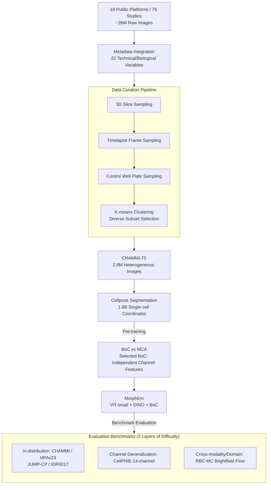

# CHAMMI-75: Pre-training multi-channel models with heterogeneous microscopy images

**Conference**: ICLR2026  
**arXiv**: [2512.20833](https://arxiv.org/abs/2512.20833)  
**Code**: [https://github.com/CaicedoLab/CHAMMI-75](https://github.com/CaicedoLab/CHAMMI-75)  
**Area**: LLM Pre-training  
**Keywords**: microscopy, multi-channel imaging, dataset curation, self-supervised learning, cell morphology

## TL;DR
The authors construct CHAMMI-75—the largest heterogeneous multi-channel microscopy image pre-training dataset (2.8M images, 75 sources, 25 channel types, 16 species)—demonstrating that imaging modality diversity is the key factor for improving multi-channel model generalization. The trained MorphEm model achieves SOTA on 6 out of 7 benchmarks.

## Background & Motivation

**Background**: Microscopy imaging is a fundamental tool in biological research. Unlike RGB natural images, microscopy images have a variable number of channels (1 to dozens), with each channel encoding different fluorescent signals. While deep learning is widely used for analysis, models typically require fixed channel counts—preventing reuse across experiments with different channel configurations.

**Limitations of Prior Work**: (a) **Fixed Channels**: Existing models modify RGB architectures for specific channel counts and cannot handle new combinations; (b) **Data Fragmentation**: Multi-channel images are scattered across public platforms with inconsistent formats and metadata; (c) **Insufficient Scale**: Existing datasets like IDRCell100k contain only 100,000 images.

**Key Challenge**: Training general foundation models for cellular morphology requires large-scale data covering multiple imaging modalities, species, and channel combinations—yet such a dataset does not exist.

**Goal**: To build the first large-scale heterogeneous multi-channel microscopy image dataset and systematically evaluate its effectiveness as a pre-training resource.

**Key Insight**: Data diversity (especially imaging modality diversity) is critical for training channel-adaptive cell morphology models—CHAMMI-75 provides this diversity.

## Method

### Overall Architecture
This work addresses the problem that "microscopy lacks its own ImageNet." Multi-channel data are fragmented across platforms with varying formats and channels. The work follows three lines: First, **Data Curation**: Downloading ~26M raw images from 75 studies across 18 platforms, integrating metadata into 22 technical/biological variables, and using a metadata-driven curation pipeline to reach 2.8M high-quality heterogeneous images (CHAMMI-75). Cellpose is used to record 1.8 billion single-cell coordinates. Second, **Evaluation Framework**: Organizing 6 benchmarks layered by generalization difficulty, from "seen channels" to "unseen channel combinations/modalities." Third, **Experiments**: Comparing multi-channel strategies (BoC vs. MCA), SSL algorithms (DINO/MAE/SimCLR), and scaling effects to release the optimized model, MorphEm.

### Key Designs

**1. Data Curation Pipeline: Reducing 26M images to 2.8M truly diverse samples**
Microscopy data is naturally redundant (adjacent slices in 3D volumes, sequential video frames). The pipeline uses metadata-driven deduplication: (a) random sampling of 2D slices from 3D volumes; (b) random sampling of frames from live-cell videos; (c) sampling control replicates from plates; (d) K-means clustering to select a diverse subset. This converts 26M raw files into a 2.8M high-quality collection. Cellpose annotations ensure training on actual cell regions rather than empty background.

**2. Bag of Channels (BoC) vs Multi-Channel Attention (MCA)**
Microscopy channels vary in number and meaning. BoC treats each channel as an independent modality, passing them through the same backbone and concatenating features; it is channel-agnostic and scalable. MCA flattens all channel tokens into a long sequence to model cross-channel correlations, costing 3-5× more compute. Experiments show BoC consistently outperforms MCA by up to 19% in SSL settings, as modeling cross-channel relations without supervision is excessively difficult.

**3. MorphEm Model**
MorphEm (Morphology Embeddings) uses a ViT-small backbone with DINO self-supervision and the BoC strategy, trained on the full CHAMMI-75 for 2,352 GPU hours. This configuration was selected through three-dimensional scaling experiments: BoC > MCA (decisive), DINO > MAE by ~15%, and larger backbones providing further gains. MorphEm achieved a 9.8% relative improvement over the best dataset-scaling results.

**4. Evaluation Benchmark Design**
Benchmarking covers three layers of generalization: In-channel tasks (CHAMMI, HPAv23, JUMP-CP, IDR0017 with seen channel configurations); Channel-generalization tasks (CellPHIE with 14 channels, a novel combination); and Cross-modality/domain tasks (RBC-MC using brightfield flow cytometry, which changes the physical imaging process). CellPHIE and RBC-MC specifically stress-test the model's out-of-distribution capabilities.

### Loss & Training
The model uses DINO-BoC self-supervised learning: each channel is independently input into the same ViT-small via a student-teacher framework. After pre-training, weights are frozen, and feature quality is evaluated on downstream tasks using linear probes or nearest neighbor search without fine-tuning.

## Key Experimental Results

### Main Results (Comparison across 6 benchmarks)

| Model | Multi-channel | Pre-train Data | CHAMMI ↑ | HPAv23 ↑ | JUMP-CP1 ↑ | CellPHIE ↑ | RBC-MC ↑ |
|------|-------|---------|---------|---------|-----------|-----------|---------|
| SubCell (WSL, ViT-B) | Manual | HPAv23 | 53.38 | **69.33** | 77.60 | 71.23 | 59.10 |
| DINOv2 | BoC | LVD-142M | 37.93 | 53.76 | 75.84 | 72.27 | 59.41 |
| OpenPhenom | MCA | RxRx+JUMP | 38.22 | 49.13 | 74.26 | 75.56 | 64.43 |
| IDRCell100k | BoC | IDRCell | 37.38 | 44.05 | 72.37 | 79.14 | 55.85 |
| **MorphEm** | BoC | **CHAMMI-75** | **48.75** | **58.87** | **76.32** | **80.51** | **68.34** |

### Ablation Study (Impact of data factors - Relative performance difference)

| Factor | With Factor | Without Factor | Impact |
|------|----------|-----------|---------|
| Heterogeneous vs. Specialized | +38% | -27% | **Highest** |
| Multi-modality vs. Fluorescence-only | +15% | -13% | **High** |
| Different Magnifications | +3% | -3% | Medium |
| Different Cell Lines | +1% | -1% | Small |
| Different Channel Counts | +1% | -1% | Small |

### Key Findings
- **Data Heterogeneity >> Data Quantity**: 100k heterogeneous images (IDRCell100k) versus 2.8M (CHAMMI-75) shows a lead for the latter, but specialized data at the 100k scale cannot compete with heterogeneous data at any scale.
- **Modality Diversity is Crucial**: Models trained on minor imaging modalities (12 types) outperformed those trained on two mainstream modalities by 28%, suggesting the model learns more robust representations from varying physical processes.
- **BoC >> MCA in SSL**: BoC is 19% better than MCA while using 3-5× less compute.
- **Small Model + Great Data > Large Model**: ViT-small MorphEm (SSL) outperformed SubCell (WSL, ViT-base) by 13% on CellPHIE and 15% on RBC-MC.
- **DINO > MAE > SimCLR**: DINO is consistently best for microscopy SSL, likely as its teacher-student framework better captures global morphological features.

## Highlights & Insights
- **Value of Curation Methodology**: The systematic deduplication and diversity preservation strategy serves as a template for large-scale dataset construction in other domains.
- **Insight on Imaging Modalities**: Diverse physical imaging processes are more important than just "more data." Foundation model strategies should prioritize collecting diverse imaging physics.
- **Zero-shot Channel Generalization**: Though trained on max 7 channels, the model generalizes to 14 channels in CellPHIE. BoC’s independent processing facilitates this, similar to independent patch processing in ViT.

## Limitations & Future Work
- **Compute Limits**: Only ViT-small was fully tested due to academic resource constraints; scaling indicates ViT-large would yield an additional 10% gain.
- **BoC Loses Inter-channel Information**: BoC ignores biological co-localization (e.g., spatial relations between DAPI and phalloidin). Future work needs to leverage this in SSL.
- **Metadata Noise**: Some metadata remains noisy despite significant curation efforts, affecting potential weak supervision.
- **Long-tail Distributions**: The distribution of channel combinations is long-tailed, leaving the representation quality of rare channels uncertain.

## Related Work & Insights
- **vs. IDRCell100k**: CHAMMI-75 has 30× the data with much higher curation quality. BoC models trained on CHAMMI-75 significantly outperform those on IDRCell100k.
- **vs. SubCell**: SubCell is strong in specific tasks with weak supervision, but MorphEm (SSL) leads in generalization scenarios (new channels/domains).
- **Analogy to ImageNet/LAION**: CHAMMI-75 has the potential to become the "ImageNet" of microscopy, where systematic data engineering drives model breakthroughs.

## Rating
- Novelty: ⭐⭐⭐⭐ Deep curation and ablation analysis; methodologies are largely existing (DINO+BoC).
- Experimental Thoroughness: ⭐⭐⭐⭐⭐ Comprehensive benchmarks, ablations, and scaling studies.
- Writing Quality: ⭐⭐⭐⭐⭐ Clear narrative on motivation and construction process.
- Value: ⭐⭐⭐⭐⭐ High contribution to microscopy foundation models; data, code, and models are open-sourced.

<!-- RELATED:START -->

## Related Papers

- [\[ACL 2025\] Pre-Training Curriculum for Multi-Token Prediction in Language Models](../../ACL2025/llm_pretraining/pre-training_curriculum_for_multi-token_prediction_in_language_models.md)
- [\[ICLR 2026\] Pre-training Limited Memory Language Models with Internal and External Knowledge](pre-training_limited_memory_language_models_with_internal_and_external_knowledge.md)
- [\[ACL 2025\] Meta-rater: A Multi-dimensional Data Selection Method for Pre-training Language Models](../../ACL2025/llm_pretraining/metarater_a_multidimensional_data_selection_method.md)
- [\[ICLR 2026\] Beyond Multi-Token Prediction: Pretraining LLMs with Future Summaries](beyond_multi-token_prediction_pretraining_llms_with_future_summaries.md)
- [\[ICLR 2026\] Dual-objective Language Models: Training Efficiency Without Overfitting](dual-objective_language_models_training_efficiency_without_overfitting.md)

<!-- RELATED:END -->
