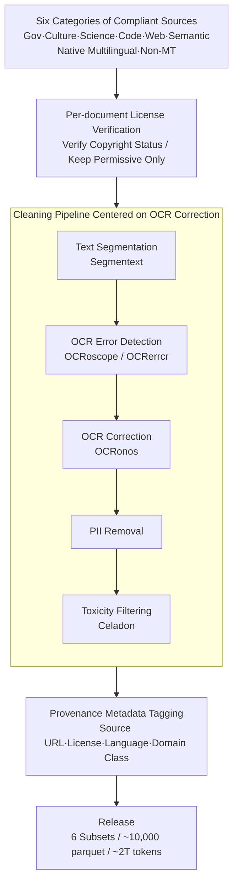

# Common Corpus: The Largest Collection of Ethical Data for LLM Pre-Training

**Conference**: ICLR 2026 Oral  
**arXiv**: [2506.01732](https://arxiv.org/abs/2506.01732)  
**Code**: [HuggingFace](https://huggingface.co/datasets/PleIAs/common_corpus)  
**Area**: LLM Pre-training Data / Data Engineering / AI Compliance  
**Keywords**: pre-training data, ethical data, open data, multilingual, data curation, copyright, AI legislation

## TL;DR
Establishment of Common Corpus—the largest legally authorized LLM pre-training dataset with approximately 2 trillion tokens. It covers 6 major collections (Government, Culture, Science, Code, Web, Semantic) across multiple languages (including low-resource languages). All data originates from public domain or permissively licensed sources, featuring complete data provenance and a multi-stage filtering pipeline. It has already been adopted by industry leaders such as Anthropic.

## Background & Motivation
**Background**: LLM pre-training requires trillion-token scale data (latest models like DeepSeek v3 and Llama 4 use $14-36T$ tokens), but mainstream datasets (The Pile, RefinedWeb, C4) utilize significant amounts of copyrighted content.

**Limitations of Prior Work**:
   - **Escalating Legal Risks**: NYT lawsuit against OpenAI, EU AI Act legislation, and the fact that 45% of C4 content is now restricted by ToS from crawling.
   - **Damage to Open Science**: Critical resources like Books3, LAION, and MATH benchmarks have been taken down due to DMCA/legal challenges, rendering previous research irreproducible.
   - **Insufficiency of Existing Compliant Datasets**: C4C ($228B$ tokens, English only), KL3M ($1.2T$ tokens, US administrative text only), and Common Pile ($1T$ tokens, English only) are either small in scale or limited in language variety.

**Key Challenge**: Training powerful LLMs requires massive data, yet the scale of compliant data is insufficient; compliant data for multilingual and low-resource languages is even scarcer.

**Core Idea**: Systematically collect and filter approximately $2T$ tokens from copyright-free or permissively licensed sources (government documents, public domain literature, open science papers, open-source code, Creative Commons web content) to establish an open science infrastructure for AI training data.

## Method

### Overall Architecture
The objective of Common Corpus is straightforward: to assemble a trillion-token scale corpus genuinely suitable for LLM pre-training without infringing on copyrighted content. The pipeline follows a "source selection → rights verification → cleaning → provenance" workflow. Candidate documents are first identified from six naturally compliant and multilingually diverse sources (Government, Culture, Science, Code, Web, and Semantic). Each document's copyright and license status is verified to retain only "license-free" content. This is followed by a cleaning pipeline centered on OCR repair (Text Segmentation → OCR Error Detection → OCR Correction → PII Removal → Toxicity Filtering), as a large volume of public domain literature comes from library scans with heavy OCR noise. Finally, each document is tagged with complete provenance metadata and categorized by domain, published as approximately 10,000 parquet files. The final corpus comprises 6 major collections totaling approximately $2T$ tokens:

| Subset | Documents | Tokens | Source |
|------|-----------|--------|------|
| Open Government | 74.7M | 406.6B | Global gov documents, legal texts, parliamentary records |
| Open Culture | 93.2M | 886.0B | Public domain books, historical documents, digitized library content |
| Open Science | 19.2M | 281.2B | Open access papers, preprints (arXiv, etc.) |
| Open Code | 202.8M | 283.2B | Permissively licensed source code (MIT/Apache/BSD, etc.) |
| Open Web | 96.2M | 73.2B | Creative Commons licensed web content |
| Open Semantic | 30.1M | 68.0B | Structured knowledge (Wikipedia, etc.) |
| **Total** | **517.0M** | **~2.0T** | |

### Key Designs

**1. Native Multilingual Compliant Source Coverage: Addressing the Monolingual Shortfall of Compliant Datasets**

Existing compliant datasets like C4C, KL3M, and Common Pile are almost exclusively in English, hindering the compliant training of multilingual LLMs. From the outset, Common Corpus adopted "broad coverage + multilingualism" as a selection principle. The six source categories span from ancient literature to the latest CC web pages. In terms of language, English still accounts for the majority ($968.8B$ tokens, ~48.5%), followed by French ($275.4B$) and German ($112.1B$). Each of the top nine languages has $\ge 10B$ tokens, with overall coverage spanning over 50 languages, including low-resource ones. Crucially, all non-English data consists of **native text, never machine-translated**. Machine translation introduces translationese and factual drift, whereas native text preserves real linguistic distributions.

**2. Per-document License Verification: Upgrading "Compliance" from Coarse Filtering to Individual Verification**

Mainstream datasets assume "it's on the web, so it's usable," yet 2024 analyses show 45% of C4 tokens are restricted by ToS. Common Corpus reverses this by individually verifying the copyright status and license type for **every document**, aligning with the strongest definition of "Open" by the Open Source Initiative—requiring that data be usable for any purpose without permission. Specifically: Public domain content is verified against national copyright laws (e.g., early publications, expired copyrights); code is restricted to permissive licenses that do not require attribution (MIT, Apache 2.0, BSD, etc.), excluding copyleft licenses like GPL. This ensures every document is "license-free," mitigating legal risks like the NYT vs. OpenAI case.

**3. OCR-centric Multi-stage Cleaning Pipeline: Refining "Source Compliance" into "Content Usability"**

Verification only addresses legality; quality depends on cleaning. This pipeline is unique in that three of its five stages focus on OCR. A large portion of public domain literature comes from library scans with significant OCR noise. Using OCRoscope, the authors measured that the OCR quality rate for public domain sections was only about 59% (measured by the ratio of recognizable 7-grams). The pipeline stages are: **Text Segmentation** using Segmentext to handle layout distortion; **OCR Error Detection** using OCRoscope/OCRerrcr to provide quality scores; **OCR Correction** using OCRonos (based on Llama 3 8B) to fix typos and structural collapses via "synthetic rewriting"; **PII Removal** to comply with GDPR; and **Toxicity Filtering** using the self-trained multilingual classifier Celadon (DeBERTa-v3-small, ~140M parameters) across five dimensions (race, gender, religion, ability, violence).

**4. End-to-end Provenance Metadata: Enabling Full Auditability of the Corpus**

To support its role as "open science infrastructure," every document includes a set of provenance metadata: source URL, license type, language tag, and collection/domain category. This allows for a complete audit chain—from the trained model back to the data it consumed, and further back to the original source and license credentials. Users can also filter out specific collections if needed. This distinguishes it from datasets like The Pile, which, due to inclusion of copyrighted content like Books3 and lack of provenance, must be taken down entirely when challenged.

## Key Experimental Results

### Scale Comparison

| Dataset | Scale | Language | Compliance |
|--------|------|------|--------|
| C4 | 156B | English-centric | Partially Restricted |
| RefinedWeb | 5T | English | Copyright Disputes |
| C4C | 228B | English | Compliant |
| KL3M | 1.2T | English | Compliant (US Admin) |
| Common Pile | 1T | English | Compliant |
| **Common Corpus** | **~2.0T** | **50+ Languages** | **Fully Compliant** |

Ours is the only dataset that simultaneously meets the criteria of "trillion-scale + multilingual + fully compliant."

### Data Diversity

| Dimension | Features |
|------|------|
| Time Span | Ancient to Modern (Public domain history → Latest CC Web) |
| Domain Scope | Law, Science, Literature, Code, Encyclopedia, Community content |
| Language Diversity | 50+ languages, including African/Asian low-resource languages |

### Community Impact
- Adopted by Anthropic for model training.
- Utilized by multiple LLM training projects.
- Derivatives include multimodal datasets, classifiers, synthetic datasets, and benchmarks.

### Key Findings
- **"The Open Data Paradox"**: A large amount of public domain/open licensed content has low visibility online and is missing from mainstream pre-training sources—requiring active extraction rather than relying solely on Common Crawl.
- Documents digitized by governments and cultural institutions are undervalued sources—high quality, no copyright issues, and multilingually diverse.
- Even with the most permissive licenses, gaps in diversity and quality persist in compliant data, necessitating further community effort.

## Highlights & Insights
- **Milestone for AI Compliance Infrastructure**: In the context of the EU AI Act and copyright litigation, Common Corpus proves that "compliant + large-scale" is possible, providing a "commons" for the industry.
- **Paradigm for Open Science**: Full data provenance, license verification, and processing tools are all open-sourced, allowing other projects to reuse the entire pipeline.
- **Unique Semantic Coverage**: Distinct from web-crawled data, it includes historical documents, legal texts, and scientific papers, potentially offering a knowledge distribution different from typical web text.

## Limitations & Future Work
- **Scale Ceiling**: $~2T$ tokens is significantly smaller than non-compliant datasets (RefinedWeb $5T+$), which may be insufficient for training the largest models under scaling laws.
- **Quality Gap**: Differences in distribution between public domain literature (OCR quality, archaic styles) and modern web text remain unquantified regarding model performance.
- **Lack of Training Validation**: Performance comparisons between models trained on Common Corpus versus non-compliant data are not reported (a key missing piece).
- **Code Data**: $283B$ tokens is far less than specialized code datasets like The Stack.
- **Low-resource Languages**: While covered, the volume may still be insufficient for training high-quality models.

## Related Work & Insights
- **vs The Pile**: A pioneering pre-training dataset but contains copyrighted content like Books3, leading to partial takedowns.
- **vs RefinedWeb**: $5T$ scale but sourced entirely from Common Crawl without license filtering.
- **vs KL3M**: Compliant but limited to US administrative text (narrow domain).
- **Industry Implications**: Common Corpus demonstrates that compliant data collection is an infrastructure project requiring sustained investment, not a one-off task. Collaborative models (like BLOOM's ROOTS) appear to be the sustainable path.

## Rating
- Novelty: ⭐⭐⭐ (Primary contribution is data engineering; limited methodological innovation)
- Experimental Thoroughness: ⭐⭐⭐ (Detailed dataset description, but lacks critical model training performance benchmarks)
- Writing Quality: ⭐⭐⭐⭐ (Clear description of sources and pipelines, follows best practices)
- Value: ⭐⭐⭐⭐⭐ (ICLR Oral deserved—significant push for industry compliance and a major contribution to open science infrastructure)

<!-- RELATED:START -->

## Related Papers

- [\[ICLR 2026\] Rewriting Pre-training Data Boosts LLM Performance in Math and Code](rewriting_pre-training_data_boosts_llm_performance_in_math_and_code.md)
- [\[ACL 2026\] Demystifying Data Organization for Enhanced LLM Training](../../ACL2026/llm_pretraining/demystifying_data_organization_for_enhanced_llm_training.md)
- [\[ICLR 2026\] Pre-training LLM without Learning Rate Decay Enhances Supervised Fine-Tuning](pre-training_llm_without_learning_rate_decay_enhances_supervised_fine-tuning.md)
- [\[ICLR 2026\] Late-to-Early Training: 让 LLM 更早学到后期知识，从而更快更好](late-to-early_training_let_llms_learn_earlier_so_faster_and_better.md)
- [\[ICLR 2026\] Token-level Data Selection for Safe LLM Fine-tuning](token-level_data_selection_for_safe_llm_fine-tuning.md)

<!-- RELATED:END -->
