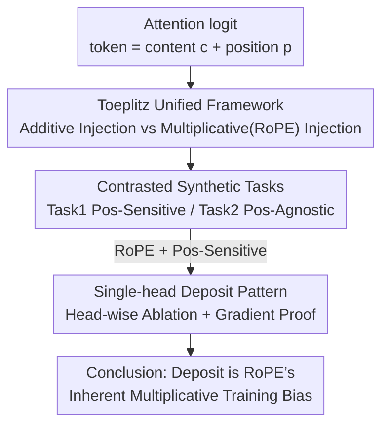

# Deconstructing Positional Information: From Attention Logits to Training Biases

**Conference**: ICLR 2026  
**arXiv**: [2505.13027](https://arxiv.org/abs/2505.13027)  
**Code**: To be confirmed  
**Area**: LLM Pre-training  
**Keywords**: Positional Encoding, RoPE, Toeplitz Matrix, Attention Mechanism, Single-head Deposit Pattern  

## TL;DR
Based on a unified Toeplitz matrix framework, the authors categorize positional encoding (PE) into additive (Absolute/T5/ALiBi) and multiplicative (RoPE) types. Through synthetic tasks, they find that RoPE holds significant advantages in position-sensitive tasks but exhibits a "single-head deposit pattern"—where positional reasoning in shallow layers is almost entirely concentrated in a single attention head. This pattern is theoretically proven to be an inherent property of RoPE's multiplicative structure.

## Background & Motivation

**Background**: Positional Encoding (PE) is a core component of Transformers, evolving from additive forms (Sinusoidal, T5 Bias, ALiBi) to multiplicative forms (RoPE). Currently, the understanding of its mechanism is largely limited to the properties of distance decay and translation invariance.

**Limitations of Prior Work**: Although RoPE has favorable theoretical properties (e.g., decay supporting length generalization), it underperforms compared to simple relative PE or even No-PE models on certain tasks. This "performance paradox" lack explanation.

**Core Idea**: Deconstruct the attention logit calculation into interaction terms between content and position, using Toeplitz matrices for unified description. Reveal that additive PE introduces position via independent bias terms, while multiplicative PE (RoPE) couples positional signals with content via Hadamard products—this strong coupling leads to an over-concentration of positional reasoning.

## Method

### Overall Architecture
This paper does not propose a new method but breaks down the calculation of attention logits to observe where positional information enters and how it settles during training. The analysis follows four steps: first, decomposing each token representation into content and position components $x_i = c_i + p_i$, and expanding the query-key inner product to unify mainstream PEs under a Toeplitz matrix perspective, distinguishing "additive injection" and "multiplicative (RoPE) injection." Second, using a pair of contrasted synthetic tasks to isolate content-position coupling capabilities from natural language. Third, performing head-wise ablation on these probes to discover that RoPE deposits positional reasoning into a single head in shallow layers (single-head deposit pattern). Finally, using gradient analysis to prove this deposit is an inherent training bias of multiplicative injection.

### Key Designs

**1. Toeplitz Unified Framework: Categorizing PE into Additive and Multiplicative Paths**

Positional encoding has historically been described by fragmented properties like "distance decay" and "translation invariance." This paper leverages the translation invariance property—where the relationship between any two tokens depends only on their relative distance—and maps it to the structure of Toeplitz matrices. By expanding the logit matrix into content-position cross-terms, two distinct paths emerge. Additive PE (Absolute, T5 Bias, ALiBi) injects positional signals as independent terms, where the logit matrix is $\mathbf{L}_{\text{Add}} = G_{q^c,k^c} + G_{q^c,k^p} + G_{q^p,k^c} + G_{q^p,k^p} + \mathbf{B}$, keeping position terms independent of content. Multiplicative PE (RoPE) uses a Toeplitz kernel $G_{\mathbf{e}}$ dependent on relative distance $i-j$ to modulate the content interaction: $\mathbf{L}_{\text{RoPE}} = \text{Re}\{(G_{q,k}+G_{q,p}+G_{p,k}+G_{p})\circ G_{\mathbf{e}}\}$. This multiplicative coupling prevents positional signals from decoupling from content.

**2. Contrasted Synthetic Tasks: Isolating Content-Position Coupling**

To verify the "multiplicative coupling" theory, the authors designed two synthetic tasks: Task 1 (Position-Sensitive) requires predicting the relative distance between two trigger words (requiring "what" and "where"); Task 2 (Position-Agnostic) requires counting trigger word frequency (where position is a nuisance). As predicted, RoPE leads significantly on Task 1 (92.64%) but performs worse on Task 2.

**3. Single-head Deposit Pattern: Training Dynamics of Multiplicative Coupling**

Head-wise ablation on Task 1 revealed that removing one specific head in the first layer caused accuracy to drop by ~60 points, while removing any other head had no effect. This pattern only occurs with "RoPE + Position-Sensitive" tasks. Gradient analysis provides the proof: Proposition 6.1 shows RoPE’s multiplicative structure ensures a non-zero "seed" for positional gradients, causing one head to gain an advantage first. Proposition 6.2 shows ALiBi’s additive bias gradients cancel out. Theorem 6.1 indicates that backpropagation exponentially amplifies this initial advantage layer by layer, where the margin between dominant and sub-dominant heads satisfies $\text{Margin}_l \geq \text{Margin}_L \prod_{k=l}^{L-1}\gamma_k$ (where $\gamma_k>1$), leading to monopoly.

## Key Experimental Results

### Synthetic Task Performance

| PE Method | Task 1 (Pos.-Sensitive) Acc | Task 2 (Pos.-Agnostic) Acc |
|-----------|-------------------------|--------------------------|
| RoPE      | **92.64%**               | 69.43%                   |
| MLA       | 88.34%                   | **97.41%**               |
| Absolute  | Sub-optimal             | Medium                   |
| ALiBi     | Failure                 | Worst                    |
| NoPE      | Failure                 | **77.69%**               |

### Ablation Study: Minimum RoPE Heads

| Number of RoPE Heads | Task 1 Acc |
|----------------------|------------|
| All heads            | 92.64%     |
| 2 heads              | ≈90%+      |
| **1 head**           | **≈90%**   |

### Key Findings
- RoPE requires only 1-2 heads for all positional reasoning; other heads are redundant for positional tasks.
- Hybrid architecture MLA (DeepSeek-V3) eliminates the deposit pattern and achieves near-optimal results on both tasks (88.34% / 97.41%).
- RoPE suppresses implicit positional representations; in Absolute+RoPE models, additive positional directions are displaced after Layer 2.

## Highlights & Insights
- **Elegant Theoretical Framework**: Uses Toeplitz matrices to categorize all PEs, explaining RoPE's behavior.
- **Continuous Logic Chain**: Synthetic discovery $\rightarrow$ Ablation verification $\rightarrow$ Mathematical proof.
- **Theoretical Validation of MLA**: Explains why DeepSeek-V3’s MLA design is effective from a PE perspective.

## Limitations & Future Work
- The causal link between deposit patterns and length extrapolation is hypothesized but not directly verified.
- Synthetic tasks are simplified; applicability to complex NLP tasks is unknown.
- Analysis focused on 6-layer models; persistence in large-scale models is unclear.

## Related Work & Insights
- Explains why NoPE can outperform RoPE in some cases (Kazemnejad et al., 2023) because multiplicative bias is harmful for position-agnostic tasks.
- Suggests avoiding pure multiplicative coupling in favor of hybrid strategies like MLA (parallel NoPE + RoPE).

## Rating
- Novelty: ⭐⭐⭐⭐⭐ 
- Experimental Thoroughness: ⭐⭐⭐⭐ 
- Writing Quality: ⭐⭐⭐⭐⭐ 
- Value: ⭐⭐⭐⭐

## Related Papers

- [\[ICML 2026\] Decoupling the "What" and "Where" With Polar Coordinate Positional Embeddings](../../ICML2026/llm_pretraining/decoupling_the_what_and_where_with_polar_coordinate_positional_embeddings.md)
- [\[ICLR 2026\] Conditioned Initialization for Attention](conditioned_initialization_for_attention.md)
- [\[ICLR 2026\] SPICE: Submodular Penalized Information–Conflict Selection for Efficient Large Language Model Training](spice_submodular_penalized_informationconflict_selection_for_efficient_large_lan.md)
- [\[ICLR 2026\] Explaining Grokking and Information Bottleneck through Neural Collapse Emergence](explaining_grokking_and_information_bottleneck_through_neural_collapse_emergence.md)
- [\[ICLR 2026\] Beyond Length: Quantifying Long-Range Information for Long-Context LLM Pretraining Data](beyond_length_quantifying_long-range_information_for_long-context_llm_pretrainin.md)

<!-- RELATED:END -->

<!-- RELATED:START -->

## Related Papers

- [\[ICML 2026\] Decoupling the "What" and "Where" With Polar Coordinate Positional Embeddings](../../ICML2026/llm_pretraining/decoupling_the_what_and_where_with_polar_coordinate_positional_embeddings.md)
- [\[ICLR 2026\] SPICE: Submodular Penalized Information–Conflict Selection for Efficient Large Language Model Training](spice_submodular_penalized_informationconflict_selection_for_efficient_large_lan.md)
- [\[ICLR 2026\] Conditioned Initialization for Attention](conditioned_initialization_for_attention.md)
- [\[ICLR 2026\] Explaining Grokking and Information Bottleneck through Neural Collapse Emergence](explaining_grokking_and_information_bottleneck_through_neural_collapse_emergence.md)
- [\[ICLR 2026\] Avey-B: Refactoring Attention-Free Architectures into Bidirectional Encoders](avey-b.md)

<!-- RELATED:END -->
