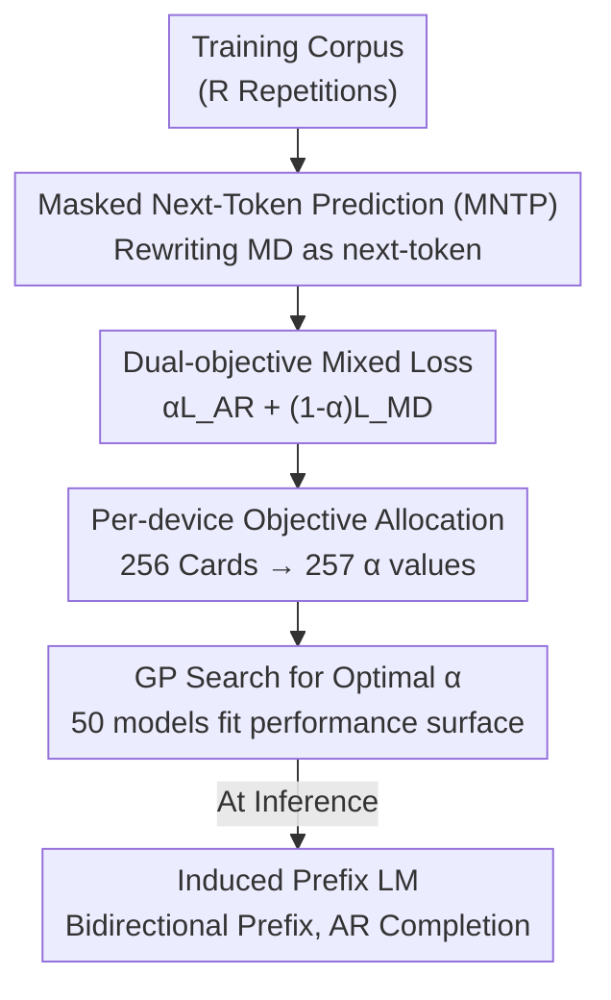

# Dual-objective Language Models: Training Efficiency Without Overfitting

**Conference**: ICLR2026  
**OpenReview**: [https://openreview.net/forum?id=BrPt0GFgOM](https://openreview.net/forum?id=BrPt0GFgOM)  
**Code**: https://github.com/ltgoslo/dual-language-models (Available, models also open-sourced on HuggingFace at `ltg/dual-lm-470m`)  
**Area**: LLM Pre-training / Training Objectives / Data-constrained Scaling  
**Keywords**: Dual-objective training, Autoregressive, Masked-diffusion, Overfitting, Data wall

## TL;DR
Without **modifying any model architecture**, this work linearly mixes autoregressive (AR) and masked-diffusion (MD) training objectives using a weight $\alpha$ on the same Transformer. This allows the model to possess both the high training efficiency of AR and the anti-overfitting capabilities of MD. The authors trained 50 models of 470M parameters to systematically sweep for the optimal $\alpha$ under different data repetition counts, concluding that "hybrid training is superior to single-objective training in all settings."

## Background & Motivation
**Background**: Currently, mainstream large language models almost exclusively utilize the autoregressive "next-token prediction" objective (GPT series). Its primary advantage is training efficiency—it allows for parallel calculation of losses at every position in a sequence in a single forward pass, enabling rapid absorption of massive text corpora.

**Limitations of Prior Work**: The autoregressive objective has a long-overlooked weakness—**it is highly prone to overfitting when training data is repeated multiple times**. Muennighoff et al. found that pure AR models learn almost nothing new after more than 16 data repetitions, after which held-out loss begins to diverge. Another approach, masked-diffusion language models (MD, which essentially extends BERT-style mask recovery into a diffusion process), is inherently resistant to overfitting and utilizes bidirectional context, but suffers from **low sample efficiency and slow convergence**, requiring more compute to catch up with AR.

**Key Challenge**: A clear trade-off exists between the "fast but overfit-prone" AR and the "stable but slow" MD. This trade-off is becoming increasingly critical as the "data wall" approaches (high-quality text is nearing exhaustion while compute continues to grow exponentially). Future training will inevitably involve **repeated iterations over limited data**, making overfitting the primary adversary.

**Goal**: Can a single model capture both the high efficiency of AR and the anti-overfitting of MD? Furthermore, can an operational guide be provided for the optimal ratio of the two objectives given a certain degree of data repetition?

**Key Insight**: The strengths and weaknesses of the two objectives are perfectly complementary. The authors' intuition is to use AR for "fast absorption" and MD as a "regularizer" to prevent divergence. A key observation is that if MD is reformulated into a "next-token prediction" format, both objectives can share the same parameters and architecture, making hybrid training nearly cost-free.

**Core Idea**: Minimize a hybrid loss $\alpha L_{\text{AR}} + (1-\alpha)L_{\text{MD}}$ during training, adjusting the ratio with a single hyperparameter $\alpha$. At inference time, the model is used directly as a standard autoregressive model with **zero additional overhead**.

## Method

### Overall Architecture
The method addresses how to train a Transformer using two seemingly incompatible objectives without increasing architectural or inference costs. The overall mechanism follows three steps: ① Reformulate the masked-diffusion objective into "Masked Next-Token Prediction" (MNTP), making it a next-token prediction task identical to AR. This allows the reuse of **identical networks and parameters**—the only difference lies in whether the input is masked and whether the attention mask is causal or bidirectional. ② Linearly mix the two objectives into a joint loss using weight $\alpha$. To avoid slowing down throughput, the authors **allocate objectives by GPU device** (each card calculates only one objective); with 256 cards, this naturally provides 257 discrete possible values for $\alpha$. ③ Train 50 models and use Gaussian Process Regression (GPR) to fit a "Data Repetitions × $\alpha$ → Downstream Performance" surface to derive the optimal $\alpha$ for any data-constrained level, distilled into direct empirical rules. Additionally, the trained model gains "Prefix Language Modeling" capabilities for free during inference.

### Key Designs

**1. Masked Next-Token Prediction (MNTP): Turning Diffusion into "Next-token Prediction"**

The biggest obstacle to mixing AR and MD is their different "shapes"—AR predicts $x_i$ using $x_{<i}$ at position $i$, while standard masked diffusion predicts the original token at the masked position directly. If the output alignment differs, parameters cannot be shared. The authors adopt **Masked Next-Token Prediction (MNTP)** (from Lv et al.): the model **always uses the hidden state at position $i$ to predict the token at position $i+1$**, regardless of whether it is in AR or diffusion mode. Thus, both modes are unified as next-token prediction, differing only in input and attention masking. The masked diffusion loss is written as an upper bound on the integral over time $t\in[0,1]$:

$$-\log p_\theta(x) \le -\int_0^1 \mathbb{E}_{x^t\sim q_{t|0}(\cdot|x)}\Big[\tfrac{1}{t}\sum_{\{i\,|\,x^t_i=\text{mask}\}}\log p_\theta(x_i\mid x^t)\Big]\,dt \overset{\text{def}}{=} L_{\text{MD}}(x;\theta)$$

Where the forward diffusion process turns each token into a mask with probability $t$ ($t=0$ is the original sentence, $t=1$ is fully masked). The integral is estimated via Monte Carlo sampling $t\sim U(0,1)$. The authors prove in the appendix that this MNTP parameterization is **equivalent in expressivity** to standard mask recovery, so the reformulation loses no capability.

**2. Dual-objective Mixed Loss and Weight $\alpha$: A Dial for "Efficiency" and "Stability"**

With unified shapes, the two objectives can be weighted and added. The training objective becomes:

$$\arg\min_\theta\ \mathbb{E}_{x\sim D}\big[\alpha L_{\text{AR}}(x;\theta) + (1-\alpha)L_{\text{MD}}(x;\theta)\big]$$

$\alpha$ is the core hyperparameter: $\alpha=1$ reduces to pure AR, $\alpha=0$ reduces to pure MD, and intermediate values continuously interpolate between "training efficiency" and "anti-overfitting." It works because a high proportion of AR ensures fast convergence, while a small proportion of MD acts as a regularizer imposing "useful modeling priors," pulling back AR's tendency to overfit. A counter-intuitive discovery is that even if one **only cares about bidirectional (diffusion) performance**, pure MD training is not ideal—mixing in a small amount of AR (large $\alpha$) achieves stronger bidirectional capabilities than pure MD.

**3. Per-device Objective Allocation: Mixing within Batches with Zero Throughput Loss**

Mixing AR and MD samples within the same batch would lead to dynamic computation graphs that are difficult to compile, reducing throughput. The authors' engineering insight is to **assign only one objective per GPU**, keeping the computation graph on each card simple, static, and highly efficiency for compilation. By distributing training across **256 devices**, $\alpha$ naturally falls into 257 discrete values $\{i/256\mid i=0,1,\dots,256\}$. Determining how many cards to allocate to AR is equivalent to setting $\alpha$. This design reduces the algorithmic problem of mixing objectives to a simple system problem of device allocation.

**4. GP Search for Optimal $\alpha$ + Two Empirical Rules: Compressing 50 Experiments into Guidelines**

Since data contains noise and the "Repetitions × $\alpha$ → Performance" mapping is a 2D surface, point-by-point comparison is unreliable. The authors trained **50 models** and used **Gaussian Process Regression (GPR)** (with an anisotropic Matérn kernel ν=1.5 + an additive white noise kernel) to fit this surface, achieving $R^2 > 0.99$. They then used posterior sampling to estimate the probability density of the optimal $\alpha$ given a repetition count. This yielded two rules: **Normal Data Zone** (≤16 repetitions, where AR does not yet overfit)—use $\alpha\approx 63/64$ (mixing in a tiny bit of MD) to gain stronger bidirectional capabilities without sacrificing AR performance (Remark 1); **Data-constrained Zone** (>32 repetitions, where overfitting is the main contradiction)—choose $\alpha$ such that the AR objective "effectively sees approximately 16 data repetitions" (Remark 2), as exceeding 32 AR repetitions causes overfitting while fewer than 8 leads to underfitting.

**5. Induced Prefix Language Modeling: Free Gains at Inference Time**

Because the model sees both unidirectional and bidirectional attention during training, the authors tested its generalization to "Prefix Language Modeling" during inference without **any additional training**. In this mode, the conditioning part of the prompt (prefix) is processed with bidirectional attention, while the completion is still generated autoregressively. They found that in most hybrid configurations, this prefix-style inference **stably outperforms pure AR inference by more than 1 percentage point** (Remark 3). In contrast, previous work required training specific adapters to achieve this, whereas dual-objective training provides this capability "for free."

## Key Experimental Results

Experiments were standardized on 470M parameter models (360M non-embedding weights) with a 32B token total budget. The repetition factor $R$ denotes sampling a unique subset of size $32\text{B}/R$ and repeating it $R$ times. The Muon optimizer and WSD learning rate scheduler were used on the HPLT v2 English web corpus.

### Main Results: Autoregressive Evaluation (Normalized scores, 0=random, 100=perfect)

| Repetitions | Model Configuration | Avg Score | Key Comparison |
| :--- | :--- | :--- | :--- |
| 1× | Dual (α=63/64) | **26.9** | Slightly better than pure AR |
| 1× | Autoregressive (α=1) | 26.1 | — |
| 32× | Dual (α=3/4) | **23.9** | 1.9 higher than pure AR |
| 32× | Autoregressive (α=1) | 22.0 | — |
| 128× | Dual (α=1/8) | **19.1** | 9.7 higher than pure AR |
| 128× | Autoregressive (α=1) | 9.4 | Catastrophic overfitting |

**Core Signal**: The more extreme the data repetition, the more pronounced the advantage of the dual-objective. At 128x repetitions, pure AR collapses to 9.4 (some tasks falling below the random baseline), while the dual-objective maintains 19.1—nearly double. Even in standard 1x repetition settings, the dual-objective does not lose to pure AR.

### Ablation Study / Analysis: Relationship between α and Overfitting

| Configuration | Phenomenon | Description |
| :--- | :--- | :--- |
| α=1 (Pure AR) | Overfits after >16 repetitions | Held-out loss diverges |
| α=0 (Pure MD) | Underperforms hybrid in bidirectional eval | Low sample efficiency, slow convergence |
| Intermediate α | Gains across most of the 9 tasks | Larger gain with more repetition |
| Prefix Inference | Gain >1pp in most configs | Zero extra training |

### Key Findings
- **Mixture is Always Superior**: In all evaluation settings (including normal vs. data-constrained, unidirectional vs. bidirectional tasks), hybrid training strictly outperforms either single objective. This is a stronger conclusion than parallel work suggesting "MD only beats AR when data is constrained."
- **Optimal $\alpha$ is Linked to Overfitting**: The optimal $\alpha$ falls just below the "overfitting $\alpha$ threshold." Since overfitting behavior does not scale with model size (per prior literature), the authors argue that the optimal $\alpha$ should remain stable for larger models, where the benefits of dual-objective training may be even greater.
- **Pushing the Data Wall by an Order of Magnitude**: While pure AR stops learning effectively after 16 repetitions, the dual-objective pushes this limit by at least an order of magnitude (maintaining non-trivial performance at 128x repetitions, equivalent to viewing only 256M unique tokens).

## Highlights & Insights
- **"Change the Shape, Not the Structure"**: Using MNTP to rewrite the diffusion objective into a next-token format is the key to zero cost. This "unified surface form" allows sharing parameters and architecture, allowing the model to be used as a standard GPT during inference. This idea can be transferred to any scenario involving mixed heterogeneous objectives.
- **Engineering Hyperparameter Search as "Device Allocation"**: Allocating objectives by GPU solves throughput issues and discretizes the continuous hyperparameter $\alpha$ into 257 clean values—a brilliant example of algorithm-system co-design.
- **Combating Noise with GPR**: Instead of point-by-point comparison of 50 noisy model points, fitting a smooth surface and estimating the "optimal probability" via posterior sampling is a robust experimental analysis paradigm.
- **The Most Counter-intuitive Point**: To achieve strong bidirectional capabilities, the optimal solution is not pure bidirectional training, but "mostly AR + a little MD." This indicates that the fast convergence provided by AR positively transfers to bidirectional representations.

## Limitations & Future Work
- **Scaling Relies on Argumentation rather than Measurement**: All experiments were conducted at the 470M scale. The claim that the conclusion holds for larger models is an indirect inference based on scaling laws of overfitting, lacking direct verification due to the cost of large-scale experiments.
- **Narrow Optimal $\alpha$ Window in Data-constrained Zones**: While Remark 2 provides an empirical heuristic, the paper notes this interval is narrow and sensitive to configurations, requiring careful tuning in practice.
- **Limited Scope of Tasks and Corpora**: Evaluation was limited to 9 zero-shot English tasks and the HPLT corpus; performance on multilingual, code, or larger downstream tasks remains unknown.
- **Future Directions**: Exploring **dynamic scheduling of $\alpha$** during training (rather than fixed) or extending the MNTP framework to more objectives (e.g., prefix, UL2-style denoising).

## Related Work & Insights
- **vs. GPT-BERT (Charpentier & Samuel, 2024)**: This work builds directly on GPT-BERT's mixture but scales it from the tiny BabyLM models to **masked-diffusion** objectives and significantly larger compute scales, validating its practicality.
- **vs. CM3 / GLM / T5 / BART**: Earlier works also mix bidirectional and AR objectives, but most rely on encoder-decoder structures or non-standard position encodings. This work requires no architectural changes, provides fine-grained $\alpha$ ratios, and generalizes to masked diffusion.
- **vs. AntLM (Yu et al., 2024)**: AntLM uses a curriculum (AR → MLM → AR), but switching causes forgetting. This work **continually learns** both objectives simultaneously, avoiding forgetting issues.
- **vs. Pure Diffusion Scaling Laws (Prabhudesai et al., 2025; Ni et al., 2025)**: They proved MD beats AR under data constraints; this work proves **no single objective is optimal—a mixture is always better**, not just when data is constrained.

## Rating
- Novelty: ⭐⭐⭐⭐ Not a brand-new mechanism, but the combination of "zero-cost unification + systematic α sweep + data wall perspective" is highly valuable.
- Experimental Thoroughness: ⭐⭐⭐⭐ 50 models + GPR fitting is solid, though limited to a single scale/corpus and lacking direct large-scale validation.
- Writing Quality: ⭐⭐⭐⭐⭐ Clear motivation, highly persuasive visualizations (especially Figure 1/4), and actionable Remarks.
- Value: ⭐⭐⭐⭐⭐ An operational guide for the "data wall" era; zero inference overhead makes it directly applicable to future LLM pre-training.

<!-- RELATED:START -->

## Related Papers

- [\[ICLR 2026\] Pre-training LLM without Learning Rate Decay Enhances Supervised Fine-Tuning](pre-training_llm_without_learning_rate_decay_enhances_supervised_fine-tuning.md)
- [\[ICLR 2026\] Pre-training Limited Memory Language Models with Internal and External Knowledge](pre-training_limited_memory_language_models_with_internal_and_external_knowledge.md)
- [\[ICLR 2026\] Soft-Masked Diffusion Language Models](soft-masked_diffusion_language_models.md)
- [\[ICLR 2026\] Steering Language Models with Weight Arithmetic](steering_language_models_with_weight_arithmetic.md)
- [\[ICLR 2026\] CHAMMI-75: Pre-training multi-channel models with heterogeneous microscopy images](chammi-75_pre-training_multi-channel_models_with_heterogeneous_microscopy_images.md)

<!-- RELATED:END -->
