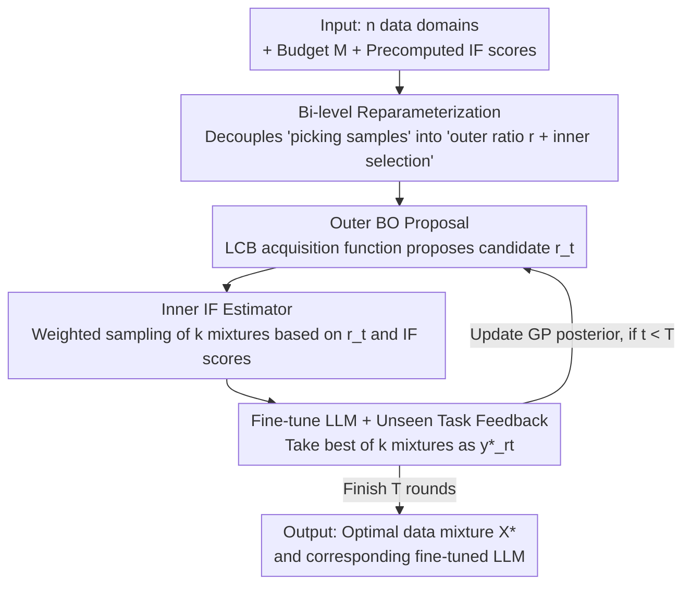

# DUET: Optimizing LLM Training Data Mixtures via Noisy Feedback from Unseen, Downstream Evaluation Tasks

**Conference**: ICLR2026  
**OpenReview**: [https://openreview.net/forum?id=9QpBwvTfBh](https://openreview.net/forum?id=9QpBwvTfBh)  
**Code**: https://github.com/chenzhiliang94/BO-for-LLMs  
**Area**: LLM Pre-training / Data Mixing / Bayesian Optimization  
**Keywords**: Data mixing, Data selection, Bayesian Optimization, Influence Function, Unseen evaluation tasks

## TL;DR
DUET addresses realistic scenarios where "evaluation task data is unseen and only multiple rounds of coarse noisy feedback are available" by iteratively optimizing LLM training data mixtures through "global Bayesian Optimization for domain ratios + local influence functions for high-quality sample selection." It provides convergence proofs and significantly outperforms methods requiring fine-grained data information, such as DoReMi and LESS, across multiple language tasks.

## Background & Motivation
**Background**: LLM performance relies heavily on the alignment between the training data domains and downstream evaluation tasks. Research on "how to configure data" has followed two main tracks: first, data mixing (e.g., DoReMi, BiMix, Aioli), which optimizes the ratios of different data domains in the training set; second, data selection (e.g., LESS, influence function, TracIn), which identifies high-quality samples within each domain.

**Limitations of Prior Work**: Almost all these methods assume access to "fine-grained data information" of the evaluation task—either knowing the distribution/labels of the evaluation data, being able to calculate the gradient of evaluation samples, or assuming the training and evaluation data are identically distributed. In real-world deployment, this is often not the case. A typical example is a chatbot where user conversations are end-to-end encrypted; the model owner cannot see the test data and only receives **coarse and noisy** feedback like "user ratings" or "dwell time." The authors refer to these as **unseen evaluation tasks**.

**Key Challenge**: Under the unseen task setting, one can neither directly minimize the evaluation loss (as it has no closed-form expression and data is invisible) nor brute-force all data mixtures (due to the cost of training LLMs). This constraint of "only one black-box feedback channel with noise" causes existing methods dependent on fine-grained information to fail—experimental results show that directly applying DoReMi or LESS to this setting performs worse than DUET.

**Goal**: Automatically optimize training data mixtures under the premise of "invisible evaluation data and multiple rounds of coarse noisy feedback" to maximize LLM performance on unseen tasks after fine-tuning.

**Key Insight**: The authors observe that this perfectly fits the problem structure of Bayesian Optimization (BO)—optimizing a black-box function that lacks a closed form, allows only queries, and returns noisy results. Moreover, BO is **query-efficient**, matching the reality where "each query requires training an LLM and is thus expensive." By treating "domain ratios" as the BO input and "unseen task feedback" as the black-box objective, the optimal ratio can be approximated with a limited number of feedback rounds.

**Core Idea**: The data mixture optimization is reparameterized into a bi-level problem: "outer loop for ratio tuning, inner loop for sample selection." The outer loop uses BO to tune **ratios** (global) using noisy feedback, while the inner loop uses influence functions to select **high-quality samples** (local) given those ratios. These two iterate alternately, converging to the optimal mixture without needing any details of the evaluation data.

## Method

### Overall Architecture
The original problem DUET aims to solve is: find the optimal mixture $\mathcal{X}^*$ by "selecting $M$ training samples to form mixture $\mathcal{X}$, fine-tuning parameters $\theta_\mathcal{X}$, and minimizing unseen task loss $L_{\text{eval}}(\theta_\mathcal{X})$." Directly searching for $\mathcal{X}^*$ is difficult because it is high-dimensional, discrete, and the form of $L_{\text{eval}}$ is unknown.

DUET's approach uses a **global-to-local** bi-level structure. The paper proves (Theorem 3.1) that the optimal sample set $\mathcal{X}^*$ is found if and only if its corresponding **domain ratio** $r^* = \text{ratio}(\mathcal{X}^*)$ is the optimal solution to the reparameterized problem. This decouples "which samples to pick" into "outer ratio $r$ + inner sample selection." The pipeline is a feedback loop: the outer BO proposes a candidate ratio $r_t \to$ the inner IF estimator performs weighted sampling to pick $k$ mixtures $\to$ each LLM is fine-tuned and tested on the unseen task to collect feedback $\to$ the best result is taken as the inner estimate for that ratio $\to$ $(r_t, \tilde{y}^*_{r_t})$ is fed back to the BO to update the Gaussian Process posterior. After $T$ rounds, the best mixture found is selected as $\mathcal{X}^*$.

### Key Designs

**1. Bi-level Reparameterization: From "picking samples" to "setting ratios then picking samples"**

The original problem is a high-dimensional discrete optimization in the sample space $\mathcal{X}\subseteq D$. DUET rewrites it as a bi-level problem regarding **ratios** $r\in\mathbb{R}^n$ (on a probability simplex across $n$ domains, $\|r\|_1=1$):

$$\min_{r\in\mathbb{R}^n}\ \min_{\mathcal{X}\in S_r} L_{\text{eval}}(\theta_\mathcal{X}),\qquad S_r \triangleq \{\mathcal{X}: \mathcal{X}\in D,\ \text{ratio}(\mathcal{X})=r,\ |\mathcal{X}|=M\}.$$

Theorem 3.1 guarantees this reparameterization is **equivalent**: the ratio $r^*$ corresponding to the optimal sample set $\mathcal{X}^*$ of the original problem is exactly the optimal ratio of the reparameterized problem. This step provides the theoretical basis for decoupling the discrete search into "outer searching $r$ on a low-dimensional continuous simplex (suitable for BO) + inner sample picking (suitable for data selection)."

**2. IF-driven Inner Estimator: Selecting high-quality samples given ratios**

The inner loop seeks $\mathcal{X}^*_r = \arg\min_{\mathcal{X}\in S_r} L_{\text{eval}}(\theta_\mathcal{X})$. A naive approach would be **uniform random sampling** of $k$ mixtures from $S_r$, fine-tuning $k$ LLMs, and taking the minimum loss as the estimate $\tilde{y}^*_r$. While consistent, this estimator has high variance.

DUET integrates **data selection** into this process. Using Influence Functions (IF) as an example, an LLM is first fine-tuned on each domain $D_i$ separately (often using a smaller proxy model) to compute and store IF scores for each sample. Given ratio $r$, samples are drawn from each domain using **IF-score weighted sampling** until the ratio $r$ is met, forming a mixture $\mathcal{X}^{IF}$. Repeating this $k$ times yields the IF-driven estimator:

$$\tilde{y}^*_r = \min_{\mathcal{X}_i}\{L_{\text{eval}}(\theta_{\mathcal{X}^{IF}_1}),\dots, L_{\text{eval}}(\theta_{\mathcal{X}^{IF}_k})\}.$$

Since high IF scores correlate with high quality, the IF-driven estimator has **lower bias and variance** than random sampling. Theorem 3.2 shows that if $L_{\text{eval}}(\theta_{\mathcal{X}^{IF}})$ follows a shifted truncated exponential distribution $y^*_r + \text{expt}(\lambda,c)$, the estimator is a random variable $y^*_r+\epsilon$ with noise $\epsilon$ PDF:

$$\text{PDF}_\epsilon(u)=\frac{\lambda k\, e^{-\lambda u}}{1-e^{-\lambda c}}\left(\frac{e^{-\lambda u}-e^{-\lambda c}}{1-e^{-\lambda c}}\right)^{k-1},\quad u\in[0,c].$$

**3. BO over Ratios: Tuning the outer loop with coarse noisy feedback**

Defining the black-box function $f(r)\triangleq y^*_r=\min_{\mathcal{X}\in S_r} L_{\text{eval}}(\theta_\mathcal{X})$, the outer problem becomes $\min_r f(r)$. DUET uses BO on the simplex $\|r\|_1=1$. BO is chosen because $f$ has no closed form and the inner estimator only provides **noisy** observations $f(r)+\epsilon$. DUET models $f$ as a Gaussian Process with a Squared Exponential kernel and uses the LCB acquisition function $r_{t+1}=\arg\min_r \mu_t(r)-\beta_{t+1}\sigma_t(r)$ to balance exploitation and exploration.

**4. Alternating Iterations + Cumulative Regret Convergence Guarantees**

Algorithm 1 joins the outer BO and inner IF estimator into a loop. Theorem 4.1 provides convergence via **cumulative regret** $\tilde{R}_T=\sum_t |\tilde{y}^*_{r_t}-f(r_t)|$. It proves that average regret $\tilde{R}_T/T$ is bounded as $T\to\infty$, showing that DUET can converge to the optimal data mixture **even without any fine-grained information from the evaluation task**.

## Key Experimental Results

### Main Results
Settings: PEFT fine-tuning on Llama-3-8B-Instruct (replicated on Qwen2.5-7B) across 9 domains (Wikitext, gsm8k, PubmedQA, etc.). BO uses $T=10$ rounds, $k=1$, and budget $M=10000$.

| Setting | Evaluation Task | DUET | Baselines (DoReMi / LESS / Uniform) | Conclusion |
|------|---------|------|--------------------------------|------|
| In-domain | TruthfulQA | Best (higher acc) | All lower | DUET automatically skews ratios toward TruthfulQA |
| Out-of-domain | gsm8k | Better than baselines | Cannot adapt to coarse feedback | DUET optimizes even if the eval domain is excluded from training |
| Out-of-domain | PubMedQA / HeadQA | Better than baselines | Cannot adapt | Cross-domain data helps (e.g., Wikitext for gsm8k) |
| Out-of-domain | Commonsense / Trivia | Better than baselines | Cannot adapt | DUET is effective in both ID and OOD settings |

### Ablation Study

| Configuration | Observation | Explanation |
|------|---------|------|
| Uniform Mixture | Baseline performance | No ratio tuning, no selection |
| + BO only | Gain (A) | Automatic domain re-weighting improves results |
| + BO + Data Selection (DUET-IF) | Further Gain (B) | Selecting high-quality samples adds further improvement |
| Changing Selection Method | Varying gain levels | IF outperforms LESS / RH / log-det |
| Increasing $k$ | Better performance | Consistent with Theorem 4.1; however, $k=1$ is already effective |

### Key Findings
- **Both BO and data selection are essential**: Tuning ratios via BO provides significant gains, while adding IF-based selection further boosts performance.
- **IF is the best inner choice**: In the inner loop, IF outperforms LESS and others due to its sample rejection capability.
- **$k=1$ is sufficient**: Although larger $k$ theoretically converges faster, $k=1$ already outperforms all baselines in experiments, showing selection is more efficient than random sampling.

## Highlights & Insights
- **Valuable Problem Setting**: Identifying the "unseen evaluation task" setting (visible feedback only) captures a realistic but ignored constraint in LLM deployment (e.g., privacy/encryption).
- **Clever Decoupling**: Reparameterizing the discrete high-dimensional search into a low-dimensional continuous BO search plus fixed-ratio data selection allows mature tools to be used effectively.
- **Query Efficiency**: In the face of expensive LLM training, BO’s efficiency is a necessary choice rather than a luxury.
- **Theory and Practice**: Provides both convergence proofs and practical cost-reduction strategies (e.g., pre-computing IF scores or using proxy models).

## Limitations & Future Work
- **Focus on Fine-tuning**: While the authors believe DUET applies to pre-training, it was only empirically validated for fine-tuning.
- **IF Computation Cost**: Computing IF scores is expensive; although approximations exist, it remains a bottleneck for massive datasets.
- **Theoretical Assumptions**: Convergence proofs rely on specific empirical noise distributions, which may vary across tasks.
- **Feedback Quality**: The method assumes a stable multi-round feedback channel; robustness to sparse or delayed feedback requires further study.

## Related Work & Insights
- **vs Data Mixing (DoReMi, etc.)**: These optimize ratios but assume access to fine-grained evaluation data; DUET works with only coarse noisy feedback.
- **vs Data Selection (LESS, IF, etc.)**: These select samples based on gradients/scores but require the evaluation task to be known. DUET uses them as modular inner loops.
- **vs Domain Adaptation/Generalization**: DUET sits between these—it cannot see evaluation data (unlike DA) but receives feedback (unlike DG), fitting a more realistic deployment middle ground.

## Rating
- Novelty: ⭐⭐⭐⭐⭐ Decoupling BO and data selection for unseen tasks is a novel and effective contribution.
- Experimental Thoroughness: ⭐⭐⭐⭐ Multiple models and domains; however, main results are primarily in charts without a unified data table.
- Writing Quality: ⭐⭐⭐⭐ Clear motivation and solid theoretical-methodological link; math is dense but correctly utilized.
- Value: ⭐⭐⭐⭐⭐ Highly relevant for privacy-preserving and real-world deployment scenarios where evaluation data is restricted.

<!-- RELATED:START -->

## Related Papers

- [\[ACL 2025\] Optimizing Pre-Training Data Mixtures with Mixtures of Data Expert Models](../../ACL2025/llm_pretraining/optimizing_pre-training_data_mixtures_with_mixtures_of_data_expert_models.md)
- [\[ICLR 2026\] Predicting Training Re-evaluation Curves Enables Effective Data Curriculums](predicting_training_re-evaluation_curves_enables_effective_data_curriculums_for_.md)
- [\[ICLR 2026\] Train on Validation (ToV): Fast Data Selection with Applications to Fine-Tuning](train_on_validation_tov_fast_data_selection_with_applications_to_fine-tuning.md)
- [\[ICLR 2026\] Beyond Length: Quantifying Long-Range Information for Long-Context LLM Pretraining Data](beyond_length_quantifying_long-range_information_for_long-context_llm_pretrainin.md)
- [\[ICLR 2026\] Rewriting Pre-training Data Boosts LLM Performance in Math and Code](rewriting_pre-training_data_boosts_llm_performance_in_math_and_code.md)

<!-- RELATED:END -->
