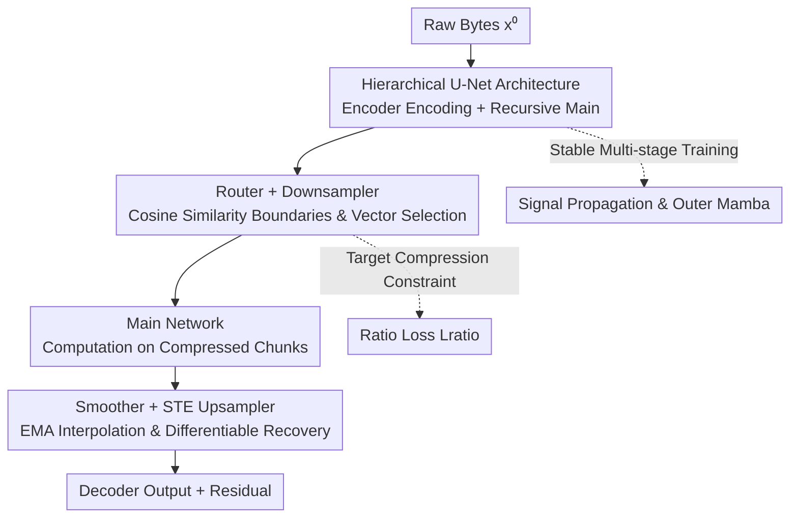

# Dynamic Chunking for End-to-End Hierarchical Sequence Modeling

**Conference**: ICLR2026  
**OpenReview**: [https://openreview.net/forum?id=ZbfLR9NbNF](https://openreview.net/forum?id=ZbfLR9NbNF)  
**Code**: To be confirmed  
**Area**: LLM Pre-training / Foundation Model Architecture  
**Keywords**: Dynamic Chunking, tokenizer-free, hierarchical sequence modeling, H-Net, end-to-end

## TL;DR
This paper proposes H-Net, a hierarchical sequence model that replaces BPE tokenization with a learnable "Dynamic Chunking (DC)" mechanism. The network automatically learns where to split chunks and the granularity of compression on byte-level inputs in an end-to-end differentiable manner. Under compute and data alignment, a single-stage H-Net outperforms BPE-based Transformers, while a two-stage H-Net matches the performance of token-level models twice its size.

## Background & Motivation
**Background**: The dominant paradigm for modern language models is "tokenization → LM → detokenization," where algorithms like BPE compress raw bytes into tokens of a fixed vocabulary before feeding them into a Transformer. Tokenization plays a critical role in compression and sequence shortening, making it an indispensable component currently.

**Limitations of Prior Work**: Tokenization is a **hand-designed, decoupled** pre-processing step, introducing several well-documented flaws—poor character-level understanding, lack of interpretability, and significantly degraded performance on languages and modalities with "weak tokenization heuristics" like Chinese, code, or DNA. This contradicts the "bitter lesson" of deep learning, which emphasizes end-to-end learning from raw data.

**Key Challenge**: To build a truly end-to-end tokenizer-free model, the "chunking" process must be integrated directly into the network for joint training. This requires overcoming three major hurdles: **efficiency** (byte-level sequences are too long, making isotropic models computationally expensive), **learnability** (boundaries are discrete choices, lacking supervision signals and causing gradient blockage), and **稳定性** (existing trainable boundary predictors often fail during scaling or when stacking multiple hierarchical levels). Previous compromises either used fixed pooling (content-independent and unfriendly to varying information rates) or relied on external delimiter/entropy heuristics (modality-specific and not truly end-to-end).

**Goal**: To enable the model to learn "where and how fine to split" chunks while simultaneously addressing efficiency, learnability, and stability, resulting in the first tokenizer-free model that matches or exceeds BPE Transformers under compute alignment.

**Key Insight**: The authors observe that **meaningful boundaries often appear where "semantics/context undergo a jump."** When the context changes, the similarity between adjacent representations decreases. Consequently, boundary scores are calculated using the cosine similarity of adjacent vectors, combined with a set of techniques to make discrete choices differentiable, turning chunking into a standard gradient optimization problem.

**Core Idea**: Replace BPE with a **content-aware, end-to-end learnable dynamic chunking mechanism** embedded within a U-Net-like hierarchical network (H-Net). This hierarchy can be **recursively nested**, allowing the model to automatically discover multi-level structures from bytes to words to higher-level abstractions.

## Method

### Overall Architecture
H-Net is a **U-Net-like hierarchical network**. Raw bytes first pass through a small **encoder** network, then are dynamically downsampled by a **chunking layer** into shorter, semantically richer chunk sequences. These are processed by a **main** network containing the bulk of the parameters, and finally upsampled back to the original resolution via a **dechunking layer** before passing through a **decoder** network. Unlike traditional U-Nets, boundaries here are **determined dynamically by the data rather than fixed-stride pooling**. The overall pipeline can be described as $\hat{x}^s = E^s(x^s),\ \hat{z}^S = M(x^S),\ \hat{z}^s = D^s(z^s)$, where chunking/dechunking is defined as $(x^{s+1}, p^s) = \mathrm{Chunk}(\hat{x}^s)$ and $z^s = \mathrm{Dechunk}(\hat{z}^{s+1}, p^s) + \mathrm{Linear}(\hat{x}^s)$.

Critically, the **main network can itself be another complete H-Net**, allowing for recursive stacking of multiple hierarchical levels. An $S$-stage model consists of $E^0, E^1, \dots, M, \dots, D^1, D^0$, where the outer layers capture fine-grained patterns and the inner layers operate on higher-level abstractions (characters → words → phrases → sentences). The core component of chunking is **Dynamic Chunking (DC)**, which sits between the main network and the encoder/decoder, comprising a "chunking layer (router + downsampler)" and a "dechunking layer (smoother + upsampler)," supplemented by a "ratio loss" to pull the compression rate toward a target.

### Key Designs

**1. Hierarchical U-Net Architecture: Efficient Compute via Encoder-Main-Decoder**

Byte-level sequences can easily exceed lengths of 10,000. Isotropic models waste computation on low-info regions by running the full model on every byte. H-Net adopts the "compress-process-recover" structure of U-Net: the encoder/decoder are small networks running at original resolution, while the main network—containing the majority of parameters—runs only on short sequences compressed to token-level granularity (approx. 4.5–5 bytes/chunk). The authors find that **using Mamba-2 (SSM) for the encoder/decoder is significantly better**, as SSMs possess a natural inductive bias for compression. The main network can be any standard architecture (Transformer or SSM). The recursive nesting allows a 2-stage model ($N^0{=}3, N^1{=}3$) to explicitly model abstractions from "bytes to words to phrases."

**2. Router + Downsampler: Content-Aware Boundaries via Cosine Similarity**

The chunking layer determines "where to split." The router projects the encoder output $\hat{x}_t$ into query/key vectors $q_t = W_q\hat{x}_t,\ k_t = W_k\hat{x}_t$ and calculates boundary probability based on adjacent similarity:

$$p_t = \frac{1}{2}\left(1 - \frac{q_t^\top k_{t-1}}{\|q_t\|\|k_{t-1}\|}\right) \in [0,1],\quad b_t = \mathbf{1}\{p_t \ge 0.5\}$$

Intuition: When $\hat{x}_{t-1}$ and $\hat{x}_t$ cross a semantic boundary (between morphemes/words/phrases), their projections diverge in latent space, resulting in low cosine similarity and a high boundary probability $p_t$. Setting $p_1 = 1.0$ ensures the sequence starts at a boundary. The downsampler **directly retains vectors where $b_t{=}1$ and discards others** (simpler and more effective than mean/max pooling or cross-attention), compressing $\hat{x}^s$ into $x^{s+1}$.

**3. Smoother + STE Upsampler: Making Discrete Chunking Differentiable**

Discrete boundary selection **interrupts gradients**, a major challenge for end-to-end chunking. The dechunking layer uses two techniques to restore gradient flow. The smoother performs Exponential Moving Average (EMA) interpolation on the main network output $\hat{z}_t$: $\bar{z}_t = P_t \hat{z}_t + (1-P_t)\bar{z}_{t-1}$. This softens "uncertain boundaries" using router confidence $P_t$, significantly improving learnability. The upsampler then recovers the original resolution, using a **straight-through estimator (STE)** to connect router confidence back to the gradient map. By defining $c_t = p_t^{b_t}(1-p_t)^{1-b_t}$ and $\mathrm{STE}(c_t) = c_t + \mathrm{stopgradient}(1-c_t)$, the router's boundary decisions receive gradients from the final loss without altering forward reconstruction.

**4. Ratio Loss: Reaching Target Compression Rates**

Without constraints, the model could collapse into trivial solutions: keeping all vectors or discarding too many. Borrowing from MoE load balancing, the authors add a ratio loss:

$$L_{\text{ratio}} = \frac{N}{N-1}\big((N-1)FG + (1-F)(1-G)\big),\quad F = \frac{1}{L}\sum_t b_t,\ G = \frac{1}{L}\sum_t p_t$$

$F$ is the actual proportion of selected vectors (non-differentiable), and $G$ is the average boundary probability (differentiable). $N$ controls the target compression rate. Although $F$ is not differentiable, the network is pushed toward the target rate through the continuous feedback of $G$.

**5. Signal Propagation: Stable Multi-stage Scaling**

Training multi-stage hierarchies end-to-end is unstable due to differing signal scales and effective batch sizes. The authors introduce several engineering techniques: (i) precise placement of projection and normalization layers (post-network norm, residual projection) to balance signal propagation between interacting sub-networks; (ii) **layer-wise optimization parameters** adjusted by dimension and effective batch size (e.g., LR multipliers on outer networks).

### Loss & Training
Total loss $L = L_{\text{AR}} + \alpha\sum_s L_{\text{ratio}}^s$, with $\alpha=0.03$. Optimization uses AdamW with a WSD (warmup-stable-decay) schedule. Training is performed on a 100B token subset of FineWeb-Edu. Tokenizer-free models process 8192 bytes per sequence, while Transformers use 1792 GPT2 tokens (approx. 8192 bytes), strictly aligning bytes-per-batch and FLOPs-per-byte.

## Key Experimental Results

### Main Results
Measured in bits-per-byte (BPB, lower is better) under strict compute/data alignment.

| Setting (GPT-3 Large, 760M FLOPs Aligned) | F-Edu BPB ↓ | Avg. ACC (7 Tasks) ↑ |
|--------|------|------|
| Transformer (BPE token) | 0.756 | 53.3 |
| MambaByte (Isotropic byte) | 0.845 | 44.3 |
| SpaceByte (Ext. delimiter supervision) | 0.791 | 49.4 |
| SpaceByte++ (Improved hierarchical baseline) | 0.760 | 53.6 |
| H-Net (space) (Heuristic chunking + Training tricks) | 0.755 | 53.4 |
| **H-Net (1-stage)** (DC end-to-end) | **0.755** | **53.6** |
| **H-Net (2-stage)** ((3,3)-DC) | **0.743** | **55.5** |

At the XL scale (1.3B FLOPs aligned), H-Net (2-stage) achieves a BPB of 0.715 and an average ACC of 58.2, **surpassing Transformer (0.730 / 55.5)** and matching token-level models twice its size.

### Ablation Study
Validating the contribution of each design component:

| Configuration | Observations | Description |
|------|---------|------|
| Isotropic (Transformer/MambaByte/LlamaByte) | Far weaker than all hierarchical models | Hierarchical structure is the prerequisite |
| H-Net (pool) | Significantly weaker than other H-Net variants | Fixed-stride pooling is ineffective; validates "data-dependent chunking" |
| SpaceByte → SpaceByte++ | Large improvement | Validates outer Mamba + network design (Design 1) |
| SpaceByte++ → H-Net (space) | Further improvement | Validates signal propagation tricks (Design 5) |
| H-Net (space) → H-Net (1-stage) | Additional gain | Validates that DC (Designs 2/3/4) outperforms strong heuristics |
| H-Net (1-stage) → H-Net (2-stage) | Substantial gain | Validates that recursive hierarchy learns nested abstractions |

### Key Findings
- **Robustness**: Without noise augmentation, H-Net is much more robust than BPE Transformers on noisy HellaSwag (e.g., AntSpeak, RandomCase). The 2-stage model achieves the highest Robustness Score.
- **Interpretability**: Visualization of learned boundaries shows H-Net automatically splits semantically coherent units without supervision.
- **Gains in Weak Tokenization Modalities**: On XWinograd-zh, performance improves from 59.9 to 66.3. In DNA language modeling, H-Net shows a **3.6×** data efficiency gain over isotropic models.
- DC naturally compresses data to a granularity similar to BPE (approx. 4.5–5 bytes/chunk).

## Highlights & Insights
- **Turning "Tokenization" into a Learnable Component**: The core "aha" moment is using adjacent vector cosine similarity as a boundary scorer, coupled with EMA smoothing and STE, to solve a discrete unsupervised chunking problem via differentiable optimization.
- **Recursive Hierarchy as the True Source of Scalability**: The main network can be another H-Net, explicitly building "character → word → phrase" abstractions and suggesting that deeper hierarchies may offer further gains.
- **Clever Ratio Loss Design**: Using the differentiable $G$ as a proxy for the non-differentiable $F$ to control compression rates precisely.
- **Hybrid Architecture Synergy**: Utilizing SSM's compression bias for encoders/decoders while reserving Transformers for the compressed "main" sequence is a practical and effective division of labor.

## Limitations & Future Work
- The main network is still primarily Transformer-based; while DC handles "input tokenization," it does not directly solve the quadratic complexity of attention for very long contexts (though compression helps).
- While tested at 1B+ parameters, performance at frontier scales (hundreds of billions of parameters) remains to be verified.
- The ratio loss is not strictly a convex constraint and relies on the router making confident decisions for convergence.
- The multi-stage hierarchy introduces several hyperparameters and engineering complexities (layer-wise LR multipliers, normalization placement).

## Related Work & Insights
- **vs. MegaByte / Hourglass Transformer**: These use **fixed-stride pooling**, which is content-independent. H-Net's "pool" ablation shows this is significantly weaker than dynamic chunking.
- **vs. SpaceByte / Byte Latent Transformer (BLT)**: These rely on **external delimiter/entropy heuristics**, which are modality-specific. H-Net internalizes boundary prediction as a joint training task, offering greater advantages in Chinese or DNA.
- **vs. BPE Transformer**: H-Net eliminates the need for hand-designed pre-processing, offering better character-level robustness and aligning with the "bitter lesson" of end-to-end learning.

## Rating
- Novelty: ⭐⭐⭐⭐⭐ 
- Experimental Thoroughness: ⭐⭐⭐⭐⭐ 
- Writing Quality: ⭐⭐⭐⭐ 
- Value: ⭐⭐⭐⭐⭐ 

<!-- RELATED:START -->

## Related Papers

- [\[NeurIPS 2025\] Conformal Risk Training: End-to-End Optimization of Conformal Risk Control](../../NeurIPS2025/llm_pretraining/conformal_risk_training_end-to-end_optimization_of_conformal_risk_control.md)
- [\[ICLR 2026\] Learned Meta-Tokens for Language Modeling](learned_meta-tokens_for_language_modeling.md)
- [\[ICLR 2026\] Pretraining with Hierarchical Memories: Separating Long-Tail and Common Knowledge](pretraining_with_hierarchical_memories_separating_long-tail_and_common_knowledge.md)
- [\[ICLR 2026\] ADEPT: Continual Pretraining via Adaptive Expansion and Dynamic Decoupled Tuning](adept_continual_pretraining_via_adaptive_expansion_and_dynamic_decoupled_tuning.md)
- [\[ICLR 2026\] Imagine How To Change: Explicit Procedure Modeling for Change Captioning](imagine_how_to_change_explicit_procedure_modeling_for_change_captioning.md)

<!-- RELATED:END -->
