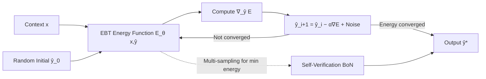

# Energy-Based Transformers are Scalable Learners and Thinkers

**Conference**: ICLR 2026  
**OpenReview**: [https://openreview.net/forum?id=ZBj3Qp1bYg](https://openreview.net/forum?id=ZBj3Qp1bYg)  
**Code**: [github.com/alexiglad/EBT](https://github.com/alexiglad/EBT) (Project page: energy-based-transformers.github.io)  
**Area**: LLM Pre-training / Energy-Based Models / System 2 Reasoning  
**Keywords**: Energy-Based Models, Transformer, Inference-time computation, System 2 Thinking, Unsupervised learning, Scalability  

## TL;DR
This paper reformulates "prediction" as "gradient descent optimization on a learned verifier (energy function)" and proposes Energy-Based Transformers (EBTs). This architecture enables cross-modal and cross-task System 2 thinking capabilities (dynamic compute allocation + self-verification) to emerge purely through unsupervised pre-training, outperforming Transformer++ and DiT in both language and vision domains.

## Background & Motivation
- **Background**: Inference-time computation (analogous to human System 2 slow thinking) is becoming a mainstream approach for enhancing model capabilities. "Reasoning models" like O1, R1, and Claude significantly improve scores in math and coding by extending processing time.
- **Limitations of Prior Work**: Current System 2 methods face three limitations: **modality binding** (effective only for text), **problem binding** (effective only in verifiable domains like math/code), and **dependence on external supervision** (requiring verifiers or verifiable reward RL). The RL route fails in domains where rewards are difficult to define (e.g., creative writing) and may not cultivate new reasoning patterns.
- **Key Challenge**: Conventional feed-forward Transformers/RNNs have fixed compute per prediction and cannot dynamically allocate resources per token. They also lack explicit "prediction verification" capabilities (the Generative AI Paradox: able to generate but unable to judge correctness). While DiT allows dynamic compute via multi-step denoising, it is not trained as an explicit verifier. Energy-Based Models (EBMs) naturally possess two cognitive elements—"dynamic compute (Facet 1) + prediction verification (Facet 2)"—but have long been hindered by training instability, high computational costs, and lack of scalability, resulting in a lack of foundation-scale EBMs.
- **Goal**: To investigate whether general System 2 thinking can emerge entirely from unsupervised learning by building a scalable, parallelizable, and cross-modal EBM foundation architecture.
- **Key Insight**: **Verification is easier than generation.** The model learns an energy function $E_\theta(x,\hat y)$ to score the compatibility between "input and candidate prediction" (lower energy indicates higher compatibility). **Prediction is optimization**: prediction is reconstructed as "gradient descent starting from a random initial value along the energy landscape until convergence," thereby unifying the verifier and generator within the same model—where the generator is implicitly defined by the verifier's gradient.

## Method

### Overall Architecture
The EBT does not directly output a prediction but maintains an energy scalar $E_\theta(x,\hat y)$ representing the compatibility (unnormalized likelihood) of the context $x$ and a candidate prediction $\hat y$. For each prediction, it starts from a random initial value $\hat y_0\sim\mathcal N(0,I)$ and iteratively performs gradient descent on $\hat y$ to minimize energy until convergence. This iterative process constitutes "thinking": faster convergence implies a simple problem (less compute), while slower convergence implies a difficult problem (more compute), naturally achieving dynamic compute allocation. The final energy value itself serves as a verification of the prediction quality. During training, the entire optimization trajectory is backpropagated (requiring second-order derivatives, efficiently calculated via Hessian-vector products). Two variants are provided: a GPT-style causal decoder EBT (autoregressive) and a full-sequence attention bidirectional EBT (vision).

### Key Designs

**1. Prediction as optimization on the verifier (Unifying verifier and generator):** The EBM models the Boltzmann distribution $p_\theta(x)=e^{-E_\theta(x)}/Z(\theta)$. Since the partition function $Z$ is intractable, the model uses an unnormalized form $p_\theta(x,\hat y)\propto e^{-E_\theta(x,\hat y)}$, ensuring low energy on the true data manifold and high energy elsewhere. Prediction involves finding the global minimum on the energy landscape using iterative gradient descent: $\hat y_{i+1}=\hat y_i-\alpha\nabla_{\hat y_i}E_\theta(x,\hat y_i)$. This step fuses "discrimination" and "generation": during the forward pass, the EBM acts like a GAN discriminator providing energy "verification"; during the backward pass (inference), it acts like a GAN generator minimizing energy to "satisfy" the discriminator. Compared to decoupled verifier-generator schemes (tree search + LLM requiring thousands of samples), this coupling naturally mitigates adversarial and scalability issues.

**2. Scalable EBM learning—Optimization-based training to bypass the curse of dimensionality:** Traditional contrastive EBM training requires simultaneously lowering energy for positive samples and raising it for negative samples. In high-dimensional spaces, the number of negative samples explodes exponentially. This work uses regularized optimization-based training: initially optimizing predictions towards the ground truth and backpropagating through the entire optimization process. This implicitly shapes a local minimum near the ground truth, **implicitly regularizing the energy landscape** to yield low energy only on the data manifold, thus avoiding the dimensionality curse of explicit negative sampling. This is key to scaling EBMs to foundation model sizes for the first time.

**3. Three energy landscape regularization techniques for "thinking" emergence:** High-dimensional landscapes rarely become smooth with single minima naturally. The authors introduce three techniques: **Replay Buffer**, which reuses longer optimization trajectories to define the landscape near minima; **Langevin Dynamics**, which adds noise to updates $\hat y_{i+1}=\hat y_i-\alpha\nabla_{\hat y_i}E_\theta(x,\hat y_i)+\eta_i,\ \eta_i\sim\mathcal N(0,\sigma)$ to encourage landscape exploration; and **Randomized Optimization Paths** (random step size $\alpha$ and optimization steps), which significantly improve generalization. Ablations show that random step sizes are particularly crucial for thinking gains.

**4. Two modes of System 2 thinking:** Once trained, two thinking routes correspond to the two cognitive facets: **"Thinking Longer"** (Facet 1), which involves more optimization steps for a single prediction; and **"Self-Verification" (BoN)** (Facet 2), where $N$ candidates are sampled and the one with the lowest energy $\hat y^*=\arg\min_j E_\theta(x,\hat y_{M,j})$ is selected. The latter is similar to Best-of-N in language models but generalized to cross-modal tasks and applied to **every prediction** token rather than just the full sequence.

## Key Experimental Results

### Main Results: Scalability of Learning and Thinking
- **Pre-training Scalability** (Language, RedPajamaV2 100B + GPT-NeoX tokenizer): Across axes of data, batch size, depth, parameters, FLOPs, and embedding dimensions, EBT's scaling rate consistently exceeds the Transformer++ recipe. FLOP and parameter scaling rates are approximately **8.97%** higher, with overall scaling up to 35% faster.
- **Downstream Task Generalization** (Identical data and parameters, shifted towards OOD): While EBT's pre-training perplexity is slightly worse, it performs better on most downstream tasks:

| Model | Pretrain ↓ | GSM8K ↓ | SQuAD ↓ | BB Math QA ↓ | BB Dyck ↓ |
|------|-----------|---------|---------|--------------|-----------|
| Transformer++ | **31.36** | 49.6 | 52.3 | 79.8 | 131.5 |
| EBT | 33.43 | **43.3** | 53.1 | **72.6** | **125.3** |

- **Image Denoising and Representation** (Bidirectional EBT vs. DiT, using only 1% of forward passes):

| Model | PSNR↑(ID) | MSE↓(ID) | PSNR↑(OOD) | MSE↓(OOD) | Top-1 Acc↑ | Top-5 Acc↑ |
|------|-----------|----------|------------|-----------|-----------|-----------|
| DiT | 26.58 | 142.98 | 19.56 | 718.7 | 0.31% | 1.36% |
| EBT | **27.25** | **122.55** | **23.29** | **305.2** | **5.32%** | **13.2%** |

EBT outperforms DiT while requiring **99% fewer forward passes** for denoising. Its linear probing classification accuracy is approximately **10×** higher, suggesting superior learned representations.

### Ablation Study (System 2 Thinking, measured by % improvement in perplexity)

| Configuration | Thinking Longer ↑ | Thinking Longer + Self-Verification ↑ |
|------|-----------|----------------------|
| w/o Random Step Size | -1.47 | 0.19 |
| w/o Random Steps | 0.00 | 9.65 |
| w/o Langevin Dynamics | 17.2 | 17.0 |
| w/o Replay Buffer | 14.8 | 17.8 |
| Full System 2 Configuration | 7.19 | **18.7** |

Removing random step sizes nearly eliminates thinking benefits. Removing Langevin dynamics favors single-path performance but worsens the ensemble, showing a performance-compute trade-off. The full configuration is optimal for the combination.

### Key Findings
- **Thinking gains rise linearly with OOD degree**: The more the data deviates from the distribution, the greater the improvement from thinking, echoing human reliance on System 2 for unfamiliar situations.
- **Thinking capability grows with training scale**: As training progresses, self-verification gains rise from 4%–8% to 12%–14%, suggesting greater potential at Llama-3 scales (≈1000× current scale).
- **Poorer pre-training but better downstream**: EBT has slightly higher perplexity but superior downstream performance, indicating stronger generalization in the verifier route (verification is easier than generation in OOD).
- By extending thinking, language model performance improves by **29%** more than Transformer++, whereas Transformer++ cannot improve token-by-token.

## Highlights & Insights
- **Formalizes "thinking" as "optimization on a learned verifier,"** unifying dynamic compute allocation and prediction verification—emerging entirely from unsupervised pre-training without external verifiers or rewards.
- **First to scale EBMs to Transformer dimensions**: Bypasses contrastive dimensionality issues via optimization-based training and landscape regularization, making EBMs truly parallelizable and scalable.
- **Generalization explained via the verifier perspective**: Since verification is robust under OOD, EBT excels in downstream tasks even with weaker pre-training perplexity—a constructive response to the Generative AI Paradox.

## Limitations & Future Work
- **Scale constraints**: Experiments are limited to small models on large datasets; performance at maximum scale remains speculative. EBT's current FLOP efficiency is lower than Transformer++ (it used more FLOPs in downstream comparisons).
- **Incompatibility with existing models**: EBT architecture is incompatible with current pre-trained models and must be trained from scratch.
- **Training cost**: Requires second-order derivatives (Hessian-vector products) through the optimization trajectory, making single steps heavier than standard feed-forward.
- **Autoregressive implementation** requires careful engineering to prevent information leakage compared to bidirectional versions.
- **CoT gains not yet observed**: Chain-of-Thought benefits were not observed at current small-model scales and require larger-scale verification.

## Related Work & Insights
- Contrasted with AR Transformers/RNNs (fixed compute, no verification) and DiT (dynamic compute, no explicit verifier), EBT integrates both elements.
- Inherits the EBM optimization and Langevin dynamics approach (Du & Mordatch) and "Transformerizes" it for scalability.
- The duality relationship with GANs (forward pass = discriminator, backward pass = generator) provides an elegant perspective for unifying verifiers and generators.

## Rating
- **Novelty**: ⭐⭐⭐⭐⭐ Reformulating prediction as optimization on a learned energy verifier and scaling EBMs for cross-modal unsupervised System 2 thinking is highly innovative.
- **Experimental Thoroughness**: ⭐⭐⭐⭐ Covers six-axis scalability, dual modalities, OOD generalization, and comprehensive ablations, though large-scale results are inferred from trends.
- **Writing Quality**: ⭐⭐⭐⭐⭐ Clear progression through the "two cognitive elements" theme; intuitive diagrams and solid motivation-method-evidence loop.
- **Value**: ⭐⭐⭐⭐⭐ Provides a scalable System 2 route independent of verifiable rewards, offering significant inspiration for reasoning models and architecture research.

<!-- RELATED:START -->

## Related Papers

- [\[NeurIPS 2025\] Scalable Fingerprinting of Large Language Models](../../NeurIPS2025/llm_pretraining/scalable_fingerprinting_of_large_language_models.md)
- [\[ICCV 2025\] ETA: Energy-based Test-time Adaptation for Depth Completion](../../ICCV2025/llm_pretraining/eta_energy-based_test-time_adaptation_for_depth_completion.md)
- [\[ACL 2026\] Working Memory Constraints Scaffold Learning in Transformers under Data Scarcity](../../ACL2026/llm_pretraining/working_memory_constraints_scaffold_learning_in_transformers_under_data_scarcity.md)
- [\[NeurIPS 2025\] Does Object Binding Naturally Emerge in Large Pretrained Vision Transformers?](../../NeurIPS2025/llm_pretraining/does_object_binding_naturally_emerge_in_large_pretrained_vision_transformers.md)
- [\[ICML 2025\] Counting in Small Transformers: The Delicate Interplay between Attention and Feed-Forward Layers](../../ICML2025/llm_pretraining/counting_in_small_transformers_the_delicate_interplay_between_attention_and_feed.md)

<!-- RELATED:END -->
