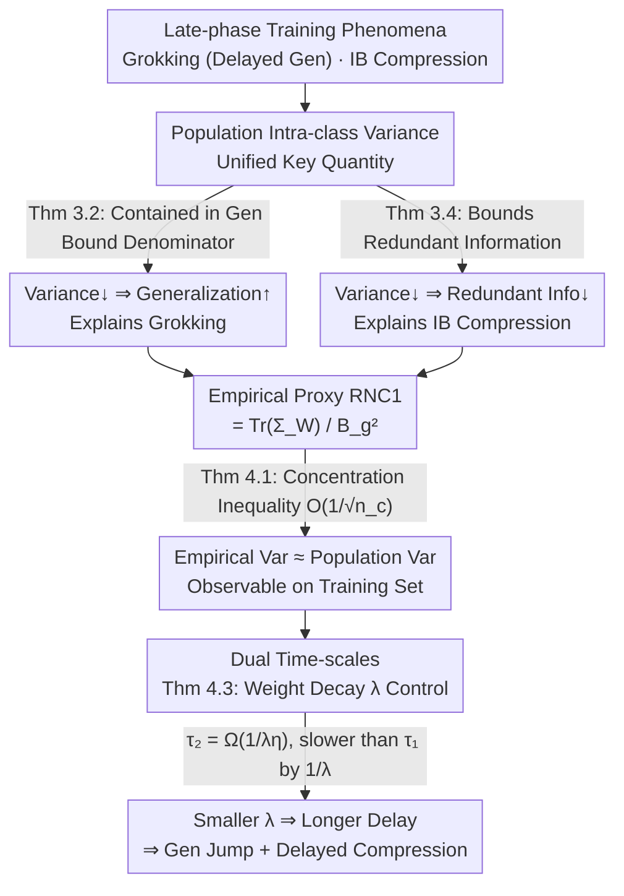

# Explaining Grokking and Information Bottleneck through Neural Collapse Emergence

**Conference**: ICLR2026  
**arXiv**: [2509.20829](https://arxiv.org/abs/2509.20829)  
**Code**: [keitaroskmt/collapse-dynamics](https://github.com/keitaroskmt/collapse-dynamics)  
**Area**: LLM Pre-training  
**Keywords**: Grokking, Information Bottleneck, Neural Collapse, Training Dynamics, Intra-class Variance, Generalization Theory, Lyapunov Time-scale

## TL;DR
This work provides a unified explanation for Grokking (delayed generalization) and Information Bottleneck (compression phase) from the perspective of Neural Collapse. It demonstrates that the contraction of population intra-class variance is the common underlying factor and reveals that a distinct time-scale, controlled by weight decay, separates training loss convergence from the emergence of Neural Collapse.

## Background & Motivation
1.  **The Mystery of Grokking**: Training loss converges early, but test accuracy surges much later. The mechanism by which an overfitted solution transitions to a generalized one remains unclear.
2.  **Two Phases of Information Bottleneck (IB)**: DNN training typically exhibits a fitting phase (simultaneous increase in $I(Z;X)$ and $I(Z;Y)$) followed by a compression phase (decrease in $I(Z;X)$ while $I(Z;Y)$ remains stable). A rigorous theoretical explanation for the trigger of the compression phase is lacking.
3.  **Commonality**: Both Grokking and IB compression occur during the late stages of training, suggesting an underlying common structural change within the network.
4.  **Potential of Neural Collapse**: Neural Collapse describes the geometric structure of the representation space in late training (intra-class collapse, class means forming an ETF), but its link to the aforementioned phenomena has not been established.
5.  **Limitations of Prior Work**: Existing explanations for Grokking often rely on empirical complexity measures or parameter compression. IB analysis faces challenges in continuous deterministic networks where mutual information may be infinite, and it lacks direct links to network parameters.
6.  **Missing Time-scale Analysis**: While intra-class variance contraction is known to improve generalization, understanding its convergence speed relative to training loss is essential to explain why generalization/compression is "delayed."

## Method

### Overall Architecture
This is a purely theoretical work aiming to unify Grokking (delayed generalization) and Information Bottleneck (compression phase) under a single internal driver: population intra-class variance. The paper constructs a chain of theorems linking "phenomena $\rightarrow$ key quantity $\rightarrow$ observable proxy $\rightarrow$ convergence time-scale." It first proves that intra-class variance controls both generalization bounds and redundant information (explaining the shared origin). It then shows this variance can be approximated by an empirical metric, RNC1, on the training set. Finally, it characterizes that RNC1 converges slower than training loss by a factor determined by weight decay (explaining the "delay").

### Key Designs

**1. Intra-class Variance as the Unified Quantity: Sharing a Driver for Grokking and IB**  
Prior work struggled to mechanistically explain what triggers generalization jumps in Grokking or compression in IB. Ours identifies population intra-class variance $\mathbb{E}\big[\|\tilde g(X) - \mathbb{E}[\tilde g(X)\mid Y]\|^2\big]$ as the common factor. For a fixed feature extractor $g$ and classifier $W$, a classification error upper bound derived from Chebyshev’s inequality (Theorem 3.2) places this variance in the denominator; thus, intra-class collapse directly improves generalization, corresponding to the Grokking surge. Simultaneously, by defining representation $Z = g(X) + B_g\cdot E$ (adding infinitesimal Gaussian noise for finite mutual information), redundant information $I(Z;X) - I(Z;Y) = I(Z;X\mid Y)$ is also upper-bounded by the population intra-class variance (Theorem 3.4). Variance contraction thus equates to redundancy reduction, characterizing the IB compression phase.

**2. Approximating Population Variance with Empirical RNC1: Connecting Theory to Training**  
Population intra-class variance is an expectation over the true distribution and is unobservable during training. Ours bridge this gap with a concentration inequality (Theorem 4.1): based on spectral norm uniform convergence, the difference between population and empirical training intra-class variance is $O(1/\sqrt{n_c})$ (where $n_c$ is samples per class). Consequently, the observable proxy RNC1 $= \frac{1}{B_g^2}\mathrm{Tr}(\Sigma_W)$ is defined to measure normalized training intra-class variance. Unlike the standard NC1 in literature, RNC1 omits inter-class normalization because the generalization bound specifically requires the raw intra-class variance.

**3. Dual Method Time-scale Characterization: Explaining Why "Delay" depends on Weight Decay**  
The "delay" in Grokking and IB stems from the fact that intra-class variance contraction lags behind loss convergence. Theorem 4.3 proves that under gradient descent with weight decay $\lambda$, training loss converges within $\tau_1 = \Omega\big(\frac{1}{\eta}\log\frac{1}{\varepsilon_1}\big)$ steps, while RNC1 requires $\tau_2 = \Omega\big(\frac{1}{\lambda\eta}\log\frac{1}{\varepsilon_2}\big)$ steps. The critical difference is the $1/\lambda$ factor in $\tau_2$. When $\lambda$ is small, $\tau_2 \gg \tau_1$, causing Neural Collapse to lag significantly behind loss convergence. This leads to the "postponed" generalization jump and IB compression; the smaller the $\lambda$, the more dramatic the Grokking phenomenon.

## Key Experimental Results

### Table 1: Grokking Experiments — Training Dynamics vs. Weight Decay (MLP on MNIST)

| Weight Decay λ | Steps for 100% Train Acc (τ₁) | Steps for Test Acc Increase (τ₂) | RNC1 Drop Synchronized with Gen |
|---|---|---|---|
| 0.3 | ~5,000 | ~10,000 | ✓ (Near simultaneous) |
| 0.1 | ~5,000 | ~20,000 | ✓ |
| 0.01 | ~5,000 | ~60,000 | ✓ (Delay increases grokking) |
| 0.003 | ~5,000 | ~100,000+ | ✓ (Extreme grokking) |

Key Observation: The decrease in RNC1 consistently synchronizes with test accuracy improvement rather than training loss convergence. Smaller $\lambda$ values exacerbate the separation of the two time-scales.

### Table 2: IB Experiments — Synchronization of Redundant Info and RNC1

| Weight Decay λ | Start of RNC1 Descent | MI-estimated Redundancy Descent | nHSIC Redundancy Descent |
|---|---|---|---|
| 0.3 | Early (~10K steps) | Synchronized | Synchronized |
| 0.1 | Mid (~20K steps) | Mostly synchronized | Synchronized |
| 0.01 | Late (~60K steps) | Slightly lagged but consistent | Synchronized |

Redundant information Estimated via two different methods (MI and nHSIC) shows qualitative alignment with RNC1 behavior, supporting Theorem 3.4.

- Results were consistent across CNN and Transformer architectures (Appendix D.1/D.2).
- Representation space visualization (Figure 2): In the overfitting phase, training samples are separable but test intra-class variance is large. After Neural Collapse, training samples collapse to points and test variance contracts accordingly.
- NC2 (Class mean condition number) synchronizes with RNC1, approaching 1, indicating the emergence of full Neural Collapse structure during Grokking.

## Highlights & Insights
- **Unified Theoretical Framework**: First work to unify Grokking and Information Bottleneck via the lens of Neural Collapse.
- **Strong Theoretical Support**: A rigorous chain of theorems (3.2 $\rightarrow$ 3.4 $\rightarrow$ 4.1 $\rightarrow$ 4.3) connecting phenomena, mechanisms, and time-scales.
- **RNC1 Superiority**: The proposed rescaled NC1 directly maps to generalization analysis, avoiding the confounding effects of inter-class variance normalization in standard NC1.
- **Precise Time-scale Characterization**: Provides a quantitative theoretical expression for how weight decay dictates the delay in Grokking.
- **Empirical-Theoretical Alignment**: Every theorem is validated with experiments, where curves under different $\lambda$ match theoretical predictions (Figure 3/4).
- **Practical Guidance**: Tracking RNC1 can serve as a signal for whether continued training will yield generalization gains. Increasing weight decay can accelerate the generalization jump.
- **Completing the IB Narrative**: Proposition 3.3 proves the necessity of the fitting phase when the initial state loses information, closing the loop on the two-phase IB story.

## Limitations & Future Work
- Theoretical analysis relies on specific assumptions: pyramidal architectures, smooth activation functions, and specific initialization, which may require further validation for non-smooth activations like ReLU.
- Experiments focused on relatively simple datasets (MNIST) and models (MLP/Small CNN); scaling to ResNet or ViT remains for future work.
- The analysis targets gradient descent with weight decay; theoretical extensions to Adam/AdamW are not yet complete (though experiments used AdamW).
- The implicit emergence of Neural Collapse without explicit weight decay was not discussed.
- The generalization bound in Theorem 3.2 uses Chebyshev’s inequality and may be loose; tighter or data-dependent bounds could be explored.
- IB analysis requires infinitesimal noise for finite mutual information, leaving a theoretical gap with purely deterministic networks.
- For large $K$ (number of classes), the union bound in Theorem 3.2 might be overly conservative.

## Related Work & Insights
- **vs. Parameter Compression (Liu et al. 2023a, Varma et al. 2023)**: While prior work focuses on parameter space compression, Ours provides a representation-space perspective (intra-class variance contraction), which is likely complementary.
- **vs. Kernel-to-Rich Regime Transition (Lyu et al. 2024)**: That work explores optimization landscapes; Ours focuses on geometric structure, offering a more direct mechanism for generalization.
- **vs. Diffusion Explanation of IB (Shwartz-Ziv et al. 2019)**: Previous work attributes compression to SGD noise/diffusion; Ours identifies a specific geometric mechanism (intra-class variance contraction).
- **vs. UFM-based Neural Collapse**: Unlike Unconstrained Feature Model (UFM) analyses that treat features as variables, Ours directly analyzes Neural Collapse dynamics under parameter gradient descent.

## Rating
- Novelty: ⭐⭐⭐⭐⭐ — Unifying three major late-phase training phenomena is highly original.
- Overall: Top-tier ICLR quality, providing elegant and rigorous insights into DNN training theory.
- Experimental Thoroughness: ⭐⭐⭐⭐ — Comprehensive across architectures and hyper-parameters, though datasets are small-scale.
- Writing Quality: ⭐⭐⭐⭐⭐ — Excellent logical flow and clear visual aids (e.g., Figure 1).
- Value: ⭐⭐⭐⭐ — Deepens understanding of late-stage training and offers direct implications for hyper-parameter tuning (weight decay).

<!-- RELATED:START -->

## Related Papers

- [\[NeurIPS 2025\] Flatness is Necessary, Neural Collapse is Not: Rethinking Generalization via Grokking](../../NeurIPS2025/llm_pretraining/flatness_is_necessary_neural_collapse_is_not_rethinking_generalization_via_grokk.md)
- [\[ICLR 2026\] Deconstructing Positional Information: From Attention Logits to Training Biases](deconstructing_positional_information_from_attention_logits_to_training_biases.md)
- [\[ICLR 2026\] Understanding the Emergence of Seemingly Useless Features in Next-Token Predictors](understanding_the_emergence_of_seemingly_useless_features_in_next-token_predicto.md)
- [\[ICLR 2026\] Beyond Length: Quantifying Long-Range Information for Long-Context LLM Pretraining Data](beyond_length_quantifying_long-range_information_for_long-context_llm_pretrainin.md)
- [\[ICML 2026\] Explaining Data Mixing Scaling Laws](../../ICML2026/llm_pretraining/explaining_data_mixing_scaling_laws.md)

<!-- RELATED:END -->
