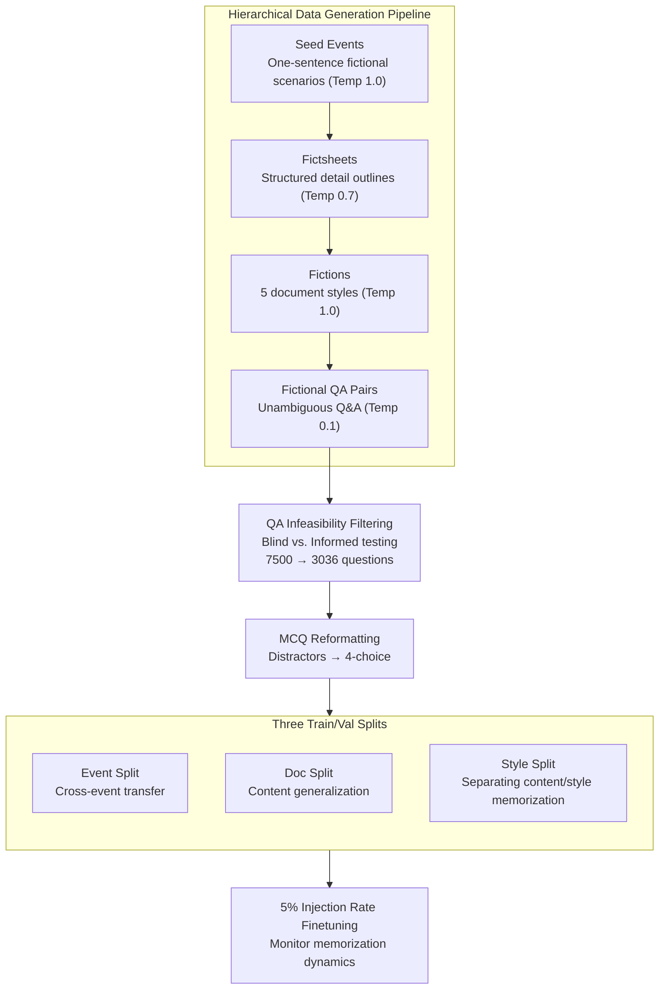

# FictionalQA: A Dataset for Studying Memorization and Knowledge Acquisition

**Conference**: ICLR 2026  
**arXiv**: [2506.05639](https://arxiv.org/abs/2506.05639)  
**Code**: [https://github.com/jwkirchenbauer/fictionalqa](https://github.com/jwkirchenbauer/fictionalqa)  
**Area**: LLM Pre-training  
**Keywords**: Memorization, Knowledge Acquisition, synthetic data, LLM Training Dynamics, Factual Memorization

## TL;DR
The authors propose the FictionalQA dataset and a generation pipeline. By synthesizing webtext-style documents and QA pairs regarding fictional events, they study the dual processes of factual and verbatim memorization during LLM training in a controlled environment. The study finds that more diverse surface forms facilitate knowledge acquisition, whereas concise structured lists are the least conducive to generalization.

## Background & Motivation

**Background**: Two types of memorization occur during LLM training: verbatim memorization (precise reproduction of training sequences) and factual memorization (generalizing facts seen during training to new tasks). While verbatim memorization has been extensively studied by Carlini et al., the understanding of factual memorization remains limited.

**Limitations of Prior Work**: Quantifying factual memorization is difficult because the frequency of specific facts in training data is hard to measure. Existing datasets are often too templated (e.g., TOFU using fill-in-the-blank), too small (e.g., New News with only 75 articles), or contain science fiction content that entangles with real-world knowledge (e.g., Fictional Knowledge featuring interstellar travel).

**Key Challenge**: There is a requirement to satisfy two conditions simultaneously: realistic surface forms and entirely fictional factual content. Realism is necessary to simulate actual training scenarios, while fiction ensures facts do not interact with real-world knowledge in the pre-training corpus, enabling controlled experiments.

**Goal**: To build a "cleanroom" synthetic dataset that allows researchers to distinguish and study the training dynamics of different memorization phenomena, particularly factual memorization, under strictly controlled conditions.

**Key Insight**: Utilize GPT-4o to generate hierarchically structured fictional data—Seed Events → Fictsheets → Multi-style Fictions → QA Pairs—and design multiple train/val split strategies to isolate different factors.

**Core Idea**: Through controllable fictional synthetic data, this work reveals in a laboratory setting that factual and verbatim memorization occur under different conditions. Diverse surface forms promote knowledge acquisition, while the most concise factual representations are the least conducive to generalization.

## Method

### Overall Architecture

To study LLM memorization under controlled conditions, the core challenge is creating data that resembles real webtext but contains entirely fictional facts, allowing "surface style" and "factual content" to be treated as independent variables. FictionalQA decomposes data construction into a multi-level expansion pipeline followed by two post-processing steps and three training splits. First, GPT-4o expands one-sentence Seed Events into structured Fictsheets, fictions in five styles, and unambiguous QA pairs, using different temperatures to control divergence at each stage. Post-processing includes QA infeasibility filtering (removing questions solvable by prior knowledge, filtering 7,500 questions down to 3,036) and MCQ reformatting (adding distractors for 4-way multiple choice scoring). Finally, the data is partitioned into train/val sets using Event, Doc, or Style splits and fine-tuned with a low injection rate of 5% into real webtext. Training/validation loss and MCQ accuracy are monitored to observe the emergence of factual memorization.

### Key Designs

**1. Hierarchical Data Generation Pipeline: Expanding a "Fictional Fact" into Multiple Surface Forms**
To study how surface form diversity affects knowledge acquisition, the same fictional fact must appear repeatedly in documents of varying styles that resemble real webtext. The pipeline uses a four-level structure: Seed Events (high temperature 1.0 for diversity), Fictsheets (temperature 0.7 to converge details into a structured outline), Fictions (temperature 1.0 to expand Fictsheets into news, social media, encyclopedia, corporate documents, and blogs), and QA Pairs (temperature 0.1 for deterministic answers). This provides a "skeleton" (Fictsheet) and "flesh" (multi-style docs) for the same underlying facts.

**2. QA Infeasibility Filtering: Removing Guessable Questions**
Synthetic QA carries the risk that some questions might be answered correctly using the pre-existing knowledge of GPT-4o. To ensure accuracy gains reflect learning from training data, GPT-4o takes each test twice: "blind" (question only) and "informed" (question + fictional document). Only questions that are unanswerable "blind" but answerable "informed" are retained.

**3. Three Train/Val Splits: Decomposing "Generalization" into Dimensions**
How data is split determines what type of generalization is measured. 
- **Event Split**: All documents for 2/3 of seed events are used for training; 1/3 are reserved for validation. This measures cross-event knowledge transfer.
- **Doc Split**: One document from every style of every event is reserved for validation. This measures content generalization within the training distribution.
- **Style Split**: Training occurs on 4 styles per event, with the 5th reserved for validation. This specifically isolates content memorization from style memorization.

**4. Training Experimental Design: Low 5% Injection Rate**
Finetuning is performed on Llama 3.1/3.2 and Gemma 1/2 base checkpoints. Mixing 5% fictional data with 95% real webtext is a key design choice. If the ratio is too high, the model may simply memorize the text verbatim, obscuring factual generalization. A low injection rate keeps the model in a "generalization window" where it extracts facts without complete rote memorization.

### Loss & Training
The study uses standard next-token prediction loss (cross-entropy). The core focus is studying memorization dynamics through different data splits and injection strategies rather than proposing new training objectives.

## Key Experimental Results

### Main Results

| Experimental Setting | Observation Metric | Key Result |
|---------|---------|---------|
| Doc Split vs Event Split | Min Validation Loss | Doc Split generalizes better (lower val loss) as all facts are partially covered. |
| Fictsheets Split | Val Loss Trend | Overfits almost immediately; no observable generalization period. |
| MCQ Accuracy by Model | Change over steps | Larger models reach higher MCQ accuracy faster. |
| MCQ by Split Type | Split vs MCQ | Doc and Style splits show best transfer; Fictsheets perform worst. |

### Ablation Study

| Configuration | QA Transfer Effect | Description |
|------|-----------|------|
| Doc Split (5 styles, same event) | Strongest | Diverse surface forms + full factual coverage. |
| Style Split (4 styles training) | Strong | Style shifts but facts remain complete. |
| Event Split (different events) | Medium | Incomplete factual coverage limits transfer. |
| Fictsheets (structured lists) | Weakest | Most concise but least diverse surface form. |
| Base Webtext Only (Control) | No Effect | Confirms gains stem from fictional data. |

### Key Findings
- **Verbatim and factual memorization have different trigger conditions**: Fictsheets are memorized verbatim quickly (loss near 0), but show almost no factual memorization (MCQ accuracy gain).
- **Surface form diversity facilitates knowledge acquisition**: Training on multi-style documents results in better QA generalization than training on structured lists. This is counter-intuitive, as humans might find structured lists easier for knowledge extraction.
- **"Leakage" in knowledge acquisition**: Even when certain facts are entirely absent from the training set (Event Split validation), MCQ accuracy improves, suggesting models may rely on distributional features rather than atomic facts.
- **Large models acquire knowledge faster**: 8B models show faster and higher MCQ accuracy improvements compared to 1B models.

## Highlights & Insights
- **The "concise is not effective" insight is highly provocative**: Structured lists (Fictsheets) lead to rapid overfitting but poor generalization. This suggests LLM knowledge acquisition relies on distributional patterns rather than explicit factual encoding.
- **Dataset as a "living asset"**: The pipeline allows for regenerating new datasets, making it more valuable than a static, one-time dataset.
- **Rigorous experimental design**: The use of blind/informed filtering and TriviaQA control experiments ensures the credibility of the conclusions.
- The "leakage" phenomenon indicates that knowledge boundaries in LLMs are blurrier than expected, providing direct implications for machine unlearning research.

## Limitations & Future Work
- Potential unintended content overlap between fictional documents (similarity across seed events) may contribute to the "leakage" effect.
- The reliance on GPT-4o for generation might introduce specific model biases.
- Experiments were conducted on models $\le 8B$; behaviors in large-scale pre-training scenarios might differ.
- The 5% injection rate was fixed; the impact of different rates on memorization forms was not systematically studied.

## Related Work & Insights
- **vs TOFU**: TOFU is designed for unlearning using templated fill-in-the-blank questions and lacks source documents. FictionalQA provides both multi-style documents and QA, closely mirroring real pre-training data.
- **vs Synthetic Biographies (Allen-Zhu & Li)**: Those are more templated; FictionalQA's webtext style is more natural and diverse, suitable for studying surface form impacts.
- **vs New News (Park et al. 2025)**: New News is small (75 articles + 375 questions); FictionalQA is larger and fully automated.
- **vs Fictional Knowledge (Chang et al. 2024)**: FictionalQA avoids sci-fi themes to prevent entanglement with real-world knowledge.

## Rating
- Novelty: ⭐⭐⭐⭐ The hierarchical pipeline and multi-split strategies are clever, though the core idea of using fictional data is not entirely new.
- Experimental Thoroughness: ⭐⭐⭐⭐ Systematic experiments across multiple models and splits, though lacking large-scale pre-training tests.
- Writing Quality: ⭐⭐⭐⭐⭐ Clear structure with detailed motivation and rigorous variable control.
- Value: ⭐⭐⭐⭐ Significant academic value for understanding LLM memorization; the dataset serves as a reusable asset.

<!-- RELATED:START -->

## Related Papers

- [\[ICLR 2026\] TNT: Improving Chunkwise Training for Test-Time Memorization](tnt_improving_chunkwise_training_for_test-time_memorization.md)
- [\[ICLR 2026\] Pretraining with Hierarchical Memories: Separating Long-Tail and Common Knowledge](pretraining_with_hierarchical_memories_separating_long-tail_and_common_knowledge.md)
- [\[ICLR 2026\] Nemotron-CC-Math: A 133 Billion-Token-Scale High Quality Math Pretraining Dataset](nemotron-cc-math_a_133_billion-token-scale_high_quality_math_pretraining_dataset.md)
- [\[ICLR 2026\] Pre-training Limited Memory Language Models with Internal and External Knowledge](pre-training_limited_memory_language_models_with_internal_and_external_knowledge.md)
- [\[ACL 2025\] Second Language (Arabic) Acquisition of LLMs via Progressive Vocabulary Expansion](../../ACL2025/llm_pretraining/second_language_arabic_acquisition_of_llms_via_progressive_vocabulary_expansion.md)

<!-- RELATED:END -->
