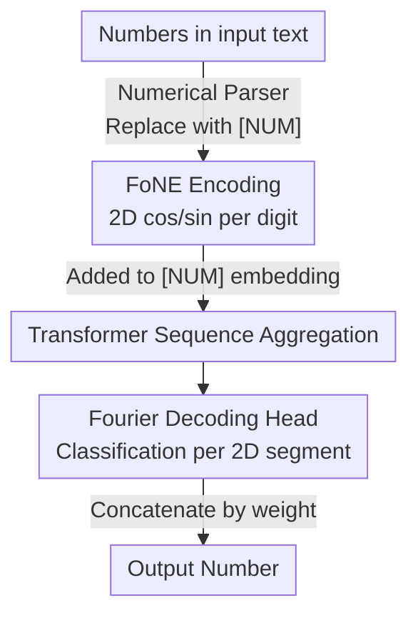

# FoNE: Precise Single-Token Number Embeddings via Fourier Features

**Conference**: ICLR 2026  
**OpenReview**: [https://openreview.net/forum?id=g0vtWmwDDh](https://openreview.net/forum?id=g0vtWmwDDh)  
**Area**: LLM Pre-training / Numerical Representation / Tokenization  
**Keywords**: Number Embeddings, Fourier Features, Single Token, Arithmetic Tasks, Frequency Bias

## TL;DR
FoNE maps arbitrary numbers directly into **single-token** embeddings using a set of sine and cosine functions with different periods (Fourier features). Each digit occupies only 2 dimensions, bypassing tokenization fragmentation and frequency bias. A 38M Transformer trained from scratch outperforms fine-tuned Llama-3.2-1B in addition, subtraction, and multiplication, being the only method to achieve 100% accuracy on 100,000 test samples.

## Background & Motivation

**Background**: Current LLMs treat numbers as ordinary text tokens, using either subword tokenization (GPT-4o, Llama-3, Phi-2) or digit-wise tokenization (Llama-2, Mistral). The model is then expected to "assemble" the numerical value from multiple tokens.

**Limitations of Prior Work**: This approach suffers from two specific issues. First is **frequency bias**—the embedding of a numerical token primarily reflects its frequency in the corpus rather than its mathematical properties (magnitude, carry, etc.). Consequently, models guess numbers based on their commonality in training data rather than mathematical logs. Second is **fragmentation**—a single number is split into multiple tokens, requiring the model to aggregate across tokens to recover the value. This is inefficient and error-prone, preventing even billion-parameter models from correctly performing multi-digit addition and multiplication.

**Key Challenge**: While word representations can be learned via co-occurrence statistics, numbers require **systematic, frequency-independent** representations. Learning numbers like words inherently fails to capture precise numerical structures and cannot extrapolate to larger values.

**Key Insight**: Interpretability research has found that pre-trained LLMs spontaneously develop a set of **sparse Fourier features** internally to represent numerical tokens, encoding both magnitude and precise values (Zhou et al., 2024). Since the model "wants" Fourier representations, it is more efficient to **directly construct** them, skipping the tokenization and self-learning phases.

**Core Idea**: Encode numbers directly into the embedding space using a set of $\cos/\sin$ functions with varying periods—using 2 dimensions per digit and representing the entire number as 1 token—thereby eliminating fragmentation and frequency bias fundamentally.

## Method

### Overall Architecture
FoNE aims to make a number a single token in an LLM while carrying precise numerical values. The workflow is: numbers in the input text are identified by a numerical parser and replaced with a special `[NUM]` token while their canonical values are recorded. These values are computed by the **FoNE encoder** into Fourier feature vectors (2D per digit) and added to the `[NUM]` word embedding for the Transformer. On the output side, a **Fourier decoding head** splits the last hidden state into "2D per digit" segments, performs 10-class classification for each digit, and reassembles them based on positional weight. Thus, the encoder packs the number into periodic functions, the decoder reads it back, and the Transformer performs sequence aggregation as usual.

### Key Designs

**1. FoNE Encoding: Compressing each digit into 2D using multi-period sine/cosine**

To address fragmentation and frequency bias, FoNE avoids traditional tokenization. Given a circular embedding $\phi(x, T) = \left(\cos\frac{2\pi}{T}x,\ \sin\frac{2\pi}{T}x\right)$, it maps a number $x$ to a point on the unit circle. The full embedding uses a set of periods $T_i = 10^i$ (where $i$ ranges from $-n+1$ to $m$, with $m$ and $n$ being fixed limits for integer and decimal parts):

$$\mathrm{FoNE}(x, m, n) = \big[\phi(x, T_{-n+1});\ \phi(x, T_{-n+2});\ \dots;\ \phi(x, T_m)\big].$$

The key logic for "one $T$ per digit" rests on a lemma: $x \bmod T$ can be recovered from $\left(\cos\frac{2\pi}{T}x,\ \sin\frac{2\pi}{T}x\right)$. Thus, the set of periods $T_i=10^i$ provides $x \bmod 10$, $x \bmod 100$, etc., where each remainder identifies a specific digit. A single large period is insufficient because for large $T$, $\phi(x)$ and $\phi(x+1)$ are nearly indistinguishable on the circle. A graduated set of $10^i$ makes each digit distinct. Each digit occupies only 2 dimensions, and the entire number is 1 token. Since values are encoded as ratios in $\cos/\sin$, they are **insensitive to LayerNorm/RMSNorm**, making FoNE more stable than magnitude-based methods like xVal.

**2. Fourier Decoding Head: Digit-wise classification instead of regression**

Since numerical space is continuous, calculating logits for every possible number is infeasible. FoNE transforms "recovering the number" into "digit-wise classification." It treats every two adjacent dimensions of the last hidden state $h$ as one digit: for the $i$-th digit, it takes $(h[2i], h[2i+1])$ and performs a dot product with 10 circular embeddings from a candidate set $\{\phi(0,10),\dots,\phi(9,10)\}$, predicting the digit with the highest similarity:

$$\hat{y}_i = \arg\max_{j\in\{0,\dots,9\}} \big(h[2i], h[2i+1]\big)\cdot \phi(j, 10).$$

Training utilizes the Fourier Number Loss (Cross-Entropy): $\mathcal{L}_{\mathrm{FoNE}}(h,y,i) = \mathcal{L}_{\mathrm{CE}}\big(y_i,\ [h[2i],h[2i{+}1]]\cdot[\phi(0,10);\dots;\phi(9,10)]^\top\big)$, averaged across all digits. All digits share the same 10-class candidate set because each digit is simply $\{0,\dots,9\}$, allowing **parallel decoding**. Classification is preferred over regression to avoid continuous values like "1996.9999," which are unusable in token-level generation.

**3. `[NUM]` Integration and Chunking for Long Numbers**

For real-world text with diverse formats (`1,234.56`, `$99.99`, `3.14e-2`), FoNE uses a numerical parser to identify and normalize values, replacing them with a single `[NUM]` token. The embedding for `[NUM]` is summed with the number's FoNE representation. If the model predicts `[NUM]`, the decoding head is invoked. To handle numbers exceeding float64 precision (~15 digits), FoNE splits them into 5-digit chunks, computing a 10D representation for each then concatenating them—**the entire number still occupies only 1 token**. This allows an 8-layer Transformer to achieve 97.42% average accuracy on 60-digit addition in a single forward pass.

## Key Experimental Results

### Main Results
Comparison on 6-digit decimal addition (Transformers of similar scale trained from scratch):

| Method | Samples needed for ≥99% | Tokens per number | 100% Achieved? |
|------|---------------------|----------------|-------------|
| FoNE (Ours, ~37.55M) | 6,400 | 1 | Yes (51,200 samples) |
| Digit-wise | 409,600 | 6 | No |
| Subword | 409,600 | 3 | No |
| Fine-tuned Llama-3.2-1B | — (Surpassed by FoNE at 3,200) | — | No |

FoNE reaches 99% accuracy using **64×** less data than subword/digit-wise methods, using 1/3 to 1/6 the tokens. FoNE is the only method to achieve a perfect score on 6-digit addition, subtraction, and 3-digit multiplication. Training/Inference efficiency (one epoch):

| Method | Decimal Add Acc | Mul Acc | Sub Training Time |
|------|----------------|-----------|-------------|
| FoNE | 100 | 98.56 | 2′42″ |
| Digit-wise | 99.85 | 81.21 | 9′41″ |
| Subword | 97.94 | 8.05 | 5′47″ |
| XVAL | 0.44 | 0 | 2′54″ |

### Ablation Study
| Configuration | Key Metric | Description |
|------|---------|------|
| Linear Alignment vs Zero Padding | 100% vs 100% (Add) | Both alignment methods are equivalent |
| Periods [2,5,10] vs [10] | 100 vs 100 | Comparable; single period 10 is more parameter-efficient |
| Period [5] only | 1.52 (Decimal Add) | Unable to distinguish values like 2 and 7 |
| Period [7] only | 3.64 | mod7 cannot represent decimal digits |
| Direct encoding [5,6,7] (No sin/cos) | 99.3% (Needs 100 epochs) | LayerNorm makes 999/888 indistinguishable; FoNE is better in 6 epochs |

### Key Findings
- **Trigonometric encoding is essential**: Directly placing digits into independent dimensions (e.g., 567→[5,6,7]) makes 999 and 888 indistinguishable after LayerNorm. FoNE achieves superior results in just 6 epochs.
- **Periods must cover all magnitudes**: Using only mod5 or mod7 leads to single-digit accuracy because a single modulus cannot carry information for every decimal position. The $10^i$ period set is required for digit-level alignment.
- **No damage to linguistic ability**: Pre-training GPT-2-117M from scratch on 10B FineWeb tokens using different number encodings shows FoNE achieves the lowest validation perplexity (46.8, better than xVal 48.8 / BPE 52.6).
- **Compatible with existing LLMs**: Continual pre-training of Llama-3.1-1B with a simplified FoNE (15B tokens) improved zero-shot 4-digit addition from 51.35% to 59.00% without degrading MMLU.
- **Complementary to Position Embeddings**: Replacing digit embeddings in Abacus with FoNE components improved length extrapolation (train on 10 digits, test on 50).

## Highlights & Insights
- **Reverse-engineering model behavior**: The authors did not invent the encoding arbitrarily; they observed pre-trained LLMs naturally forming Fourier features and formalized this discovered inductive bias.
- **Invariance to normalization is a crucial technical detail**: FoNE uses the ratio of $\cos/\sin$ to represent numbers, making it naturally immune to LayerNorm/RMSNorm scaling. This explains its stability compared to magnitude-based xVal.
- **Classification vs. Regression Trade-off**: Choosing digit-wise classification ensures seamless compatibility with standard LLM training and avoids the generation of continuous floats unsuitable for sequence generation.
- **Chunking maintains single-token efficiency**: Chunking long numbers circumvents float64 precision limits while maintaining the "one number, one token" efficiency promise.

## Limitations & Future Work
- **Numerical focus**: Core experiments focus on structured numerical tasks (arithmetic, linear classification). Benefits for complex semantic reasoning requiring numerical data remain to be fully validated.
- **Dependence on fixed $m,n$**: Integer and decimal limits are global hyperparameters rather than adaptive settings, requiring manual adjustment or chunking if ranges change.
- **Simplified FoNE for continual pre-training**: Integrating into existing LLMs currently uses a projection layer over BPE tokens rather than the full FoNE architecture, leaving a performance gap between scratch-trained and adapted models.
- **Future Directions**: Adding more features (e.g., for signs or units) and exploring non-decimal bases for specific tasks.

## Related Work & Insights
- **vs xVal (Golkar et al., 2023)**: xVal uses a single scalar to scale a shared embedding, which is sensitive to normalization. FoNE uses ratios in multi-period $\cos/\sin$, capturing both magnitude and periodicity more robustly.
- **vs Digit-wise / Subword**: Traditional schemes split numbers into multiple tokens, leading to frequency bias and low efficiency. FoNE reduces token count by 3× to 6× and data requirements by 64×.
- **vs Abacus (McLeish et al., 2024a)**: Abacus focuses on digit-wise position embeddings. FoNE is orthogonal and can replace digit embeddings in Abacus to improve extrapolation.
- **vs DICE / SALSA**: These map numbers to a single unit circle, failing to distinguish between magnitudes. FoNE's multi-component Fourier series provides stronger discriminative power.

## Rating
- Novelty: ⭐⭐⭐⭐⭐ Reverse-engineering internal Fourier features into an explicit single-token encoding is a powerful concept.
- Experimental Thoroughness: ⭐⭐⭐⭐⭐ Comprehensive coverage across efficiency, various tasks, 60-digit extrapolation, and language model pre-training.
- Writing Quality: ⭐⭐⭐⭐ Clear definitions and lemmas, though some theoretical details are relegated to the appendix.
- Value: ⭐⭐⭐⭐⭐ A simple, additive, and non-destructive design with high potential for fundamental numerical representation in LLMs.

<!-- RELATED:START -->

## Related Papers

- [\[ICLR 2026\] Understanding the Emergence of Seemingly Useless Features in Next-Token Predictors](understanding_the_emergence_of_seemingly_useless_features_in_next-token_predicto.md)
- [\[NeurIPS 2025\] Optimal Online Change Detection via Random Fourier Features](../../NeurIPS2025/llm_pretraining/optimal_online_change_detection_via_random_fourier_features.md)
- [\[ICLR 2026\] A Law of Data Reconstruction for Random Features (and Beyond)](a_law_of_data_reconstruction_for_random_features_and_beyond.md)
- [\[ICLR 2026\] Token-level Data Selection for Safe LLM Fine-tuning](token-level_data_selection_for_safe_llm_fine-tuning.md)
- [\[ICLR 2026\] ssToken: Self-modulated and Semantic-aware Token Selection for LLM Fine-tuning](sstoken_self-modulated_and_semantic-aware_token_selection_for_llm_fine-tuning.md)

<!-- RELATED:END -->
