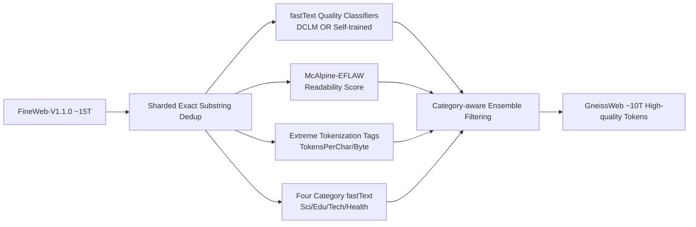

# GneissWeb: Preparing High Quality Data for LLMs at Scale

**Conference**: ICLR 2026  
**OpenReview**: [https://openreview.net/forum?id=NRWUAo075J](https://openreview.net/forum?id=NRWUAo075J)  
**Code**: [IBM/data-prep-kit](https://github.com/IBM/data-prep-kit) · [Dataset ibm-granite/GneissWeb](https://huggingface.co/datasets/ibm-granite/GneissWeb)  
**Area**: LLM Pre-training / Dataset Construction  
**Keywords**: Pre-training datasets, data quality filtering, deduplication, readability scoring, ensemble filtering  

## TL;DR
GneissWeb distills approximately 10T high-quality tokens from the 15T FineWeb dataset using "sharded exact substring deduplication + an ensemble of novel complementary quality filters." This allows a 7B model to outperform the FineWeb-trained version by an average of 2.73 percentage points across 11 benchmarks, filling the gap between "small but refined" (<5T) and "large but coarse" (>15T) datasets.

## Background & Motivation
**Background**: Pre-training data for leading LLMs (Llama-3 trained on 15T tokens, Gemma-2 on 13T, Granite-3.0 on 12T) generally far exceeds the Chinchilla-optimal scale, yet their data recipes remain private. The open-source community has created datasets like FineWeb, RedPajama, and DCLM, mostly processed from Common Crawl.

**Limitations of Prior Work**: Stage-1 long-token pre-training requires corpora that are both "large and clean." However, existing open-source sets are either **sufficient in volume but low in quality** (e.g., FineWeb 15T, RedPajama v2 30T) or **high in quality but low in volume** (e.g., FineWeb-Edu 1.3T, DCLM-Baseline 3.8T), where aggressive model-based classifiers reduce the scale to <5T, which is insufficient for pre-training regimes that only pass through data once or twice.

**Key Challenge**: Relying solely on a single model-based quality classifier for aggressive filtering leads to either the accidental deletion of good data or the inclusion of low-quality documents, failing to achieve a fine-grained balance between "quality" and "retained token volume" (aiming for ~10T).

**Goal**: Establish a reusable and scalable Stage-1 data recipe to distill ~10T high-quality tokens from FineWeb, significantly improving downstream performance without sacrificing scale.

**Core Idea**: **Ensemble rather than single-point**—instead of relying on a single classifier, multiple quality signals characterizing different aspects of text (fastText classifiers, readability, tokenization anomalies) are combined into an ensemble filtering rule. Additionally, **category-awareness**—applying variable thresholds based on document domains (Science, Education, Tech, Healthcare, etc.)—prevents the "one-size-fits-all" deletion of long educational texts.

## Method

### Overall Architecture
The GneissWeb recipe is a pipeline built upon FineWeb-V1.1.0: it first performs **sharded exact substring deduplication** to remove verbatim repetitions within and across documents. Each document is then tagged with multi-path quality annotations (two fastText quality classifiers, McAlpine-EFLAW readability scores, extreme tokenization tags, and four category classifiers). Finally, an **ensemble quality filtering rule** combines these signals to decide the retention of each document under the constraint of "retaining approximately 10T tokens." All steps are run at scale on Kubernetes clusters using the open-source Data Prep Kit, with an additional Bloom filter provided for a lightweight replication path.

### Key Designs

**1. Sharded Exact Substring Deduplication: Cleaning verbatim repetitions beyond FineWeb's fuzzy dedup.** FineWeb only performed fuzzy deduplication within each snapshot. Sequence-level verbatim repetitions remained within and across documents. Ours adapts the exact substring deduplication implementation based on suffix arrays from Lee et al., removing any substring longer than a threshold that appears more than once, and modifies it for **sharded** execution to accommodate the 10T-scale. While deduplication shows negligible gains at small token counts, it improved the high-signal average from 55.99% to 57.39% in a 1.4B model ablation with 350B tokens.

**2. Dual fastText Quality Classifiers via Union: Complementary rather than exclusive.** Following the efficiency of fastText binary classifiers, two classifiers are used simultaneously—one provided by DCLM (trained on OpenHermes-2.5 and ELI5 high-score posts) and one self-trained (using Cosmopedia synthetic data as positives and FineWeb negatives annotated by Mixtral-8x22B, totaling 400k documents). The union (`DCLM-fastText OR our-fastText`) serves as the fastText component in the ensemble. Using either alone pushed high-signal scores from 51.94% to 52.3~52.5%; the union reached 52.92%, indicating that the two classifiers capture different low-quality patterns.

**3. Category-aware Readability Filtering: Filtering unreadable documents via reading difficulty.** The McAlpine-EFLAW readability formula is introduced: $\text{score}(D)=(W+M)/S$, where $W$ is the number of words, $M$ is the number of "mini-words" (words $\le$ 3 characters), and $S$ is the number of sentences. Lower scores indicate easier readability. Experiments showed it outperforms candidates like Flesch-Kincaid, ARI, and Gunning Fog. The key is **adjusting thresholds by category**: educational long-form texts in science, education, technology, and health naturally have higher readability scores. Thresholds are relaxed for these and tightened for others to avoid deleting high-quality educational content. This single item improved the high-signal score from 51.94% to 53.20%.

**4. Extreme Tokenization Document Removal: Catching hidden low quality via "pre/post-tokenization inconsistency."** Documents misclassified as normal by both fastText and readability filters may still produce abnormal token counts after tokenization—documents with similar character lengths can have massive differences in token numbers. Two metrics are defined: $\text{TokensPerChar}=\frac{\#\text{tokens}}{\#\text{chars}}$ and $\text{TokensPerByte}=\frac{\#\text{tokens}}{\text{bytes}}$. Documents falling into the extreme tails of the distribution for a given category are discarded. This filter improved high-signal scores to 52.85%.

**5. Ensemble Filtering Rule: Optimizing combined signals under the 10T constraint.** With multi-path annotations, five ensemble aggregation rules were compared, adjusting fastText thresholds to retain ~10T tokens. The chosen GneissWeb rule achieved 54.29% in 35B token ablations, exceeding the FineWeb baseline (51.94%), any single filter, and other ensemble rules (52.56~53.53%), proving that combining complementary signals is superior to stacking a single strong classifier.

## Key Experimental Results

### Main Results (Comparison with large datasets at the same scale, 1.4B model, 350B tokens, average of 3 seeds)

| Dataset | Tokens | High-Signal | Extended |
|---|---|---|---|
| FineWeb-V1.1.0 | 15T | 56.26 ± 0.14 | 47.33 ± 0.30 |
| FineWeb-Edu-Score-2 | 5.4T | 57.36 ± 0.42 | 48.16 ± 0.29 |
| **GneissWeb** | **9.8T** | **58.40 ± 0.19** | **48.82 ± 0.27** |

Conclusions hold for 3B / 7B models: On GneissWeb, the 7B model achieved a High-Signal score of 67.34 vs. FineWeb's 64.61 (**Gain**: 2.73) and an Extended score of 55.14 vs. 53.39 (**Gain**: 1.75).

### Ablation Study (Single Filters vs. Ensemble, 35B token High-Signal score)

| Configuration | High-Signal |
|---|---|
| FineWeb-V1.1.0 Baseline | 51.94 |
| Readability Only (McAlpine-EFLAW) | 53.20 |
| Extreme Tokenization Only | 52.85 |
| fastText Union Only | 52.92 |
| Ensemble Rule 1 (Runner-up) | 53.53 |
| **GneissWeb Ensemble Rule** | **54.29** |

### Key Findings
- Every novel filter provides a gain over the baseline when used individually; the ensemble effect is additive and exceeds any single item or alternative rule.
- Gains remain stable as model scale increases (1.4B $\to$ 3B $\to$ 7B) and evaluation sets expand (11 $\to$ 20 benchmarks), confirming that small-scale ablations are predictive of large-scale performance.
- Deduplication benefits only manifest at sufficiently large token volumes (260B+); they are nearly invisible on small datasets.

## Highlights & Insights
- **"Ensemble + Category-Aware" Paradigm**: Upgrades data cleaning from "one strong classifier fits all" to "multi-path complementary weak signals + domain-adjusted thresholds," allowing a fine-grained trade-off between quality and quantity. This approach is transferable to any data curation workflow.
- **Two Truly Novel Signals**: Readability scoring and extreme tokenization document removal characterize quality from the neglected perspectives of "human readability" and "tokenizer behavior," catching low-quality documents missed by standard classifiers.
- **High Engineering Reproducibility**: The entire process is open-sourced (Data Prep Kit transforms + fastText models + datasets). A 28GB Bloom filter is also provided to allow low-cost approximate replication of the ~12B document dataset using an `is-in-GneissWeb` boolean column.

## Limitations & Future Work
- Ablations and comparisons focused on 1.4B–7B models and 100B–350B tokens; directly verifying on larger models/more tokens was limited by compute, relying instead on "small-to-large high-rank correlation" extrapolation.
- Strong dependence on FineWeb as a starting point; while the recipe is claimed to be transferable to other corpora, this has not been fully validated. Category division relies on IAB/WatsonNLP classification, which may introduce domain bias.
- Thresholds were tuned via grid search on 8 high-signal task subsets, risking overfitting to the evaluation set (partially mitigated by the extended set). The readability formula is biased toward "English as a Foreign Language" ease, which may be overly strict for certain professional texts.

## Related Work & Insights
Compared to FineWeb (15T, fuzzy dedup), FineWeb-Edu / DCLM-Baseline (aggressive model-based filtering reducing scale to <5T), and RedPajama v2 (30T, average quality), GneissWeb positions itself as "improving quality while maintaining a ~10T scale." The insight is that the next step in pre-training data engineering is not building stronger single-quality classifiers, but designing **ensembles of complementary signals + domain-adaptive thresholds**. Cheap statistical signals like readability and tokenization anomalies are worth including in quality profiling. Additionally, releasing "membership determination" via Bloom filters instead of raw text is a practical paradigm for navigating copyright and distribution challenges.

## Rating
- Novelty: ⭐⭐⭐⭐ Readability filtering and extreme tokenization removal are truly novel quality signals; the ensemble + category-aware framework provides a clear contribution; however, individual techniques (deduplication, fastText) are largely engineering combinations of existing tools.
- Experimental Thoroughness: ⭐⭐⭐⭐ Three model scales (1.4B/3B/7B), 11+20 benchmarks, average of 3 seeds with standard deviations, and complete component-wise ablations. Points deducted for lack of direct validation on larger models due to compute limits.
- Writing Quality: ⭐⭐⭐⭐ Clear structure, independent ablations for each filter, well-explained motivation and design. Many details are pushed to the appendix, slightly increasing reading cost.
- Value: ⭐⭐⭐⭐⭐ Completely open-sourced ~10T dataset + recipe + toolkit + Bloom filter, providing direct, high-value utility for the open-source LLM pre-training community.

<!-- RELATED:START -->

## Related Papers

- [\[ICLR 2026\] Nemotron-CC-Math: A 133 Billion-Token-Scale High Quality Math Pretraining Dataset](nemotron-cc-math_a_133_billion-token-scale_high_quality_math_pretraining_dataset.md)
- [\[ICLR 2026\] How Text Quality Interventions Reshape Neural Scaling Laws for LLMs: Empirical Study](how_text_quality_interventions_reshape_neural_scaling_laws_for_llms_empirical_st.md)
- [\[ICLR 2026\] How to Train Data-Efficient LLMs](how_to_train_data-efficient_llms.md)
- [\[ICLR 2026\] Scaling Laws Revisited: Modeling the Role of Data Quality in Language Model Pretraining](scaling_laws_revisited_modeling_the_role_of_data_quality_in_language_model_pretr.md)
- [\[ICLR 2026\] Joint Selection for Large-Scale Pre-Training Data via Policy Gradient-based Mask Learning](joint_selection_for_large-scale_pre-training_data_via_policy_gradient-based_mask.md)

<!-- RELATED:END -->
