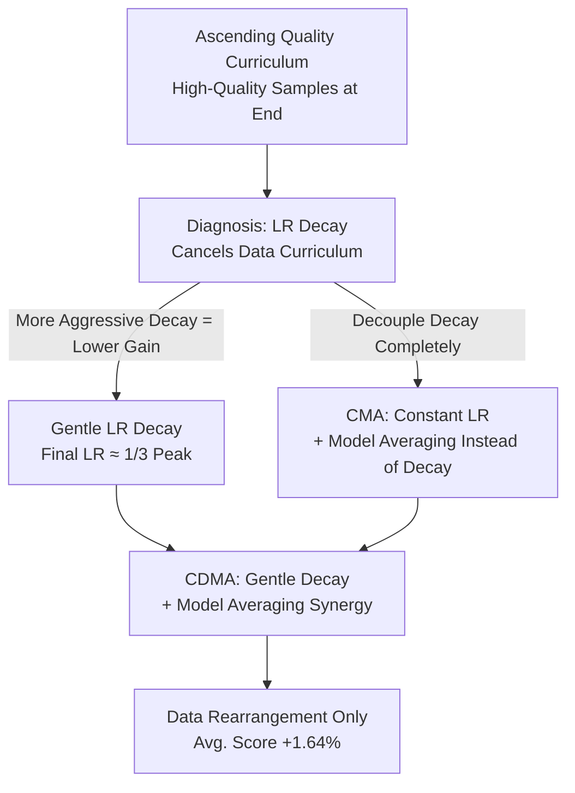

# How Learning Rate Decay Wastes Your Best Data in Curriculum-Based LLM Pretraining

**Conference**: ICLR 2026  
**OpenReview**: [https://openreview.net/forum?id=T5wkZJqzkz](https://openreview.net/forum?id=T5wkZJqzkz)  
**Area**: LLM Pretraining / Curriculum Learning / Optimization  
**Keywords**: Data Curriculum, Learning Rate Decay, Model Averaging, Pretraining, High-Quality Data

## TL;DR
The authors identify a natural conflict between "ascending quality data curriculum" and "learning rate (LR) decay." High-quality data is intentionally placed at the end of training but coincides with the stage where the LR is decayed to its minimum, resulting in minimal update steps and wasted data. By utilizing "gentle decay + replacing decay with model averaging," the study improves average benchmark scores by 1.64% relative to random shuffling on a 1.5B model / 30B tokens by simply rearranging the data.

## Background & Motivation
**Background**: High-quality data is scarce, and LLM pretraining often involves training on mixed corpora of varying quality. Beyond filtering or weighting during data cleaning, **curriculum learning** is a natural approach: sorting data by quality scores in ascending order so the model encounters the best data late in training. This leverages "catastrophic forgetting" to ensure high-quality knowledge is retained best.

**Limitations of Prior Work**: Existing research repeatedly reports that instance-level curriculum learning yields limited or even disappointing gains. To address this, "folding" curricula were proposed—segmenting data and sorting within segments to distribute quality more evenly. However, the authors find folding to be fragile; its advantages disappear at larger scales or when using widely used DCLM fastText quality scores.

**Key Challenge**: The authors identify a previously overlooked factor: **the ascending data quality order and the decaying learning rate (LR) schedule cancel each other out**. In every update $\theta_{t+1}=\theta_t-\eta_t g_t$, the LR acts as an **implicit importance weight** for each sample. The gradient $g_t$ consists of a signal direction $E[g_t]$ and noise $\epsilon_t$. While decaying $\eta_t$ stabilizes training by suppressing noise, it also shrinks the step size along the signal direction. Curriculum learning places the most valuable samples at the end, precisely when standard LR schedules decay $\eta_t$ to its minimum, thus "muting" the best data.

**Goal**: To demonstrate that this conflict exists and worsens with aggressive decay, and to provide simple training strategies that decouple this conflict without requiring additional data cleaning.

**Key Insight**: Since decay is the culprit, two solutions are proposed: either make the decay "gentle" (ensuring the final LR does not approach zero) or **replace decay with weight averaging** for noise reduction, thereby maintaining a high LR throughout to fully utilize late-stage high-quality data.

**Core Idea**: Replace LR decay with a constant learning rate combined with model averaging (CMA), and further co-design "gentle decay + model averaging + curriculum" (CDMA) to reveal a long-neglected high-performance pretraining regime.

## Method

### Overall Architecture
This paper does not propose a new network but diagnoses the coupling of "data curriculum $\times$ LR schedule" and provides a repair recipe. The logic is: isolate the effectiveness of the curriculum using constant LR, prove standard decay consumes these gains, and then provide three increasingly effective solutions: Gentle Decay, CMA (Constant LR + Model Averaging), and CDMA (Gentle Decay + Model Averaging). All conclusions are validated on a 1.5B parameter model with 30B tokens across multiple quality scores (DCLM / PreSelect) and data mixes.

### Key Designs

**1. Diagnosing LR Decay Canceling Data Curriculum: Best Data Hits Minimum Step Size**

This is the central pivot of the paper. Under a constant LR, an ascending (Ascend) curriculum based on DCLM scores significantly outperforms a uniform (Uniform) baseline, with lower validation loss and faster convergence. Conversely, a descending (Descend) curriculum performs worse as it moves away from high-quality data. However, once a WSD or cosine schedule is applied, the curriculum advantage nearly disappears. Systemic ablation shows that as the decay phase lengthens or the final LR decreases (from $3\times10^{-3}$ down to $1\times10^{-5}$), the gap $L_{\text{Uniform}}-L_{\text{Ascend}}$ shrinks to near zero. High-value data contributions are essentially erased by the decay. While folding curricula slightly mitigate this, they are still outperformed by Uniform under cosine schedules and surpassed by simple end-to-end Ascend under constant LR.

**2. CMA: Replacing LR Decay with Model Averaging to Maximize High-Quality Data**

Since decay's "noise reduction" is tied to the side effect of "shrunk signal step size," CMA (Curriculum Model Averaging) replaces decay entirely. It uses a **constant LR** throughout and performs weighted averaging on terminal checkpoints. Model averaging stabilizes parameters and suppresses noise (similar to decay benefits) but **does not reduce update magnitude**. Consequently, the model maintains large step sizes during the high-quality late stage, moving quickly along reliable signal directions before averaging smooths out noise-induced oscillations. The default implementation uses Exponential Moving Average (EMA, $\alpha=0.2$) on the last six checkpoints. The key finding is the **synergy**: EMA+Ascend outperforms WSD+Uniform, WSD+Ascend, and EMA+Uniform.

**3. CDMA: Synergy of Gentle Decay and Model Averaging**

The authors discovered that the two fixes can be stacked. For uniform data, a lower final LR is typically better. However, for curriculum data, gains **increase** as decay becomes gentler (higher final LR). The optimal final LR for the curriculum is approximately $1\times10^{-3}$, about 1/3 of the peak LR—much higher than the optimal for uniform data. CDMA (Curriculum with LR Decay Model Averaging) stacks gentle decay with EMA. Across experiments, this combination provides the most stable and optimal results, being less sensitive to hyperparameters. The refined guideline: curriculum-based pretraining should use gentler LR decay than uniform training and incorporate model averaging.

## Key Experimental Results

### Main Results
1.5B parameters, 30B tokens, DCLM-Baseline data. "Core" includes MMLU, ARC-c, ARC-e, CSQA. Baseline is WSD+Uniform.

| Config (WA / Order / LRS) | Core | Avg. | Gain vs Baseline |
|---|---|---|---|
| ✗ / Uniform / Cos | 44.31 | 49.13 | −1.43 |
| ✗ / Uniform / WSD (Baseline) | 46.21 | 50.56 | — |
| ✗ / Ascend / WSD | 45.45 | 50.34 | −0.22 |
| EMA / Uniform / Const | 45.29 | 49.94 | −0.62 |
| **SMA / Ascend / Const** | **47.02** | **50.94** | **+0.38** |
| **EMA / Ascend / Const** | 46.95 | 50.95 | **+0.39** |

Applying curriculum directly to standard decay (WSD+Ascend) drops performance. Only the "Curriculum + Model Averaging + Constant LR" (EMA/SMA+Ascend) yields positive gains.

### mid-training Experiment (Mixed quality, more practical)

| Config (WA / Order / LRS) | Core | Avg. | Gain vs Baseline |
|---|---|---|---|
| ✗ / U,U / WSD (Baseline) | 41.61 | 47.49 | — |
| ✗ / A-T / WSD | 42.73 | 48.01 | +0.52 |
| EMA / U,A / Const | 41.30 | 47.45 | −0.04 |
| **EMA / A,A / Const** | **43.61** | **48.69** | **+1.20** |
| **EMA / A-T / Const** | **43.82** | **48.69** | **+1.20** |
| **SMA / A-T / Const** | **43.90** | **48.69** | **+1.20** |

In mid-training settings, CMA gains are more significant: EMA+A-T improves average scores by +1.20% and Core by over +2.0% compared to the WSD+U,U baseline.

### Key Findings
- **Sorting Only at the End is Insufficient**: U,A (sorting only the high-quality phase) yields near-zero gains (−0.04), while A,A (ascending in both phases) yields +2.00 Core.
- **Aggressive Decay Negates Curriculum**: The validation loss difference $L_{\text{Uniform}}-L_{\text{Ascend}}$ shrinks monotonically as decay steps increase or final LR decreases.
- **Hyperparameter Shifts**: The optimal final LR for curriculum training is significantly higher than for uniform training.
- **Robustness**: Results hold across different quality scores (PreSelect) and unfiltered datasets (WebOrganizer).

## Highlights & Insights
- **Reinterpreting LR as "Sample Importance Weight"**: This connects curriculum learning and optimization scheduling, which were previously studied in isolation.
- **Replacing Decay with Model Averaging**: This effectively decouples "noise reduction" from "step size reduction," allowing high-quality data to be fully utilized with larger updates.
- **Parameter Sensitivity**: The study highlights that hyperparameters tuned for uniform data are suboptimal for curriculum training.
- The method achieves a 1.64% improvement with zero additional data cleaning costs by simply rearranging data and modifying the optimization strategy.

## Limitations & Future Work
- The scale is limited to 1.5B parameters / 30B tokens; extrapolation to trillion-token scales remains to be verified.
- The optimal final LR and EMA parameters depend on specific settings; a universal self-adaptive recipe is lacking.
- The theoretical model is based on simplified SGD on quadratic loss, which is a distance away from actual Adam + Transformer dynamics.

## Related Work & Insights
- **vs. Multi-stage/Mid-training**: While OLMo 2 and Phi-4 use high-quality data late, they still suffer from LR decay. CMA offers a more effective way to utilize these segments.
- **vs. Folding Curriculum**: Folding is shown to be a fragile workaround for decay; CMA/CDMA addresses the root cause of the signal-weighting conflict.
- **vs. Model Averaging**: While SWA and EMA are often used for stability in uniform training, this work reveals their synergistic potential when paired with curriculum learning.

## Rating
- Novelty: ⭐⭐⭐⭐⭐ (Identifies a crucial overlooked coupling factor)
- Experimental Thoroughness: ⭐⭐⭐⭐ (Solid validation, though missing large-scale extrapolation)
- Writing Quality: ⭐⭐⭐⭐⭐ (Clear progression from diagnosis to mechanism to solutions)
- Value: ⭐⭐⭐⭐⭐ (Practical, zero-cost pretraining recipe)

## Related Papers

- [\[ICLR 2026\] Pre-training LLM without Learning Rate Decay Enhances Supervised Fine-Tuning](pre-training_llm_without_learning_rate_decay_enhances_supervised_fine-tuning.md)
- [\[ICLR 2026\] LLM Pretraining with Continuous Concepts](llm_pretraining_with_continuous_concepts.md)
- [\[ICLR 2026\] How to Train Data-Efficient LLMs](how_to_train_data-efficient_llms.md)
- [\[ICLR 2026\] Reformulation for Pretraining Data Augmentation](reformulation_for_pretraining_data_augmentation.md)
- [\[ICLR 2026\] Scaling Laws Revisited: Modeling the Role of Data Quality in Language Model Pretraining](scaling_laws_revisited_modeling_the_role_of_data_quality_in_language_model_pretr.md)

<!-- RELATED:END -->

<!-- RELATED:START -->

## Related Papers

- [\[ICLR 2026\] Pre-training LLM without Learning Rate Decay Enhances Supervised Fine-Tuning](pre-training_llm_without_learning_rate_decay_enhances_supervised_fine-tuning.md)
- [\[ICLR 2026\] LLM Pretraining with Continuous Concepts](llm_pretraining_with_continuous_concepts.md)
- [\[ICLR 2026\] How to Train Data-Efficient LLMs](how_to_train_data-efficient_llms.md)
- [\[ICLR 2026\] Scaling Laws Revisited: Modeling the Role of Data Quality in Language Model Pretraining](scaling_laws_revisited_modeling_the_role_of_data_quality_in_language_model_pretr.md)
- [\[ICLR 2026\] Reformulation for Pretraining Data Augmentation](reformulation_for_pretraining_data_augmentation.md)

<!-- RELATED:END -->
