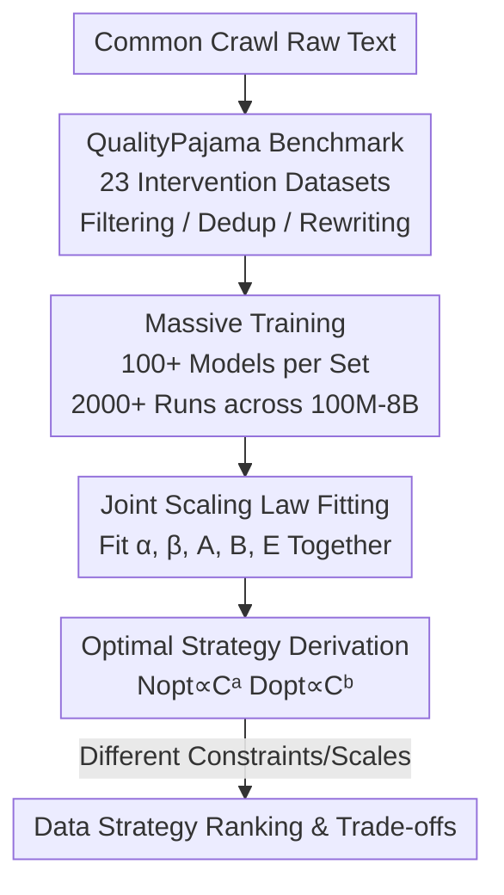

# How Text Quality Interventions Reshape Neural Scaling Laws for LLMs: Empirical Study

**Conference**: ICLR 2026  
**OpenReview**: [https://openreview.net/forum?id=ZC5QBfdOw7](https://openreview.net/forum?id=ZC5QBfdOw7)  
**Area**: LLM Pre-training / Scaling Laws / Data Quality  
**Keywords**: Neural Scaling Laws, Data Quality Intervention, Compute-Optimal, Deduplication, Synthetic Data  

## TL;DR
The authors construct QualityPajama, a suite of 23 datasets with different quality interventions, and train 2000+ models to systematically measure how "filtering / deduplication / LLM rewriting" reshapes all five parameters of neural scaling laws. They find that data interventions simultaneously change both scaling coefficients and exponents (unlike architectural changes which mainly affect coefficients), causing the compute-optimal token-to-parameter ratio to fluctuate by orders of magnitude, thereby establishing scaling law analysis as a principled framework for evaluating data strategies.

## Background & Motivation

**Background**: Neural scaling laws $\text{Loss}(N,D) \sim A D^{-\alpha} + B N^{-\beta} + E$ (where $N$ is parameter count and $D$ is token count) are widely used for performance prediction, ROI analysis, and compute allocation. Extensive empirical and theoretical work has characterized the power-law decline of pre-training loss relative to resource investment, making scaling laws a core decision-making tool in LLM R&D.

**Limitations of Prior Work**: Despite their widespread adoption, the impact of data quality on scaling laws has rarely been studied systematically. A typical unresolved mystery is the stark discrepancy between Kaplan and Hoffmann (Chinchilla) regarding the compute-optimal token/parameter ratio (21 vs. 1). Recent works speculate that differences in training data might be the root cause, but no definitive conclusion has been reached. Theoretical works (Data Manifold Theory, Zipf Distribution Theory) typically predict power-law exponents while remaining silent on the coefficients $A, B$ and irreducible loss $E$, often analyzing one exponent in isolation by taking the infinite limit of the other.

**Key Challenge**: Existing attempts to incorporate data quality into scaling laws (e.g., effective tokens, utility-based scaling) treat quality merely as a correction to $D$ or a single exponent $\beta$, ignoring its broad impact on other components. Crucially, these components often **move in opposite directions**—improving one may worsen another—meaning that analyzing any single metric in isolation can yield misleading conclusions.

**Goal**: To provide the first large-scale, systematic measurement of how text quality interventions simultaneously affect all five scaling law components $\alpha, \beta, A, B, E$, and use this to answer whether scaling laws can serve as a principled framework for ranking data quality across scales.

**Key Insight**: Instead of relying on theoretical assumptions or small-scale experiments, the authors directly "fit and observe" scaling laws through massive training. By enumerating a suite of quality interventions and training hundreds of models of varying scales for each, they measure the actual drift of components caused by these interventions.

**Core Idea**: Treat the **joint fitting** of scaling laws (fitting all five components together rather than exponents in isolation) as a microscope for measuring data quality. Then, derive compute-optimal strategies from the fitted components to reveal the fundamental trade-off between data quality and quantity.

## Method

### Overall Architecture

This is a methodological and empirical study. The core is not a new model architecture but a measurement pipeline: "Intervention Datasets → Massive Training → Joint Scaling Law Fitting → Five-Component Decomposition → Compute-Optimal Strategy Derivation." The authors derive 23 datasets (QualityPajama) from Common Crawl using three types of quality interventions (heuristic filtering, deduplication, and LLM rewriting). For each dataset, they train 100+ models across different scales (100M–8B parameters, 100M–200B tokens), totaling 2000+ training runs. They then jointly fit all five parameters $\alpha, \beta, A, B, E$ for each dataset to observe their drift and translate these components into compute-optimal parameter counts, token counts, and their ratios using $a=\beta/(\alpha+\beta)$ and $b=\alpha/(\alpha+\beta)$.

### Key Designs

**1. QualityPajama Benchmark: Quantifying "Data Quality" into Enumerated Interventions**

Data quality is a vague, context-dependent concept. The authors operationalize it into three major families of interventions resulting in 23 datasets. **Heuristic Filterings** include NSFW filters, aesthetic filters (removing lorem ipsum, inline code, or text with alphanumeric ratios > 0.8), PageRank-based tiering (low/med/high/unknown percentiles), fuzzy deduplication (using MinHashLSH at similarity thresholds of 0.7–1.0), and sentence-length/syntactic complexity filters. **Synthetic Rewriting** includes high-quality rewriting (HQ), Q&A rewriting (QA), and textbook-style rewriting (TB, inspired by Phi models), with varying mixing ratios between synthetic and natural (CC) data (100/0, 67/33, 33/67). This spectrum covers the range from content removal to redundancy reduction to content synthesis.

**2. Joint Decomposition of Scaling Laws: Fitting Five Components Simultaneously**

Previous theories often focused on exponents while treating coefficients and irreducible loss as constants. This study **jointly fits** all five parameters of $\text{Loss}(N,D)\sim A D^{-\alpha}+B N^{-\beta}+E$ for every dataset. A key discovery is that **data interventions shift both coefficients and exponents simultaneously**, fundamentally altering the scaling law in ways unpredicted by current theory. More subtly, there is a tension between components: empirically, $A\propto\alpha$ and $B\propto\beta$ show strong positive correlations (better-fitting exponents often come with larger coefficients). Since increasing an exponent decreases loss while increasing a coefficient raises it, "improving one component may simultaneously worsen another." The authors point out that even at modern compute scales (e.g., $10^{24}$ FLOPs), this tension persists because $A$ and $B$ vary across several orders of magnitude, which the relatively small $\alpha$ and $\beta$ cannot compensate for.

**3. Deriving Compute-Optimal Strategies: Mapping Components to Token/Parameter Ratios**

With the five components fitted, the authors use the relations $N_{opt}\propto C^{a}$, $D_{opt}\propto C^{b}$, and $D_{opt}/N_{opt}\propto C^{b-a}$ (where $a=\beta/(\alpha+\beta)$ and $b=\alpha/(\alpha+\beta)$) to translate abstract scaling law components into engineering decisions. At modern compute scales, the optimal parameter count can vary by 14× and the optimal token count by 13× between the best and worst interventions, while the token/parameter ratio can fluctuate by a staggering 182×. This step bridges the gap between abstract parameter drift and concrete decisions on model sizing and data volume.

## Key Experimental Results

Setup: 23 QualityPajama datasets, over 100 models per set, ranging from 100M to 8B parameters and 100M to 200B tokens, totaling 2000+ training runs. Extrapolations use Llama 3.1 ($N$=405B, $D$=15.6T) as a baseline.

### Scalability of Intervention Ranking (Spearman Correlation across Validation Sets)

| Data Intervention | $A$ | $B$ | $\alpha$ | $\beta$ | $E$ |
|-------------------|-----|-----|----------|---------|-----|
| Heuristic Filtering (All) | 0.45 | 0.34 | 0.46 | 0.32 | 0.34 |
| Synthetic Data (All) | 0.81 | 0.91 | 0.76 | 0.91 | 0.54 |

Ranking by scaling components for heuristic filters is only "partially consistent" (0.3–0.5 correlation), suggesting that scaling behaviors for natural data interventions are sensitive to the specific validation set. Conversely, rankings for synthetic data are highly consistent (0.76–0.91), making scaling components a more reliable indicator for synthetic data quality.

### Comparison of Interventions from a Compute Efficiency Perspective

| Intervention | $A$ | $B$ | $\alpha$ | $\beta$ | $E$ | Key Takeaway |
|--------------|-----|-----|----------|---------|-----|--------------|
| deduped_1.0 | 2471.6 | 157.3 | 0.34 | 0.156 | 0.05 | Exact dedup, lowest $E$ |
| deduped_0.7 | 3246.6 | 186.8 | 0.38 | 0.160 | 0.13 | Fuzzy dedup, highest compute efficiency |
| aesthetic | 3211.5 | 442.3 | 0.39 | 0.171 | 0.50 | Aesthetic filtering |
| high_pr | 1959.0 | 210.2 | 0.30 | 0.161 | 0.36 | High PageRank |
| QA100 | 14377.5 | 1586.4 | 0.47 | 0.291 | 1.43 | Pure QA rewriting, high $\alpha$ but massive $A$ |
| QA67-CC33 | 14201.3 | 4193.5 | 0.48 | 0.337 | 1.53 | Synthetic-Natural Mix |

### Key Findings
- **Deduplication gains far exceed data volume reduction**: Exact deduplication reduces data volume to 83% of the original but yields a ~100× improvement in compute efficiency. Fuzzy deduplication (dedupe_0.7) is ~3× more efficient than dedupe_0.9, 10× more than exact dedup, and 300× more than no deduplication.
- **PageRank is a relevant but incomplete signal**: While high_pr > med_pr > low_pr holds, strictly filtering for high PageRank is not superior to the baseline. Including pages without a PageRank (no_pr) actually improves compute efficiency, likely due to "recency" effects.
- **Synthetic-Natural mixtures consistently outperform either source alone**, but the optimal mixing ratio evolves with model/compute scale, meaning no single fixed ratio is universal.
- **Data quality rankings flip across scales**: Scaling curves for different interventions frequently cross. A dataset that is optimal at a small scale might be outperformed at larger scales, suggesting significant risk in extrapolating small-scale pilot results to high-compute regimes.
- **"The Best" depends on resource constraints**: The optimal data strategy differs depending on whether the constraint is fixed compute, fixed model size, or fixed token count.

## Highlights & Insights
- **Turning "Data Quality" into an enumerable variable**: QualityPajama breaks a vague concept into 23 controlled interventions, allowing scaling component drifts to be measured cleanly for the first time.
- **The "Joint Fitting + Component Tension" perspective**: By revealing the coupling of $A\propto\alpha$ and $B\propto\beta$ and showing that exponents do not dominate coefficients at current scales, the authors clarify why analyzing exponents alone is insufficient.
- **The 182× fluctuation in token/parameter ratio** is the most striking result, providing empirical evidence that the Kaplan vs. Chinchilla debate likely stems from differences in data quality.
- **The 100×/300× compute efficiency gain from deduplication** provides a concrete engineering guide for how aggressive deduplication should be in corpus cleaning.

## Limitations & Future Work
- **Fixed pre-training interventions**: The study only applies interventions once before training and does not include adaptive pruning or curriculum learning during training, which might approach exponential rather than power-law improvements.
- **Upstream loss focus**: The work focuses on pre-training loss rather than downstream task performance or the value of high-quality data in post-training alignment.
- **Cross-validation sensitivity**: The sensitivity of natural data rankings to validation sets suggests that findings for heuristic filters may lack robustness and require validation at deployment scales.
- **Theoretical Gaps**: Drifts in scaling components do not always align with predictions from Zipf's law or Data Manifold theory, leaving room for deeper theoretical reconciliation.

## Related Work & Insights
- **Vs. Effective-token / Utility-based Scaling**: Unlike works that treat quality as a simple multiplier for $D$ or $\beta$, this study proves that data interventions perturb all five components.
- **Vs. Full Scaling Law for Data Mixtures (Shukor et al., 2025)**: While sharing similar goals, Shukor et al. focus on mixing ratios, whereas this paper includes heuristic filtering and synthetic rewriting.
- **Vs. Synthetic Data Scaling Laws**: While others study synthetic generative scale in vision, this work focuses on upstream loss and the systematic comparison of synthetic-natural mixtures in LLMs.

## Rating
- Novelty: ⭐⭐⭐⭐⭐ First systematic measurement of data intervention effects on all scaling law components at scale.
- Experimental Thoroughness: ⭐⭐⭐⭐⭐ 23 datasets, 2000+ models, 100M–8B range; a massive empirical undertaking.
- Writing Quality: ⭐⭐⭐⭐ Clear arguments and contributions, though data density makes some sections dense.
- Value: ⭐⭐⭐⭐⭐ Provides evidence for the Kaplan/Chinchilla discrepancy and practical deduplication/data strategy guides.

<!-- RELATED:START -->

## Related Papers

- [\[ICLR 2026\] Scaling Laws Revisited: Modeling the Role of Data Quality in Language Model Pretraining](scaling_laws_revisited_modeling_the_role_of_data_quality_in_language_model_pretr.md)
- [\[ICLR 2026\] GneissWeb: Preparing High Quality Data for LLMs at Scale](gneissweb_preparing_high_quality_data_for_llms_at_scale.md)
- [\[ICLR 2026\] How to Train Data-Efficient LLMs](how_to_train_data-efficient_llms.md)
- [\[ICLR 2026\] Pretraining Scaling Laws for Generative Evaluations of Language Models](pretraining_scaling_laws_for_generative_evaluations_of_language_models.md)
- [\[ICLR 2026\] Unveiling Downstream Performance Scaling of LLMs: A Clustering-Based Perspective](unveiling_downstream_performance_scaling_of_llms_a_clustering-based_perspective.md)

<!-- RELATED:END -->
